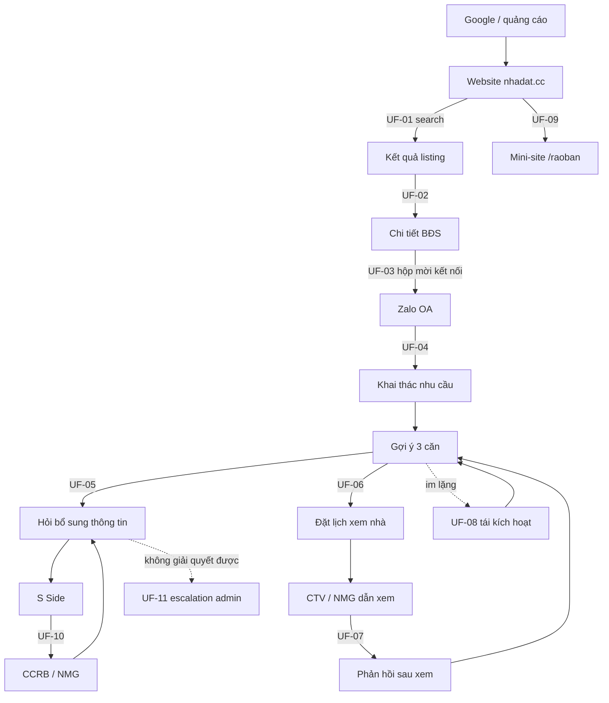
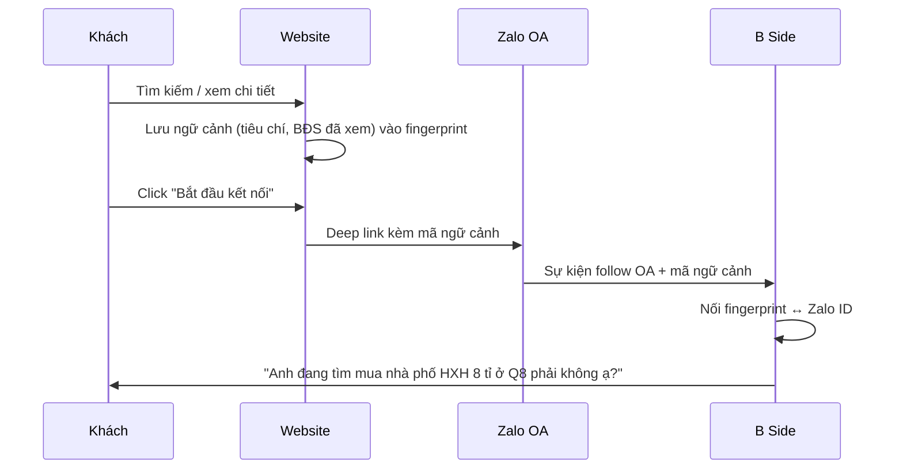
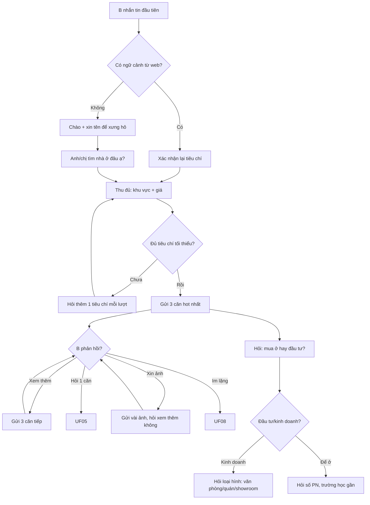
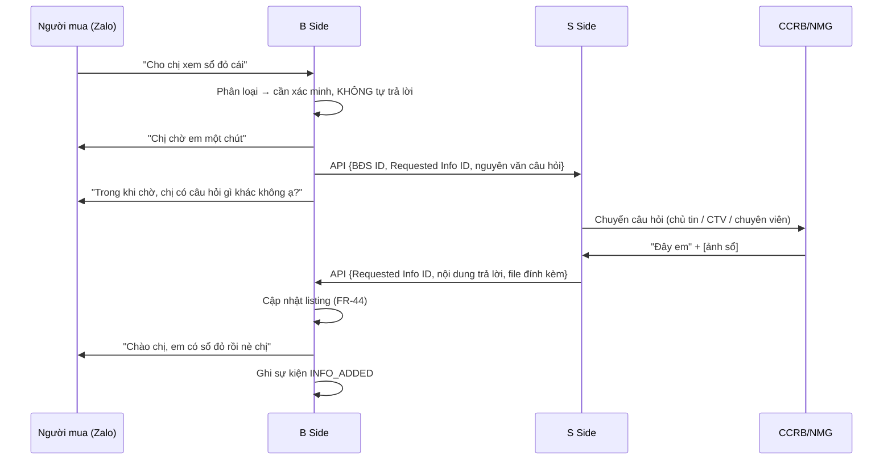
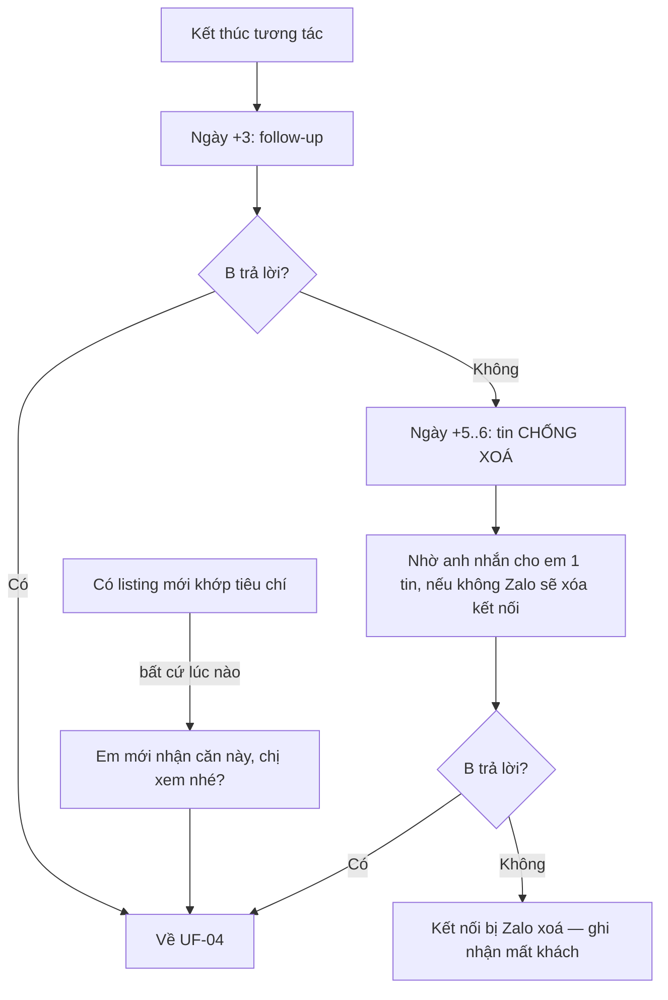
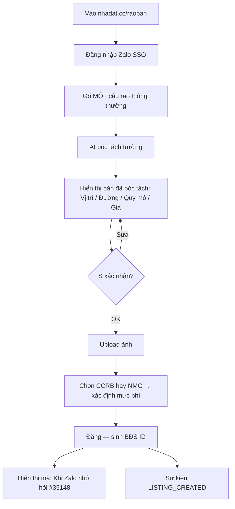
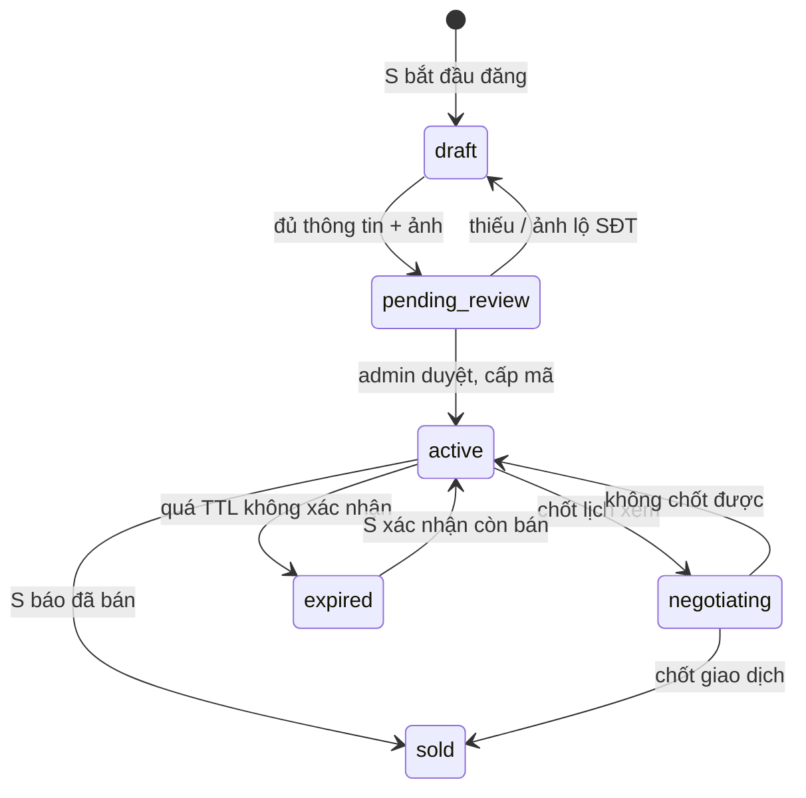

# 03 — User Flows

12 luồng end-to-end. Mỗi luồng ghi rõ actor, điều kiện vào, điều kiện ra, FR liên quan,
và các nhánh lỗi. Sơ đồ dùng Mermaid.

## Bản đồ toàn cảnh

---

## UF-01 — Tìm kiếm trên web bằng ngôn ngữ tự nhiên
**Actor** khách vãng lai (chưa có Zalo) · **FR** FR-02, FR-08, FR-09, FR-16

1. Vào trang chủ hoặc trang tag từ Google.
2. Gõ vào ô chat: *"tìm mua nhà phố HXH 8 tỉ ở Q8"*.
3. Hệ thống parse thành tiêu chí có cấu trúc: `giao dịch=mua`, `loại=nhà phố`,
   `đường=HXH`, `giá≈8 tỉ`, `khu vực=Quận 8`.
4. Trang kết quả hiển thị: **"Tìm thấy 234 mục theo yêu cầu"** + tiêu đề diễn giải
   *"Mua nhà Nhà phố HXH giá 8 tỉ đồng Quận 8 TP HCM"*.
5. Lưu tiêu chí vào phiên (fingerprint) để dùng ở UF-03.

**Nhánh lỗi**
- Không parse được → hỏi lại một câu duy nhất kèm 3 gợi ý mẫu, **không** trả về lỗi.
- 0 kết quả → nới lỏng lần lượt: giá ±20% → phường → quận lân cận, và nói rõ đã nới gì.

**Ra**: có ≥1 kết quả HOẶC có hộp mời kết nối Zalo (không bao giờ là ngõ cụt).

---

## UF-02 — Xem chi tiết một BĐS
**Actor** khách vãng lai · **FR** FR-10, FR-11, FR-15

1. Click card ở trang kết quả.
2. Trang chi tiết: gallery, mô tả đầy đủ, bảng thông số (DT, kết cấu, pháp lý, giá),
   vị trí trên bản đồ.
3. Hiển thị **cue** cố định: *"Khi Zalo nhớ hỏi #35148"*.
4. Khối "BĐS tương tự" giữ người dùng ở lại 3–5 trang (FR-15).

**Ra**: click sang Zalo (UF-03) hoặc xem tiếp BĐS khác.

---

## UF-03 — Chuyển từ web sang Zalo OA kèm ngữ cảnh
**Actor** khách vãng lai → B · **FR** FR-13, FR-14, FR-30

**Điều kiện ra**: tin nhắn đầu tiên của bot **đã nhắc đúng nhu cầu** — người dùng
không phải kể lại. Đây là điểm đo quan trọng nhất của phễu (BR-09).

**Nhánh lỗi**: mất ngữ cảnh → rơi về UF-04 (chào lần đầu), không được im lặng.

---

## UF-04 — Chat lần đầu & khai thác nhu cầu
**Actor** B · **FR** FR-20, FR-22, FR-23, FR-24, FR-25, FR-26

**Tiêu chí tối thiểu để bắt đầu gợi ý**: khu vực (≥ cấp quận) **và** khoảng giá.
**Quy tắc**: tối đa 3 listing/tin nhắn (FR-24); mỗi lượt chỉ hỏi **một** câu.

---

## UF-05 — Hỏi bổ sung thông tin từ S (vòng lặp trung tâm)
**Actor** B, hệ thống, S · **FR** FR-40…FR-47, FR-98

**Kho tích luỹ trước, hỏi S sau** (FR-44 + Cầu Nối §F3): trước khi tạo info_request,
bot tìm trong `media` / `listing_facts` — đã có thì **trả ngay, không làm phiền S**.
Câu trả lời mới của S được lọc liên hệ (FR-105) rồi lưu kho, nên B thứ hai hỏi cùng
câu là có liền. Timeout theo FR-110: nhắc S sau 24h, quá 48h đóng yêu cầu và báo
trung thực cho B.

**Quy tắc vàng (RSK-03)**: với câu hỏi pháp lý, quy hoạch, "còn bán không", hệ thống
**không bao giờ khẳng định**. Mẫu đúng quan sát được:
> *"Cho tới 15h ngày 17/9 thì còn. Nhưng để em hỏi lại anh nhé."*

**Nhánh lỗi**: S không trả lời trong SLA → escalate CTV → chuyên viên (FR-47);
đồng thời báo B trung thực: *"Em chưa liên lạc được chủ nhà, em báo chị ngay khi có."*

---

## UF-06 — Đặt lịch xem nhà
**Actor** B, CTV/NMG · **FR** FR-50…FR-57

1. B đề nghị xem, **hoặc** bot đề nghị sau tín hiệu quan tâm (hỏi ≥3 câu về một căn).
2. Bot xác nhận đúng căn: *"Chị xem căn MS30148 Trần Bình Trọng, Phường 4 Quận 5,
   giá 12 tỉ phải không chị?"*
3. Hỏi khung giờ thuận tiện.
4. **Xin số điện thoại** — nêu rõ chỉ dùng để liên lạc buổi xem (FR-53 ↔ `OPEN-05`).
5. Ghi nhận lịch dạng câu đầy đủ, đọc lại cho B xác nhận.
6. Sinh sự kiện `VIEWING_REQUESTED` + email `[VIEWING]` cho admin (FR-57).
7. CTV/NMG xác nhận → bot chốt giờ + gửi link Google Maps (FR-54).
8. Nhắc trước giờ hẹn (FR-55).
9. Sau buổi xem → UF-07.

**Mở khoá danh tính (FR-104 · Cầu Nối §F4)** — toàn hệ thống chỉ có đúng một khoảnh
khắc hai bên biết nhau: khi lịch xem **đã chốt**. Lúc đó B nhận địa chỉ chính xác +
tên, SĐT người dẫn xem (CTV nếu chủ tin là CCRB, chính NMG nếu là NMG); S nhận tên +
SĐT người mua. Trước thời điểm này: ẩn danh tuyệt đối cả hai chiều.

**Nhánh lỗi**
- B từ chối cho số ĐT → vẫn nhận lịch, liên hệ hoàn toàn qua Zalo (bắt buộc, theo NFR-07).
- Không ai dẫn được (1.5 CTV, RSK-05) → đề xuất khung giờ khác, **không** huỷ im lặng.

---

## UF-07 — Sau khi xem nhà
**Actor** B · **FR** FR-56, FR-65

1. *"Chị ưng căn này không ạ?"*
2. Nếu **không ưng** → *"Căn nhà này có gì chưa phù hợp ạ? Chị chia sẻ với em đi."*
3. Câu trả lời (*"Chị mua nhà mặt tiền trên 4m thôi"*) được **ghi thành tiêu chí mới**
   của B và áp vào mọi gợi ý sau.
4. Xin đánh giá buổi xem (thang 5 sao) → điểm này chấm cho NMG (FR-102).
5. Quay lại UF-04 với tiêu chí đã tinh chỉnh.

**Đây là cơ chế học sở thích chính** (OKR slide 5: *I will find out more about your tastes*).

---

## UF-08 — Tái kích hoạt & chống mất kết nối Zalo
**Actor** hệ thống → B · **FR** FR-60…FR-64 · **Rủi ro** RSK-01

**Nội dung follow-up xoay vòng** (không lặp lại cùng một mẫu 2 lần liên tiếp):
1. Hỏi về căn cuối cùng đã xem + mời xem ảnh + mời đặt lịch (FR-61).
2. Chào 2–3 căn khác cùng khu vực/tầm giá (FR-62).
3. Giới thiệu 1–2 căn **mới nhận** để khởi động lại từ đầu (FR-64).
4. Nhờ thẳng: *"Chị đã tìm mua được nhà chưa ạ? Em tiếp tục tìm cho chị nha?"*

**Ràng buộc**: mọi tin chủ động phải kết thúc bằng **một câu hỏi** — mục tiêu là B
*nhắn lại*, không phải B *đọc*.

---

## UF-09 — S rao tin từ website
**Actor** CCRB / NMG · **FR** FR-90…FR-96, FR-101

**Ví dụ bóc tách** [nguồn: S's side.docx]:

| Câu rao | *"Bán nhà HXH xe tải quay đầu, gần ngã tư Trần Bình Trọng và An Dương Vương, giá 9 tỉ có thể bớt lộc, Phường 4 Quận 5 nhà trệt dễ xây lại"* |
|---|---|
| Vị trí | Ngã tư TBT và ADV, P4 Q5 |
| Đường | HXH (xe tải quay đầu) |
| Quy mô | Nhà trệt, dễ xây dựng lại |
| Giá | 9 tỉ, thương lượng |

Từ bản bóc tách này, AI sinh **nhiều biến thể câu rao** theo độ dài và theo khía cạnh
B quan tâm (gần trường học, gần tiện ích…) — FR-93.

---

## UF-10 — S rao tin ngay trong Zalo (F1)
**Actor** CCRB / NMG · **FR** FR-109, FR-111, FR-106 · *(bản cũ dùng FR-97 đã deprecated;
quyết định đảo chiều theo [nguồn: artifact "Cầu Nối BĐS" v2, phiên nhadat-bot, 08/2026])*

1. S nhắn Zalo OA: *"Cần bán nhà MT Trần Bình Trọng giá 6 tỉ"*.
2. Bot hỏi **lần lượt từng bước**: khu vực → loại BĐS → giá → diện tích → pháp lý → mô tả.
3. Khu vực không khớp danh mục chuẩn → bot đưa lựa chọn quận/phường để S chọn.
4. Bot yêu cầu gửi ảnh: mặt tiền · nội thất · sổ.
5. Ảnh Zalo là URL tạm → tải về ngay, upload kho file qua adapter, ghi bảng `media` (FR-111).
6. Listing vào `pending_review` chờ admin duyệt; thiếu thông tin hoặc **ảnh lộ SĐT** → trả về S bổ sung.
7. Duyệt đạt → `active`, cấp mã công khai (định dạng: `OPEN-17`), sẵn sàng matching.

Một S có nhiều BĐS: mỗi lần đăng tạo một listing riêng với mã riêng. Mã công khai
là danh tính duy nhất B nhìn thấy (FR-104). Mini-site `/raoban` (UF-09) vẫn tồn tại
như kênh song song trên web — một câu rao + AI bóc tách.

---

## UF-11 — Escalation sang admin
**Actor** hệ thống → chuyên viên · **FR** FR-76…FR-81

Bốn tình huống sinh email tới `admin.buyerside@nhadat.cc`:

| Trigger | Loại email | Danh sách admin |
|---|---|---|
| B hỏi, cần S trả lời | `[QUESTION] <Zalo ID>` | FR-76 |
| B muốn nói chuyện trực tiếp | `[VOICE] <Zalo ID>` | FR-79 |
| B yêu cầu xem nhà | `[VIEWING] <Zalo ID>` | FR-78 |
| B có phản ứng tiêu cực | `[UPSET] <Zalo ID>` | FR-77 |

Body chứa các field của danh sách tương ứng; nếu có BĐS ID thì kèm mô tả BĐS.

**Phản ứng tiêu cực** cần định nghĩa phát hiện được (từ khoá bực bội, lặp câu hỏi
chưa được trả lời, chấm ≤3 sao) — chi tiết ở `07-srs.md §5.4`.

---

## UF-12 — Gửi danh sách riêng cho một người mua
**Actor** hệ thống → B · **FR** FR-100

Chat không thể hiển thị quá 3 BĐS mỗi tin nhắn (FR-24), nên khi cần chào vài chục căn:

1. B Side tạo một danh sách riêng: `{User ID, [BĐS ID…]}`.
2. Sinh URL riêng dạng `nhadat.cc/ds/<token>`.
3. Bot gửi link: *"Tụi em lọc ra 1 danh sách các BĐS phù hợp với chị. Em gửi chị xem được không ạ?"*
4. B mở link → trang listing đã lọc sẵn, mỗi card vẫn có cue mã số để hỏi lại trên Zalo.

**Ràng buộc riêng tư**: URL chứa token không đoán được, không index (`noindex`),
không lộ thông tin cá nhân của B trên trang.

---

## UF-13 — Vòng đời listing & báo sold cho người đang chờ
**Actor** hệ thống, admin, S, B · **FR** FR-106, FR-107, FR-108 · [nguồn: artifact "Cầu Nối BĐS" v2, phiên nhadat-bot, 08/2026]

1. Trạng thái gắn vào **từng BĐS**, không gắn vào người bán; S báo "bán rồi" ở bất kỳ đâu trong hội thoại đều được nhận diện.
2. `last_confirmed_at` điều khiển TTL 7 ngày (FR-107): trong hạn giới thiệu ngay; quá hạn bot hỏi S *"Căn [mã] còn bán không anh/chị?"* trước khi giới thiệu B mới — S không bị hỏi lặp mỗi lần có khách.
3. Khi listing chuyển `sold`: bot quét bảng `interests`, **chủ động báo mọi B đang chờ** căn đó kèm gợi ý căn thay thế cùng khu vực/tầm giá (FR-108).
4. `expired` không xoá listing — chỉ ẩn khỏi matching cho tới khi S xác nhận lại.
5. Ràng buộc Zalo: tin chủ động ngoài khung tương tác cần ZNS trả phí (`OPEN-09`) — thiết kế nhắc/báo nên gom vào các lần hai bên đang tương tác.
