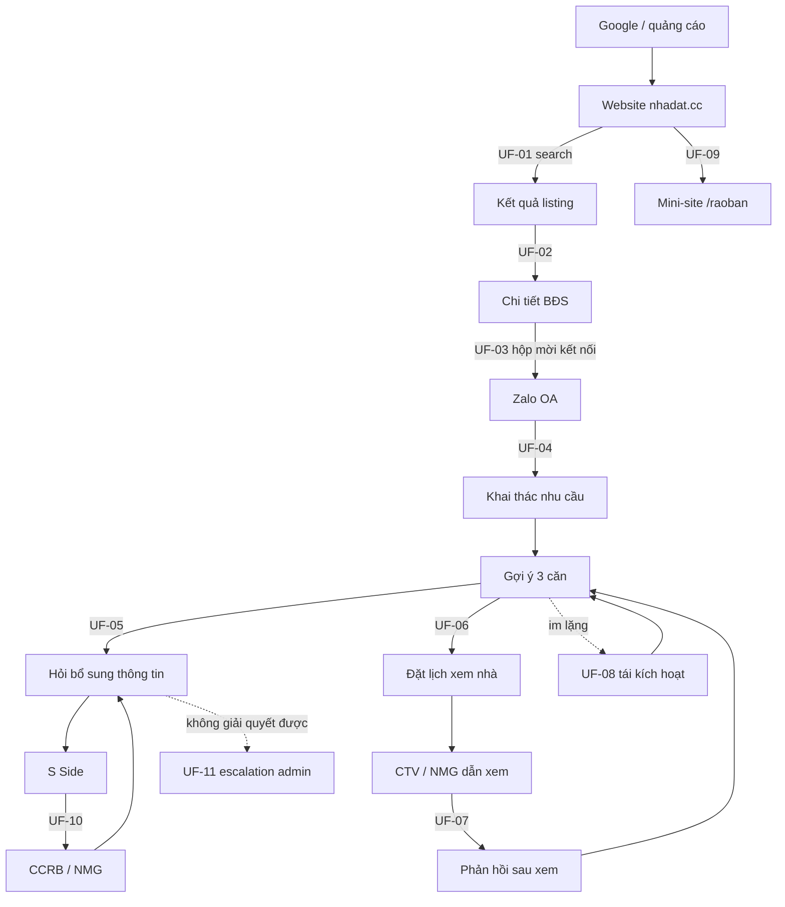
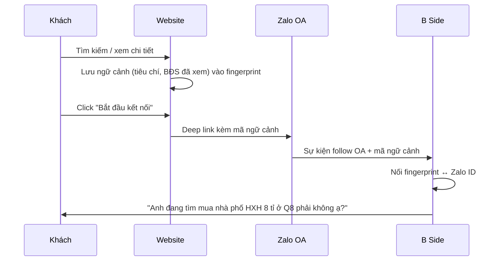
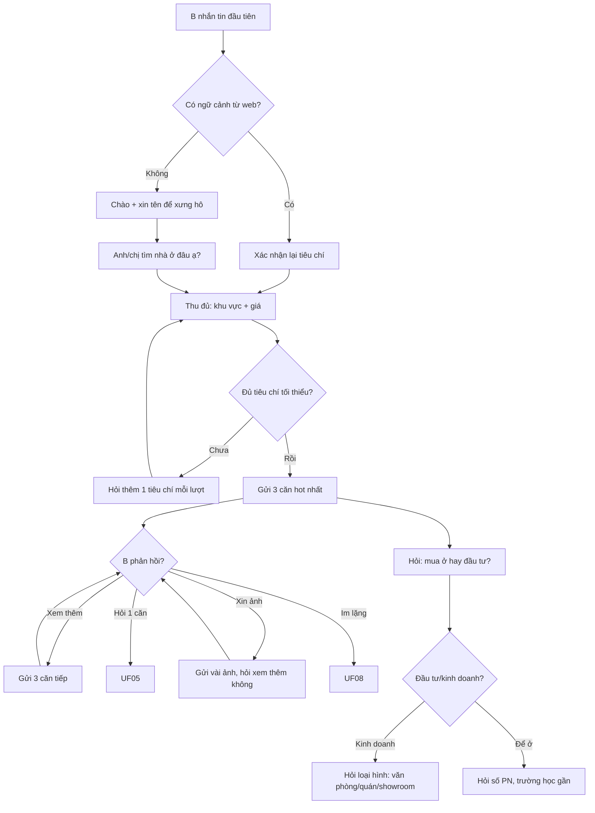
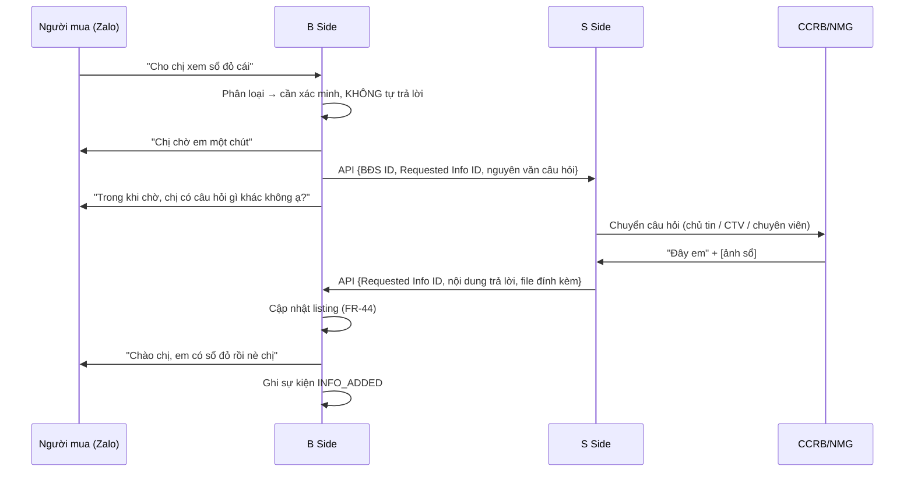
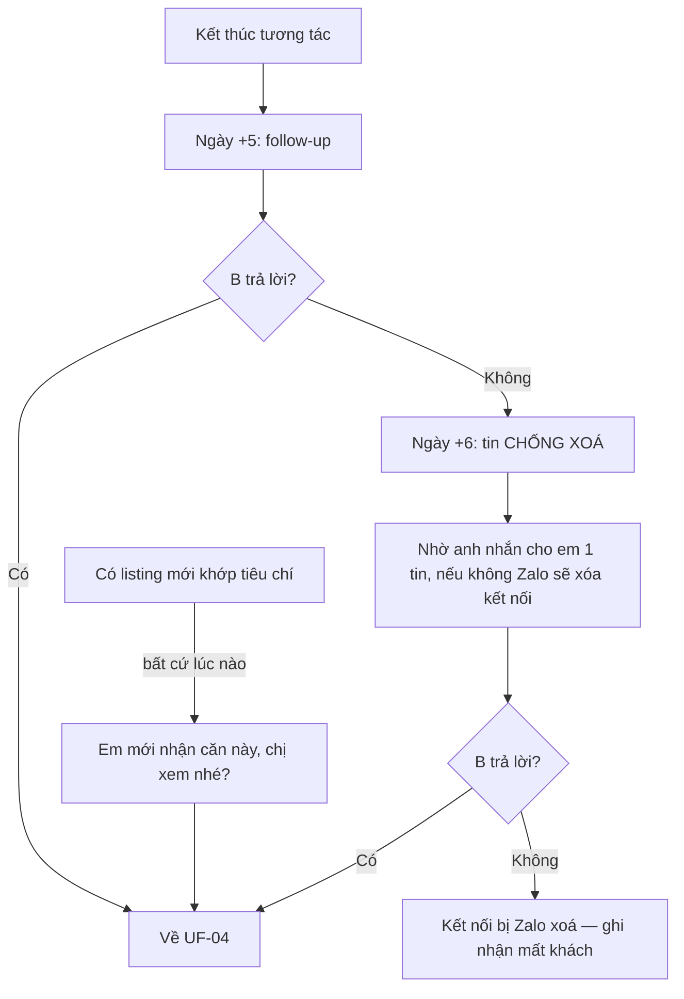
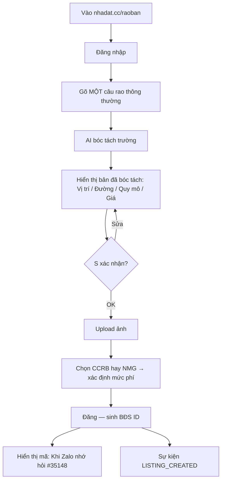
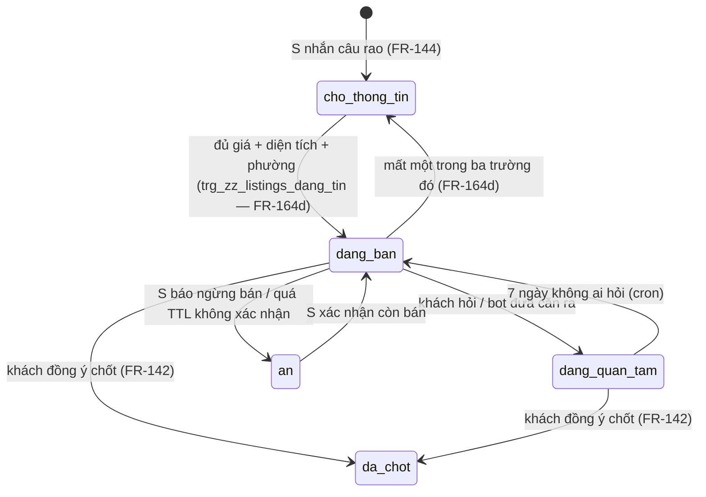

# 03 — User Flows

13 luồng end-to-end. Mỗi luồng ghi actor, FR liên quan, sơ đồ Mermaid hoặc bước
chính, nhánh lỗi, và **một dòng trạng thái dựng** (đối chiếu code 04/09/2026 —
`docs/10 §10.8`; chi tiết chưa dựng gom ở OPEN-43).

## Bản đồ toàn cảnh

---

## UF-01 — Tìm kiếm trên web bằng ngôn ngữ tự nhiên
**Actor** khách vãng lai · **FR** FR-02, FR-08, FR-09, FR-16
🟡 một phần: `/api/search` + `lib/parse-query.ts` bóc câu tìm rồi 302 sang `/{tag}` khớp hoặc `/mua-ban?q=` / `/cho-thue?q=`; lưu tiêu chí vào phiên (fingerprint) chưa dựng.

1. Vào trang chủ hoặc trang tag từ Google, gõ vào ô chat *"tìm mua nhà phố HXH 8 tỉ ở Q8"*.
2. Hệ thống parse thành tiêu chí có cấu trúc (`giao dịch`, `loại`, `đường`, `giá`, `khu vực`).
3. Trang kết quả: *"Tìm thấy N mục theo yêu cầu"* + tiêu đề diễn giải.
4. Lưu tiêu chí vào phiên để dùng ở UF-03.

**Nhánh lỗi**: không parse được → hỏi lại một câu kèm 3 gợi ý, không trả lỗi; 0 kết
quả → nới lỏng lần lượt giá ±20% → phường → quận lân cận, nói rõ đã nới gì.
**Ra**: có ≥1 kết quả hoặc có hộp mời kết nối Zalo — không bao giờ là ngõ cụt.

---

## UF-02 — Xem chi tiết một BĐS
**Actor** khách vãng lai · **FR** FR-10, FR-11, FR-15
✅ đã dựng: `/nha-dat/[code]` (gallery, thông số, JSON-LD, cue mã tin); khối "BĐS tương tự" trên web chưa có — FR-31 chạy trong chat.

1. Click card → trang chi tiết: gallery, mô tả, bảng thông số, vị trí.
2. Cue cố định *"Khi Zalo nhớ hỏi #35148"* (FR-11).
3. Khối "BĐS tương tự" giữ người dùng 3–5 trang (FR-15).

**Ra**: sang Zalo (UF-03) hoặc xem tiếp.

---

## UF-03 — Chuyển từ web sang Zalo OA kèm ngữ cảnh
**Actor** khách vãng lai → B · **FR** FR-13, FR-14, FR-30
❌ chưa dựng: deep link mang ngữ cảnh (`?ref=`) không ai đọc (OPEN-43); hôm nay khách gõ `#mã tin` trong Zalo và bot tra theo mã.

**Ra**: tin đầu tiên của bot nhắc đúng nhu cầu — điểm đo chính của phễu (BR-09).
**Nhánh lỗi**: mất ngữ cảnh → rơi về UF-04, không im lặng.

---

## UF-04 — Chat lần đầu & khai thác nhu cầu
**Actor** B · **FR** FR-20, FR-22, FR-23, FR-24, FR-25, FR-26
✅ đã dựng: `chat-reply` nhánh buyer — hồ sơ nhu cầu `buyers.preferences` (FR-130), lọc kho khi đủ khu vực + giá.

**Tiêu chí tối thiểu**: khu vực (≥ cấp quận) **và** khoảng giá. Tối đa 3 listing/tin
(FR-24); hỏi gọn, không thành bảng hỏi (`06 §6.8`).

---

## UF-05 — Hỏi bổ sung thông tin từ S (vòng lặp trung tâm)
**Actor** B, hệ thống, S · **FR** FR-40…FR-47, FR-98, FR-173
✅ đã dựng: `info_requests` + kho `listing_facts`/`media` tra trước (FR-44); câu khách hỏi giao CTV (FR-173), timeout FR-110 qua cron `info-timeout-tick`.

- **Kho trước, hỏi S sau** (FR-44): có trong `media`/`listing_facts` thì trả ngay;
  câu trả lời mới lọc liên hệ (FR-105) rồi lưu kho. Nhắc S sau 24h, quá 48h đóng
  và báo thật cho B (FR-110).
- **Câu khách hỏi** (`buyer_ask`, FR-173): giao CTV đang hoạt động ít việc nhất
  (không có → admin); CTV trả lời theo mẫu `#mã tin: câu trả lời`; quá 120' nhắc
  admin, CTV tụt hạng. Câu nhỏ giọt nuôi tin vẫn đi S.
- **Hàng dự án** (INS-10, FR-115/116): câu tầng dự án trả lời từ dữ liệu chung,
  không info_request; câu tầng căn đọc `unit_status`, chỉ hỏi S khi quá TTL (FR-107).
- **Quy tắc vàng (RSK-03)**: pháp lý, quy hoạch, "còn bán không" — không bao giờ
  khẳng định: *"Cho tới 15h ngày 17/9 thì còn. Nhưng để em hỏi lại anh nhé."*

**Nhánh lỗi**: S không trả lời trong SLA → escalate CTV → chuyên viên (FR-47), báo
B trung thực.

---

## UF-06 — Đặt lịch xem nhà
**Actor** B, CTV/NMG · **FR** FR-50…FR-57
🟡 một phần: chốt lịch + xin SĐT đúng kịch bản (`chat-reply`), trigger `viewings` → escalation CTV/admin + `xac_nhan_lich` (FR-52), nhắc trước giờ kèm bản đồ (`nudge`, FR-54/55); email `[VIEWING]` nay đi `email_admin()` → ntfy (cần `NTFY_TOKEN`); mở khoá danh tính hai bên (FR-104) chưa dựng.

1. B đề nghị xem, hoặc bot đề nghị sau ≥3 câu hỏi về một căn.
2. Bot xác nhận đúng căn, hỏi khung giờ.
3. **Xin số điện thoại** — nêu rõ chỉ dùng cho buổi xem, có đường từ chối (FR-53 ↔ OPEN-05).
4. Đọc lại lịch cho B xác nhận; sinh `VIEWING_REQUESTED` + báo admin (FR-57).
5. CTV/NMG xác nhận → bot chốt giờ + link bản đồ (FR-54); nhắc trước giờ (FR-55).
6. Sau buổi xem → UF-07.

**Mở khoá danh tính (FR-104)**: chỉ khi lịch **đã chốt** hai bên mới biết SĐT của
nhau (B nhận địa chỉ chính xác + người dẫn xem; S nhận tên + SĐT B). Trước đó bot
khai địa chỉ/thông số/fact đã lưu khi khách hỏi, chỉ SĐT/Zalo chờ tới bước này (OPEN-36).

**Nhánh lỗi**: B không cho số → vẫn nhận lịch, liên hệ qua Zalo (NFR-07); không ai
dẫn được (RSK-05) → đề xuất giờ khác, không huỷ im lặng.

---

## UF-07 — Sau khi xem nhà
**Actor** B · **FR** FR-56, FR-65
🟡 một phần: hỏi cảm nhận 4 giờ sau buổi xem (`feedback`, nudge v25) + chấm sao → `ghi_danh_gia` (FR-65); ghi lý do không ưng thành tiêu chí mới của B chưa dựng.

1. *"Chị ưng căn này không ạ?"* — không ưng → hỏi chưa phù hợp chỗ nào.
2. Câu trả lời (*"mặt tiền trên 4m thôi"*) ghi thành tiêu chí mới, áp cho mọi gợi ý sau.
3. Xin đánh giá 5 sao → chấm cho NMG (FR-102). Quay lại UF-04 với tiêu chí đã tinh chỉnh.

Đây là cơ chế học sở thích chính [nguồn: OKRs eo2024.pptx slide 5].

---

## UF-08 — Tái kích hoạt & chống mất kết nối Zalo
**Actor** hệ thống → B · **FR** FR-60…FR-64 · **Rủi ro** RSK-01
✅ đã dựng: `nudge` v25 — hỏi thăm khi im đủ 5 ngày, sáu góc xoay vòng, im ≥6 ngày buộc câu giữ kết nối, `match` tin mới khớp tiêu chí (trigger DB).

Góc follow-up xoay vòng, không lặp cùng mẫu hai lần liên tiếp: căn cuối đã xem
(FR-61) · căn khác cùng khu/tầm giá (FR-62) · căn mới nhận (FR-64) · hỏi thẳng
*"Chị đã tìm mua được nhà chưa ạ?"*. Mọi tin chủ động kết bằng **một câu hỏi** —
mục tiêu là B *nhắn lại*, chỉ gửi trong 8h–21h VN (FR-133).

---

## UF-09 — S rao tin từ website
**Actor** CCRB / NMG · **FR** FR-90…FR-96, FR-101, FR-114
🟡 một phần: `/raoban` + `/api/listing/parse` (bóc câu rao) + upload ảnh (FR-96) + `/quan-ly`; đăng nhập là Google/magic link chứ không Zalo SSO; biến thể câu rao (FR-93) chưa dựng.

**Ví dụ bóc tách** [nguồn: S's side.docx]: *"Bán nhà HXH xe tải quay đầu, gần ngã
tư Trần Bình Trọng và An Dương Vương, giá 9 tỉ có thể bớt lộc, Phường 4 Quận 5 nhà
trệt dễ xây lại"* → Vị trí: ngã tư TBT–ADV, P4 Q5 · Đường: HXH xe tải quay đầu ·
Quy mô: nhà trệt, dễ xây lại · Giá: 9 tỉ, thương lượng.

**Hàng dự án (FR-114)**: trường tuỳ chọn "Thuộc dự án" + mã căn; bỏ qua = hàng lẻ,
không thêm ma sát cho CCRB (INS-05).

---

## UF-10 — S rao tin ngay trong Zalo (F1)
**Actor** CCRB / NMG · **FR** FR-109, FR-111, FR-106, FR-144, FR-150 · *(FR-97 bản cũ deprecated)* [nguồn: artifact "Cầu Nối BĐS" v2, 08/2026]
✅ đã dựng: `chat-reply` nhánh seller (tạo tin nháp, hỏi nhỏ giọt, `ask-seller` cron), ảnh về bucket `listing-public` (FR-165), trigger tự lên `dang_ban` khi đủ giá + diện tích + phường.

1. S nhắn *"Cần bán nhà MT Trần Bình Trọng giá 6 tỉ"*.
2. Bot hỏi từng bước: khu vực → giá → diện tích → pháp lý → mô tả. Loại BĐS không
   hỏi — trigger tự suy từ câu rao (FR-150), chỉ hỏi khi không đoán được.
3. Khu vực lạ → bot đưa lựa chọn quận/phường.
4. Ảnh Zalo là URL tạm → tải về, lưu kho, ghi `listing_media` (FR-111/165).
5. Listing vào `cho_thong_tin`; đủ giá + diện tích + phường → `dang_ban` (FR-139).
   Thiếu thông tin hoặc ảnh lộ SĐT → bot hỏi tiếp S (FR-144).
6. Vòng đời sau đó theo UF-13. Mã công khai: OPEN-17.

Mỗi lần đăng là một listing riêng; mã công khai là danh tính duy nhất B thấy (FR-104).
`/raoban` (UF-09) là kênh song song.

---

## UF-11 — Escalation sang admin
**Actor** hệ thống → chuyên viên · **FR** FR-76…FR-81
⛔ thay bằng: `reminders` → `escalation-feed` → bridge Zalo (+ ntfy `email_admin()` từ `20260904f`); admin xem tại `/admin` (`20260904c`). Email SMTP không dựng.

| Trigger | Loại | FR |
|---|---|---|
| B hỏi, cần S trả lời | `[QUESTION] <Zalo ID>` | FR-76 |
| B muốn nói chuyện trực tiếp | `[VOICE] <Zalo ID>` | FR-79 |
| B yêu cầu xem nhà | `[VIEWING] <Zalo ID>` | FR-78 |
| B có phản ứng tiêu cực | `[UPSET] <Zalo ID>` | FR-77 |

Body chứa field của danh sách tương ứng, kèm mô tả BĐS nếu có. Định nghĩa "phản
ứng tiêu cực": `07-srs.md §5.4`.

---

## UF-12 — Gửi danh sách riêng cho một người mua
**Actor** hệ thống → B · **FR** FR-100
🟡 một phần: trang `/ds/[token]` đã có (`20260904g`, `noindex`, robots chặn `/ds/`); bot chưa tự tạo danh sách và gửi link.

1. B Side tạo danh sách `{User ID, [BĐS ID…]}` khi cần chào nhiều hơn 3 căn (FR-24).
2. Sinh URL `nhadat.cc/ds/<token>`; bot gửi link kèm câu hỏi xin phép.
3. B mở → trang listing lọc sẵn, mỗi card có cue mã để hỏi lại trên Zalo.

**Riêng tư**: token không đoán được, `noindex`, không lộ thông tin B trên trang.

---

## UF-13 — Vòng đời listing & báo sold cho người đang chờ
**Actor** hệ thống, admin, S, B · **FR** FR-139, FR-107, FR-108, FR-164, FR-103 · *(FR-106 bản cũ deprecated)* [nguồn: artifact "Cầu Nối BĐS" v2, 08/2026]
✅ đã dựng: 5 trạng thái + trigger `trg_zz_listings_dang_tin`; `da_chot` → kind `sold` cho khách trong `interests` (nudge v25); tin im 30 ngày → hỏi chủ "còn bán không" (`stale-listing-tick`, FR-103). TTL 7 ngày (FR-107) chỉ áp cho căn trong dự án.

1. Trạng thái gắn vào **từng BĐS**; S báo "bán rồi" ở bất kỳ đâu đều được nhận diện.
2. `last_confirmed_at` điều khiển TTL: quá hạn bot hỏi S *"Căn [mã] còn bán không?"*
   trước khi giới thiệu B mới — không hỏi lặp mỗi lần có khách.
3. Sang `da_chot`: quét `interests`, báo mọi B đang chờ kèm căn thay thế (FR-108).
4. `an` không xoá listing — chỉ ẩn khỏi matching tới khi S xác nhận lại.
5. Tin chủ động ngoài cửa sổ tương tác Zalo cần ZNS trả phí (OPEN-09).
