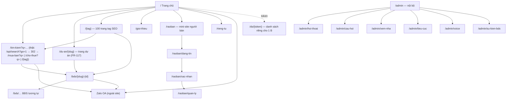
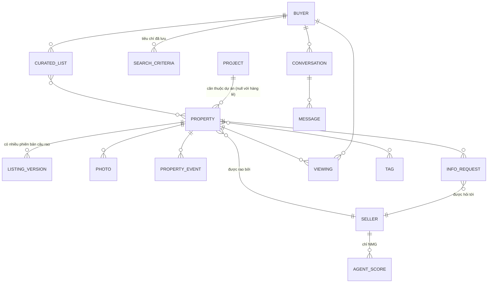

# 04 — Information Architecture

## 4.1 Nguyên tắc

| ID | Nguyên tắc | Vì sao |
|---|---|---|
| IA-P1 | Mọi trang đều là **phễu về Zalo** | INS-01 |
| IA-P2 | URL sinh theo **tag SEO**, không theo cấu trúc DB | FR-12, BR-08 |
| IA-P3 | Mã BĐS (`#35148`) là **khoá liên kết duy nhất** giữa web và chat | FR-11 |
| IA-P4 | Điều hướng khuyến khích xem 3–5 trang trước khi rời sang Zalo | FR-15 |
| IA-P5 | Khu vực S (`/raoban`) tách hẳn khu vực B — hai tâm trí khác nhau | S's side.docx |
| IA-P6 | Không có trang "tài khoản người mua" — B sống trên Zalo, không trên web | NFR-07 |

## 4.2 Sitemap

## 4.3 Bảng trang

| ID | URL | Mục đích | Index? | FR |
|---|---|---|---|---|
| IA-01 | `/` | Giới thiệu dịch vụ + ô search chat + hộp mời kết nối | ✅ | FR-01…06, FR-13 |
| IA-02 | `/tim-kiem?q={truy vấn}` | Kết quả tìm kiếm ngôn ngữ tự nhiên *[dựng 04/09/2026: không có route `/tim-kiem`; form trang chủ GET `/api/search?q=&go=1` → 302 sang `/{tag}` khớp hoặc `/mua-ban?…&q=` / `/cho-thue?…&q=`; hai trang đó tự đánh `noindex` khi có `q`; `/api/` chặn trong robots]* | ❌ `noindex` | FR-08, FR-09 |
| IA-03 | `/{tag}` | 100 trang tag SEO tĩnh | ✅ | FR-12 |
| IA-04 | `/bds/{slug}-{id}` | Chi tiết một BĐS | ✅ | FR-10, FR-11 |
| IA-05 | `/gioi-thieu` | Cách hoạt động, cam kết riêng tư, biểu phí | ✅ | FR-04 |
| IA-06 | `/rieng-tu` | Chính sách dữ liệu, fingerprint, quyền ngắt kết nối | ✅ | NFR-08 |
| IA-07 | `/raoban` | Landing người bán: lợi ích + biểu phí CCRB/NMG | ✅ | FR-90, FR-06 |
| IA-08 | `/raoban/dang-tin` | Ô nhập **một câu rao** | ❌ | FR-91 |
| IA-09 | `/raoban/xac-nhan` | Bản bóc tách để S sửa + upload ảnh | ❌ | FR-94, FR-96 |
| IA-10 | `/raoban/quan-ly` | Tin của tôi + câu hỏi chờ trả lời | ❌ | FR-98 |
| IA-11 | `/ds/{token}` | Danh sách riêng gửi cho một B *[dựng 04/09/2026: `app/ds/[token]`, `noindex, nofollow`, robots chặn `/ds/`, không vào sitemap]* | ❌ `noindex` | FR-100 |
| IA-12 | `/admin/*` | Backend nội bộ, 20 mục/trang | ❌ | FR-70…81 |
| IA-13 | `/du-an/{slug}` | Trang dự án: thông tin chung + giỏ hàng (tin `project_id`) *[dựng 04/09/2026, SSG, canonical + sitemap]* | ✅ | FR-117, FR-113 |
| IA-14 | `/api/search`, `/api/listing/parse` | Route handler JSON (bóc câu tìm / câu rao), không phải trang *[dựng 04/09/2026]* | ❌ (robots chặn `/api/`) | FR-09, FR-92 |

> `/tim-kiem` **không** index để tránh sinh vô số trang mỏng cạnh tranh với trang tag.
> Trang tag mới là tài sản SEO (IA-P2).

## 4.4 Chiến lược URL & SEO

### Trang tag — cấu trúc
Nguồn tag: **TOP-100 keyword BĐS phổ biến nhất trên Google**, lấy từ file
`ndCC-TOP-KW-2014-01.xlsm` [nguồn: nhadat.cc website.docx §Tag]. File này **chưa có
trong repo** → `OPEN-06`.

Công thức slug: `{giao-dịch}-{loại-hình}-{thuộc-tính}-{khu-vực}`

| Ví dụ keyword | URL |
|---|---|
| Nhà dưới 1 tỉ đồng | `/nha-duoi-1-ty` |
| Bán nhà hẻm xe hơi Quận 5 | `/ban-nha-hem-xe-hoi-quan-5` |
| Cho thuê căn hộ 2PN Tân Bình | `/cho-thue-can-ho-2pn-tan-binh` |
| Bán nhà mặt tiền Trần Bình Trọng | `/ban-nha-mat-tien-tran-binh-trong` |

**Quy tắc**
- Slug không dấu, chữ thường, gạch nối; `tỉ` → `ty` trong URL, hiển thị vẫn là "tỉ".
- Một keyword ↔ một URL duy nhất. Biến thể → `canonical` về URL chính.
- Trang tag render server-side (SSR/SSG), có H1 = keyword, đoạn mô tả 80–120 từ,
  danh sách listing khớp, và **link chéo sang 6–8 tag liên quan** (phục vụ IA-P4).
- Trang tag rỗng: **không** trả 404 — hiển thị hộp mời kết nối Zalo + tag lân cận
  (IA-P1: không bao giờ là ngõ cụt).

> **Dựng 04/09/2026**: khung trang tag đã có (`lib/tags.ts`, `app/[tag]`), 64 tag
> sinh từ taxonomy hiện có theo đúng công thức slug và 4 quy tắc trên; bộ TOP-100
> keyword thật vẫn chờ OPEN-06, tag theo khu mới chờ OPEN-27 nửa sau.

### Structured data
Mỗi listing phát `schema.org/RealEstateListing` với `name`, `description`, `price`,
`floorSize`, `numberOfRooms`, `address`, `image`, `identifier` = mã BĐS (NFR-09).

## 4.5 Content model

### Thực thể trung tâm — PROPERTY

| Nhóm | Trường | Ghi chú |
|---|---|---|
| Định danh | `id` (mã hiển thị `#35148`), `slug` | IA-P3 |
| Giao dịch | `deal_type` ∈ {bán, cho thuê} | |
| Loại | `property_type` ∈ {nhà phố, chung cư, đất, MT, biệt thự, phòng trọ} | |
| Vị trí | `street`, `alley`, `ward`, `district`, `city`, `lat/lng`, `landmarks[]` | landmarks phục vụ INS-07 |
| Tiếp cận | `access_type` ∈ {MT, HXH, HXT, hẻm xe máy}, `alley_width_m` | Tiêu chí lọc số 1 |
| Quy mô | `land_area_m2`, `legal_area_m2`, `built_area_m2`, `frontage_m`, `length_m`, `floors`, `bedrooms`, `bathrooms` | Phân biệt DT thực tế / DT công nhận |
| Giá | `price`, `price_unit` (tỉ/triệu-tháng), `negotiable` | |
| Pháp lý | `has_red_book`, `completion_year` (hoàn công), `planning_status` | **Luôn cần S xác minh** (RSK-03) |
| Nội dung | `raw_pitch` (câu rao gốc của S), `variants[]` (biến thể AI sinh) | FR-91, FR-93 |
| Trạng thái | `status` ∈ {đang rao, tạm ngưng, đã bán, hết hạn}, `last_verified_at` | RSK-06 |
| Xếp hạng | `hot_score` = số sự kiện 2 tháng gần nhất | FR-73 |
| Dự án | `project_id` (null = hàng lẻ), `unit_code`, `floor`, `direction`, `unit_status` ∈ {còn bán, giữ chỗ, đã cọc, đã bán} | FR-113, INS-10 |

Thực thể **PROJECT** (FR-113): `name`, `slug`, `developer`, vị trí, `legal_status`,
`amenities`, `floor_plans`, `handover_date` — dữ liệu **dùng chung** cho mọi căn;
câu hỏi tầng dự án trả lời từ đây, không qua vòng info_request (FR-115). Không bao
giờ dùng chung dữ liệu giữa hai dự án. Trang `/du-an/{slug}`: giai đoạn 2 (FR-117) *[nửa trang dựng 04/09/2026 — IA-13]*.

### PROPERTY_EVENT — 5 loại sự kiện chuẩn
[nguồn: chats w B.docx §Các sự kiện với 1 BĐS]

| Mã | Nghĩa |
|---|---|
| `CREATED` | Được tạo ra |
| `UPDATED` | Được hiệu chỉnh |
| `INFO_REQUESTED` | Được hỏi thêm thông tin |
| `INFO_ADDED` | Được có thêm thông tin |
| `VIEWING_REQUESTED` | Được yêu cầu xem nhà |

## 4.6 Taxonomy tìm kiếm

Bộ chiều mà cả web search lẫn bot phải hiểu (FR-09, FR-22, FR-23):

| Chiều | Giá trị / cách diễn đạt của người dùng |
|---|---|
| Giao dịch | mua, bán, thuê, cho thuê |
| Loại hình | nhà phố, nhà cấp 4, chung cư/căn hộ, đất, biệt thự, nhà trọ, mặt bằng |
| Khu vực | tỉnh/thành (Sài Gòn, Long An — FR-174, 03/09/2026) → quận/huyện (tên cũ, INS-12) → phường (cũ ↔ mới, FR-118 / OPEN-27 nửa sau) → đường → hẻm số → **ngã tư X và Y** → **mốc tiện ích** ("gần hồ bơi Lam Sơn") → **"gần căn này"** |
| Giá | "khoảng 10 tỉ", "dưới 10 tỉ", "trên 9 dưới 10", "giá cỡ căn này quanh đây" |
| Tiếp cận | HXH, hẻm xe tải, ô tô vô nhà, MT, hẻm 2 xe máy tránh nhau |
| Quy mô | m², "3.9x20", số tầng, số PN |
| Pháp lý | sổ đỏ, hoàn công, quy hoạch |
| Mục đích | để ở, đầu tư, kinh doanh (văn phòng / quán / showroom) |

> Bốn cách diễn đạt vị trí in đậm là **khác biệt cốt lõi** so với bộ lọc dropdown của
> đối thủ, và là lý do phải phủ sâu một quận trước (INS-08).

## 4.7 Điều hướng

**Header (khu B)**: Logo · Mua bán · Cho thuê · Giới thiệu · `[Rao bán với nhadat.cc]`
· `[Zalo — nút nhấn mạnh]`

**Footer**: 4 cột — Về nhadat.cc · Tag phổ biến (12 tag top) · Khu vực (quận nội thành)
· Cam kết riêng tư. Kèm khối "Cần bán hay cho thuê?" dẫn `/raoban`.

**Header (khu S)**: Logo · Đăng tin · Tin của tôi · Câu hỏi chờ trả lời (badge số) ·
Biểu phí · Tài khoản Zalo.

**Breadcrumb** (phục vụ SEO + IA-P4): `Trang chủ › Bán nhà Quận 5 › Hẻm xe hơi › #35148`.

## 4.8 Đặt "Hộp mời kết nối Zalo"

| Trang | Vị trí | Nội dung mang theo |
|---|---|---|
| `/` | Dưới ô search, và sticky bar mobile | Truy vấn vừa gõ |
| `/tim-kiem` (thật: `/mua-ban?q=`) | Sau card thứ 3 và cuối trang *[04/09/2026: hộp đặt ĐẦU lưới, ngay dưới dải tiêu đề, và ở ô rỗng]* | Toàn bộ tiêu chí đã parse *[thật: `ref=search:<câu gốc>`]* |
| `/{tag}` | Sau card thứ 3 và cuối trang | Tiêu chí suy từ tag |
| `/bds/{id}` | Cạnh bảng thông số + cuối trang | **Mã BĐS** + tiêu chí phiên |
| `/ds/{token}` | Đầu trang | ID danh sách |

Nội dung chuẩn [nguồn: nhadat.cc website.docx §Hộp mời kết nối]:
> *"Mời anh/chị kết nối ngay với tụi em để tụi em cùng tìm kiếm, và khi có sẽ thông báo tức thì."*
> `[Zalo] Bắt đầu kết nối`
