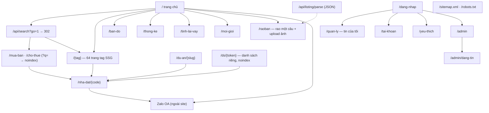
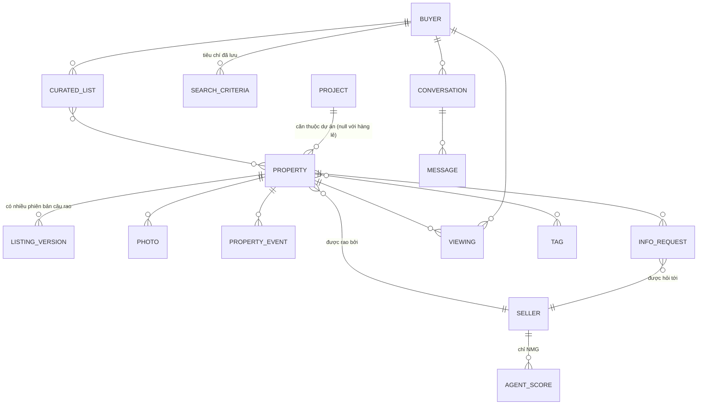

# 04 — Information Architecture

## 4.1 Nguyên tắc

| ID | Nguyên tắc | Vì sao |
|---|---|---|
| IA-P1 | Mọi trang đều là **phễu về Zalo** | INS-01 |
| IA-P2 | URL sinh theo **tag SEO**, không theo cấu trúc DB | FR-12, BR-08 |
| IA-P3 | Mã BĐS (`#35148`) là **khoá liên kết duy nhất** giữa web và chat | FR-11 |
| IA-P4 | Điều hướng khuyến khích xem 3–5 trang trước khi rời sang Zalo | FR-15 |
| IA-P5 | Khu vực S (`/raoban`) tách hẳn khu vực B — hai tâm trí khác nhau | S's side.docx |
| IA-P6 | Không có trang "tài khoản người mua" — B sống trên Zalo, không trên web | NFR-07 |

## 4.2 Sitemap (route thật trong `app/`, 04/09/2026)

## 4.3 Bảng trang

| ID | URL (thật) | Mục đích | Index? | FR | Trạng thái |
|---|---|---|---|---|---|
| IA-01 | `/` | Giới thiệu + ô search chat + hộp mời kết nối | ✅ | FR-01…06, FR-13 | ✅ đã dựng |
| IA-02 | `/tim-kiem` → thật `/api/search?go=1` → 302 `/{tag}` hoặc `/mua-ban?q=` / `/cho-thue?q=` | Kết quả tìm ngôn ngữ tự nhiên | ❌ `noindex` khi có `q` | FR-08, FR-09 | ⛔ thay bằng redirect |
| IA-03 | `/{tag}` | Trang tag SEO tĩnh (`lib/tags.ts`, 64 tag) | ✅ | FR-12 | ✅ đã dựng; TOP-100 thật chờ OPEN-06 |
| IA-04 | `/bds/{slug}-{id}` → thật `/nha-dat/{code}` | Chi tiết một BĐS, JSON-LD | ✅ | FR-10, FR-11 | ✅ đã dựng |
| IA-05 | `/gioi-thieu` | Cách hoạt động, cam kết riêng tư, biểu phí | ✅ | FR-04 | ❌ chưa dựng (nội dung nằm trên `/`) |
| IA-06 | `/rieng-tu` | Chính sách dữ liệu, quyền ngắt kết nối | ✅ | NFR-08 | ❌ chưa dựng |
| IA-07 | `/raoban` | Landing người bán + ô một câu rao + ảnh | ✅ | FR-90, FR-91, FR-96 | ✅ đã dựng (gộp IA-08/09) |
| IA-08 | `/raoban/dang-tin` | Ô nhập một câu rao | ❌ | FR-91 | ⛔ gộp vào `/raoban` |
| IA-09 | `/raoban/xac-nhan` | Bản bóc tách để S sửa + upload ảnh | ❌ | FR-94, FR-96 | ⛔ gộp vào `/raoban` |
| IA-10 | `/raoban/quan-ly` → thật `/quan-ly` | Tin của tôi + câu hỏi chờ trả lời | ❌ | FR-98 | 🟡 tin của tôi có; câu hỏi chờ trả lời chưa |
| IA-11 | `/ds/{token}` | Danh sách riêng cho một B (`noindex, nofollow`, robots chặn) | ❌ | FR-100 | ✅ trang có; bot chưa tự tạo (UF-12) |
| IA-12 | `/admin`, `/admin/dang-tin` | Sức khoẻ bot, việc chờ, buyer side, đăng tin tay | ❌ | FR-70…81, FR-152 | ✅ đã dựng |
| IA-13 | `/du-an/{slug}` | Trang dự án + giỏ hàng (tin `project_id`), SSG | ✅ | FR-117, FR-113 | ✅ đã dựng |
| IA-14 | `/api/search`, `/api/listing/parse` | Route handler JSON, không phải trang | ❌ robots chặn `/api/` | FR-09, FR-92 | ✅ đã dựng |
| IA-15 | `/mua-ban`, `/cho-thue` | Lưới listing theo giao dịch, lọc bằng searchParams (`unstable_cache`) | ✅ (❌ khi có `q`) | FR-07, FR-08 | ✅ đã dựng |
| IA-16 | `/ban-do` | Bản đồ tin có `lat/lng` | ✅ | FR-122 | ✅ đã dựng |
| IA-17 | `/thong-ke` | Giá theo phường/loại tính tại chỗ từ tin đang có | ✅ | FR-120 | ✅ đã dựng |
| IA-18 | `/tinh-lai-vay` | Công cụ tính khoản vay | ✅ | FR-119 | ✅ đã dựng |
| IA-19 | `/moi-gioi` | Danh sách NMG công khai (view `agents_public`, không lộ liên hệ) | ✅ | FR-125 | ✅ đã dựng |
| IA-20 | `/yeu-thich` | Tin đã tim (localStorage) | ❌ | FR-121 | ✅ đã dựng |
| IA-21 | `/dang-nhap`, `/tai-khoan` | Google OAuth / magic link (không Zalo SSO) | ❌ | FR-124, FR-126 | ✅ đã dựng |
| IA-22 | `/sitemap.xml`, `/robots.txt` | `app/sitemap.ts`, `app/robots.ts` | — | NFR-09 | ✅ đã dựng |

> Trang tìm kiếm không index để tránh trang mỏng cạnh tranh với trang tag — tag mới
> là tài sản SEO (IA-P2).

## 4.4 Chiến lược URL & SEO

**Nguồn tag**: TOP-100 keyword BĐS trên Google, file `ndCC-TOP-KW-2014-01.xlsm`
[nguồn: nhadat.cc website.docx §Tag] — chưa có trong repo → OPEN-06; hiện 64 tag
sinh từ taxonomy §4.6.

Công thức slug: `{giao-dịch}-{loại-hình}-{thuộc-tính}-{khu-vực}`

| Keyword | URL |
|---|---|
| Nhà dưới 1 tỉ đồng | `/nha-duoi-1-ty` |
| Bán nhà hẻm xe hơi Quận 5 | `/ban-nha-hem-xe-hoi-quan-5` |
| Cho thuê căn hộ 2PN Tân Bình | `/cho-thue-can-ho-2pn-tan-binh` |
| Bán nhà mặt tiền Trần Bình Trọng | `/ban-nha-mat-tien-tran-binh-trong` |

**Bốn quy tắc**
1. Slug không dấu, chữ thường, gạch nối; `tỉ` → `ty` trong URL, hiển thị vẫn "tỉ".
2. Một keyword ↔ một URL; biến thể → `canonical` về URL chính.
3. Trang tag SSG: H1 = keyword, mô tả 80–120 từ, listing khớp, link chéo 6–8 tag
   liên quan (IA-P4).
4. Tag rỗng **không 404** — hộp mời kết nối Zalo + tag lân cận (IA-P1); slug lạ
   ngoài danh sách thì 404 (`dynamicParams=false`).

**Structured data**: mỗi listing phát `schema.org/RealEstateListing` (`name`,
`description`, `price`, `floorSize`, `numberOfRooms`, `address`, `image`,
`identifier` = mã BĐS) — NFR-09.

## 4.5 Content model

Bảng thật (`listings`, `listing_facts`, `listing_media`, `property_events`,
`info_requests`, `viewings`, `buyers`, `conversations`, `messages`, `interests`,
`projects`, `sellers`, `ratings`, `deals`) — cột chi tiết ở `07-srs.md §3`.

### PROPERTY — nhóm trường

| Nhóm | Trường | Ghi chú |
|---|---|---|
| Định danh | `id` (UUID bất biến), `code` (mã hiển thị `#35148`), `slug` | IA-P3 |
| Giao dịch · loại | `deal_type` ∈ {bán, cho thuê}; `property_type` ∈ {nhà phố, chung cư, đất, MT, biệt thự, phòng trọ, mặt bằng} | |
| Vị trí | `street`, `alley`, `ward`, `district`, `city`, `lat/lng`, `landmarks[]` | landmarks phục vụ INS-07 |
| Tiếp cận | `access_type` ∈ {MT, HXH, HXT, hẻm xe máy}, `alley_width_m`, `distance_to_street_m` | Tiêu chí lọc số 1 |
| Quy mô | `land_area_m2`, `legal_area_m2`, `built_area_m2`, `frontage_m`, `length_m`, `floors`, `bedrooms`, `bathrooms` | FR-172 |
| Giá | `price_vnd`, `price_per_m2_vnd`, `price_unit`, `negotiable` | |
| Pháp lý | `legal_status`, `has_completion`, `planning_status` | Luôn cần S xác minh (RSK-03) |
| Nội dung | `raw_pitch` (câu rao gốc), `variants[]` (AI sinh — FR-93, chưa dựng) | FR-91 |
| Trạng thái | `status` ∈ {cho_thong_tin, dang_ban, dang_quan_tam, da_chot, an}, `last_confirmed_at` | FR-139, RSK-06 |
| Xếp hạng | `hot_score` = số sự kiện 2 tháng gần nhất | FR-73 |
| Dự án | `project_id` (null = hàng lẻ), `unit_code`, `floor`, `direction`, `unit_status` ∈ {còn bán, giữ chỗ, đã cọc, đã bán} | FR-113, INS-10 |

**PROJECT** (FR-113): `name`, `slug`, `developer`, vị trí, `legal_status`, `amenities`,
`floor_plans`, `handover_date` — dùng chung cho mọi căn; câu tầng dự án trả lời từ
đây (FR-115). Không dùng chung dữ liệu giữa hai dự án.

**PROPERTY_EVENT** [nguồn: chats w B.docx §Các sự kiện với 1 BĐS]: `CREATED` ·
`UPDATED` · `INFO_REQUESTED` · `INFO_ADDED` · `VIEWING_REQUESTED` (bảng
`property_events`, FR-70).

## 4.6 Taxonomy tìm kiếm

Bộ chiều mà cả web search lẫn bot phải hiểu (FR-09, FR-22, FR-23):

| Chiều | Giá trị / cách diễn đạt của người dùng |
|---|---|
| Giao dịch | mua, bán, thuê, cho thuê |
| Loại hình | nhà phố, nhà cấp 4, chung cư/căn hộ, đất, biệt thự, nhà trọ, mặt bằng |
| Khu vực | tỉnh/thành (Sài Gòn, Long An — FR-174) → quận/huyện (tên cũ, INS-12) → phường (cũ ↔ mới, FR-118 / OPEN-27) → đường → hẻm số → **ngã tư X và Y** → **mốc tiện ích** → **"gần căn này"** |
| Giá | "khoảng 10 tỉ", "dưới 10 tỉ", "trên 9 dưới 10", "giá cỡ căn này quanh đây" |
| Tiếp cận | HXH, hẻm xe tải, ô tô vô nhà, MT, hẻm 2 xe máy tránh nhau |
| Quy mô | m², "3.9x20", số tầng, số PN |
| Pháp lý | sổ đỏ, hoàn công, quy hoạch |
| Mục đích | để ở, đầu tư, kinh doanh (văn phòng / quán / showroom) |

> Bốn cách diễn đạt vị trí in đậm là khác biệt cốt lõi so với bộ lọc dropdown của
> đối thủ — lý do phải phủ sâu một quận trước (INS-08).

## 4.7 Điều hướng

- **Header (khu B)**: Logo · Mua bán · Cho thuê · Bản đồ · Thống kê · `[Rao bán]` · `[Zalo — nút nhấn mạnh]`.
- **Footer**: 4 cột — Về nhadat.cc · Tag phổ biến · Khu vực · Cam kết riêng tư; khối "Cần bán hay cho thuê?" dẫn `/raoban`.
- **Khu S**: `/raoban` (đăng tin) · `/quan-ly` (tin của tôi) · `/tai-khoan`.
- **Breadcrumb** (SEO + IA-P4): `Trang chủ › Bán nhà Quận 5 › Hẻm xe hơi › #35148`.

## 4.8 Đặt "Hộp mời kết nối Zalo"

| Trang | Vị trí | Nội dung mang theo |
|---|---|---|
| `/` | Dưới ô search, sticky bar mobile | Truy vấn vừa gõ |
| `/mua-ban?q=` · `/cho-thue?q=` | Đầu lưới, ngay dưới dải tiêu đề, và ở ô rỗng | Câu gốc (`ref=search:<câu>` — FR-14, phía bot chưa đọc) |
| `/{tag}` | Sau card thứ 3 và cuối trang | Tiêu chí suy từ tag |
| `/nha-dat/{code}` | Cạnh bảng thông số + cuối trang | **Mã BĐS** + tiêu chí phiên |
| `/ds/{token}` | Đầu trang | ID danh sách |

Nội dung chuẩn [nguồn: nhadat.cc website.docx §Hộp mời kết nối]:
> *"Mời anh/chị kết nối ngay với tụi em để tụi em cùng tìm kiếm, và khi có sẽ thông báo tức thì."* `[Zalo] Bắt đầu kết nối`
