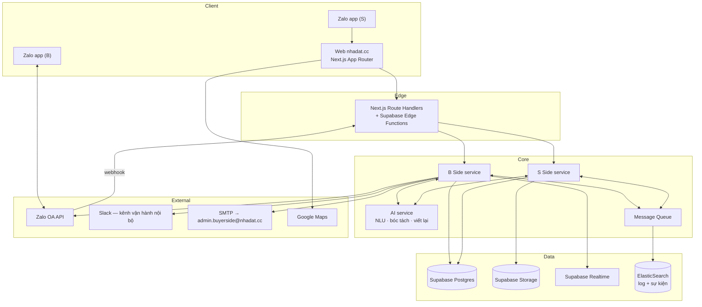

# 07 — Software Requirements Specification

**Hệ thống**: nhadat.cc · **Phiên bản**: v1.0 (Draft) · **Ngày**: 2026-08-21
**Cơ sở**: `Tài liệu hệ thống nhadat.cc.pdf` (Le Duong, 06/10/2024, v.5) +
`02-requirements.md` + `03-user-flows.md` + `04-information-architecture.md`.

Tài liệu này là **hợp đồng kỹ thuật** với vendor phát triển. Mọi mục `SRS-` phải
kiểm chứng được.

---

## 1. Giới thiệu

### 1.1 Mục đích
Đặc tả đầy đủ phần mềm cần xây dựng để hiện thực hoá các yêu cầu ở `02-requirements.md`,
đủ chi tiết để ước lượng, phát triển và nghiệm thu trong ngân sách 418tr VND (NFR-14).

### 1.2 Phạm vi hệ thống
Bốn phân hệ triển khai được độc lập:

| Mã | Phân hệ | Nội dung |
|---|---|---|
| `WEB` | Website công khai | Landing, listing, search, tag SEO, chi tiết BĐS |
| `BOT` | B Side | Zalo OA chatbot, NLU, gợi ý, hội thoại, giữ chân |
| `SEL` | S Side | Mini-site rao tin, bóc tách AI, luồng trả lời câu hỏi |
| `ADM` | Admin | Bảng thống kê, escalation, email notification |

### 1.3 Tài liệu tham chiếu
`docs/00`…`docs/06`, `docs/09-open-issues.md`.

---

## 2. Kiến trúc tổng thể

> **Nghiệm thu 04/09/2026 (`10 §10.8`, OPEN-43)** — phần lớn §2.1, §3.2, §3.8b,
> §4, §5.3 (bảng "thiết kế"), §5.5 và 9/13 AC ở §7 là **thiết kế chưa dựng**:
> stack thật là Next.js + Supabase (Postgres/Edge/Storage/Vault, pg_net,
> pg_cron), Google OAuth + magic link (không Zalo SSO), 3 hàng đợi Postgres
> (không Logstash/ES), bridge Zalo + ntfy (không Slack/SMTP), Leaflet/OSM
> (không Google Maps), không fingerprint; không route `/api/*` nào — B↔S đi
> bằng bảng `info_requests` + trigger. Chờ chủ dự án chốt cách đánh dấu
> (OPEN-43); trước đó, coi các mục nêu trên là lộ trình, và **§3.8b, §3.11,
> §3.12, §3.13, §3.14 + bảng cron "thật" §5.3 là hiện trạng**.



### SRS-2.1 — Tech stack

| Lớp | Công nghệ | Nguồn |
|---|---|---|
| Web | Next.js (App Router) + TypeScript + Tailwind | `.claude/launch.json`, `.gitignore` |
| Auth | Supabase Auth + **Zalo SSO** | PDF hệ thống §2, §Công nghệ 4 |
| DB | Supabase Postgres | PDF hệ thống §1, §3 |
| Storage | Supabase Storage (ảnh listing, giấy tờ) | PDF hệ thống §3 |
| Realtime | Supabase Realtime | PDF hệ thống §6 |
| Serverless | Supabase Functions (webhook, API tích hợp) | PDF hệ thống §Công nghệ 1 |
| Hàng đợi | Logstash (+ ElasticSearch lưu log/sự kiện) | PDF hệ thống §5 — **xem `OPEN-11`** |
| Chat | Zalo OA API + Webhook | PDF hệ thống §4, §7 |
| Vận hành nội bộ | Slack API + Webhook | PDF hệ thống §4 |
| AI | LLM cho NLU, entity recognition, sinh câu rao | PDF hệ thống §Công nghệ 2 |
| Định danh khách vãng lai | Fingerprint trình duyệt | PDF hệ thống §1 |

> **Ghi chú kiến trúc (BA).** Tài liệu gốc mô tả **Logstash làm hàng đợi tin nhắn** để
> "giữ lại tin nhắn nếu người bán hoặc người mua không online". Logstash là pipeline
> thu thập log, **không** cung cấp bảo đảm giao nhận (at-least-once, retry, DLQ) mà
> NFR-04 đòi hỏi. Khuyến nghị: dùng Postgres outbox + worker, hoặc pgmq/Redis Streams,
> và giữ Logstash + ElasticSearch cho **quan sát** (log, phân tích sự kiện). Quyết định
> cuối thuộc về chủ dự án — `OPEN-11`.

### SRS-2.2 — Hai đường giao tiếp S↔B (điểm mâu thuẫn cần chốt)

Tài liệu gốc mô tả **hai cơ chế khác nhau** cho cùng một việc:

| Cơ chế | Nguồn | Mô tả |
|---|---|---|
| **A — Relay qua Slack** | PDF hệ thống §4 | Zalo → Chatbot → Slack Channel → người bán (web) → ngược lại |
| **B — API S Side ↔ B Side** | `S's side.docx`, `chats w B.docx` | Gọi API có `BĐS ID`, `Requested Info ID`, nguyên văn câu hỏi/trả lời |

**Khuyến nghị BA**: hai cơ chế **không loại trừ nhau** mà phục vụ hai mục đích:
- **B là đường nghiệp vụ chính** — có ID, truy vết được, cập nhật được listing (FR-44),
  hiển thị được ở admin (FR-76). Đây là thứ phải xây.
- **A là kênh quan sát/can thiệp của con người** — chuyên viên theo dõi hội thoại trong
  Slack và nhảy vào khi cần, không phải đường đi bắt buộc của dữ liệu.

Đặc tả dưới đây theo khuyến nghị này. Chờ chủ dự án xác nhận — `OPEN-03`.

---

## 3. Mô hình dữ liệu

Chuẩn: Postgres, `snake_case`, khoá chính `uuid`, mọi bảng có `created_at`, `updated_at`.

### SRS-3.1 · `properties`
```
id                uuid pk
code              int unique          -- mã hiển thị #35148, sequence
slug              text unique
deal_type         enum(sale, rent)
property_type     enum(nha_pho, nha_cap4, chung_cu, dat, biet_thu, phong_tro, mat_bang, chua_ro)
                  -- chua_ro = giá trị THẬT (FR-150), không phải NULL ngầm;
                  -- trigger trg_listings_fill_property_type tự lấp từ mô tả
-- vị trí
street            text
alley             text                -- "hẻm 174", "hẻm XH 572"
ward              text
district          text
city              text default 'TP.HCM'
lat, lng          numeric
landmarks         jsonb               -- [{name:"hồ bơi Lam Sơn", distance_m:250}]
access_type       enum(mat_tien, hem_xe_hoi, hem_xe_tai, hem_xe_may)
alley_width_m     numeric
-- quy mô
land_area_m2      numeric
legal_area_m2     numeric             -- diện tích công nhận
built_area_m2     numeric
frontage_m        numeric
length_m          numeric
floors            text                -- "1 trệt 1 lửng 3 lầu"
bedrooms          int
bathrooms         int
-- giá
price             numeric
price_unit        enum(ty, trieu_thang)
negotiable        bool default false
-- pháp lý (mọi trường có thể null = chưa xác minh)
has_red_book      bool
completion_year   int                 -- hoàn công
planning_status   text
-- nội dung
raw_pitch         text not null       -- câu rao gốc của S (FR-91)
variants          jsonb               -- biến thể AI sinh (FR-93)
-- vận hành
seller_id         uuid fk sellers
status            enum(dang_rao, tam_ngung, da_ban, het_han)
last_verified_at  timestamptz
hot_score         int default 0       -- FR-73, tính lại hằng ngày
```

**Ràng buộc**: `legal_area_m2` và `land_area_m2` là **hai trường khác nhau** — người
dùng Việt Nam phân biệt rõ, gộp lại là sai nghiệp vụ.
Trường pháp lý `null` phải hiển thị "Chờ xác minh" (UI-C05), **không** hiển thị "Không".

**Bảng THẬT `listings` so với đặc tả trên** *(FR-172, 02/09/2026)*. Trước 02/09
bảng thật chỉ có `area_m2`, `price_vnd/price_raw`, `bedrooms`, `direction`,
`floor`, `property_type`, `ward/district/location_raw` — phần còn lại của khối
"vị trí / quy mô / pháp lý" chưa từng tồn tại, dữ liệu nằm trong `description`.
Migration `20260902e` đưa về khớp, tên cột giữ theo đặc tả khi trùng:

| Đặc tả | Cột thật | Ghi chú |
|---|---|---|
| `street`, `alley` | `street` | tên đường bóc từ `location_raw` (`boc_ten_duong`); số hẻm KHÔNG lưu riêng (FR-104: số nhà là việc lúc hẹn xem) |
| `access_type` enum | `access_type` text + CHECK | thêm giá trị `hem` = trong hẻm nhưng chưa rõ cỡ |
| `alley_width_m` | `alley_width_m`, + `distance_to_street_m` | "cách mặt tiền 40m" là thứ khách Quận 5 hỏi ngay sau cỡ hẻm |
| `land_area_m2` | `area_m2` (đã có, giữ tên) | diện tích chính của tin; chung cư = tim tường |
| `legal_area_m2`, `built_area_m2` | cùng tên | công nhận / xây dựng (DTXD, DT sàn) |
| `frontage_m`, `length_m` | cùng tên, + `rear_width_m` | nở hậu — người mua hỏi, chủ nhà khoe |
| `floors text` | `floors int` + `floors_text` | số để lọc ("1 trệt 3 lầu" = 4), chữ để hiện ("trệt + lửng + 3 lầu + sân thượng"); `floor` riêng cho tầng căn chung cư |
| `bathrooms` | `bathrooms` | |
| `negotiable` | `negotiable` | |
| `has_red_book`, `completion_year` | `legal_status` enum + `has_completion` bool | "sổ" ở Quận 5 có 5 trạng thái khác nhau về giá, bool không đủ |
| `planning_status` | `planning_status` | `khong_lo_gioi` / `khong_quy_hoach` / `dinh_lo_gioi` |
| — | `has_elevator`, `car_in_house`, `corner_lot`, `furnishing`, `year_built`, `rent_income_vnd` | thêm từ đối chiếu sàn + mô tả thật (INS-13) |
| — | `price_per_m2_vnd` (generated) | mogi không có, radanhadat có — trục so giá |
| — | `specs_source` | bậc nguồn CỦA CỤM cột trên: `boc_mo_ta` < `admin` < `chu_xac_nhan` (FR-164) |

Ba cột `*_source` cũ (`property_type_source`, `price_source`, `ward_source`)
giữ nguyên; cụm thông số mới dùng một `specs_source` chung vì chúng đến cùng
một đường (một câu rao / một câu trả lời).

### SRS-3.2 · `property_events` — FR-70

*[04/09/2026: bảng KHÔNG tồn tại; thay thế một phần bằng `listings.last_interest_at`
+ `mark_listing_interest()` (FR-139). OPEN-43.]*
```
id            uuid pk
property_id   uuid fk
event_type    enum(CREATED, UPDATED, INFO_REQUESTED, INFO_ADDED, VIEWING_REQUESTED)
occurred_at   timestamptz not null
actor_type    enum(buyer, seller, ctv, system)
actor_id      uuid
metadata      jsonb
```
Index `(property_id, occurred_at desc)`, `(occurred_at desc)`.
`hot_score` = `count(*) where occurred_at > now() - interval '2 months'` (FR-73).

### SRS-3.3 · `buyers`
```
id                uuid pk
zalo_user_id      text unique
display_name      text
phone             text null           -- CHỈ khi B tự nguyện cung cấp ở UF-06
fingerprint_ids   text[]              -- nối phiên web ↔ Zalo (FR-30)
first_contact_at  timestamptz
last_contact_at   timestamptz
connection_status enum(active, at_risk, lost)   -- at_risk khi im lặng ≥5 ngày (FR-63)
preferences       jsonb               -- tiêu chí học được (UF-07)
```

### SRS-3.4 · `sellers`
```
id                 uuid pk
zalo_user_id       text unique
seller_type        enum(ccrb, nmg, unknown) default unknown
                   -- quyết định mức phí (FR-101). `unknown` = chưa phân loại,
                   -- chỉ còn ở hồ sơ tạo tay không ghi loại; dòng mở từ chat
                   -- (FR-159) mang nhãn ngay lúc bóc tách từ 02/09 (ccrb mặc
                   -- định, nmg khi tự xưng). Chốt kèo lúc còn unknown thì
                   -- fee_pct = null (OPEN-28) [nguồn: DB thực tế, TS-VAI-01/06]
active_listing_id  uuid null           -- căn bot đang hỏi, neo ngữ cảnh (FR-157)
-- RLS 02/09: sellers_admin_read/update (email trong admins) để /admin xem và
-- đổi nhãn; reminders_admin_read/update cùng khuôn để /admin đọc việc chờ.
name, email        text
fee_rate       numeric                -- 1.0 hoặc 0.5
-- chỉ NMG (FR-102)
active_listings_count  int
success_rate_6m        numeric
avg_rating             numeric
contract_status        enum(active, warning, terminated)
```

### SRS-3.5 · `conversations`, `messages` — FR-71, FR-72
```
conversations
  id, buyer_id, started_at, ended_at,
  buyer_message_count, system_message_count,
  duration_seconds, channel enum(zalo, web)

messages
  id, conversation_id, direction enum(inbound, outbound),
  body text, attachments jsonb, sent_at timestamptz,
  intent text, sentiment enum(neutral, positive, negative)
```
**Quy tắc cắt hội thoại (FR-72)**: tin nhắn mới thuộc cuộc trò chuyện đang mở nếu
cách tin trước **≤ 30 phút**; ngược lại đóng cuộc cũ và mở cuộc mới.

**`conversations.last_message_at` do trigger giữ** *(FR-171 h, 02/09/2026)*:
mọi dòng `messages` chèn vào — của khách hay của bot — đều đẩy mốc qua
`trg_messages_bump_last_message`; ứng dụng KHÔNG ghi tay cột này nữa. Báo cáo
CTV và `nudge` đọc mốc chỉ để biết "hội thoại còn sống không", không phân biệt
ai nói câu cuối. Chi tiết hàm ở SRS-3.12.

### SRS-3.6 · `info_requests` — FR-40…FR-44, FR-76
```
id                  uuid pk           -- = Requested Info ID
property_id         uuid fk
buyer_id            uuid fk
question_text       text not null     -- nguyên văn câu hỏi của B
question_category   enum(con_ban, so_do, quy_hoach, kinh_doanh, hinh_anh, hoan_cong, khac)
sent_to_seller_at   timestamptz
routed_to           enum(seller, ctv, chuyen_vien)
answered_at         timestamptz
answer_text         text
answer_attachments  jsonb
applied_to_listing  bool default false   -- FR-44
status              enum(pending, answered, escalated, expired)
```

*Bảng thật có thêm `assignee` (seller/ctv/admin), `ctv_id`, `source`
(`seller_flow` | `buyer_ask`), `buyer_id` (FR-140), và từ `20260903a` (FR-173):
`sla_due_at` (hạn CTV = lúc hỏi + `ctv_sla_phut()` = 120 phút, chỉ với
`buyer_ask` giao CTV), `sla_missed_at` (đã báo admin quá hạn). Định tuyến
03/09/2026: `buyer_ask` → CTV đang hoạt động ít việc nhất (không seller), không
có CTV → admin; drip vẫn → seller. Trigger `trg_notify_info_request_escalation` —
`buyer_ask` sinh MỘT nhắc cho CTV kèm mẫu trả lời "`#mã: câu trả lời`", KHÔNG báo
admin (bản 02/09 báo admin mỗi câu đã bỏ); `info_request_sla_tick()` (cron
`ctv-sla-tick`) quá hạn → nhắc admin + `sla_missed_at`. View `ctv_ranks` xếp
hạng CTV từ chính cột này (SRS-3.14). `trg_info_request_bao_lai_khach`
— chuyển `answered` thì sinh nhắc `followup` "chủ nhà vừa trả lời" cho khách,
`nudge` báo lại đúng câu trả lời. Đóng vòng INS-06: hỏi → hỏi chủ → chủ trả lời
→ khách nhận, admin thấy cả ba bước.*

### SRS-3.7 · `viewings` — FR-50…FR-57
```
id, property_id, buyer_id, requested_at,
preferred_time text, confirmed_at timestamptz, scheduled_at timestamptz,
guide_type enum(ctv, nmg), guide_id uuid,
buyer_phone text null, maps_url text,
status enum(requested, confirmed, reminded, completed, cancelled, no_show),
outcome_feedback text, rating int
```

### SRS-3.8 · Bảng broker — theo spec Cầu Nối BĐS v2
Schema đã được hiện thực sẵn trên Supabase project `nhadat-cc` [nguồn: artifact "Cầu Nối BĐS" v2, phiên nhadat-bot, 08/2026]:

```
listings.status            text CHECK (cho_thong_tin|dang_ban|dang_quan_tam|da_chot|an)  -- FR-139
                           -- (bản cũ enum listing_status tiếng Anh của FR-106 đã DROP 25/08)
listings.last_confirmed_at timestamptz   -- TTL 7 ngày (FR-107)
interests                  id, listing_id, buyer_id, created_at
                           -- B đang quan tâm căn nào; sold → báo tất cả (FR-108)
listing_facts              id, listing_id, question_norm, answer, source_info_request_id
                           -- kho hỏi-đáp tích luỹ: có sẵn thì trả ngay, không hỏi S
media                      [thay bởi listing_media 29/08/2026 — FR-165. Bản phác này còn giữ
                           `is_public`, đúng cột FR-165 bỏ hẳn vì `bucket` đã nói điều đó.
                           Ảnh Zalo URL tạm thì VẪN chưa tải về kho — xem OPEN-32.]
deals                      id, listing_id, buyer_id, seller_id, stage, price_final,
                           fee_rate, fee_amount, ctv_id, closed_at
                           -- căn cứ tính phí + tỉ lệ chốt NMG (FR-112, OPEN-16 đã chốt (b))
users.rating               -- điểm sao từng tương tác (chấm dứt NMG: OPEN-12)
```

**Bất biến ẩn danh (FR-104/105)**: view công khai không bao giờ trả về số nhà,
tên hay liên hệ của S; mọi payload relay đi qua bộ lọc SĐT/Zalo/địa chỉ chính xác
trước khi gửi; danh tính chỉ xuất hiện trong luồng xác nhận lịch xem (UF-06).
*[chỉnh 02/09/2026 — OPEN-36: bất biến này là về VIEW CÔNG KHAI và LIÊN HỆ.
Trong hội thoại, khách hỏi một căn thì bot khai mọi thứ đã lưu về căn đó
("lưu hết, khai khi hỏi" — quyết định chủ dự án); chỉ SĐT/Zalo người bán còn
giữ tới UF-06. Bộ lọc SĐT phía bot (FR-105) hiện CHƯA có — `chat-reply` đưa
fact thẳng vào prompt; web lọc bằng `sanitizeDescription()`. Ghi nhận để làm
cùng đợt `listing_reports`.]*

### SRS-3.8a · Hai cái bẫy chữ nghĩa đã cắn thật [giả định BA — rút từ sự cố 26/08/2026]

Hai lỗi dưới đây không phải chuyện phong cách code: mỗi cái đã tự mình làm
**chết hẳn luồng CHO THUÊ** trên production, im lặng, không báo lỗi ra ngoài.
Ghi vào SRS để mọi người sau khỏi giẫm lại.

**(a) `deal` có HAI bảng từ vựng.**

| Nơi dùng | Giá trị | Ví dụ |
|---|---|---|
| Cột DB `listings.deal` (enum `listing_deal`) | `ban` \| `cho_thue` | `insert … deal = 'cho_thue'` |
| Hồ sơ khách `buyers.preferences` (JSON) và schema tool của model | `ban` \| `thue` | `{"deal":"thue"}` |

Bảng JSON dùng từ ngắn vì đó là chữ model sinh ra; cột DB dùng `cho_thue` vì
enum đã có từ trước. **Mọi chỗ chạm vào CỘT phải quy đổi** — trong
`chat-reply/index.ts` là hàm `dealCol()`. Quên quy đổi thì: INSERT tin thuê nổ
`invalid input value for enum listing_deal`, còn bộ lọc kho
`.eq("deal","thue")` lỗi truy vấn → khách tìm thuê **không bao giờ** được gợi ý
căn nào (11 tin thuê trong kho bị khuất sạch).

**(b) `\b` của JavaScript chỉ biết ký tự ASCII.**

`\w` = `[A-Za-z0-9_]`, nên **chữ có dấu tiếng Việt không phải `\w`**. Hệ quả:
`\b` đặt cạnh chữ có dấu cho kết quả ngược với trực giác.

| Mẫu sai | Chuyện xảy ra |
|---|---|
| `/\bthuê\b/` | "ê" ngoài ASCII → sau nó không bao giờ là biên từ → **không bao giờ khớp** |
| `/\b(bán\|rao\|cho thuê)\b/` | mọi câu rao CHO THUÊ rơi âm thầm, không tạo tin |
| `/\btr\b/` (viết tắt "triệu") | khớp luôn **"TRệt"** → `price_raw` thành "1 trệt 2 lầu" |

Cách viết đúng: tự dựng biên từ bằng lớp chữ tiếng Việt —
`/(^|[^a-zà-ỹ])thu[êe](?![a-zà-ỹ])/` (vẫn để "thuế" trượt),
`/tr(?![a-zA-ZÀ-ỹ])/`. **Luật: không đặt `\b` cạnh chữ tiếng Việt có dấu.**

Giới hạn còn lại (chưa vá, chưa có FR): toàn bộ đường bóc tách vẫn giả định
người dùng gõ **có dấu**. Câu rao "cho thue nha hem phuong 5" không qua cổng —
không phải do lỗi trên mà do các mẫu loại BĐS / phường / giá đều viết có dấu.
Muốn hỗ trợ gõ không dấu thì phải chuẩn hoá dấu ở đầu vào, cần FR riêng.

### SRS-3.8b · Bảng phụ trợ
```
tags                id, slug unique, keyword, title, description, criteria jsonb
property_tags       property_id, tag_id
saved_criteria      id, buyer_id, criteria jsonb, active bool     -- FR-64
curated_lists       id, token unique, buyer_id, property_ids[], created_at, expires_at  -- FR-100
listing_media       id, listing_id FK->listings(id) ON DELETE CASCADE, bucket, storage_path,
                    media_type enum-check(mat_tien, trong_nha, hem, so_do, giay_to, khac),
                    mime_type, sort_order, is_cover, created_at        -- FR-165 (đã dựng)
media_cleanup_queue id, bucket, storage_path, trang_thai enum-check(cho, dang_lam, xong, loi, chet),
                    attempts, last_error, next_retry_at, created_at, updated_at   -- FR-165, FR-166g
inbound_events      event_id PK (= zalo_msg_id thật), zalo_user_id, payload jsonb, delivery_count,
                    first_seen_at, last_seen_at                                   -- FR-162 phần 2
inbound_ledger      zalo_msg_id PK, status enum-check(received, processing, completed, failed, dead),
                    attempts, reply jsonb, detail, sent_at, send_error, sent_bubbles,
                    next_retry_at, locked_by, started_at, finished_at, created_at, updated_at
                                                                                  -- FR-162, FR-166b
reminders           id, kind, buyer_id, seller_id, ctv_id, listing_id, viewing_id, due_at, note,
                    status enum-check(pending, sent, cancelled, dead), sent_at, created_at,
                    locked_at, locked_by, attempts, next_retry_at, last_error      -- FR-32, FR-166f
photos              [thay bởi listing_media 29/08/2026 — `is_public` bỏ, `bucket` đã nói điều đó]
escalations         id, type enum(QUESTION, VOICE, VIEWING, UPSET), buyer_id, property_id, payload jsonb, emailed_at  -- FR-77..81
```

**SRS-3.9 · Bảo mật dữ liệu**
- `listing_media.media_type in ('so_do','giay_to')` → **bắt buộc** `bucket =
  'listing-private'` (CHECK ở DB, FR-165). Bucket riêng không phục vụ qua route
  `/object/public` — đo được: trả `NoSuchBucket`. Cách truy cập hợp lệ DUY NHẤT
  là signed URL hạn **≤ 15 phút** do service_role ký (NFR-06) — **nhưng đường ký
  đó CHƯA DỰNG**: quét toàn repo không có `createSignedUrl`, cũng chưa chỗ nào
  đọc `listing-private`. Nghĩa là hôm nay bucket riêng đóng kín (đúng), nhưng
  cũng chưa ai lấy file ra được. Nửa còn lại là việc phải làm.
  *[cập nhật 29/08/2026 — câu cũ nói `photos.kind='so_do'` → `is_public=false`;
  bảng `photos` chưa từng được dựng, nay là `listing_media` và `is_public` bỏ
  hẳn vì `bucket` đã là thứ quyết định]*
- `buyers.phone` mã hoá at-rest, chỉ CTV được cấp quyền đọc.
- RLS bật trên mọi bảng; `anon` chỉ đọc được `properties` có `status='dang_rao'`,
  `listing_media` có `bucket='listing-public'`, và `tags`.
  *[siết 29/08/2026 — FR-167c: `listing_media` còn phải thuộc TIN ĐÃ LÊN KỆ.
  Bucket là chuyện của FILE, đăng hay chưa là chuyện của TIN — hỏi thiếu vế sau
  thì ảnh và mã của tin `cho_thong_tin` đọc được từ Internet, đã đo thật.]*

**Mô hình quyền thực tế (soát bảo mật 26/08/2026).** Anon key là key **công
khai** — nó nằm trong bundle JS của web và trong `bot/bridge-zca`; repo để
private không làm nó bí mật. Vì vậy RLS + GRANT là bức tường duy nhất, và luật
là:

1. **Vai `anon` chỉ được ĐỌC.** Mọi quyền INSERT/UPDATE/DELETE/TRUNCATE trên
   schema `public` đã thu hồi khỏi `anon`; `authenticated` giữ quyền ghi có
   policy gác (buyers, listings nháp, listing_views), không ai có TRUNCATE.
2. **Bảng chỉ dành cho bot** (`reminders`, `messages`, `conversations`,
   `info_requests`, `viewings`, `deals`, `ctvs`, `ctv_daily_reports`,
   `bot_prompts`, `required_facts`, `interests`) bật RLS và **cố ý
   không có policy nào** — service_role bỏ qua RLS nên bot chạy bình thường,
   còn anon đọc ra 0 dòng. Cảnh báo `rls_enabled_no_policy` của Supabase ở các
   bảng này là *kỳ vọng*, không phải lỗi.
3. **Hàm là nội bộ trừ khi chứng minh ngược lại.** Toàn bộ hàm trong `public`
   đã thu hồi EXECUTE khỏi `public/anon/authenticated`; chỉ `service_role` và
   `postgres` gọi được. Trước đó `seller_drip_tick`, `ctv_report_tick`,
   `mark_listing_interest`… gọi được bằng anon key qua `/rest/v1/rpc/…`.
   Mọi hàm cũng ghim `search_path` (`public` hoặc `public, pg_temp`).
4. **View không được là cửa hậu.** View SECURITY DEFINER chạy bằng quyền chủ
   view nên đi vòng RLS. `public_listings`, `public_media`,
   `listing_missing_facts` đã chuyển `security_invoker = on` và khoá khỏi anon
   (web không dùng). Hai view cố ý giữ definer: `agents_public` (chỉ tên NMG +
   số tin, nguồn trang `/moi-gioi`) và `listing_photos_v` — cả hai chỉ còn
   quyền SELECT. *[04/09/2026: `agents_public` phải **tự chứa** — definer mà
   join qua một view invoker (`seller_ranks`) thì view trong vẫn xét quyền
   người gọi, anon lại 0 dòng; `20260904b` dựng lại, TS-SEC-08.]* Anon còn đọc
   được `listing_facts` (policy lọc `hinh_anh`/`dia_chi_chi_tiet` + tin lên kệ)
   và `projects` — cố ý, web dùng. *[chỉnh 29/08/2026 — FR-167c. Lý do THẬT phải giữ definer cho
   `listing_photos_v` không phải "path vốn công khai" mà là: thân view đọc
   `app_config`, đổi sang invoker là anon vỡ view (đúng bẫy TS-KHO-21). Và nó
   KHÔNG còn chỉ lọc bucket — nay lọc cả trạng thái tin, vì quyền của chủ view
   từng là đường vòng qua RLS của `listings`.]*
5. **Vault không bao giờ chạm anon**: `get_secret()` chỉ cấp cho `postgres` và
   `service_role`.

Hồi quy: TS-SEC-01…10 trong `docs/10 §10.7`, chạy lại sau mọi migration đụng
RLS hoặc GRANT.

### SRS-3.10 · `projects` — hàng dự án (FR-113, OPEN-15 phương án b)
```
id             uuid pk
name           text not null        -- "Ny'ah"
slug           text unique
developer      text
street, ward, district, city, lat, lng
legal_status   text                 -- pháp lý cấp dự án
amenities      jsonb
floor_plans    jsonb                -- mặt bằng tầng
handover_date  date
description    text
```
`properties` bổ sung: `project_id uuid null fk projects`, `unit_code text`,
`floor int`, `direction text`, `unit_status enum(con_ban, giu_cho, da_coc, da_ban)`.

**Quy tắc thừa hưởng (FR-115/FR-116)**: trường tầng dự án đọc từ `projects`, không
tạo info_request; `unit_status` là nguồn sự thật cho "căn X còn không" — quá TTL
`last_confirmed_at` (FR-107) thì xác nhận lại với S trước khi khẳng định. MVP chưa
có UI giỏ hàng riêng — cập nhật `unit_status` qua luồng rao/sửa tin và bảng `deals`.

### SRS-3.11 · Tài khoản NMG + mặt công khai (FR-124, FR-125 — 25/08/2026)

- `sellers.auth_user_id uuid unique fk auth.users` — nối tài khoản Supabase Auth
  (magic-link email) với hồ sơ NMG. CCRB và buyer **không có** tài khoản.
- RLS `authenticated`: đọc/ghi `sellers` của chính mình; đọc `listings` của
  mình mọi status; insert `listings` chỉ với `status='cho_thong_tin'` và
  `seller_id` thuộc về mình (`listings_own_read`, `listings_own_insert`).
- View `agents_public` (definer): lộ đúng `name, seller_type, rating_sum,
  rating_count, listing_count` của NMG — **không bao giờ** lộ `phone`,
  `zalo_user_id`, `phone_proxy` (bất biến FR-104).
  *(27/08/2026: hai cột `rating_sum`/`rating_count` vẫn còn trong view nhưng đã
  CHẾT — nguồn ghi duy nhất là bảng `ratings`, xoá theo OPEN-23. Web không render
  chúng nữa, xem FR-125. Giữ cột lại để khỏi phải đổi view khi có nguồn chấm điểm
  NMG mới (OPEN-12); đừng dùng chúng cho tới lúc đó.)*
  Advisor Supabase báo view này `security_definer_view` mức ERROR — **cố ý**:
  bỏ định danh đó thì `anon` không đọc được qua RLS của `sellers`, tức phá đúng
  mục đích FR-125. Kết luận soát ghi ở `docs/09` (mục soát 27/08/2026).
- Đọc công khai (anon): chỉ các trạng thái đang lên kệ
  `dang_ban` / `dang_quan_tam` / `da_chot` (FR-139); tin `cho_thong_tin` (chưa đủ
  thông tin) và `an` không lộ ra web — ghi nhận ở kế hoạch kiểm thử (TS-SEL/TS-ADM).

**Bổ sung 25/08 (FR-126/127/128, FR-122 cập nhật):**
- `listings.lat/lng` — geocode từ `location_raw` (edge function
  `geocode-listings`: Nominatim, cache theo đường, 1 req/1.1s);
  `listings.bedrooms int` — backfill regex từ mô tả, bot bổ sung dần.
- `buyers.auth_user_id uuid unique fk auth.users` (tài khoản tự nguyện) +
  bảng `listing_views(auth_user_id, listing_id, viewed_at)` RLS own-only —
  nền cho "tin đã xem" và khuyến nghị.
- Bảng `admins(email pk)` + RLS `listings_admin_read/update`: admin duyệt
  tin trên web (`/admin`). Thêm admin = insert email.

### SRS-3.12 · Bảng vận hành & quan trắc + bảng hàm RPC (FR-146, FR-151, FR-152, FR-159, FR-168, FR-169, FR-171 — 27/08 → 02/09/2026)

```
bot_usage    day date pk (giờ VN), model_calls int, capped_at timestamptz,  -- FR-151a
             in_tokens, out_tokens, cache_write_tokens,
             cache_read_tokens bigint                                       -- FR-169
             (đếm CHỮ, không lưu thành tiền — giá nhân lúc đọc ở /admin;
              admin đọc qua policy bot_usage_admin_read)
bot_errors   id bigserial pk, at timestamptz, source text, status_code int,
             detail text (cắt 500)                                          -- FR-152
             index (at desc) cho /admin; index (source, at desc) cho van
             log_loi + trigger bat_het_tien_api                             -- FR-171 a
bot_health   who text pk, at timestamptz, last_id bigint                    -- FR-152
```

*(FR-171 a cũng thêm index `inbound_events(first_seen_at)` — SRS-3.8b — vì
`viec_inbound_bo_roi()` lọc + sắp theo cột đó 1.440 lần/ngày.)*

Cả ba bật RLS và `revoke all from anon`. Cả ba đều có policy SELECT cho
`authenticated` là admin (cùng khuôn `listings_admin_read`) — `bot_errors_admin_read`,
`bot_health_admin_read` từ 27/08, `bot_usage_admin_read` từ 01/09 (FR-169) — để
trang `/admin` hiện được sức khoẻ bot và tiền bộ não. Ghi thì vẫn chỉ
`service_role`: cấp SELECT mà quên policy là mọi người đăng nhập đọc được, hai vế
phải đi cùng nhau.

| Hàm | Vai trò | Ai gọi được |
|---|---|---|
| `bump_model_quota(p_limit)` | Đếm lượt vào bộ não theo ngày, vượt trần trả `false` + báo admin đúng một lần | chỉ `service_role` |
| `mo_ho_so_nguoi_ban(p_zalo_user_id, p_seller_type default ccrb)` | FR-159: mở (hoặc lấy lại) hồ sơ `sellers` theo Zalo id khi người nhắn TỰ NHẬN có BĐS, kèm NHÃN gán lúc bóc tách (02/09: có BĐS = `ccrb`, tự xưng môi giới = `nmg`). `insert … on conflict do update … returning` — idempotent, ba tin gõ vụn đồng thời cùng nhận một id; chỉ nâng `unknown` → nhãn, KHÔNG ghi đè nhãn đã có | chỉ `service_role` |
| `cong_token(in, out, cache_write, cache_read)` | Cộng dồn số CHỮ của một lượt gọi model vào dòng hôm nay của `bot_usage` (FR-169). Dùng `insert … on conflict` chứ không `update`, vì lượt đầu trong ngày có thể không đi qua `bump_model_quota`. Chỉ ĐO, không chặn; nuốt mọi lỗi để không kéo câu trả lời của khách xuống nhánh dự phòng | chỉ `service_role` |
| `log_loi(source, detail, code)` | Cửa ghi lỗi tầng ứng dụng. **Van: 20 dòng/nguồn/giờ và 200 dòng/giờ tổng** — từ FR-171 b đếm cả hai van bằng MỘT câu `count(*) filter (where source = …)` trên cửa sổ 1 giờ | mở cho `anon` (bắt buộc — server Next chạy bằng publishable key) |
| `ensure_buyer_conversation(zalo_user_id, channel)` | Mở/lấy `buyers` + hội thoại mở gần nhất, khoá advisory theo Zalo id. **FR-171 h trả thêm `c_ctv_id`, `c_human_touch_at`** (cùng khuôn `ensure_seller_conversation`) để `chat-reply` khỏi SELECT lại `conversations` cho cổng nhường sân FR-141; cột thêm ở CUỐI nên người gọi cũ không gãy | chỉ `service_role` |
| `tao_followup(buyer_id, code)` | FR-32 qua một hàm (FR-171 h): tra tin theo mã, kiểm "đã có nhắc `followup` pending/sent trong 24h chưa", chèn `reminders` hẹn +150 phút. Trả `true` khi chèn; `false` khi không có tin hoặc đã có nhắc. Trước đó là ba vòng riêng trong `chat-reply` | chỉ `service_role` |
| `messages_bump_last_message()` | Trigger AFTER INSERT trên `messages` (FR-171 h): đẩy `conversations.last_message_at = greatest(cũ, tin mới)`. Thay cho bốn chỗ UPDATE tay (`chat-reply` ×2, `nudge`, `ask-seller`) — và sửa luôn lệch cũ: `chat-reply` chỉ ghi mốc ở tin KHÁCH, không ghi ở tin bot | trigger, không ai gọi tay |
| `boc_thong_so(p_text, p_type)` | FR-172: bóc thông số từ mô tả / câu trả lời → jsonb chỉ chứa khoá BẮT ĐƯỢC (ngang, dài, nở hậu, DT công nhận/xây dựng, số tầng + chữ kết cấu, PN, WC, đường vào, hẻm rộng, cách MT, pháp lý, hoàn công, quy hoạch, thang máy, xe hơi, căn góc, nội thất, năm xây, hướng, thương lượng, thu nhập thuê). Chạy trên `bo_dau()` nên có dấu/không dấu/viết tắt là một; giá trị ngoài dải hợp lý thì BỎ, không đoán. `immutable` | ai cũng gọi được (hàm thuần) |
| `boc_ten_duong(location_raw)` | FR-172: tên đường từ địa chỉ — bỏ số nhà, "Dự án…", "Hẻm xx/", tiền tố "Đường/Phố" | hàm thuần |
| `ap_thong_so(p_listing_id, j, p_bac, p_de)` | FR-172/173 (`20260903c`): đổ jsonb của `boc_thong_so()` vào cột `listings` theo luật bậc — cột trống thì điền, `p_de` (bậc fact ≥ bậc cụm cột) thì đè; `floors` kéo theo `floors_text`; `rent_income_vnd` chỉ tin bán; khoá lạ bỏ qua. Gọi từ `listing_facts_sync_cols` sau các nhánh theo khoá, nên fact có `question` chữ tự do (câu khách hỏi qua CTV) cũng vào cột. Nội bộ, thu hồi EXECUTE của anon/authenticated |
| `listings_boc_thong_so()` | Trigger BEFORE INSERT/UPDATE OF `description, location_raw, property_type` (`trg_y_…`, chạy sau `fill_property_type`): điền cột còn TRỐNG từ `boc_thong_so`; mô tả đổi mà `specs_source` còn là `boc_mo_ta` thì đè. Không bao giờ đè lời chủ nhà/admin | trigger |
| `media_cleanup_tick()` | Cron 5 phút: gọi `media-cleanup` CHỈ KHI có việc nhận được — vị từ y hệt `nhan_viec_don_media` (`cho`, hoặc `dang_lam`/`loi` quá 10 phút; `attempts < 6`; tới giờ thử lại). Guard cũ đếm mọi dòng `loi` nên một dòng đang chờ giờ làm cron gọi lambda 12 lần/giờ mà không claim được gì (FR-171 c) | chỉ `service_role` |
| `bat_het_tien_api()` | Trigger AFTER INSERT trên `bot_errors` (FR-168): thấy dấu hiệu hết tiền tài khoản AI (`credit balance`, `plans & billing`, `insufficient…quota`, `billing`, mã 402) thì dựng một dòng cảnh báo nguồn `HET TIEN API`. **Ghi THẲNG, không qua `log_loi`** — van chống ngập sổ không được nuốt chuông báo sập hệ thống, mà sổ ngập chính là lúc dễ có sự cố lớn nhất. Tự hãm 6 giờ/lần; không tạo escalation vì đường đó đi qua cầu nối vốn có thể đang chết | trigger, không ai gọi tay |
| `bot_health_tick()` | Quét `net._http_response` tìm phản hồi không 2xx → `bot_errors`; kiểm nhịp tim bridge; gộp báo admin 1 tin/giờ (🩺 cũ chưa gửi bị huỷ khi có tin mới); **gọi `canh_bao_ngoai()` 1 tin/giờ** khi có lỗi mới hoặc bridge im (`20260904a`); huỷ báo cáo CTV treo > 36 giờ; dọn sổ > 30 ngày | chỉ `service_role`, chạy bằng cron `*/15` |
| `canh_bao_ngoai(title, text, priority)` | FR-152 (e): `net.http_post` tới `https://ntfy.sh` với topic ở `app_config.ntfy_topic` — kênh cảnh báo KHÔNG đi qua bridge/OA, không cần token. Trả id yêu cầu pg_net; kết quả HTTP thật được chính nhịp kiểm sau soi lại | chỉ `service_role` |
| `beat(who)` | Ghi nhịp tim. `escalation-feed` gọi mỗi lần bridge kéo việc | chỉ `service_role` |
| `lan_thu_ke(attempts)` | Khoảng chờ trước lần thử kế — nhân đôi dần, chặn ở 1 tiếng, nhiễu ±20%. Luật chung cho cả ba hàng đợi (FR-166 a) | chỉ `service_role` |
| `claim_inbound(msg_id, stale_secs, worker)` | Giành job tin đến, atomic. Trả `received`/`in_flight`/`completed`/`dead` + payload trả lời đã lưu. Quá 8 lần → `dead` (FR-162 a, FR-166 c) | chỉ `service_role` |
| `bao_hong_inbound(msg_id, detail)` | Ghi hỏng + hẹn giờ lùi dần, hoặc chuyển thư chết. Dòng đã `completed` thì KHÔNG đụng (khỏi va guard FR-163 g) | chỉ `service_role` |
| `viec_inbound_bo_roi(limit)` | Tìm việc đường nhanh chưa làm xong: `chua_co_job` / `job_do_dang` / `chua_gui`. Cửa sổ 24h (FR-166 d) | chỉ `service_role` |
| `inbound_sweep_tick()` | Cron 1 phút: có việc bỏ rơi thì gọi `inbound-sweep`, không thì return ngay | chỉ `service_role` |
| `nhan_viec_nhac(kinds, limit, worker)` | Giành lời nhắc tới hạn bằng hợp đồng thuê 5 phút (`for update skip locked`) — cửa DUY NHẤT để `nudge` lấy việc (FR-166 f) | chỉ `service_role` |
| `bao_hong_nhac(id, detail)` | Đã THỬ mà hụt: nhả hợp đồng thuê + hẹn giờ lùi dần; quá 5 lần → `dead` | chỉ `service_role` |
| `next_listing_code()` | Cấp mã tin kế tiếp (max+1). Chỉ gọi từ trong trigger `listings_fill_code()`; **siết 29/08 (FR-167)** vì gọi trực tiếp là đếm `listings` vượt RLS | chỉ `service_role` |
| `nha_viec_nhac(id, worker)` | CHƯA THỬ được (thiếu đích/token OA — việc của bridge): trả việc lại nguyên vẹn và hoàn luôn lượt đếm `attempts` (`20260829c`). **Thêm `worker` ở `20260829f`**: chỉ nhả khi `locked_by` khớp — thiếu vế này thì worker treo quá hạn xoá được khoá của worker đang chạy | chỉ `service_role` |
| `bo_dem_nhac_treo(gio)` | Đếm lời nhắc `escalation`/`report` nằm chờ quá `gio` giờ và tự ghi `bot_errors` (`20260829f`). Con mắt bù cho việc `nha_viec_nhac` **cố ý không có trần thử lại**: bridge không tới lấy thì `attempts` cứ về 0 mỗi nhịp, không gì tự lộ (FR-152, NFR-18) | chỉ `service_role` |
| `nhan_viec_don_media(limit)` | Giành việc dọn file, `attempts < 6` (FR-165 e, FR-166 g) | chỉ `service_role` |
| `chon_viec_don_chet()` | Dán nhãn `chet` cho việc dọn đã hết đường thử lại | chỉ `service_role` |
| view `job_suc_khoe` | Một cửa sổ cho ba hàng đợi: job id, attempts, lỗi, started/finished, next_retry (FR-166). **Chưa nối vào `/admin`** — trang đó đọc Supabase bằng publishable key tức vai `anon`, mà view này `revoke all` khỏi anon; muốn hiện thì phải mở qua một RPC security-definer có kiểm quyền admin, như `bot_health_tick`. Hiện chỉ đọc được bằng service key | `revoke all` khỏi anon/authenticated |

**Vì sao phải có `bot_errors` thay vì đọc log**: log edge function bậc Free chỉ
giữ 1 ngày, mà loại lỗi nguy nhất ở hệ này **TRẢ 200** (`catch` nuốt exception
rồi hàm chạy tiếp) nên không cửa nào mã-HTTP thấy được. Đã đo thật 27/08: bắn
một tin kèm `image_url` hỏng → HTTP 200, khách vẫn nhận câu trả lời qua fallback
regex, mà `bot_errors` ghi `chat-reply model → 400 Unable to download the file`.

**Cổng FR-151b**: secret `BRIDGE_SECRET` trong Vault. Có secret thì function
chỉ nhận request kèm header `x-bridge-secret` khớp, hoặc request mang
`service_role` key. Chưa đặt secret thì chạy như cũ.
*[mở rộng 29/08/2026 — FR-167b: từ HAI function (`chat-reply`,
`escalation-feed`) lên **TÁM**, thêm `nudge`, `ask-seller`, `ctv-report`,
`geocode-listings`, `media-cleanup`, `inbound-sweep`. Lý do: `verify_jwt=true`
KHÔNG phải xác thực — nó chỉ đòi publishable key, mà khoá đó nằm trong bundle JS
của web. Bảng "ai gọi hợp lệ" ở `bot/README.md`. Mọi hàm SQL gọi sang phải mang
theo bí mật — bỏ sót một cái là đường đó đứt IM LẶNG vì `net.http_post` bắn-rồi-
quên (đã vấp: `ask_seller_drip`, vá ở `20260829e`).]* **Thứ tự bật bắt buộc**: điền `.env` phía bridge TRƯỚC, tạo secret trong
Vault SAU — làm ngược là bridge chết trong khoảng giữa. Tắt khẩn:
`delete from vault.secrets where name = 'BRIDGE_SECRET';`

**Cổng này FAIL-OPEN, và đó là chủ ý** (gắn cổng trước khi có bí mật thì cron
không gãy) — nhưng chủ ý ấy có giá: đọc hụt bí mật MỘT lần là function thành
công khai mà không ai hay. Từ `20260829f` cả tám cửa ghi `bot_errors` nguồn
`<tên function> CONG MO` khi không đọc được `BRIDGE_SECRET`; van của `log_loi`
(20 dòng/nguồn/giờ) chặn spam. Đọc bí mật phải qua `secretOf()` — **biến môi
trường trước, Vault sau**; `get_secret` trần chỉ hỏi Vault, nên bí mật đặt bằng
env của function thì cửa đó mở toang trong khi cả nhà đã đóng (đã vấp:
`geocode-listings`, `escalation-feed`).

**Cửa `mark_sent` của `chat-reply`** (FR-162, `29/08`): `POST {mark_sent: msg_id,
sent_bubbles: n, done: bool}` → ghi `inbound_ledger.sent_bubbles`/`sent_at`. Có
vì `zalo-webhook` cầm service key nên tự ghi sổ được, còn bridge chỉ có
publishable key + bí mật cổng. Thiếu cửa này thì `already_sent` bên kênh
`zalo_personal_test` **vĩnh viễn false**, tức cờ chống-gửi-đúp là chữ chết ở
đúng cái kênh đang chạy thật. Cửa dùng chung cổng `x-bridge-secret`, không mở
thêm lối nào.

### SRS-3.13 · Tầng cache của web (NFR-17 — 27/08/2026)

Ba nhóm route, ba cách giữ:

| Nhóm | Route | Cách |
|---|---|---|
| Tĩnh/ISR | `/`, `/ban-do` (5 phút); `/moi-gioi`, `/thong-ke` (1 giờ) | `export const revalidate` là đủ |
| Động **có tham số đường dẫn** | `/nha-dat/[code]` | `export const revalidate` **KHÔNG đủ** — bắt buộc kèm `generateStaticParams()` |
| Động đọc `searchParams` | `/mua-ban`, `/cho-thue` | ISR không với tới (tổ hợp lọc vô hạn) → bọc truy vấn Supabase trong `unstable_cache` (TTL 300s), khoá theo chính bộ lọc |

**Cái bẫy**: thiếu `generateStaticParams()` thì Next 15 để
`prerender-manifest.dynamicRoutes` **rỗng** và `revalidate` thành chữ chết —
không lỗi, không cảnh báo, chỉ là mỗi lượt xem một tin đi thẳng xuống Supabase.
Đo tại chỗ 27/08: `/` trả `x-nextjs-cache: HIT` + `s-maxage=300`, còn route
`[param]` trả `Cache-Control: private, no-cache, no-store`. Đúng 164 trang tin
— toàn bộ mặt SEO — đang ở tình trạng đó. Cách nghiệm thu ở TS-CACHE.

**Bớt việc bên trong một lần dựng trang** *(FR-171 j, 02/09/2026)* — cache trả
lời câu "dựng bao nhiêu lần", còn đây là "mỗi lần dựng tốn gì":

- `/nha-dat/[code]`: `generateMetadata` và trang cùng gọi `getListing`, bọc
  `React.cache` nên một lượt dựng chỉ hỏi DB MỘT lần thay vì hai.
- Danh sách tin đọc `CARD_COLS` (13 cột thẻ), bản đồ đọc `MAP_COLS`; không
  `select("*")` nữa — `/ban-do` 300 dòng từng kéo cả `description` vào HTML.
- `TrackView` (theo dõi lượt xem cho tài khoản) chỉ `import()` supabase-js khi
  localStorage có phiên `sb-*-auth-token`; khách vãng lai không tải ~63KB gzip.
- `/mua-ban`, `/cho-thue` bỏ `export const revalidate` — route đọc
  `searchParams` nên dòng đó vô hiệu; cache thật nằm ở `unstable_cache`.
- `/admin`: 12 truy vấn 5 đợt → một `Promise.all`; ba `count(*)` thành đọc cột
  `status` rồi đếm tại chỗ.

Bằng chứng giữ nguyên NFR-17: bảng route sau `bun run build` vẫn `●` cho
`/nha-dat/[code]`.

### SRS-3.14 · Đặc tính riêng theo loại BĐS, hạng người rao, cửa đăng tin admin (FR-153…FR-156 — 27/08/2026)

**Đặc tính riêng theo loại hình** không nằm ở cột riêng cho từng loại (nhà phố
một bảng, chung cư một bảng) mà ở cặp `required_facts` × `listing_facts`:

```
required_facts   (property_type, fact_key, priority)   -- BỘ CÂU HỎI của từng loại
listing_facts    (listing_id, question, answer, source) -- CÂU TRẢ LỜI, dạng chữ
listing_missing_facts (view)  = required_facts ⋈ property_type − listing_facts
                                − {fact_key mà CỘT tương ứng đã có}   -- FR-172 d
```

*(FR-172 d, 02/09/2026: view trừ thêm câu nào cột `listings` đã điền — `ket_cau`
↔ `floors`, `do_rong_hem`/`do_rong_duong` ↔ `alley_width_m` hoặc
`access_type = mat_tien`, `phap_ly` ↔ `legal_status`, `huong` ↔ `direction`,
`so_phong_ngu` ↔ `bedrooms`, `tang` ↔ `floor`, `dien_tich*` ↔ `area_m2`,
`nam_xay` ↔ `year_built`, `noi_that` ↔ `furnishing`, `mat_tien` ↔ `frontage_m`,
`quy_hoach` ↔ `planning_status`. Bất kể bậc nguồn: câu rao đã nói "hẻm xe hơi
6m" thì hỏi lại là mất mặt, còn muốn CHỦ XÁC NHẬN thì đó là việc của khách hỏi
(FR-140), không phải của vòng nhỏ giọt. Đo trên kho 173 tin: 1.140 câu thiếu →
638. `listing_facts_sync_cols` mở rộng theo cùng ánh xạ *(bản 02/09 lỡ làm rơi
bốn nhánh `gia`/`phuong`/`loai_bds`/`dien_tich_tim_tuong` của FR-164 — cấy lại
`20260904b`)*; ghi khi cột trống hoặc
`bac_nguon(fact) ≥ bac_nguon(specs_source)` — chủ nhà > admin > bóc mô tả, câu
chủ nhà mới nhất thắng (`20260902g`, sửa sau soát truy vết: bản đầu chỉ đè
`boc_mo_ta`).)*

Đổi `listings.property_type` là **đổi cả bộ câu hỏi ở lượt kế tiếp**, không cần
migration nào. Bộ câu hỏi đang chạy (đọc từ DB 27/08/2026, theo thứ tự ưu tiên):

| Loại | Bộ câu hỏi riêng |
|---|---|
| `nha_pho` | ket_cau, dien_tich_dat, do_rong_hem, phap_ly, huong, quy_hoach, nam_xay |
| `nha_cap4` | dien_tich_dat, phap_ly, do_rong_hem, hien_trang, quy_hoach |
| `chung_cu` | phap_ly, so_phong_ngu, tang, dien_tich_tim_tuong, huong, phi_quan_ly, noi_that |
| `dat` | phap_ly, dien_tich, quy_hoach, tho_cu, do_rong_duong |
| `biet_thu` | phap_ly, ket_cau, dien_tich_dat, huong, san_vuon |
| `phong_tro` | gia_dien_nuoc, dien_tich, noi_that, gio_giac |
| `mat_bang` | dien_tich, mat_tien, thoi_han_thue, nganh_hang_phu_hop |
| `chua_ro` | loai_bds *(hỏi đúng một câu để biết mình đang ở nhánh nào)* |

Bảng một-cột-một-loại thì mỗi lần thêm loại là một lần đổi lược đồ; ở đây chỉ là
thêm dòng vào `required_facts`.

Cái giá của EAV là **fact nằm dạng chữ nên không lọc được**. FR-153 trả cái giá
đó bằng trigger `trg_listing_facts_sync_cols` (AFTER INSERT trên `listing_facts`):

| fact_key | Cột đổ vào | Ràng buộc |
|---|---|---|
| `so_phong_ngu` | `listings.bedrooms` | 1…20, phải có chữ số |
| `dien_tich`, `dien_tich_dat` | `listings.area_m2` | >5 và <5000 |
| `dien_tich_tim_tuong` | `listings.area_m2` | >5 và <5000, **chỉ khi `property_type = chung_cu`** (FR-163: tim tường của nhà phố là con số phụ, đè vào là hỏng diện tích đất) |
| `tang` | `listings.floor` | 0…80 (0 = trệt) |
| `huong` | `listings.direction` | độ dài 2…40 ký tự |
| `gia` | `listings.price_raw` (+ `price_source`) | `parse_vnd()` phải đọc ra số trong 1e8…1e12; `price_vnd` do trigger giá dẫn xuất, không ghi tay (FR-164) |
| `phuong` | `listings.ward` (+ `ward_source`) | qua `chuan_hoa_phuong()` → `Phường N` (1…25) hoặc tên chữ 2…50 ký tự (FR-164) |
| `loai_bds` | `listings.property_type` (+ `property_type_source`) | qua `guess_property_type_answer()`; không đọc ra loại thì KHÔNG ghi, hỏi lại (FR-150/FR-164) |

Luật ghi đè là **bậc nguồn** `bac_nguon()` (FR-164a): `chu_xac_nhan` (3) >
`admin` (2) > `suy_doan` (1). Fact chỉ ghi vào cột khi bậc của nó **lớn hơn hoặc
bằng** bậc đang giữ cột, và trong cùng một bậc thì giá trị MỚI NHẤT thắng — chủ
nhà sửa 3PN thành 4PN là `bedrooms` đổi theo. Luật bậc chỉ áp cho BA trường có
cột `*_source` (`price_raw`, `ward`, `property_type`) — đúng ba trường có đường
SUY ĐOÁN cạnh tranh; bốn trường còn lại (`bedrooms`, `area_m2`, `floor`,
`direction`) không có nguồn nào ngoài chủ nhà và admin nên không có tranh chấp
để phân xử, chỉ theo luật mới-nhất-thắng của FR-163(a). *[cập nhật 28/08/2026 — thay câu
bất biến cũ "tất cả chỉ ghi khi cột đang trống"; luật đó bị FR-163(a) bỏ vì nó
làm mọi lời đính chính của chủ nhà rơi vào hư không]*

Vẫn **không đụng `description`**: câu rao gốc là văn phong người bán, fact hiện ở
khối "Thông tin thêm" riêng trên trang tin. `listing_facts.answer` giữ NGUYÊN VĂN
làm bằng chứng — chuẩn hoá chỉ xảy ra trên đường vào CỘT.

**Hạng người rao** (FR-155) là `seller_rank()` + view `seller_ranks`, tính tại
chỗ từ số tin. Cố ý không lưu thành cột: cột thì phải có người cập nhật, mà thứ
không ai cập nhật sẽ đóng băng rồi nói dối — đúng vết `sellers.rating_sum` đã đổ
(OPEN-23). View chỉ lộ `id, name, seller_type, active_count, closed_count,
total_count, rank`; `phone` và `zalo_user_id` KHÔNG bao giờ đi qua đây, vì trang
admin đọc view này từ trình duyệt.

**Cửa đăng tin admin** (FR-156) là RPC `admin_dang_tin(jsonb)` `security definer`
(từ `20260903d` — FR-174 — nhận thêm `district` từ form, không có thì mặc định
"Quận 5"; `chat-reply` tạo tin từ câu rao cũng bóc quận/huyện bằng `bocQuan`
thay vì ghi cứng):

```
admin_dang_tin(p jsonb) → jsonb {id, code, price_vnd, seller_id}
  1. auth.jwt()->>'email' phải có trong `admins`, không thì 42501
  2. seller_id có sẵn → dùng; không thì tra theo zalo/SĐT; vẫn không → tạo mới
  3. lock table listings in share row exclusive mode
  4. code = 'BDS-Q5-' || lpad(max(seq)+1, 4, '0')
  5. insert listings (trigger giá FR-154 + trigger loại FR-150 tự chạy)
```

Vì sao là RPC chứ không phải policy INSERT: mở policy thì trang admin còn phải
đọc được bảng `sellers` để đổ ô xổ xuống chọn người bán — mà bảng đó chứa số
điện thoại thật của dân. Bọc vào hàm thì admin **gọi được hàm nhưng không đọc
được bảng**. `lock table` ở bước 3 là để hai admin bấm cùng lúc không sinh trùng
mã: `code` là thứ khách đọc qua Zalo, trùng mã là chỉ nhầm căn.

---

## 4. Đặc tả giao diện lập trình

*[04/09/2026: không route `/api/*` nào tồn tại trong `app/`; đường thật: Edge
Functions `bot/supabase/functions/*` (bảng ở `bot/README.md`) + bảng/trigger.
OPEN-43.]*

Chuẩn chung: REST/JSON, `Content-Type: application/json`, xác thực bằng
`Authorization: Bearer <service token>`, mọi request có `X-Request-Id` để truy vết.

### SRS-4.1 · `POST /api/s-side/info-request` — B Side → S Side (FR-41)
```json
{
  "request_id": "uuid",
  "property_code": 35148,
  "buyer_ref": "b_7f3a",
  "question_text": "Cho chị xem sổ đỏ cái",
  "question_category": "so_do",
  "asked_at": "2026-08-21T14:32:10+07:00"
}
```
`200 {"accepted": true, "routed_to": "seller"}` ·
`404` property không tồn tại · `409` request_id trùng (idempotent, trả kết quả cũ).

### SRS-4.2 · `POST /api/b-side/info-response` — S Side → B Side (FR-43)
```json
{
  "request_id": "uuid",
  "answer_text": "Sổ cấp 2023, chính chủ đứng tên",
  "attachments": [
    {"type": "image", "storage_path": "docs/35148/so-1.jpg", "public": false}
  ],
  "answered_by": "seller",
  "answered_at": "2026-08-21T15:07:02+07:00",
  "listing_updates": {"has_red_book": true, "completion_year": 1989}
}
```
Hành vi bắt buộc khi nhận:
1. Cập nhật `info_requests`.
2. Áp `listing_updates` vào `properties` (**FR-44**) và ghi `property_events.INFO_ADDED`.
3. Đẩy tin nhắn tới B qua Zalo OA.
4. Nếu B offline → vào hàng đợi, giao khi B quay lại (NFR-04).

### SRS-4.3 · `POST /api/curated-list` — FR-100
```json
{ "buyer_ref": "b_7f3a", "property_codes": [24, 56, 234, 284], "note": "Q5 dưới 12 tỉ HXH" }
```
`201 {"url": "https://nhadat.cc/ds/9fK2xQ", "expires_at": "..."}`
Token ≥ 22 ký tự ngẫu nhiên; trang trả `X-Robots-Tag: noindex`.

### SRS-4.4 · `POST /api/webhooks/zalo` — sự kiện Zalo OA
Xác thực chữ ký (`X-ZEvent-Signature`). Xử lý: `user_send_text`, `user_send_image`,
`follow`, `unfollow`. **Ghi vào hàng đợi rồi trả `200` trong < 1s**; xử lý bất đồng bộ.

### SRS-4.5 · `POST /api/search` — FR-09
```json
{ "q": "tìm mua nhà phố HXH 8 tỉ ở Q8", "fingerprint": "fp_...", "limit": 12 }
```
```json
{
  "parsed": {"deal_type":"sale","property_type":"nha_pho","access_type":"hem_xe_hoi",
             "price":{"approx":8,"unit":"ty"},"district":"Quận 8"},
  "title": "Mua nhà Nhà phố HXH giá 8 tỉ đồng Quận 8 TP HCM",
  "total": 234,
  "relaxed": null,
  "results": [ … ]
}
```
Khi 0 kết quả: nới theo thứ tự **giá ±20% → phường → quận lân cận**, và trả
`relaxed: {"field":"price","from":8,"to":9.6}` để giao diện nói rõ đã nới gì (WF-02).

### SRS-4.6 · `POST /api/listing/parse` — FR-92
Vào: `{"raw_pitch": "..."}`. Ra: các trường bóc tách kèm **`confidence` từng trường**;
trường có `confidence < 0.7` được đánh dấu để S kiểm lại (UI-C09).

### SRS-4.7 · Zalo deep link kèm ngữ cảnh — FR-14
`https://zalo.me/<oa_id>?ctx=<token>`; token trỏ tới bản ghi ngữ cảnh (tiêu chí đã
parse + danh sách BĐS vừa xem), TTL 24 giờ. Khi nhận `follow`/tin đầu tiên có `ctx`,
B Side nối `fingerprint ↔ zalo_user_id` và mở hội thoại bằng câu xác nhận nhu cầu.

---

## 5. Đặc tả xử lý

### SRS-5.1 · Chu trình chatbot (BOT)
```
nhận tin → chuẩn hoá → phân loại intent → cập nhật hồ sơ nhu cầu
  → chọn hành động:
      TRẢ LỜI ĐƯỢC        → soạn theo tone §6.8, gửi
      TẦNG DỰ ÁN          → listing có project_id + câu hỏi thuộc dữ liệu chung
                            → trả từ projects, KHÔNG info_request (FR-115)
      TỒN KHO CĂN         → "căn X còn không" → đọc unit_status; quá TTL
                            (FR-107) mới xác nhận lại với S (FR-116)
      CẦN XÁC MINH        → info_request (SRS-4.1) + câu giữ nhịp
      ĐỦ TIÊU CHÍ         → truy vấn, trả tối đa 3 listing
      MUỐN XEM NHÀ        → luồng viewing
      TIÊU CỰC            → escalation UPSET + hạ nhiệt
      MUỐN GỌI ĐIỆN       → escalation VOICE
      MUỐN BÁN            → gửi link /raoban
  → ghi message + property_events
```

**Bất biến bắt buộc kiểm thử được**
- I1: không quá 3 listing/tin nhắn (FR-24).
- I2: mọi tin chủ động kết thúc bằng dấu hỏi (FR-63, §6.8 quy tắc 3).
- I3: intent thuộc `{con_ban, so_do, quy_hoach, hoan_cong}` **luôn** sinh info_request,
  bot không tự khẳng định (RSK-03).
- I4: không hỏi số điện thoại trừ khi `state = viewing_scheduling` (NFR-07).

### SRS-5.2 · Xếp hạng gợi ý
```
score = 0.40 × khớp_tiêu_chí
      + 0.25 × hot_score_chuẩn_hoá        (FR-73)
      + 0.20 × độ_đầy_đủ_thông_tin        -- ưu tiên tin đã được làm giàu
      + 0.15 × độ_mới_last_verified_at    -- chống tin cũ (RSK-06)
```
Loại khỏi kết quả: `status ≠ 'dang_rao'`, và listing B đã từ chối sau khi xem (UF-07).

### SRS-5.3 · Job định kỳ

| Job | Lịch | Việc |
|---|---|---|
| `recompute_hot_score` | 02:00 hằng ngày | FR-73 |
| `followup_d3` | mỗi giờ | B im lặng đúng 3 ngày → FR-60 |
| `zalo_keepalive` | mỗi giờ | B im lặng 5–6 ngày → FR-63, đặt `connection_status='at_risk'` |
| `match_new_listings` | mỗi 15 phút | listing mới khớp `saved_criteria` → FR-64 |
| `info_request_sla` | mỗi 30 phút | *(mốc theo FR-110)* pending > 24h → nhắc S một lần; > 48h → đóng (expired) + báo trung thực cho B; escalate CTV/chuyên viên chạy song song (FR-47) |
| `stale_listing_check` | thứ 2 hằng tuần | *(tinh chỉnh theo FR-107)* TTL xác nhận là **7 ngày**, kiểm tra **tại thời điểm matching**: quá hạn thì hỏi S trước khi giới thiệu; job tuần chỉ quét listing không có lượt matching nào |
| `close_conversations` | mỗi 5 phút | đóng hội thoại im lặng > 30 phút (FR-72) |

**Cron THẬT đang chạy trên `nhadat-cc`** (pg_cron, kiểm 29/08/2026 — bảng trên
là thiết kế, bảng dưới là thực tế):

| Job | Lịch | Gọi gì |
|---|---|---|
| `seller-drip-tick` | `22,52 1-13 * * *` (8h–20h VN, hai lượt/giờ) | `ask-seller` — hỏi nhỏ giọt chính chủ (FR-129/144). *Trước 02/09: `*/30` suốt ngày đêm — hỏi chủ nhà lúc 2 giờ sáng, mà hàm tick không tự kiểm giờ (FR-171 d)* |
| `nudge-tick` | `7,37 1-13 * * *` (8h–20h VN, hai lượt/giờ) | `nudge` — nhắc lời hứa, nhắc lịch xem, leo thang (FR-133/32/147). *Trước 02/09: `*/30` suốt ngày, 22h–8h vào rồi thoát; phút lệch thay cho đoạn ngủ ngẫu nhiên 45 s trong lambda (FR-171 d)* |
| `cron-don-so` | `15 18 * * *` | SQL thuần: xoá `cron.job_run_details` quá 7 ngày. Trước đó không ai dọn, 8.600 dòng/tuần (FR-171 d) |
| `ctv-report-tick` | `0 10 * * *` (17h VN) | `ctv-report` — báo cáo CTV (FR-137/149), từ v10 có dòng hạng CTV (FR-173 e) |
| `ctv-sla-tick` | `*/15 1-13 * * *` (8h–20h VN, 15 phút/lượt) | hàm SQL `info_request_sla_tick()` — câu khách hỏi giao CTV quá `ctv_sla_phut()` (120 phút) chưa trả lời → một dòng nhắc admin + `sla_missed_at` (FR-173 c, migration `20260903a`). Không gọi edge function |
| `listing-interest-decay` | `0 20 * * *` | trả tin `dang_quan_tam` về `dang_ban` sau 7 ngày (FR-139) |
| `bot-health-tick` | `*/15 * * * *` | `bot_health_tick()` — SQL thuần, không HTTP (FR-152) |
| `media-cleanup-tick` | `*/5 * * * *` | `media-cleanup` — xoá file đã bị gỡ khỏi DB (FR-165 e) |
| `inbound-sweep-tick` | `* * * * *` | `inbound_sweep_tick()` → `inbound-sweep`. Không có việc bỏ rơi thì RETURN NGAY, không gọi HTTP (FR-166 d) |
| `media-chet-tick` | `0 * * * *` | `chon_viec_don_chet()` — SQL thuần, dán nhãn thư chết cho việc dọn quá 6 lần (FR-166 g) |

*(Ba dòng `media-cleanup-tick`/`inbound-sweep-tick`/`media-chet-tick` bổ sung 29/08/2026 — `media-cleanup-tick` chạy từ 29/08 theo FR-165 nhưng trước lần này chưa từng được ghi vào bảng. Lịch `nudge-tick`/`seller-drip-tick` và dòng `cron-don-so` đổi 02/09/2026 theo FR-171 d, kiểm lại trên `cron.job` cùng ngày.)*

**Số đo làm gốc cho FR-171** (7 ngày trước 02/09/2026, DB thật): 8.605 lượt
cron trong đó 5.911 là `inbound-sweep-tick`; chỉ 12 lượt `net.http_post` thật
sự đi ra. Nghĩa là gần như toàn bộ việc của bot là tự đánh thức mình — đó là
lý do đợt này đi vào guard, index và giờ chạy trước khi đụng tới model.

**Đừng tin `cron.job_run_details.status`** (NFR-18): `net.http_post()` trả về
ngay khi xếp hàng nên cron luôn báo `succeeded`, kể cả lúc edge function trả
500. Đo 27/08: 3 ngày có 147 lượt cron "succeeded" mà `net._http_response` chỉ
còn 16 dòng (Supabase tự dọn sau vài giờ). Kết quả thật phải qua
`bot_health_tick()` → `bot_errors`.

### SRS-5.4 · Phát hiện phản ứng tiêu cực (FR-77)
Đánh dấu `sentiment = negative` khi thoả **bất kỳ**:
- Khớp từ điển bực bội tiếng Việt (*"hỏi hoài không trả lời"*, *"chán"*, *"lừa"*, *"phiền"*, *"thôi khỏi"*).
- Cùng một câu hỏi lặp ≥ 3 lần mà chưa có `info_response`.
- Đánh giá ≤ 3/5 (FR-65).
- B gửi `unfollow` ngay sau một tin của hệ thống.

→ tạo `escalations(type='UPSET')` + email `[UPSET] <Zalo ID>` (FR-81), body kèm
**trích nguyên văn vài tin nhắn**.

### SRS-5.5 · Email notification (FR-81)
```
To:      admin.buyerside@nhadat.cc
Subject: [QUESTION] 1234567890123456
Body:
  Zalo ID: …          Thời điểm: …
  BĐS: #35148 — Bán nhà HXH 572 Nguyễn Trãi P8 Q5, 4.2x17m, 12.7 tỉ
  Câu hỏi: "Cho chị xem sổ đỏ cái"
  Link admin: https://nhadat.cc/admin/cau-hoi?id=…
```
Bốn loại: `[QUESTION] [VOICE] [VIEWING] [UPSET]`. Gửi qua hàng đợi, retry 3 lần;
thất bại vẫn phải giữ bản ghi trong `escalations` để admin không mất việc.

---

## 6. Yêu cầu phi chức năng — tiêu chí nghiệm thu

| NFR | Cách kiểm chứng |
|---|---|
| NFR-01 | Load test 50 tin nhắn đồng thời, p95 < 3s |
| NFR-02 | Lighthouse mobile ≥ 90, LCP < 2.5s trên Moto G Power / 4G |
| NFR-03 | Uptime monitor 30 ngày ≥ 99.5% |
| NFR-04 | Chaos test: tắt worker 10 phút → 0 tin nhắn mất sau khi khôi phục |
| NFR-05 | Seed 5.000 listing, 300 hội thoại → không suy giảm p95 |
| NFR-06 | Pen-test: URL ảnh sổ đỏ hết hạn sau 15 phút; truy cập trực tiếp bucket bị chặn |
| NFR-07 | Rà log 100 hội thoại mẫu: 0 lần hỏi số ĐT ngoài `viewing_scheduling` |
| NFR-09 | Google Search Console: 100 URL tag được index, 0 lỗi structured data |
| NFR-11 | Kết nối Excel qua Postgres/REST, xuất được 3 bảng thống kê |
| NFR-12 | Thêm adapter Telegram giả lập không sửa file trong `core/` |
| NFR-17 | Bảng route sau `bun run build`: trang tin là `●`/`○`, không `ƒ`; `prerender-manifest.dynamicRoutes` có `/nha-dat/[code]`; trên bản deploy `x-vercel-cache` lần hai là `HIT`/`STALE` (TS-CACHE) |
| NFR-18 | Bắn một request tới function không tồn tại → `bot_health_tick()` trả `loi_moi ≥ 1` và `bot_errors` có dòng, trong khi `cron.job_run_details` vẫn `succeeded` (TS-HEALTH) |

---

## 7. Tiêu chí nghiệm thu MVP

*[04/09/2026 (`10 §10.8`): AC-07 ✅ (TS-MA/VAI/THONGSO); AC-03/06/08 ⚠ (đường
đã đổi theo FR-173/159 và bridge); AC-01/02/04/05/09/10/11/12/13 ❌ chưa có
tính năng hoặc chưa có bài chạy được. AC-08 (link `/raoban`) và AC-10 (email)
lỗi thời — chờ OPEN-43 rồi cấp AC mới theo FR-159/173.]*

Hệ thống được nghiệm thu khi **toàn bộ** kịch bản sau chạy end-to-end:

| # | Kịch bản | FR/UF |
|---|---|---|
| AC-01 | Google → trang tag → chi tiết BĐS → click Zalo → bot nhắc **đúng** nhu cầu ở tin đầu | UF-01→03, FR-14 |
| AC-02 | Chat từ đầu, bot thu đủ khu vực + giá, trả đúng 3 listing, "xem thêm" trả 3 tiếp | UF-04, FR-24 |
| AC-03 | B hỏi "cho xem sổ đỏ" → tạo info_request → S trả lời kèm ảnh → B nhận ảnh **và** listing được cập nhật | UF-05, FR-44 |
| AC-04 | Đặt lịch xem: xác nhận đúng căn, B **từ chối** cho số ĐT vẫn đặt được lịch, nhận link Maps, có email `[VIEWING]` | UF-06, FR-53, NFR-07 |
| AC-05 | Sau buổi xem, B nói "chị chỉ mua MT trên 4m" → gợi ý lần sau đã loại nhà hẻm | UF-07 |
| AC-06 | B im lặng 5 ngày → nhận tin chống-xoá-Zalo kết thúc bằng câu hỏi | UF-08, FR-63 |
| AC-07 | S gõ **một** câu rao → bóc tách đúng ≥ 4 trường → sửa → đăng → có mã `#ID` | UF-09, FR-92 |
| AC-08 | Nhắn Zalo "cần bán nhà" → nhận ngay link `/raoban` | UF-10, FR-97 |
| AC-09 | Admin thấy đủ 5 bảng, 20 mục/trang, click B ID nhảy sang Zalo | FR-70…80 |
| AC-10 | 4 loại email tới `admin.buyerside@nhadat.cc` đúng subject, đúng body | FR-81 |
| AC-11 | Tạo danh sách riêng → URL token → `noindex`, không lộ danh tính B | UF-12, FR-100 |
| AC-12 | Tìm kiếm "gần ngã tư Trần Bình Trọng và An Dương Vương" trả kết quả hợp lý | FR-22, INS-07 |
| AC-13 | Rao một căn gắn dự án (mã căn 50) → hỏi bot "căn 50 của dự án đó còn không?" trả đúng theo `unit_status`; hỏi tiện ích dự án được trả lời ngay **không** sinh info_request; đổi `unit_status` sang đã bán → mọi B trong interests được báo kèm căn thay thế cùng dự án | FR-113…FR-116, INS-10 |

## 8. Kế hoạch phát hành đề xuất

| Giai đoạn | Nội dung | Phụ thuộc |
|---|---|---|
| **P0 — Nền** | DB schema, Supabase, Zalo SSO, upload ảnh, mini-site rao tin (UF-09) | — |
| **P1 — Nguồn hàng** | Bóc tách AI, sinh biến thể, trang listing/chi tiết/tag, SEO | P0 · phục vụ OKR 1&2 trước |
| **P2 — Chat** | Bot B Side, NLU, gợi ý, vòng info_request | P1 (cần có hàng để chat) |
| **P3 — Giao dịch** | Đặt lịch xem, escalation, email, admin | P2 |
| **P4 — Giữ chân** | Follow-up, chống xoá Zalo, match listing mới, đánh giá | P3 |

> **Thứ tự này quan trọng.** OKR 3 (10 chat/ngày) không thể đạt trước OKR 1&2 (nguồn
> hàng + NMG). Xây bot trước khi có hàng sẽ tạo ra những cuộc chat rỗng — đúng thứ mà
> OKR 3 loại trừ ("không có chat vô nghĩa").
