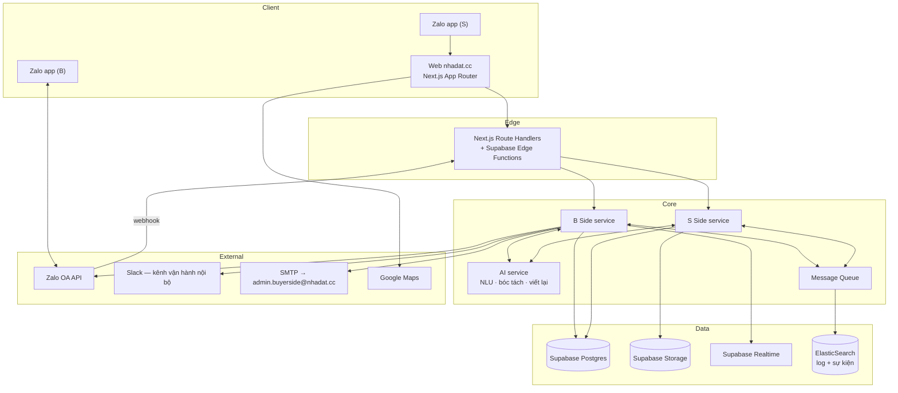

# 07 — Software Requirements Specification

**Hệ thống**: nhadat.cc · **Phiên bản**: v1.0 (Draft) · **Ngày**: 2026-08-21
**Cơ sở**: `Tài liệu hệ thống nhadat.cc.pdf` (Le Duong, 06/10/2024, v.5) +
`02-requirements.md` + `03-user-flows.md` + `04-information-architecture.md`.

Tài liệu này là **hợp đồng kỹ thuật** với vendor phát triển. Mọi mục `SRS-` phải
kiểm chứng được.

---

## 1. Giới thiệu

### 1.1 Mục đích
Đặc tả đầy đủ phần mềm cần xây dựng để hiện thực hoá các yêu cầu ở `02-requirements.md`,
đủ chi tiết để ước lượng, phát triển và nghiệm thu trong ngân sách 418tr VND (NFR-14).

### 1.2 Phạm vi hệ thống
Bốn phân hệ triển khai được độc lập:

| Mã | Phân hệ | Nội dung |
|---|---|---|
| `WEB` | Website công khai | Landing, listing, search, tag SEO, chi tiết BĐS |
| `BOT` | B Side | Zalo OA chatbot, NLU, gợi ý, hội thoại, giữ chân |
| `SEL` | S Side | Mini-site rao tin, bóc tách AI, luồng trả lời câu hỏi |
| `ADM` | Admin | Bảng thống kê, escalation, email notification |

### 1.3 Tài liệu tham chiếu
`docs/00`…`docs/06`, `docs/09-open-issues.md`.

---

## 2. Kiến trúc tổng thể



### SRS-2.1 — Tech stack

| Lớp | Công nghệ | Nguồn |
|---|---|---|
| Web | Next.js (App Router) + TypeScript + Tailwind | `.claude/launch.json`, `.gitignore` |
| Auth | Supabase Auth + **Zalo SSO** | PDF hệ thống §2, §Công nghệ 4 |
| DB | Supabase Postgres | PDF hệ thống §1, §3 |
| Storage | Supabase Storage (ảnh listing, giấy tờ) | PDF hệ thống §3 |
| Realtime | Supabase Realtime | PDF hệ thống §6 |
| Serverless | Supabase Functions (webhook, API tích hợp) | PDF hệ thống §Công nghệ 1 |
| Hàng đợi | Logstash (+ ElasticSearch lưu log/sự kiện) | PDF hệ thống §5 — **xem `OPEN-11`** |
| Chat | Zalo OA API + Webhook | PDF hệ thống §4, §7 |
| Vận hành nội bộ | Slack API + Webhook | PDF hệ thống §4 |
| AI | LLM cho NLU, entity recognition, sinh câu rao | PDF hệ thống §Công nghệ 2 |
| Định danh khách vãng lai | Fingerprint trình duyệt | PDF hệ thống §1 |

> **Ghi chú kiến trúc (BA).** Tài liệu gốc mô tả **Logstash làm hàng đợi tin nhắn** để
> "giữ lại tin nhắn nếu người bán hoặc người mua không online". Logstash là pipeline
> thu thập log, **không** cung cấp bảo đảm giao nhận (at-least-once, retry, DLQ) mà
> NFR-04 đòi hỏi. Khuyến nghị: dùng Postgres outbox + worker, hoặc pgmq/Redis Streams,
> và giữ Logstash + ElasticSearch cho **quan sát** (log, phân tích sự kiện). Quyết định
> cuối thuộc về chủ dự án — `OPEN-11`.

### SRS-2.2 — Hai đường giao tiếp S↔B (điểm mâu thuẫn cần chốt)

Tài liệu gốc mô tả **hai cơ chế khác nhau** cho cùng một việc:

| Cơ chế | Nguồn | Mô tả |
|---|---|---|
| **A — Relay qua Slack** | PDF hệ thống §4 | Zalo → Chatbot → Slack Channel → người bán (web) → ngược lại |
| **B — API S Side ↔ B Side** | `S's side.docx`, `chats w B.docx` | Gọi API có `BĐS ID`, `Requested Info ID`, nguyên văn câu hỏi/trả lời |

**Khuyến nghị BA**: hai cơ chế **không loại trừ nhau** mà phục vụ hai mục đích:
- **B là đường nghiệp vụ chính** — có ID, truy vết được, cập nhật được listing (FR-44),
  hiển thị được ở admin (FR-76). Đây là thứ phải xây.
- **A là kênh quan sát/can thiệp của con người** — chuyên viên theo dõi hội thoại trong
  Slack và nhảy vào khi cần, không phải đường đi bắt buộc của dữ liệu.

Đặc tả dưới đây theo khuyến nghị này. Chờ chủ dự án xác nhận — `OPEN-03`.

---

## 3. Mô hình dữ liệu

Chuẩn: Postgres, `snake_case`, khoá chính `uuid`, mọi bảng có `created_at`, `updated_at`.

### SRS-3.1 · `properties`
```
id                uuid pk
code              int unique          -- mã hiển thị #35148, sequence
slug              text unique
deal_type         enum(sale, rent)
property_type     enum(nha_pho, nha_cap4, chung_cu, dat, biet_thu, phong_tro, mat_bang, chua_ro)
                  -- chua_ro = giá trị THẬT (FR-150), không phải NULL ngầm;
                  -- trigger trg_listings_fill_property_type tự lấp từ mô tả
-- vị trí
street            text
alley             text                -- "hẻm 174", "hẻm XH 572"
ward              text
district          text
city              text default 'TP.HCM'
lat, lng          numeric
landmarks         jsonb               -- [{name:"hồ bơi Lam Sơn", distance_m:250}]
access_type       enum(mat_tien, hem_xe_hoi, hem_xe_tai, hem_xe_may)
alley_width_m     numeric
-- quy mô
land_area_m2      numeric
legal_area_m2     numeric             -- diện tích công nhận
built_area_m2     numeric
frontage_m        numeric
length_m          numeric
floors            text                -- "1 trệt 1 lửng 3 lầu"
bedrooms          int
bathrooms         int
-- giá
price             numeric
price_unit        enum(ty, trieu_thang)
negotiable        bool default false
-- pháp lý (mọi trường có thể null = chưa xác minh)
has_red_book      bool
completion_year   int                 -- hoàn công
planning_status   text
-- nội dung
raw_pitch         text not null       -- câu rao gốc của S (FR-91)
variants          jsonb               -- biến thể AI sinh (FR-93)
-- vận hành
seller_id         uuid fk sellers
status            enum(dang_rao, tam_ngung, da_ban, het_han)
last_verified_at  timestamptz
hot_score         int default 0       -- FR-73, tính lại hằng ngày
```

**Ràng buộc**: `legal_area_m2` và `land_area_m2` là **hai trường khác nhau** — người
dùng Việt Nam phân biệt rõ, gộp lại là sai nghiệp vụ.
Trường pháp lý `null` phải hiển thị "Chờ xác minh" (UI-C05), **không** hiển thị "Không".

### SRS-3.2 · `property_events` — FR-70
```
id            uuid pk
property_id   uuid fk
event_type    enum(CREATED, UPDATED, INFO_REQUESTED, INFO_ADDED, VIEWING_REQUESTED)
occurred_at   timestamptz not null
actor_type    enum(buyer, seller, ctv, system)
actor_id      uuid
metadata      jsonb
```
Index `(property_id, occurred_at desc)`, `(occurred_at desc)`.
`hot_score` = `count(*) where occurred_at > now() - interval '2 months'` (FR-73).

### SRS-3.3 · `buyers`
```
id                uuid pk
zalo_user_id      text unique
display_name      text
phone             text null           -- CHỈ khi B tự nguyện cung cấp ở UF-06
fingerprint_ids   text[]              -- nối phiên web ↔ Zalo (FR-30)
first_contact_at  timestamptz
last_contact_at   timestamptz
connection_status enum(active, at_risk, lost)   -- at_risk khi im lặng ≥5 ngày (FR-63)
preferences       jsonb               -- tiêu chí học được (UF-07)
```

### SRS-3.4 · `sellers`
```
id             uuid pk
zalo_user_id   text unique
seller_type    enum(ccrb, nmg)        -- quyết định mức phí (FR-101)
name, email    text
fee_rate       numeric                -- 1.0 hoặc 0.5
-- chỉ NMG (FR-102)
active_listings_count  int
success_rate_6m        numeric
avg_rating             numeric
contract_status        enum(active, warning, terminated)
```

### SRS-3.5 · `conversations`, `messages` — FR-71, FR-72
```
conversations
  id, buyer_id, started_at, ended_at,
  buyer_message_count, system_message_count,
  duration_seconds, channel enum(zalo, web)

messages
  id, conversation_id, direction enum(inbound, outbound),
  body text, attachments jsonb, sent_at timestamptz,
  intent text, sentiment enum(neutral, positive, negative)
```
**Quy tắc cắt hội thoại (FR-72)**: tin nhắn mới thuộc cuộc trò chuyện đang mở nếu
cách tin trước **≤ 30 phút**; ngược lại đóng cuộc cũ và mở cuộc mới.

### SRS-3.6 · `info_requests` — FR-40…FR-44, FR-76
```
id                  uuid pk           -- = Requested Info ID
property_id         uuid fk
buyer_id            uuid fk
question_text       text not null     -- nguyên văn câu hỏi của B
question_category   enum(con_ban, so_do, quy_hoach, kinh_doanh, hinh_anh, hoan_cong, khac)
sent_to_seller_at   timestamptz
routed_to           enum(seller, ctv, chuyen_vien)
answered_at         timestamptz
answer_text         text
answer_attachments  jsonb
applied_to_listing  bool default false   -- FR-44
status              enum(pending, answered, escalated, expired)
```

### SRS-3.7 · `viewings` — FR-50…FR-57
```
id, property_id, buyer_id, requested_at,
preferred_time text, confirmed_at timestamptz, scheduled_at timestamptz,
guide_type enum(ctv, nmg), guide_id uuid,
buyer_phone text null, maps_url text,
status enum(requested, confirmed, reminded, completed, cancelled, no_show),
outcome_feedback text, rating int
```

### SRS-3.8 · Bảng broker — theo spec Cầu Nối BĐS v2
Schema đã được hiện thực sẵn trên Supabase project `nhadat-bot` [nguồn: artifact "Cầu Nối BĐS" v2, phiên nhadat-bot, 08/2026]:

```
listings.status            text CHECK (cho_thong_tin|dang_ban|dang_quan_tam|da_chot|an)  -- FR-139
                           -- (bản cũ enum listing_status tiếng Anh của FR-106 đã DROP 25/08)
listings.last_confirmed_at timestamptz   -- TTL 7 ngày (FR-107)
interests                  id, listing_id, buyer_id, created_at
                           -- B đang quan tâm căn nào; sold → báo tất cả (FR-108)
listing_facts              id, listing_id, question_norm, answer, source_info_request_id
                           -- kho hỏi-đáp tích luỹ: có sẵn thì trả ngay, không hỏi S
media                      id, listing_id, kind, storage_ref, is_public
                           -- ảnh Zalo URL tạm → tải về, đẩy kho file qua ADAPTER (FR-111, OPEN-18)
deals                      id, listing_id, buyer_id, seller_id, stage, price_final,
                           fee_rate, fee_amount, ctv_id, closed_at
                           -- căn cứ tính phí + tỉ lệ chốt NMG (FR-112, OPEN-16 đã chốt (b))
users.rating               -- điểm sao từng tương tác (chấm dứt NMG: OPEN-12)
```

**Bất biến ẩn danh (FR-104/105)**: view công khai không bao giờ trả về số nhà,
tên hay liên hệ của S; mọi payload relay đi qua bộ lọc SĐT/Zalo/địa chỉ chính xác
trước khi gửi; danh tính chỉ xuất hiện trong luồng xác nhận lịch xem (UF-06).

### SRS-3.8b · Bảng phụ trợ
```
tags                id, slug unique, keyword, title, description, criteria jsonb
property_tags       property_id, tag_id
saved_criteria      id, buyer_id, criteria jsonb, active bool     -- FR-64
curated_lists       id, token unique, buyer_id, property_ids[], created_at, expires_at  -- FR-100
photos              id, property_id, storage_path, kind enum(mat_tien, trong_nha, hem, so_do, khac), sort_order, is_public
escalations         id, type enum(QUESTION, VOICE, VIEWING, UPSET), buyer_id, property_id, payload jsonb, emailed_at  -- FR-77..81
```

**SRS-3.9 · Bảo mật dữ liệu**
- `photos.kind = 'so_do'` → `is_public = false` bắt buộc, bucket riêng, chỉ truy cập
  bằng signed URL hạn **≤ 15 phút** (NFR-06).
- `buyers.phone` mã hoá at-rest, chỉ CTV được cấp quyền đọc.
- RLS bật trên mọi bảng; `anon` chỉ đọc được `properties` có `status='dang_rao'`,
  `photos` có `is_public=true`, và `tags`.

**Mô hình quyền thực tế (soát bảo mật 26/08/2026).** Anon key là key **công
khai** — nó nằm trong bundle JS của web và trong `bot/bridge-zca`; repo để
private không làm nó bí mật. Vì vậy RLS + GRANT là bức tường duy nhất, và luật
là:

1. **Vai `anon` chỉ được ĐỌC.** Mọi quyền INSERT/UPDATE/DELETE/TRUNCATE trên
   schema `public` đã thu hồi khỏi `anon`; `authenticated` giữ quyền ghi có
   policy gác (buyers, listings nháp, listing_views), không ai có TRUNCATE.
2. **Bảng chỉ dành cho bot** (`reminders`, `messages`, `conversations`,
   `info_requests`, `viewings`, `deals`, `ctvs`, `ctv_daily_reports`,
   `bot_prompts`, `required_facts`, `interests`, `ratings`) bật RLS và **cố ý
   không có policy nào** — service_role bỏ qua RLS nên bot chạy bình thường,
   còn anon đọc ra 0 dòng. Cảnh báo `rls_enabled_no_policy` của Supabase ở các
   bảng này là *kỳ vọng*, không phải lỗi.
3. **Hàm là nội bộ trừ khi chứng minh ngược lại.** Toàn bộ hàm trong `public`
   đã thu hồi EXECUTE khỏi `public/anon/authenticated`; chỉ `service_role` và
   `postgres` gọi được. Trước đó `seller_drip_tick`, `ctv_report_tick`,
   `mark_listing_interest`… gọi được bằng anon key qua `/rest/v1/rpc/…`.
   Mọi hàm cũng ghim `search_path = public, pg_temp`.
4. **View không được là cửa hậu.** View SECURITY DEFINER chạy bằng quyền chủ
   view nên đi vòng RLS. `public_listings`, `public_media`,
   `listing_missing_facts` đã chuyển `security_invoker = on` và khoá khỏi anon
   (web không dùng). Hai view cố ý giữ definer: `agents_public` (chỉ tên NMG +
   số tin, nguồn trang `/moi-gioi`) và `listing_photos_v` (chỉ path của bucket
   vốn công khai) — cả hai chỉ còn quyền SELECT.
5. **Vault không bao giờ chạm anon**: `get_secret()` chỉ cấp cho `postgres` và
   `service_role`.

Hồi quy: TS-SEC-01…10 trong `docs/10 §10.7`, chạy lại sau mọi migration đụng
RLS hoặc GRANT.

### SRS-3.10 · `projects` — hàng dự án (FR-113, OPEN-15 phương án b)
```
id             uuid pk
name           text not null        -- "Ny'ah"
slug           text unique
developer      text
street, ward, district, city, lat, lng
legal_status   text                 -- pháp lý cấp dự án
amenities      jsonb
floor_plans    jsonb                -- mặt bằng tầng
handover_date  date
description    text
```
`properties` bổ sung: `project_id uuid null fk projects`, `unit_code text`,
`floor int`, `direction text`, `unit_status enum(con_ban, giu_cho, da_coc, da_ban)`.

**Quy tắc thừa hưởng (FR-115/FR-116)**: trường tầng dự án đọc từ `projects`, không
tạo info_request; `unit_status` là nguồn sự thật cho "căn X còn không" — quá TTL
`last_confirmed_at` (FR-107) thì xác nhận lại với S trước khi khẳng định. MVP chưa
có UI giỏ hàng riêng — cập nhật `unit_status` qua luồng rao/sửa tin và bảng `deals`.

### SRS-3.11 · Tài khoản NMG + mặt công khai (FR-124, FR-125 — 25/08/2026)

- `sellers.auth_user_id uuid unique fk auth.users` — nối tài khoản Supabase Auth
  (magic-link email) với hồ sơ NMG. CCRB và buyer **không có** tài khoản.
- RLS `authenticated`: đọc/ghi `sellers` của chính mình; đọc `listings` của
  mình mọi status; insert `listings` chỉ với `status='cho_thong_tin'` và
  `seller_id` thuộc về mình (`listings_own_read`, `listings_own_insert`).
- View `agents_public` (definer): lộ đúng `name, seller_type, rating_sum,
  rating_count, listing_count` của NMG — **không bao giờ** lộ `phone`,
  `zalo_user_id`, `phone_proxy` (bất biến FR-104).
- Đọc công khai (anon): chỉ các trạng thái đang lên kệ
  `dang_ban` / `dang_quan_tam` / `da_chot` (FR-139); tin `cho_thong_tin` (chưa đủ
  thông tin) và `an` không lộ ra web — ghi nhận ở kế hoạch kiểm thử (TS-SEL/TS-ADM).

**Bổ sung 25/08 (FR-126/127/128, FR-122 cập nhật):**
- `listings.lat/lng` — geocode từ `location_raw` (edge function
  `geocode-listings`: Nominatim, cache theo đường, 1 req/1.1s);
  `listings.bedrooms int` — backfill regex từ mô tả, bot bổ sung dần.
- `buyers.auth_user_id uuid unique fk auth.users` (tài khoản tự nguyện) +
  bảng `listing_views(auth_user_id, listing_id, viewed_at)` RLS own-only —
  nền cho "tin đã xem" và khuyến nghị.
- Bảng `admins(email pk)` + RLS `listings_admin_read/update`: admin duyệt
  tin trên web (`/admin`). Thêm admin = insert email.

---

## 4. Đặc tả giao diện lập trình

Chuẩn chung: REST/JSON, `Content-Type: application/json`, xác thực bằng
`Authorization: Bearer <service token>`, mọi request có `X-Request-Id` để truy vết.

### SRS-4.1 · `POST /api/s-side/info-request` — B Side → S Side (FR-41)
```json
{
  "request_id": "uuid",
  "property_code": 35148,
  "buyer_ref": "b_7f3a",
  "question_text": "Cho chị xem sổ đỏ cái",
  "question_category": "so_do",
  "asked_at": "2026-08-21T14:32:10+07:00"
}
```
`200 {"accepted": true, "routed_to": "seller"}` ·
`404` property không tồn tại · `409` request_id trùng (idempotent, trả kết quả cũ).

### SRS-4.2 · `POST /api/b-side/info-response` — S Side → B Side (FR-43)
```json
{
  "request_id": "uuid",
  "answer_text": "Sổ cấp 2023, chính chủ đứng tên",
  "attachments": [
    {"type": "image", "storage_path": "docs/35148/so-1.jpg", "public": false}
  ],
  "answered_by": "seller",
  "answered_at": "2026-08-21T15:07:02+07:00",
  "listing_updates": {"has_red_book": true, "completion_year": 1989}
}
```
Hành vi bắt buộc khi nhận:
1. Cập nhật `info_requests`.
2. Áp `listing_updates` vào `properties` (**FR-44**) và ghi `property_events.INFO_ADDED`.
3. Đẩy tin nhắn tới B qua Zalo OA.
4. Nếu B offline → vào hàng đợi, giao khi B quay lại (NFR-04).

### SRS-4.3 · `POST /api/curated-list` — FR-100
```json
{ "buyer_ref": "b_7f3a", "property_codes": [24, 56, 234, 284], "note": "Q5 dưới 12 tỉ HXH" }
```
`201 {"url": "https://nhadat.cc/ds/9fK2xQ", "expires_at": "..."}`
Token ≥ 22 ký tự ngẫu nhiên; trang trả `X-Robots-Tag: noindex`.

### SRS-4.4 · `POST /api/webhooks/zalo` — sự kiện Zalo OA
Xác thực chữ ký (`X-ZEvent-Signature`). Xử lý: `user_send_text`, `user_send_image`,
`follow`, `unfollow`. **Ghi vào hàng đợi rồi trả `200` trong < 1s**; xử lý bất đồng bộ.

### SRS-4.5 · `POST /api/search` — FR-09
```json
{ "q": "tìm mua nhà phố HXH 8 tỉ ở Q8", "fingerprint": "fp_...", "limit": 12 }
```
```json
{
  "parsed": {"deal_type":"sale","property_type":"nha_pho","access_type":"hem_xe_hoi",
             "price":{"approx":8,"unit":"ty"},"district":"Quận 8"},
  "title": "Mua nhà Nhà phố HXH giá 8 tỉ đồng Quận 8 TP HCM",
  "total": 234,
  "relaxed": null,
  "results": [ … ]
}
```
Khi 0 kết quả: nới theo thứ tự **giá ±20% → phường → quận lân cận**, và trả
`relaxed: {"field":"price","from":8,"to":9.6}` để giao diện nói rõ đã nới gì (WF-02).

### SRS-4.6 · `POST /api/listing/parse` — FR-92
Vào: `{"raw_pitch": "..."}`. Ra: các trường bóc tách kèm **`confidence` từng trường**;
trường có `confidence < 0.7` được đánh dấu để S kiểm lại (UI-C09).

### SRS-4.7 · Zalo deep link kèm ngữ cảnh — FR-14
`https://zalo.me/<oa_id>?ctx=<token>`; token trỏ tới bản ghi ngữ cảnh (tiêu chí đã
parse + danh sách BĐS vừa xem), TTL 24 giờ. Khi nhận `follow`/tin đầu tiên có `ctx`,
B Side nối `fingerprint ↔ zalo_user_id` và mở hội thoại bằng câu xác nhận nhu cầu.

---

## 5. Đặc tả xử lý

### SRS-5.1 · Chu trình chatbot (BOT)
```
nhận tin → chuẩn hoá → phân loại intent → cập nhật hồ sơ nhu cầu
  → chọn hành động:
      TRẢ LỜI ĐƯỢC        → soạn theo tone §6.8, gửi
      TẦNG DỰ ÁN          → listing có project_id + câu hỏi thuộc dữ liệu chung
                            → trả từ projects, KHÔNG info_request (FR-115)
      TỒN KHO CĂN         → "căn X còn không" → đọc unit_status; quá TTL
                            (FR-107) mới xác nhận lại với S (FR-116)
      CẦN XÁC MINH        → info_request (SRS-4.1) + câu giữ nhịp
      ĐỦ TIÊU CHÍ         → truy vấn, trả tối đa 3 listing
      MUỐN XEM NHÀ        → luồng viewing
      TIÊU CỰC            → escalation UPSET + hạ nhiệt
      MUỐN GỌI ĐIỆN       → escalation VOICE
      MUỐN BÁN            → gửi link /raoban
  → ghi message + property_events
```

**Bất biến bắt buộc kiểm thử được**
- I1: không quá 3 listing/tin nhắn (FR-24).
- I2: mọi tin chủ động kết thúc bằng dấu hỏi (FR-63, §6.8 quy tắc 3).
- I3: intent thuộc `{con_ban, so_do, quy_hoach, hoan_cong}` **luôn** sinh info_request,
  bot không tự khẳng định (RSK-03).
- I4: không hỏi số điện thoại trừ khi `state = viewing_scheduling` (NFR-07).

### SRS-5.2 · Xếp hạng gợi ý
```
score = 0.40 × khớp_tiêu_chí
      + 0.25 × hot_score_chuẩn_hoá        (FR-73)
      + 0.20 × độ_đầy_đủ_thông_tin        -- ưu tiên tin đã được làm giàu
      + 0.15 × độ_mới_last_verified_at    -- chống tin cũ (RSK-06)
```
Loại khỏi kết quả: `status ≠ 'dang_rao'`, và listing B đã từ chối sau khi xem (UF-07).

### SRS-5.3 · Job định kỳ

| Job | Lịch | Việc |
|---|---|---|
| `recompute_hot_score` | 02:00 hằng ngày | FR-73 |
| `followup_d3` | mỗi giờ | B im lặng đúng 3 ngày → FR-60 |
| `zalo_keepalive` | mỗi giờ | B im lặng 5–6 ngày → FR-63, đặt `connection_status='at_risk'` |
| `match_new_listings` | mỗi 15 phút | listing mới khớp `saved_criteria` → FR-64 |
| `info_request_sla` | mỗi 30 phút | *(mốc theo FR-110)* pending > 24h → nhắc S một lần; > 48h → đóng (expired) + báo trung thực cho B; escalate CTV/chuyên viên chạy song song (FR-47) |
| `stale_listing_check` | thứ 2 hằng tuần | *(tinh chỉnh theo FR-107)* TTL xác nhận là **7 ngày**, kiểm tra **tại thời điểm matching**: quá hạn thì hỏi S trước khi giới thiệu; job tuần chỉ quét listing không có lượt matching nào |
| `close_conversations` | mỗi 5 phút | đóng hội thoại im lặng > 30 phút (FR-72) |

### SRS-5.4 · Phát hiện phản ứng tiêu cực (FR-77)
Đánh dấu `sentiment = negative` khi thoả **bất kỳ**:
- Khớp từ điển bực bội tiếng Việt (*"hỏi hoài không trả lời"*, *"chán"*, *"lừa"*, *"phiền"*, *"thôi khỏi"*).
- Cùng một câu hỏi lặp ≥ 3 lần mà chưa có `info_response`.
- Đánh giá ≤ 3/5 (FR-65).
- B gửi `unfollow` ngay sau một tin của hệ thống.

→ tạo `escalations(type='UPSET')` + email `[UPSET] <Zalo ID>` (FR-81), body kèm
**trích nguyên văn vài tin nhắn**.

### SRS-5.5 · Email notification (FR-81)
```
To:      admin.buyerside@nhadat.cc
Subject: [QUESTION] 1234567890123456
Body:
  Zalo ID: …          Thời điểm: …
  BĐS: #35148 — Bán nhà HXH 572 Nguyễn Trãi P8 Q5, 4.2x17m, 12.7 tỉ
  Câu hỏi: "Cho chị xem sổ đỏ cái"
  Link admin: https://nhadat.cc/admin/cau-hoi?id=…
```
Bốn loại: `[QUESTION] [VOICE] [VIEWING] [UPSET]`. Gửi qua hàng đợi, retry 3 lần;
thất bại vẫn phải giữ bản ghi trong `escalations` để admin không mất việc.

---

## 6. Yêu cầu phi chức năng — tiêu chí nghiệm thu

| NFR | Cách kiểm chứng |
|---|---|
| NFR-01 | Load test 50 tin nhắn đồng thời, p95 < 3s |
| NFR-02 | Lighthouse mobile ≥ 90, LCP < 2.5s trên Moto G Power / 4G |
| NFR-03 | Uptime monitor 30 ngày ≥ 99.5% |
| NFR-04 | Chaos test: tắt worker 10 phút → 0 tin nhắn mất sau khi khôi phục |
| NFR-05 | Seed 5.000 listing, 300 hội thoại → không suy giảm p95 |
| NFR-06 | Pen-test: URL ảnh sổ đỏ hết hạn sau 15 phút; truy cập trực tiếp bucket bị chặn |
| NFR-07 | Rà log 100 hội thoại mẫu: 0 lần hỏi số ĐT ngoài `viewing_scheduling` |
| NFR-09 | Google Search Console: 100 URL tag được index, 0 lỗi structured data |
| NFR-11 | Kết nối Excel qua Postgres/REST, xuất được 3 bảng thống kê |
| NFR-12 | Thêm adapter Telegram giả lập không sửa file trong `core/` |

---

## 7. Tiêu chí nghiệm thu MVP

Hệ thống được nghiệm thu khi **toàn bộ** kịch bản sau chạy end-to-end:

| # | Kịch bản | FR/UF |
|---|---|---|
| AC-01 | Google → trang tag → chi tiết BĐS → click Zalo → bot nhắc **đúng** nhu cầu ở tin đầu | UF-01→03, FR-14 |
| AC-02 | Chat từ đầu, bot thu đủ khu vực + giá, trả đúng 3 listing, "xem thêm" trả 3 tiếp | UF-04, FR-24 |
| AC-03 | B hỏi "cho xem sổ đỏ" → tạo info_request → S trả lời kèm ảnh → B nhận ảnh **và** listing được cập nhật | UF-05, FR-44 |
| AC-04 | Đặt lịch xem: xác nhận đúng căn, B **từ chối** cho số ĐT vẫn đặt được lịch, nhận link Maps, có email `[VIEWING]` | UF-06, FR-53, NFR-07 |
| AC-05 | Sau buổi xem, B nói "chị chỉ mua MT trên 4m" → gợi ý lần sau đã loại nhà hẻm | UF-07 |
| AC-06 | B im lặng 5 ngày → nhận tin chống-xoá-Zalo kết thúc bằng câu hỏi | UF-08, FR-63 |
| AC-07 | S gõ **một** câu rao → bóc tách đúng ≥ 4 trường → sửa → đăng → có mã `#ID` | UF-09, FR-92 |
| AC-08 | Nhắn Zalo "cần bán nhà" → nhận ngay link `/raoban` | UF-10, FR-97 |
| AC-09 | Admin thấy đủ 5 bảng, 20 mục/trang, click B ID nhảy sang Zalo | FR-70…80 |
| AC-10 | 4 loại email tới `admin.buyerside@nhadat.cc` đúng subject, đúng body | FR-81 |
| AC-11 | Tạo danh sách riêng → URL token → `noindex`, không lộ danh tính B | UF-12, FR-100 |
| AC-12 | Tìm kiếm "gần ngã tư Trần Bình Trọng và An Dương Vương" trả kết quả hợp lý | FR-22, INS-07 |
| AC-13 | Rao một căn gắn dự án (mã căn 50) → hỏi bot "căn 50 của dự án đó còn không?" trả đúng theo `unit_status`; hỏi tiện ích dự án được trả lời ngay **không** sinh info_request; đổi `unit_status` sang đã bán → mọi B trong interests được báo kèm căn thay thế cùng dự án | FR-113…FR-116, INS-10 |

## 8. Kế hoạch phát hành đề xuất

| Giai đoạn | Nội dung | Phụ thuộc |
|---|---|---|
| **P0 — Nền** | DB schema, Supabase, Zalo SSO, upload ảnh, mini-site rao tin (UF-09) | — |
| **P1 — Nguồn hàng** | Bóc tách AI, sinh biến thể, trang listing/chi tiết/tag, SEO | P0 · phục vụ OKR 1&2 trước |
| **P2 — Chat** | Bot B Side, NLU, gợi ý, vòng info_request | P1 (cần có hàng để chat) |
| **P3 — Giao dịch** | Đặt lịch xem, escalation, email, admin | P2 |
| **P4 — Giữ chân** | Follow-up, chống xoá Zalo, match listing mới, đánh giá | P3 |

> **Thứ tự này quan trọng.** OKR 3 (10 chat/ngày) không thể đạt trước OKR 1&2 (nguồn
> hàng + NMG). Xây bot trước khi có hàng sẽ tạo ra những cuộc chat rỗng — đúng thứ mà
> OKR 3 loại trừ ("không có chat vô nghĩa").
