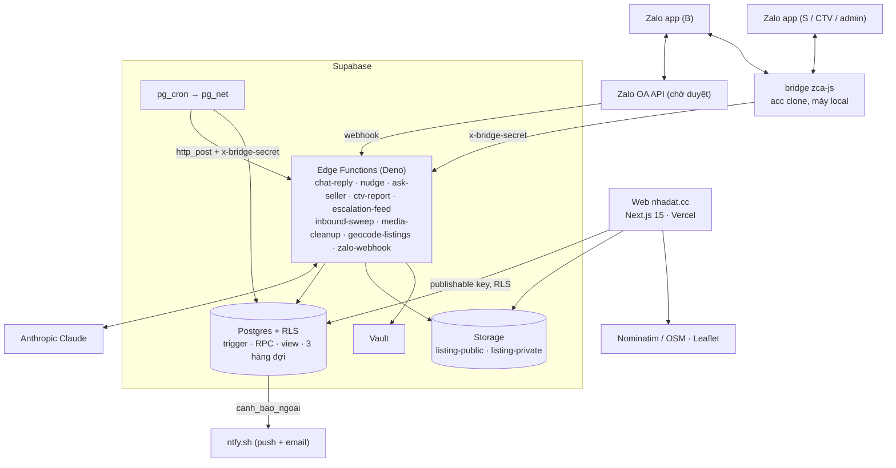
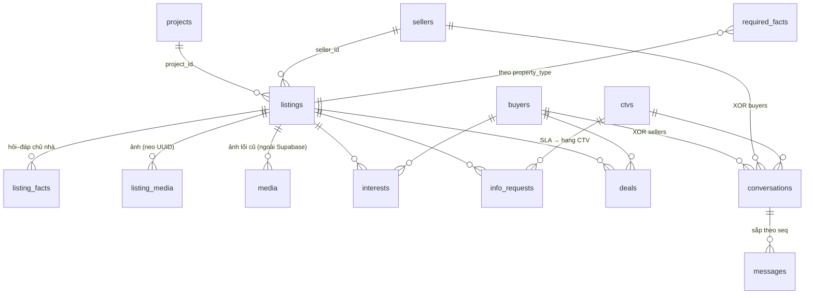
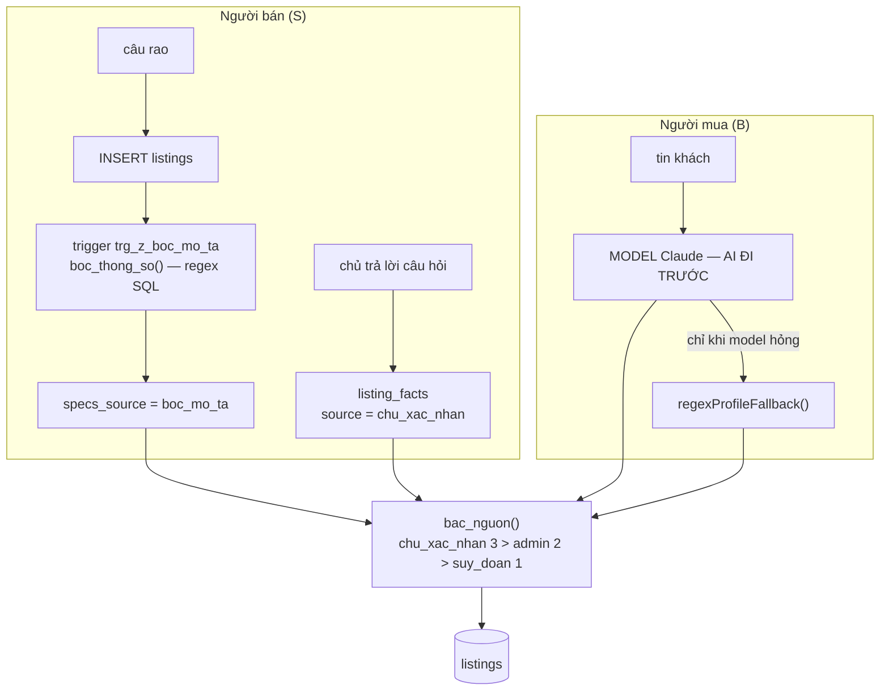

# 07 — Software Requirements Specification

**Hệ thống**: nhadat.cc · **Phiên bản**: v2.0 · **Ngày**: 2026-09-04
**Cơ sở**: `02-requirements.md`, `03-user-flows.md`, `04-information-architecture.md`,
code ở HEAD và DB thật project `nhadat-cc` (`tbcdpupiarkuxtntmosl`).

Tài liệu này tả **hệ thống như đang chạy**. Nguồn của mọi khẳng định là code
trong repo và DB thật (`[nguồn: DB 04/09/2026]` ghi một lần ở đầu mỗi mục lớn).
Mục thiết kế chưa dựng chỉ còn một dòng "Không dựng — thay bằng …" để giữ ID
cho `08-traceability.md`.

---

## 1. Giới thiệu

### 1.1 Mục đích
Đặc tả phần mềm đang vận hành để nghiệm thu (`§7`), kiểm thử (`docs/10`) và
mở rộng mà không lệch khỏi yêu cầu ở `02-requirements.md`.

### 1.2 Phạm vi hệ thống

| Mã | Phân hệ | Đường thật |
|---|---|---|
| `WEB` | Website công khai | Next.js ở root repo: `/`, `/[tag]`, `/mua-ban`, `/cho-thue`, `/nha-dat/[code]`, `/du-an/[slug]`, `/ban-do`, `/moi-gioi`, `/thong-ke`, `/ds/[token]`, `/raoban`, `/tai-khoan`, `/yeu-thich`, `/tinh-lai-vay` |
| `BOT` | B Side | Edge function `chat-reply` (bộ não), `zalo-webhook` (OA) + bridge `zca-js` (acc clone, máy local), `nudge`, `inbound-sweep` |
| `SEL` | S Side | Cùng `chat-reply` (nhánh bán, FR-159), `ask-seller` (hỏi nhỏ giọt), `/quan-ly` + `/dang-nhap` cho NMG |
| `ADM` | Admin | `/admin` (Next, JWT admin qua RLS), `escalation-feed` + `ctv-report` (việc cho CTV/admin), cảnh báo ntfy |

### 1.3 Tài liệu tham chiếu
`docs/00`…`docs/06`, `docs/09-open-issues.md`, `docs/10-ke-hoach-kiem-thu.md`, `bot/README.md`.

---

## 2. Kiến trúc tổng thể



### SRS-2.1 — Tech stack

`[nguồn: package.json, bot/README.md, DB 04/09/2026]`

| Lớp | Công nghệ |
|---|---|
| Web | Next.js 15 (App Router) + TypeScript + Tailwind 4, Bun, deploy Vercel project `nhadat-cc` từ root repo |
| Auth | Supabase Auth: Google OAuth + magic link email (NMG, admin, tài khoản B tự nguyện); không Zalo SSO |
| DB | Supabase Postgres, RLS trên mọi bảng, trigger + RPC `security definer`, 3 hàng đợi bằng bảng (`inbound_ledger`, `reminders`, `media_cleanup_queue`) |
| Serverless | Supabase Edge Functions (Deno), 9 function (`§4`) |
| Lịch / HTTP nội bộ | `pg_cron` (12 job, `SRS-5.3`) + `pg_net` (`net.http_post`) |
| Bí mật | Supabase Vault (`ANTHROPIC_API_KEY`, `BRIDGE_SECRET`), đọc qua `get_secret()` chỉ cho `service_role` |
| Kho file | Supabase Storage: `listing-public` (ảnh, công khai), `listing-private` (sổ đỏ/giấy tờ, signed URL) |
| AI | Anthropic Claude qua SDK (structured output zod v4, prompt cache); prompt sửa được ở bảng `bot_prompts` (FR-138) |
| Chat | Zalo qua bridge `zca-js` (acc clone, chạy local, `bot/bridge-zca`); Zalo OA API qua `zalo-webhook` chờ OA duyệt |
| Cảnh báo | ntfy.sh (`canh_bao_ngoai`), chuyển tiếp email khi có tài khoản ntfy (`SRS-5.5`) |
| Bản đồ | Leaflet + OSM tile; geocode Nominatim (`geocode-listings`) |
| Quan trắc | `bot_errors` / `bot_health` / `bot_usage` + `/admin` (FR-152, FR-169); không Logstash/ES, Slack, SMTP, fingerprint |

### SRS-2.2 — Đường giao tiếp S↔B

`[nguồn: DB 04/09/2026, chat-reply v48]` Một đường duy nhất, bằng bảng + trigger, không HTTP giữa hai "side":

1. Khách hỏi về căn → `chat-reply` chèn `info_requests(source='buyer_ask')`; trigger `route_info_request` giao CTV ít việc
   nhất (không có CTV → admin), `sla_due_at` = +`ctv_sla_phut()` (120 phút) (FR-140, FR-173).
2. Trigger `notify_info_request_escalation` sinh MỘT `reminders(kind='escalation')` cho người được giao kèm mẫu
   "`#mã: câu trả lời`"; bridge kéo qua `escalation-feed`.
3. Người nội bộ / chủ nhà nhắn "`#mã: …`" → `chat-reply` (`nguoi_noi_bo`) ghi `ghi_fact_listing` + đóng câu `answered`;
   trigger `info_request_bao_lai_khach` hẹn `followup` cho khách, `nudge` gửi (FR-140 c).
4. Quá SLA → `info_request_sla_tick()` nhắc admin + `[QUESTION]`; quá 48 h → `info_request_timeout_tick()` báo thật cho khách kèm căn khác (FR-110).

Vòng nhỏ giọt với chủ nhà (`source='seller_flow'`) đi cùng bảng, gọi `ask-seller` qua `ask_seller_drip()` (FR-129/144). Không có kênh Slack (OPEN-03 đóng).

---

## 3. Mô hình dữ liệu

`[nguồn: information_schema + pg_constraint + pg_policies, DB 04/09/2026]`
Khối: `cột:kiểu`, `!` = NOT NULL, `=` = default, `→` = FK. PK `uuid` trừ khi ghi khác. Enum thật:
`listing_deal(ban, cho_thue)`, `property_type(nha_pho, nha_cap4, chung_cu, dat, biet_thu, phong_tro, mat_bang, chua_ro)`,
`seller_type(ccrb, nmg, unknown)`, `request_status(pending, answered, expired)`, `msg_sender(buyer, seller, bot, ctv, system, human)`,
`unit_status(con_ban, giu_cho, da_coc, da_ban)`.

### SRS-3.0 · Bản đồ 31 bảng và đường bóc tách

`[nguồn: pg_class + pg_description, DB 06/09/2026]`

Ba tháng sau mở lại repo, thứ mất trước tiên là *cái nào thuộc về cái nào*. Mục
này là bản đồ đó. Nó KHÔNG đẻ nguồn sự thật thứ hai: chú thích tương ứng đã nằm
trong chính DB (`comment on table/column`, migration `20260906b`), hiện ra ngay
dưới tên bảng trong Supabase Table Editor. Đây là bản in ra giấy của thứ đó.

**Năm nhóm, đủ 31 bảng.** Tiền tố `[NHÓM]` nằm ngay đầu chú thích mỗi bảng, nên
Table Editor vẫn xếp A→Z mà mắt vẫn gom được theo việc.

| Nhóm | Bảng |
|---|---|
| `[RỔ HÀNG]` (8) | `listings` `media` `listing_media` `listing_facts` `required_facts` `media_cleanup_queue` `projects` `listing_views` |
| `[NGƯỜI & HỘI THOẠI]` (10) | `buyers` `sellers` `conversations` `messages` `interests` `info_requests` `viewings` `deals` `reminders` `ratings_log` |
| `[BOT & HÀNG ĐỢI]` (7) | `inbound_events` `inbound_ledger` `bot_errors` `bot_health` `bot_usage` `chat_quota` `bot_prompts` |
| `[CTV]` (2) | `ctvs` `ctv_daily_reports` |
| `[HỆ THỐNG]` (4) | `admins` `app_config` `curated_lists` `property_events` |

**Quan hệ chính** — chỉ khoá ngoại thật, không vẽ luồng chạy:



Ba chỗ hay hiểu nhầm, nói thẳng ở đây:

- **Không có bảng `buyer_preferences`.** Nhu cầu khách nằm ở cột
  `buyers.preferences` (jsonb).
- **Không có, và không cần, bảng `<loai>_specs` cho từng loại BĐS.** Chỗ rổ
  hàng đã chia theo loại là `required_facts` — 38 câu hỏi × 7 loại, khoá
  `(property_type, fact_key)`. Định nghĩa thông số phía mã nguồn là `SPEC_COLS`
  trong `bot/supabase/functions/_shared/thong_so.ts` (FR-172).
- **`media` và `listing_media` là hai đời khác nhau.** `media` (1005 dòng) trỏ
  file NGOÀI Supabase — đường dẫn dựng theo `listings.legacy_sst`, tức ảnh nằm
  trong kho ảnh gốc trên máy local, không nằm trong Storage. `listing_media`
  (FR-165) mới là ảnh trong Storage, neo `listings.id`. Hệ quả đang thấy:
  `storage.objects` = 0 nên web phục vụ ảnh giữ chỗ cho mọi tin.

**Đường bóc tách — hai nhánh chạy NGƯỢC nhau.** Đây là hình trạng thật, không
phải hình mong muốn:



Nhánh S đúng thứ tự *tiền định trước, model sau*. Nhánh B thì ngược: mỗi tin
khách là một lượt gọi model, kể cả câu regex bóc được ("dưới 6 tỷ", "3 phòng
ngủ"); regex chỉ chạy khi model chết (`chat-reply/index.ts:65`, gọi ở `:2266`).
Đảo lại nhánh B là việc còn treo, chưa làm.

**Ranh giới bóc tách ⟂ AI có máy canh.** `bot/tests/ranh-gioi.mjs` (nằm trong
`bun run test:bot`, nên chạy ở CI mỗi PR) chặn hai chiều: mã bóc tách tiền định
không được import SDK Anthropic / `claude.ts` / gọi RPC; tầng AI không được ghi
bảng nghiệp vụ, chỉ ba RPC đã khai tên (`get_secret`, `log_loi`, `cong_token`).
Bài có ca âm nên luật hỏng thì bài đỏ, không im.

**Đọc rổ hàng bằng mắt người:** view `ro_hang_ban` (20 cột thay cho 56, giá quy
ra tỷ, nhãn tiếng Việt, cột `canh_bao` chỉ đích danh trường nào là máy đoán).
`security_invoker = on`, `anon` bị revoke.

### SRS-3.1 · `listings`

```text
id:uuid!  code:text! unique ('BDS-Q5-0001', trigger listings_fill_code)  legacy_sst:int
seller_id:uuid→sellers  deal:listing_deal!=ban  status:text!=cho_thong_tin
district:text!='Quận 5'  ward:text  street:text  location_raw:text  lat,lng:numeric
property_type:property_type=chua_ro  project_id:uuid→projects  unit_code:text  unit_status:unit_status
area_m2,legal_area_m2,built_area_m2:numeric  frontage_m,length_m,rear_width_m:numeric
floors:int  floors_text:text  floor:int  bedrooms:int  bathrooms:int  direction:text
access_type:text  alley_width_m,distance_to_street_m:numeric
legal_status:text  has_completion:bool  planning_status:text
has_elevator,car_in_house,corner_lot,negotiable:bool  furnishing:text  year_built:int
price_raw:text  price_vnd:bigint  price_per_m2_vnd:bigint(generated)  rent_income_vnd:bigint
description:text  source:text!=import_excel  source_url,cc_link:text
property_type_source,price_source,ward_source:text!=suy_doan  specs_source:text
last_confirmed_at,last_interest_at:timestamptz  created_at,updated_at:timestamptz!
```
- CHECK `status ∈ {cho_thong_tin, dang_ban, dang_quan_tam, da_chot, an}` (FR-139); `access_type ∈ {mat_tien, hem_xe_tai, hem_xe_hoi, hem_xe_may, hem}`;
  `legal_status ∈ {so_hong_rieng, so_hong_chung, so_hong, hdmb, giay_tay}`; `furnishing ∈ {full, co_ban, khong}`; `bedrooms 1..20`;
  `*_source ∈ {suy_doan, chu_xac_nhan, admin}`; `specs_source ∈ {boc_mo_ta, admin, chu_xac_nhan}` (FR-164/172).
- Trigger BEFORE (theo tên): `listings_chuan_hoa_cot` → `fill_code` → `fill_property_type` (FR-150) → `set_price_vnd` (FR-154) →
  `trg_y_boc_thong_so` (FR-172) → `trg_z_normalize_status` → `trg_zz_dang_tin` (tự lên kệ khi đủ giá + m2 + phường, FR-144).
  AFTER: `listing_insert_drip` (FR-129), `bao_tin_moi_khop` (FR-64), `bao_can_da_chot` (FR-108), `trg_pe_listings` (FR-70).
- Index lọc: `(deal, price_vnd)`, `(deal, status, access_type)`, `(deal, status, floors)`, `(district, status)`; unique partial `(project_id, unit_code)`.
- Policy: `anon_read_listings` chỉ `dang_ban | dang_quan_tam | da_chot`; `listings_own_read/insert` (NMG tin của mình); `listings_admin_read/update`.
- Luật: `area_m2` là diện tích chính (chung cư = tim tường), `legal_area_m2` là công nhận — hai cột khác nhau; `description` giữ nguyên văn
  câu rao, không trigger nào sửa (FR-91/153). Bậc nguồn `chu_xac_nhan` > `admin` > `suy_doan`/`boc_mo_ta`; fact chỉ ghi vào cột khi bậc ≥ bậc
  đang giữ, cùng bậc thì mới nhất thắng (FR-163 a, FR-164 a).

### SRS-3.2 · `property_events` — FR-70, FR-73

```text
id:bigserial  listing_id:uuid!→listings cascade  event_type:text!  buyer_id:uuid→buyers set null  at:timestamptz!=now()  meta:jsonb
```
- CHECK `event_type ∈ {view, asked, interest, photos, viewing, deal, match_sent, status}`; index `(listing_id, at desc)`, `(at desc)`; policy `property_events_admin_read`.
- Chỉ trigger `trg_property_event()` ghi (`ghi_su_kien_bds`, không bao giờ ném): `listing_views` → `view`, `info_requests` `buyer_ask` → `asked`,
  `interests` → `interest`, `viewings` → `viewing`, `deals` → `deal`, `reminders` match sent → `match_sent`, `listings` đổi `status` → `status`. `photos` chưa có nguồn sinh.
- `hot_score` (FR-73) = view `bds_hot` tính lúc đọc (số sự kiện 60 ngày), không có cột/job.

### SRS-3.3 · `buyers`

```text
id:uuid!  zalo_user_id:text unique  auth_user_id:uuid unique→auth.users  name:text  phone:text
preferences:jsonb='{}'  last_contact_at:timestamptz  notes:text  created_at:timestamptz!
```
- `preferences` = hồ sơ nhu cầu tích luỹ (`deal` từ ngắn `ban|thue`, `area`, `budget`, `alley`, `bedrooms`, `photo_offset`, `hoi_vai`…), ghi qua `merge_buyer_prefs()` (FR-130).
- `phone` chỉ khi B tự cung cấp ở luồng đặt lịch (NFR-07); `/admin` không SELECT cột này. Policy `buyers_self_read/insert/update`, `buyers_admin_read`.
- Không có `connection_status`/`fingerprint_ids`: vết giữ chân ở `reminders.kind = reengage` (FR-63); fingerprint không dựng (OPEN-14).

### SRS-3.4 · `sellers`

```text
id:uuid!  zalo_user_id:text unique  auth_user_id:uuid unique→auth.users  phone:text unique  phone_proxy:text  name:text
seller_type:seller_type!=unknown  rating_sum:int!=0  rating_count:int!=0  active_listing_id:uuid→listings set null  created_at:timestamptz!
```
- `seller_type` quyết định phí (CCRB 1 %, NMG 0,5 %, FR-101); hồ sơ mở từ chat (`mo_ho_so_nguoi_ban`, FR-159) mang nhãn ngay
  (có BĐS = `ccrb`, tự xưng môi giới = `nmg`), không ghi đè nhãn đã có; `unknown` chỉ còn ở hồ sơ tạo tay.
- `active_listing_id` = căn bot đang hỏi (FR-157), trigger `info_request_set_active_listing` giữ. `rating_*` chỉ do `ghi_danh_gia()` ghi (FR-65).
- Policy `sellers_self_read/insert`, `sellers_admin_read/update`. Không có `fee_rate`, `email`, `contract_status`.

### SRS-3.5 · `conversations`, `messages` — FR-71, FR-72, FR-131, FR-141

```text
conversations  id:uuid!  buyer_id:uuid→buyers  seller_id:uuid→sellers  ctv_id:uuid→ctvs  channel:text!=zalo_oa  started_at:timestamptz!
               last_message_at:timestamptz  needs_human:bool!=false  needs_human_at,human_touch_at,human_escalated_at:timestamptz
messages       id:uuid!  conversation_id:uuid!→conversations  sender:msg_sender!  body:text!  zalo_msg_id:text unique  seq:bigint! unique  created_at:timestamptz!
```
- CHECK `conversations_mot_vai` (`buyer_id` XOR `seller_id`); unique partial `(buyer_id)`, `(seller_id)` — **một hội thoại/khách, không bao giờ đóng** (FR-131).
  "Cuộc trò chuyện" 30 phút của FR-72 tính lúc đọc ở view `hoi_thoai_phien`.
- Trigger: `assign_ctv_round_robin` (BEFORE INSERT, chia CTV); `conversations_email_upset` (`needs_human` false→true → `[UPSET]`);
  `messages_bump_last_message` giữ `last_message_at = greatest(cũ, mới)` — ứng dụng không ghi tay (FR-171 h).
- `seq` là thứ tự tất định cho gửi/replay (FR-162). Policy chỉ `*_admin_read`; bot ghi bằng `service_role`.

### SRS-3.6 · `info_requests` — FR-40…FR-44, FR-76, FR-110, FR-140, FR-173

```text
id:uuid!  listing_id:uuid!→listings cascade  buyer_id:uuid→buyers  question:text!  answer:text  status:request_status!=pending
source:text!=seller_flow  assignee:text  ctv_id:uuid→ctvs  sla_due_at,sla_missed_at,reminded_at,answered_at:timestamptz  created_at:timestamptz!
```
- CHECK `assignee ∈ {seller, ctv, admin}`; `source ∈ {seller_flow, buyer_ask}` (theo code); index partial `(sla_due_at) where pending and sla_missed_at is null`.
- Trigger: `route_info_request` (BEFORE, giao việc + SLA), `notify_info_request_escalation` (bỏ qua `xac_nhan_lich`/`con_ban`),
  `info_request_bao_lai_khach` (`answered` → followup; `xac_nhan_lich` → `viewings.status='confirmed'`), `info_request_set_active_listing`, `trg_pe_info_requests`.
- `question` với `seller_flow` là `fact_key` của `required_facts`; với `buyer_ask` là chữ tự do. FR-44: câu trả lời vào cột qua `listing_facts_sync_cols` (SRS-3.14). Policy `info_requests_admin_read`.

### SRS-3.7 · `viewings` — FR-50…FR-57, FR-65

```text
id:uuid!  listing_id:uuid→listings  listing_code:text  buyer_id:uuid→buyers  guide:text  slot:timestamptz  time_text:text  phone:text
status:text!=proposed  buyer_rating:int  note:text  source:text=bot  created_at:timestamptz!
```
- CHECK `status ∈ {proposed, pending, confirmed, done, cancelled}`; `buyer_rating 1..5`; `viewings_can_neo` (`listing_id` hoặc `listing_code`).
- INSERT → `viewings_bao_ctv_va_email`: nhắc CTV của hội thoại (hoặc admin) ngay, mở câu `xac_nhan_lich` (`buyer_ask`), `email_admin('VIEWING')` (FR-52/57/81).
- Nhắc trước giờ xem = `reminders.kind='viewing'` kèm link bản đồ khi có toạ độ (FR-54); `viewing` sent → `feedback` +4 h (FR-56); `buyer_rating` do `ghi_danh_gia()` ghi.
- `phone` chỉ điền khi B đồng ý ở bước này (NFR-07). Policy `viewings_admin_read`.

### SRS-3.8 · `interests`, `listing_facts`, `deals` — FR-108, FR-112, FR-140, FR-153

```text
interests      buyer_id:uuid!→buyers cascade  listing_id:uuid!→listings cascade  created_at:timestamptz!   (PK cặp)
listing_facts  id:uuid!  listing_id:uuid!→listings cascade  question:text!  answer:text!  source:text!=seller_zalo  created_at:timestamptz!
deals          id:uuid!  listing_id:uuid!→listings  buyer_id:uuid→buyers  ctv_id:uuid→ctvs  price_vnd:bigint  fee_pct:numeric  closed_at  created_at
               unique nulls not distinct (listing_id, buyer_id)
```
- `interests`: `mark_listing_interest(codes, buyer_id)` ghi cho mọi căn khách nhắc/bot gợi/xin hình/nhờ hỏi chủ; tin sang `da_chot` → mỗi khách
  trong `interests` nhận `reminders.kind='sold'` kèm căn thay thế (FR-108).
- `listing_facts`: kho hỏi-đáp tích luỹ, `answer` giữ nguyên văn; ghi duy nhất qua `ghi_fact_listing()`; trigger `listing_facts_sync_cols` đổ vào cột
  theo luật bậc (SRS-3.14). Policy anon đọc trừ `hinh_anh`/`dia_chi_chi_tiet`, chỉ tin lên kệ.
- `deals`: căn cứ phí (`fee_pct` null khi chốt lúc `unknown`, OPEN-28); `deals_chan_xoa_da_chot` cấm xoá deal đã chốt.
- Bất biến ẩn danh (FR-104/105): view/policy công khai không bao giờ trả `phone`, `zalo_user_id`, số nhà; trong hội thoại bot khai mọi thứ đã lưu
  về căn trừ liên hệ người bán (OPEN-36); bong bóng gửi người mua qua `locLienHe()`.

### SRS-3.8a · Hai luật chữ nghĩa bắt buộc

`[nguồn: chat-reply v48]`
- **`deal` có hai bảng từ vựng**: cột `listings.deal` = `ban | cho_thue`; JSON `buyers.preferences` và schema model = `ban | thue`. Mọi chỗ chạm cột phải qua `dealCol()` (FR-163).
- **Không đặt `\b` cạnh chữ tiếng Việt có dấu** — `\w` của JS chỉ là ASCII. Tự dựng biên (`(^|[^a-zà-ỹ])…(?![a-zà-ỹ])`) hoặc khớp trên bản bỏ dấu `boDau()` (FR-161).

### SRS-3.8b · Bảng phụ trợ

```text
curated_lists        id:uuid!  token:text! unique =24 hex  buyer_id:uuid→buyers set null  listing_ids:uuid[]! (1..60)  title  created_at
                     expires_at:=now()+30 ngày                                    -- FR-100; RLS, không policy; đọc/tạo qua RPC (SRS-4.3)
listing_media        id:uuid!  listing_id:uuid!→listings cascade  bucket:text!  storage_path:text!  media_type:text!  mime_type:text!
                     sort_order:int!=0  is_cover:bool!=false  created_at         -- FR-165
                     CHECK bucket ∈ {listing-public, listing-private}; media_type ∈ {mat_tien, trong_nha, hem, so_do, giay_to, khac};
                     so_do/giay_to ⇒ bucket riêng; is_cover ⇒ bucket công khai; storage_path bắt đầu '<listing_id>/'; unique (bucket, storage_path);
                     unique partial một bìa/tin; trigger listing_media_giu_bia, listing_media_xep_hang_don (→ media_cleanup_queue)
media_cleanup_queue  id:uuid!  bucket,storage_path:text!  trang_thai:text!=cho ∈ {cho, dang_lam, xong, loi, chet}  attempts:int!=0  last_error
                     next_retry_at  created_at  updated_at                          -- FR-165 e, FR-166 g
inbound_events       event_id:text! PK (= zalo_msg_id)  zalo_user_id  payload:jsonb  delivery_count:int!=1  first_seen_at  last_seen_at  -- FR-162
inbound_ledger       zalo_msg_id:text! PK  status:text!=received ∈ {received, processing, completed, failed, dead}  attempts:int!=1  reply:jsonb
                     detail  sent_at  send_error  sent_bubbles:int!=0  next_retry_at  locked_by  started_at  finished_at  -- FR-162, FR-166
reminders            id:uuid!  kind:text! ∈ {promise, reengage, viewing, followup, escalation, report, match, feedback, sold, rating}
                     buyer_id  seller_id  ctv_id  listing_id  viewing_id (FK cascade)  due_at:timestamptz!  note:text
                     status:text!=pending ∈ {pending, sent, cancelled, dead}  sent_at  locked_at  locked_by  attempts:int!=0  next_retry_at  last_error
                     unique partial: (buyer_id, listing_id) match; (buyer_id, listing_id) sold; (viewing_id) feedback; (buyer_id) reengage pending
                     -- FR-32/60…64/108/110/133/166 f; policy reminders_admin_read/update
ratings_log          buyer_id,listing_id (PK)  stars:int! 1..5  note  at        -- FR-65, idempotent cho ghi_danh_gia
ctvs                 id:uuid!  name:text!  zalo_user_id unique  phone  active:bool!=true  last_assigned_at  created_at   -- FR-136/173
ctv_daily_reports    id  report_date:date!  ctv_id→ctvs  body:text!  scores:jsonb  sent_to  created_at; unique (report_date, ctv_id)  -- FR-137
required_facts       property_type:property_type!  fact_key:text!  priority:int!=1  (PK cặp)   -- FR-153
listing_views        auth_user_id:uuid!→auth.users  listing_id:uuid!→listings  viewed_at; policy views_own_all   -- FR-126
admins               email:text! PK  zalo_user_id  zalo_phone; policy admins_self_read
app_config           key PK  value!  ghi_chu  (admin_email, ntfy_topic, functions_base_url, storage_public_base_url, publishable_key)
bot_prompts          key PK  content!  updated_at (trigger touch)   -- FR-138
media                bảng cũ đường OneDrive, còn policy anon đọc ảnh approved, không còn nguồn ghi — dọn cùng OPEN-18
```
- Không dựng: `tags`/`property_tags` (tag là hằng `lib/tags.ts`, 64 tag, FR-12; OPEN-06), `saved_criteria` (FR-64 đọc `buyers.preferences`),
  `escalations` (bốn loại đi `email_admin()`; vết việc ở `reminders`/`viewings`/`info_requests`), `photos` (thay bởi `listing_media`).

### SRS-3.9 · Bảo mật dữ liệu

`[nguồn: pg_policies, pg_class.relacl, storage.policies, DB 04/09/2026]` Anon key là khoá **công khai** (trong bundle JS và bridge) nên RLS + GRANT là bức tường duy nhất:

1. Vai `anon` chỉ SELECT; `authenticated` ghi có policy gác (`buyers`, `sellers`, `listings` nháp, `listing_views`, `listing_media` tin của mình); không ai có TRUNCATE (FR-167).
2. Bảng chỉ cho bot (`conversations`, `messages`, `info_requests`, `viewings`, `deals`, `interests`, `ctvs`, `ctv_daily_reports`, `bot_prompts`, `required_facts`,
   `curated_lists`, `inbound_*`, `media_cleanup_queue`, `ratings_log`, `app_config`) bật RLS, chỉ policy đọc cho admin hoặc không policy — anon 0 dòng; cảnh báo `rls_enabled_no_policy` là kỳ vọng.
3. Hàm là nội bộ trừ khi chứng minh ngược lại: EXECUTE mặc định chỉ `service_role`/`postgres`; ngoại lệ cố ý là hàm thuần `immutable` (`bo_dau`, `boc_thong_so`,
   `khu_khop`, `bac_nguon`, `seller_rank`, `chuan_hoa_*`…), `log_loi` (web Next chạy bằng publishable key), `doc_danh_sach` (anon), và cho `authenticated`:
   `admin_dang_tin`, `tao_danh_sach`, `la_admin`, `tin_cua_toi`, `thu_muc_dau_uuid`, `parse_vnd`, `guess_property_type`. Mọi hàm ghim `search_path`.
4. View công khai phải là **SECURITY DEFINER tự chứa** (`agents_public`, `listing_photos_v`), chỉ lộ cột không định danh, chỉ tin đã lên kệ; view không dùng cho anon
   để `security_invoker` và revoke (`public_listings`, `public_media`, `listing_missing_facts`, `job_suc_khoe`, `media_mo_coi_*`). View admin (`ctv_ranks`, `nmg_hoat_dong`,
   `bds_hot`, `hoi_thoai_*`, `khach_can_nguoi_that`, `bot_do_tre`) gác `auth.role() = 'service_role'` hoặc email trong `admins` (FR-167 c).
5. Vault không chạm anon: `get_secret()` chỉ `postgres`/`service_role`.
6. Storage: `listing-private` không có route public; đọc duy nhất bằng signed URL 900 s do admin ký ở `/admin` (`storage_admin_private_all`, NFR-06). Bucket công khai:
   `storage_admin_public_all`; người bán chỉ INSERT/DELETE đường dẫn có thư mục đầu = UUID tin của mình (`tin_cua_toi(thu_muc_dau_uuid(name))`, FR-96).
   `listing_media` công khai chỉ đọc được khi TIN đã lên kệ (`listing_media_doc_cong_khai`, FR-167 c).
7. Cổng edge function: 8 function (trừ `zalo-webhook`) qua nếu `Authorization` là service key hoặc header `x-bridge-secret` khớp `BRIDGE_SECRET`; chưa đặt secret thì
   fail-open nhưng ghi `bot_errors` nguồn `<function> CONG MO`; bí mật đọc qua `secretOf()` (env trước, Vault sau). Mọi hàm SQL gọi `net.http_post` tới function
   phải mang `x-bridge-secret`, trừ `canh_bao_ngoai` (FR-151 b, FR-167 b).
8. `zalo-webhook` `verify_jwt=false`; chữ ký `X-ZEvent-Signature` chỉ kiểm khi có `ZALO_APP_SECRET` (chưa có → ghi `KHONG VERIFY`, OPEN-33).

Hồi quy: TS-SEC-01…10, TS-SEC2 (`docs/10`) sau mọi migration đụng RLS/GRANT.

### SRS-3.10 · `projects` — FR-113…FR-117

```text
id:uuid!  name:text!  slug:text unique  developer  district  ward  province  location_raw  lat,lng:numeric  legal_status  amenities:jsonb
floor_plans:jsonb  images:jsonb  specs:jsonb  unit_types:jsonb  description  price_min,price_max:bigint  priority:int!=100  is_partner:bool!=false
handover_date:date  handover:text  status_text  source  source_url  created_at  updated_at
```
- `listings.project_id/unit_code/floor/direction/unit_status` nối căn với dự án; unique partial `(project_id, unit_code)`. Policy `anon_read_projects` (true); `match_projects(text)` tìm dự án khách nhắc.
- Luật thừa hưởng (FR-115/116): câu tầng dự án trả từ `projects`, không sinh `info_requests`; "căn X còn không" đọc `unit_status`; `last_confirmed_at` > 7 ngày hoặc null → "để em xác nhận lại chủ".

### SRS-3.11 · Tài khoản, admin và view quan trắc hội thoại — FR-124…FR-128, FR-71/74/76/77/78/80

- `sellers.auth_user_id`, `buyers.auth_user_id` nối Supabase Auth (Google OAuth + magic link). CCRB không cần tài khoản.
- `admins(email)`: mọi policy `*_admin_read/update` kiểm `exists (select 1 from admins where email = auth.jwt()->>'email')`. Thêm admin = insert email.
  Sáu bảng buyer side (`info_requests`, `viewings`, `buyers`, `conversations`, `messages`, `ctvs`) chỉ mở SELECT cho admin; ghi vẫn thuộc bot/trigger.
- `agents_public` (definer, tự chứa): `id, name, seller_type, rating_sum, rating_count, listing_count, closed_count, rank` — không bao giờ `phone`/`zalo_user_id` (FR-125).
- `listing_views` (own-only) là nền "tin đã xem"; `TrackView` chỉ chạy khi có phiên đăng nhập.
- View admin: `hoi_thoai_thong_ke` (30 ngày theo ngày VN, FR-71), `khach_can_nguoi_that` (FR-77), `hoi_thoai_phien` (FR-72), `bds_hot` (FR-73), `bot_do_tre` (p50/p95, NFR-01). `/admin` đọc bằng JWT admin, có CSV.
- Kỷ luật cột: DB quyết "ai đọc", web quyết "đọc cột nào" — `app/admin/page.tsx` không SELECT `buyers.phone`/`ctvs.phone` (NFR-07).

### SRS-3.12 · Bảng vận hành và hàm RPC — FR-146, FR-151, FR-152, FR-159, FR-166…FR-173

```text
bot_usage   day:date! PK (giờ VN)  model_calls:int!=0  capped_at  in_tokens,out_tokens,cache_write_tokens,cache_read_tokens:bigint!=0  -- FR-151 a, FR-169
bot_errors  id:bigserial  at:timestamptz!  source:text!  status_code:int  detail:text; index (at desc), (source, at desc)      -- FR-152
bot_health  who:text! PK  at:timestamptz!  last_id:bigint!=0                                                                    -- FR-152
```
Cả ba: RLS, policy `*_admin_read`, ghi chỉ `service_role`. `bot_errors` là sổ duy nhất còn lại khi log function (1 ngày, bậc Free) trôi — mọi `catch` phải nối `ghiLoi()`/`log_loi()` (FR-152 d).

`[nguồn: pg_proc + proacl, DB 04/09/2026]` Quyền: **SR** = chỉ `service_role`/`postgres`; **trig** = hàm trigger; **thuần** = ai cũng gọi được; **auth** = thêm `authenticated`; **anon** = mở cho web.

| Hàm / view | Việc | Quyền |
|---|---|---|
| `ensure_buyer_conversation` / `ensure_seller_conversation` | Mở/lấy hồ sơ + hội thoại duy nhất (advisory lock), trả kèm `ctv_id`, `human_touch_at` | SR |
| `mo_ho_so_nguoi_ban(zalo, seller_type)` / `nguoi_noi_bo(zalo)` | Mở `sellers` idempotent kèm nhãn, không ghi đè nhãn (FR-159) / tra CTV-admin (FR-173 d) | SR |
| `merge_buyer_prefs` / `ghi_fact_listing` / `mark_listing_interest` / `tao_followup` / `ghi_danh_gia` | Hồ sơ nhu cầu (FR-130) / cửa ghi fact duy nhất / `interests` + `dang_quan_tam` (FR-108/139) / followup +150' một lần/24 h (FR-32) / sao → `viewings` + `sellers.rating_*`, idempotent (FR-65) | SR |
| `can_cung_khu(buyer, listing, limit)` / `khu_khop` | 2–3 căn cùng phường/quận, giá 0,7–1,15×, trừ căn đã gửi (FR-62/108/110) | SR / thuần |
| `bao_tin_moi_khop` / `bao_can_da_chot` + trigger | Tin vừa `dang_ban` → `reminders.match` cho khách khớp, van 1/khách/24 h (FR-64) / tin `da_chot` → `reminders.sold` (FR-108) | SR / trig |
| `reminders_hen_hoi_cam_nhan` / `messages_bump_last_message` | `viewing` sent → `feedback` +4 h (FR-56) / giữ `last_message_at` (FR-171 h) | trig |
| `route_info_request` / `notify_info_request_escalation` / `info_request_bao_lai_khach` | Giao việc + SLA / nhắc người được giao / báo lại khách, lật lịch `confirmed` (FR-140, FR-173, FR-52) | trig |
| `viewings_bao_ctv_va_email` / `conversations_email_upset` / `reminders_email_voice` | `[VIEWING]` + nhắc CTV + câu `xac_nhan_lich` / `[UPSET]` / `[VOICE]` (FR-52/57/77/79/81) | trig |
| `email_admin(loai, uid, body, listing)` / `canh_bao_ngoai(title, text, priority, p_email)` | Ghép `[LOẠI] <uid>` → ntfy; `admin_email` rỗng → không gửi (FR-81) / `net.http_post` tới ntfy.sh, không qua bridge (FR-152 e) | SR |
| `info_request_sla_tick` / `info_request_timeout_tick` / `stale_listing_tick` | Quá 120' → admin + `[QUESTION]` (FR-173 c) / 24 h nhắc, 48 h `expired` + followup căn khác (FR-110) / tin im 30 ngày → hỏi `con_ban`, ≤ 5 tin/ngày (FR-103) | SR (cron) |
| `seller_drip_tick` / `ask_seller_drip` / `trg_listing_drip` | Gọi `ask-seller` hỏi nhỏ giọt, mang `x-bridge-secret` (FR-129/144) | SR / trig |
| `nudge_tick` / `ctv_report_tick` / `media_cleanup_tick` / `inbound_sweep_tick` | Gọi edge function tương ứng; chỉ gọi HTTP khi có việc (FR-166 d, FR-171 c) | SR (cron) |
| `bot_health_tick` / `beat(who)` / `bo_dem_nhac_treo(gio)` | Quét `net._http_response` không 2xx → `bot_errors`, nhịp tim bridge, gộp báo 1 tin/giờ, dọn sổ 30 ngày (FR-152, NFR-18) / nhịp tim / đếm nhắc treo | SR |
| `log_loi(source, detail, code)` / `bat_het_tien_api()` | Cửa ghi lỗi, van 20 dòng/nguồn/giờ, 200/giờ (FR-171 b) / dấu hiệu hết tiền AI → `HET TIEN API`, ghi thẳng, hãm 6 h (FR-168) | anon / trig |
| `bump_model_quota(limit)` / `cong_token(...)` | Trần lượt gọi model/ngày; cộng số chữ vào `bot_usage` (FR-151 a, FR-169) | SR |
| `claim_inbound` / `bao_hong_inbound` / `viec_inbound_bo_roi` / `ghi_su_kien_inbound` | Sổ idempotency tin đến: giành job atomic, 8 lần → `dead`, tìm việc bỏ rơi 24 h (FR-162, FR-166) | SR |
| `nhan_viec_nhac` / `bao_hong_nhac` / `nha_viec_nhac(id, worker)` | Hàng đợi nhắc: thuê 5' `skip locked`; hỏng → lùi dần, 5 lần `dead`; chưa thử → trả lại nguyên vẹn (FR-166 f) | SR |
| `nhan_viec_don_media` / `chon_viec_don_chet` / `lan_thu_ke(attempts)` | Hàng đợi dọn file `attempts < 6`; khoảng chờ nhân đôi, trần 1 h, nhiễu ±20 % (FR-165 e, FR-166) | SR |
| `boc_thong_so(text, type)` / `boc_ten_duong` / `ap_thong_so(listing, j, bac, de)` / `listings_boc_thong_so` | Bóc thông số (trên `bo_dau`) → cột theo luật bậc (FR-172) | thuần / thuần / SR / trig |
| `listing_facts_sync_cols` / `listings_fill_code` / `next_listing_code` | Fact → cột (SRS-3.14) / cấp mã tin chỉ trong trigger (FR-158, FR-167) | trig / trig / SR |
| `listings_set_price_vnd` / `parse_vnd` / `chuan_hoa_gia_raw` / `chuan_hoa_lai_gia` | Giá chữ → số (FR-154) | trig / auth / thuần / SR |
| `listings_fill_property_type` / `guess_property_type` / `guess_property_type_answer` | Loại BĐS từ mô tả; không đoán ra thì `chua_ro` (FR-150) | trig / auth / SR |
| `listings_quyet_dinh_dang_tin` / `listing_du_dang_tin` / `listings_try_publish` / `listings_autopublish` | Tự lên kệ khi đủ giá + m2 + phường (FR-144) | trig / thuần / SR |
| `admin_dang_tin(jsonb)` / `tao_danh_sach` / `doc_danh_sach(token)` | Cửa đăng tin admin (FR-156/174) / danh sách riêng (FR-100) | auth / auth / anon |
| `la_admin` / `tin_cua_toi(listing)` / `thu_muc_dau_uuid(name)` / `get_secret` / `cau_hinh(key)` | Gác policy storage + `listing_media` (FR-96) / Vault / `app_config` | auth / SR |
| `seller_rank` / `bac_nguon` / `ctv_sla_phut` / `bo_dau` / `chuan_hoa_phuong` / `cat_truoc_phu_dinh` / `match_projects` | Hàm thuần dùng chung | thuần (`match_projects` SR) |
| view `ctv_ranks`, `nmg_hoat_dong`, `seller_ranks`, `job_suc_khoe`, `listing_missing_facts`, `media_mo_coi_db/storage` | Hạng CTV (FR-173 e); NMG hoạt động (I5); hạng người rao (FR-155); ba hàng đợi (FR-166); câu còn thiếu (FR-153); file mồ côi (FR-165) | admin/SR; `seller_ranks` invoker; còn lại SR |

Cửa `mark_sent` của `chat-reply` (`POST {mark_sent, sent_bubbles, done}`) ghi `inbound_ledger.sent_bubbles/sent_at` cho bridge (chỉ có publishable key + bí mật cổng) để cờ chống gửi đúp đúng ở kênh đang chạy thật (FR-162).

### SRS-3.13 · Tầng cache của web — NFR-17, FR-171 j

`[nguồn: app/**/page.tsx]`

| Nhóm | Route | Cách |
|---|---|---|
| Tĩnh/ISR | `/`, `/ban-do` (300 s); `/moi-gioi`, `/thong-ke`, `sitemap` (3600 s) | `export const revalidate` |
| Động có tham số đường dẫn | `/nha-dat/[code]` (300 s), `/[tag]`, `/du-an/[slug]` (3600 s) | `revalidate` **bắt buộc kèm** `generateStaticParams()` — thiếu là route thành `ƒ`, mỗi lượt xem một lambda |
| Đọc `searchParams` | `/mua-ban`, `/cho-thue` | ISR không với tới → truy vấn bọc `unstable_cache` (300 s) khoá theo bộ lọc; không `revalidate` |
| Bí mật | `/ds/[token]`, `/admin`, `/quan-ly` | động (`ƒ`) có chủ ý |

- Luật: trang tin phải là `●`/`○` trong bảng route sau `bun run build`; thấy `ƒ` là hỏng (TS-CACHE).
- Trong một lần dựng: `getListing` bọc `React.cache`; danh sách đọc `CARD_COLS`, bản đồ `MAP_COLS`, không `select("*")`; `/admin` gom truy vấn vào một `Promise.all`.

### SRS-3.14 · Bộ câu hỏi theo loại, bậc nguồn, hạng người rao, cửa đăng tin admin — FR-153…FR-156, FR-164, FR-172

Đặc tính riêng theo loại không nằm ở cột riêng mà ở cặp `required_facts × listing_facts`:
`listing_missing_facts = required_facts ⋈ property_type − listing_facts − {fact_key mà cột tương ứng đã có}` (FR-172 d; ánh xạ `ket_cau↔floors`,
`do_rong_hem/do_rong_duong↔alley_width_m|mat_tien`, `phap_ly↔legal_status`, `huong↔direction`, `so_phong_ngu↔bedrooms`, `tang↔floor`, `dien_tich*↔area_m2`,
`nam_xay↔year_built`, `noi_that↔furnishing`, `mat_tien↔frontage_m`, `quy_hoach↔planning_status`). Đổi `property_type` = đổi bộ câu hỏi ở lượt kế, không migration.

| Loại | Bộ câu hỏi (`required_facts`, theo priority) |
|---|---|
| `nha_pho` | ket_cau, dien_tich_dat, do_rong_hem, phap_ly, huong, quy_hoach, nam_xay |
| `nha_cap4` | do_rong_hem, dien_tich_dat, phap_ly, quy_hoach, hien_trang |
| `chung_cu` | phap_ly, dien_tich_tim_tuong, so_phong_ngu, tang, phi_quan_ly, huong, noi_that |
| `dat` | dien_tich, phap_ly, quy_hoach, tho_cu, do_rong_duong |
| `biet_thu` | ket_cau, dien_tich_dat, phap_ly, huong, san_vuon |
| `phong_tro` | dien_tich, gia_dien_nuoc, gio_giac, noi_that |
| `mat_bang` | dien_tich, mat_tien, thoi_han_thue, nganh_hang_phu_hop |
| `chua_ro` | loai_bds |

- Trigger `listing_facts_sync_cols` đổ fact vào cột (fact giữ nguyên văn, chuẩn hoá chỉ trên đường vào cột): `so_phong_ngu → bedrooms` (1…20);
  `dien_tich/dien_tich_dat → area_m2` (5…5000), `dien_tich_tim_tuong → area_m2` **chỉ** `chung_cu` (FR-163); `tang → floor` (0…80); `huong → direction`;
  `gia → price_raw + price_source` (`parse_vnd` 1e8…1e12, thuê dải riêng; `price_vnd` do trigger dẫn xuất); `phuong → ward + ward_source` (`chuan_hoa_phuong`);
  `loai_bds → property_type + property_type_source` (`guess_property_type_answer`, không đọc ra thì không ghi); khoá khác → cụm cột FR-172 qua `boc_thong_so()` → `ap_thong_so()`.
- Luật bậc `bac_nguon()`: `chu_xac_nhan` (3) > `admin` (2) > `suy_doan`/`boc_mo_ta` (1); ghi khi bậc fact ≥ bậc cột, cùng bậc thì mới nhất thắng.
  Mô tả đổi mà `specs_source` còn `boc_mo_ta` thì bóc lại; không bao giờ đè lời chủ nhà/admin.
- Hạng người rao (FR-155): `seller_rank()` + view `seller_ranks` (`id, name, seller_type, active_count, closed_count, total_count, rank`) tính lúc đọc, không lưu cột.
- Cửa đăng tin admin (FR-156/174): `admin_dang_tin(jsonb) → {id, code, price_vnd, seller_id}` — kiểm `admins` (42501 nếu không), tìm/tạo `sellers`,
  `lock table listings in share row exclusive mode`, mã kế tiếp, insert (trigger giá/loại tự chạy); `district` từ form, mặc định "Quận 5".
  Là RPC chứ không policy INSERT để admin gọi được hàm mà không đọc được bảng `sellers` (SĐT thật).

---

## 4. Đặc tả giao diện lập trình

`[nguồn: bot/README.md, bot/supabase/functions/*, app/api/*]` Giao diện thật là **Edge Functions + RPC/trigger + hai route Next**,
không có REST `/api/*` giữa các "side". Gọi function: `POST {SUPABASE_URL}/functions/v1/<name>`, JSON UTF-8, cổng SRS-3.9 (7).

| Function | Vào | Việc | Ai gọi hợp lệ |
|---|---|---|---|
| `chat-reply` (v48) | `{external_user_id, text, msg_id?, channel?, image_url?, human_note?}` hoặc `{mark_sent}` | Bộ não hội thoại mọi kênh (SRS-5.1) | `zalo-webhook` (service key), bridge |
| `zalo-webhook` | event OA `user_send_text`/`user_send_image`; `{replay_event_id}` | Ghi `inbound_events` trước ack 200, gọi `chat-reply`, gửi bong bóng qua OA từ `sent_bubbles` | Zalo OA, `inbound-sweep` |
| `nudge` (v25) | `{}` / `{dry_run, force}` | Gửi lời nhắc tới hạn (SRS-5.4) | cron `nudge_tick` |
| `ask-seller` | `{listing_id, dry_run?}` | Hỏi chủ nhà ≤ 3 thông tin thiếu theo `listing_missing_facts`, ghi `info_requests` | `ask_seller_drip()` (cron + trigger) |
| `escalation-feed` | `{action: pull \| ack \| log}` | Bridge kéo việc `escalation`/`report` kèm `text` soạn sẵn + đích Zalo/SĐT; ack; ghi lỗi | bridge |
| `ctv-report` | `{}` | Báo cáo 17 h theo CTV, chấm điểm hội thoại, lưu `ctv_daily_reports`, xếp `reminders.report` | cron `ctv_report_tick` |
| `inbound-sweep` | `{}` | Gọi lại `zalo-webhook` cửa phát lại cho việc `viec_inbound_bo_roi()` | cron `inbound_sweep_tick` |
| `media-cleanup` | `{}` | Xoá file trong `media_cleanup_queue` qua Storage API | cron `media_cleanup_tick` |
| `geocode-listings` | `{}` | Điền `lat/lng` từ `location_raw` (Nominatim, 1 req/1,1 s) | gọi tay |

### SRS-4.1 · B Side → S Side: câu hỏi (FR-41)
Không dựng REST — thay bằng `info_requests(source='buyer_ask')` + trigger `route_info_request` / `notify_info_request_escalation`; `chat-reply` ghi thẳng bằng `service_role` (SRS-2.2).

### SRS-4.2 · S Side → B Side: trả lời (FR-43, FR-44)
Không dựng REST — thay bằng `chat-reply` nhánh nội bộ "`#mã: trả lời`" → `ghi_fact_listing` + `answered` → trigger `info_request_bao_lai_khach` → `nudge` gửi; cột `listings` cập nhật qua `listing_facts_sync_cols` (SRS-3.14).

### SRS-4.3 · Danh sách riêng cho khách (FR-100)
RPC thay cho HTTP: `tao_danh_sach(p_listing_codes text[], p_title, p_buyer_id) → {token, path, expires_at, n}` (admin qua `admins` hoặc `service_role`; mã lạ → lỗi) và
`doc_danh_sach(p_token) → {title, created_at, expires_at, listings[CARD_COLS]}` hoặc NULL (chỉ tin lên kệ, không trả `buyer_id`).
Trang `app/ds/[token]` đặt `<meta robots noindex, nofollow>`; `robots.txt` chặn `/ds/`; hết hạn → trang báo + hộp Zalo.

### SRS-4.4 · Nhận tin Zalo (FR-162)
Hai cửa vào cùng một bộ não: `zalo-webhook` (OA, ghi `inbound_events` rồi ack < 1 s, chờ OA duyệt) và bridge `bot/bridge-zca/index.mjs` (zca-js, acc clone, chạy local,
gọi `chat-reply` với `x-bridge-secret`, gửi bong bóng rồi `mark_sent`). Mọi tin đến là một vòng đời trong `inbound_ledger` (`claim_inbound` → xử lý → `completed`/`failed`/`dead`), thứ tự gửi theo `messages.seq`.

### SRS-4.5 · `POST /api/search` (FR-09)
`app/api/search/route.ts` + `lib/parse-query.ts`: `{q}` → `{q, filters, confidence, title, url, empty}`; không đụng DB, không xác thực. `filters` dùng tên cột thật
(`deal`, `types[]`, `ward`, `district`, `priceMin/Max/Approx` — "8 tỉ" → ±15 %, `access` mt|hxh|hem, `bedrooms`, `areaMin/Max`, `street`, `landmark`).
`url` = `/{tag}` khi tổ hợp khớp đúng một tag, không thì `/mua-ban|/cho-thue?…`; `GET ?go=1` trả 302 cho form không JS. Kết quả do trang đích truy vấn (một nơi lọc);
0 kết quả → chip lọc + hộp Zalo mang câu gốc, không `relaxed`.

### SRS-4.6 · `POST /api/listing/parse` (FR-92)
`app/api/listing/parse/route.ts`: `{text}` (nhận cả `raw_pitch`; `GET ?text=`) → `{text, fields, confidence, needs_review[]}` bằng luật `parseListing` (không DB, không model).
Trường: deal, property_type, ward, district, street, landmark, bedrooms, price_raw/price_vnd, access_type, alley_width_m, frontage_m/length_m/rear_width_m, area_m2, floors,
legal_status, has_completion, negotiable, direction, has_elevator, car_in_house, corner_lot, furnishing. Là bản xem trước cho `/raoban`; đường bóc thật lúc đăng là `boc_thong_so()` ở DB (FR-172).

### SRS-4.7 · Zalo deep link kèm ngữ cảnh (FR-14)
`zaloLink(context)` (`lib/format.ts`) → `{ZALO_OA_URL}?ref=<ngữ cảnh>` chữ thường (`#mã`, `search:<câu>`, `tag:<slug>`, `ds:<8 ký tự token>`, `du-an:<slug>`).
Không có bảng token/TTL, không nối fingerprint (OPEN-14); bot chưa đọc `ref` ở tin đầu.

---

## 5. Đặc tả xử lý

### SRS-5.1 · Chu trình `chat-reply` v48

`[nguồn: bot/supabase/functions/chat-reply/index.ts]`

```text
1. Cổng 1: bí mật (service key | x-bridge-secret); nạp bot_prompts + trần lượt, nhớ tạm 60 s (FR-171 h).
   mark_sent? → ghi inbound_ledger, return.  human_note? → nhường sân 30' (FR-141), return
2. Sổ inbound: claim_inbound(msg_id) → in_flight/completed thì trả lại reply đã lưu (FR-162)
3. Chuẩn hoá: tKD = boDau(text); mọi cổng regex khớp CẢ có dấu lẫn không dấu (FR-161)
4. Cổng 2: bump_model_quota(cap) — vượt trần → nhánh dự phòng regex, admin được báo một lần/ngày (FR-151 a)
5. Người nội bộ (nguoi_noi_bo) nhắn "#mã: trả lời" → ghi_fact_listing + đóng info_requests, return (FR-173 d)
6. Phân vai (FR-159): đã có hồ sơ bán → BÁN; tự nhận có BĐS → mo_ho_so_nguoi_ban (nhãn ccrb/nmg) → BÁN;
   câu mập mờ ở tin đầu → hỏi vai một lần, không gọi model; mặc định → MUA
7. Nhánh BÁN: câu rao mới → listings nháp (bocQuan, dealCol); trả lời drip → ghi_fact_listing (FR-164);
   lời hứa (PROMISE_RE) → reminders.promise (FR-133); tin đủ đăng thì ngừng drip (FR-144)
8. Nhánh MUA: ensure_buyer_conversation; trần 100 tin/24 h (FR-146); merge_buyer_prefs từ model (fallback regex);
   prompt 2 khối (chung: luật + few-shot + dự án nhà mình, cache 1 h; riêng: KHO ≤ 6 tin theo hồ sơ + giá TB phường FR-99,
   căn khách nhắc, CĂN TRONG DỰ ÁN ≤ 5 + unit_status FR-116, CĂN TƯƠNG TỰ FR-31); structured output → ≤ 2 bong bóng, ≤ 3 listing
9. Cổng regex trên tKD: xin hình → ≤ 4 ảnh/lượt + photo_offset (FR-27); "N sao" trong 48 h sau feedback → ghi_danh_gia (FR-65);
   muốn gọi/voice → needs_human + reminders.escalation "VOICE:" (FR-79); tiêu cực/cần người → needs_human (FR-77/141);
   đặt lịch → viewings (xin SĐT đúng kịch bản, từ chối vẫn đặt được, NFR-07); đồng ý chốt → deals + da_chot (FR-142)
10. Câu cần xác minh (còn bán/sổ/quy hoạch/hoàn công…) → info_requests buyer_ask + câu giữ nhịp FR-45; không tự khẳng định (RSK-03)
11. Lọc liên hệ: mọi fact/địa chỉ vào prompt và mọi bong bóng gửi người MUA qua locLienHe() — SĐT/Zalo → "[liên hệ qua Zalo]", bỏ số nhà (FR-105)
12. Hậu kỳ song song: messages, mark_listing_interest, tao_followup, cong_token (FR-169), ledger completed; mọi catch → ghiLoi
```

Bất biến kiểm thử được: I1 ≤ 3 listing/tin (FR-24); I2 tin chủ động kết thúc bằng câu hỏi (FR-63, `06 §6.8`); I3 câu thuộc {còn bán, sổ, quy hoạch, hoàn công}
luôn sinh `info_requests`; I4 không hỏi SĐT ngoài đặt lịch (NFR-07).

### SRS-5.2 · Xếp hạng gợi ý

`[nguồn: chat-reply v48]` Không có công thức trọng số; hai luật đang chạy:

- **KHO theo hồ sơ** (FR-130): lọc `deal` (qua `dealCol`), đúng số phường (`ward ilike 'Phường N'`), `bedrooms ≥`, `price_vnd` trong dải `budgetRangeVnd()`
  ("tầm 5 tỷ" → ≤ 5,75 tỷ; "5–6 tỷ" → 4,75–6,6 tỷ; đọc "5 tỷ 8", "5 tới 6"), chỉ `dang_ban | dang_quan_tam` có giá số; `created_at` giảm dần, lấy 6, model chọn ≤ 3.
- **CĂN TƯƠNG TỰ** (FR-31): khi căn khách hỏi đã `da_chot`/`an` hoặc câu có "giống vầy/tương tự/na ná": gốc = căn khách nhắc (không có → mã cuối bot nói trong 12 tin);
  ứng viên cùng `deal`, lên kệ, giá 0,7–1,3× gốc, bước 1 cùng `ward` (≤ 6), < 3 thì thêm cùng `district`; điểm = 4·[cùng ward] + 2·[cùng access_type] + 1·[cùng property_type]; lấy 3.
- Phía DB, `can_cung_khu()` dùng cho nhắc (reengage/sold/followup): cùng phường ưu tiên rồi cùng quận, giá 0,7–1,15×, trừ căn đã gửi.
- Chưa có: loại listing B đã từ chối sau khi xem (UF-07); `bds_hot` chưa tham gia xếp hạng.

### SRS-5.3 · Job định kỳ

`[nguồn: cron.job, DB 04/09/2026]` Giờ cron là UTC (1–13 = 8 h–20 h VN).

| Job | Lịch | Gọi gì |
|---|---|---|
| `inbound-sweep-tick` | `* * * * *` | `inbound_sweep_tick()` → `inbound-sweep` chỉ khi có việc bỏ rơi (FR-166 d) |
| `media-cleanup-tick` | `*/5 * * * *` | `media_cleanup_tick()` → `media-cleanup` chỉ khi có việc nhận được (FR-165 e) |
| `bot-health-tick` | `*/15 * * * *` | `bot_health_tick()` — SQL thuần (FR-152, NFR-18) |
| `ctv-sla-tick` | `*/15 1-13 * * *` | `info_request_sla_tick()` (FR-173 c) |
| `nudge-tick` | `7,37 1-13 * * *` | `nudge_tick()` → `nudge` (FR-32/54/56/60…64/108/110/133) |
| `seller-drip-tick` | `22,52 1-13 * * *` | `seller_drip_tick()` → `ask-seller` (FR-129/144) |
| `info-timeout-tick` | `3 1-13 * * *` | `info_request_timeout_tick()` (FR-110) |
| `media-chet-tick` | `0 * * * *` | `chon_viec_don_chet()` (FR-166 g) |
| `stale-listing-tick` | `0 2 * * *` (9 h VN) | `stale_listing_tick()` (FR-103) |
| `ctv-report-tick` | `0 10 * * *` (17 h VN) | `ctv_report_tick()` → `ctv-report` (FR-137/149/173 e) |
| `listing-interest-decay` | `0 20 * * *` | SQL: `dang_quan_tam` quá 7 ngày → `dang_ban` (FR-139) |
| `cron-don-so` | `15 18 * * *` | SQL: xoá `cron.job_run_details` quá 7 ngày (FR-171 d) |

- Luật: không tin `cron.job_run_details.status` — `net.http_post` trả về khi xếp hàng nên luôn `succeeded`; kết quả thật ở `net._http_response` → `bot_health_tick()` → `bot_errors` (NFR-18).
- Không dựng job riêng cho `recompute_hot_score` (view `bds_hot`), `match_new_listings` (trigger `bao_tin_moi_khop`), `close_conversations` (FR-131).

### SRS-5.4 · `nudge` v25 và cờ cần người thật — FR-60…FR-64, FR-77, FR-133, FR-147

`[nguồn: bot/supabase/functions/nudge/index.ts]`

```text
1. Cổng bí mật (congBiMat); tự chặn ngoài 8 h–21 h VN; dry_run không giành việc
2. nhan_viec_nhac(kinds, limit, worker) — hợp đồng thuê 5', hai lượt chồng nhau không gửi đúp (FR-166 f)
3. Theo kind:
   promise   → nhắc khéo một tin đúng giờ hẹn (FR-133)
   viewing   → nhắc trước ~45', kèm "Bản đồ: maps.google.com/?q=lat,lng" khi có toạ độ (FR-54); sent → trigger hẹn feedback +4 h
   reengage  → khách im ĐỦ 5 ngày: một lần/lượt im (FR-60), góc xoay vòng tất định theo số lần đã hỏi
               (can_cuoi · tien_do · xem_anh · tieu_chi · dat_lich · thi_truong, FR-61) + kho can_cung_khu (FR-62);
               im ≥ 6 ngày → BUỘC mẫu KEEPALIVE cố định "nhắn lại một chữ kẻo Zalo ngắt" (FR-63)
   followup  → "chủ nhà chưa phản hồi #mã…" (FR-110) / "lịch xem #mã đã được xác nhận…" (FR-52) mẫu cố định; còn lại qua model (FR-32)
   match     → "vừa có căn mới khớp tiêu chí: <note>" mẫu cố định (FR-64)
   feedback  → hỏi cảm nhận + xin chấm sao 1–5 (FR-56/65)
   sold      → "#mã đã chốt · thay thế: …" mẫu cố định (FR-108)
   escalation/report → gửi qua OA nếu có token, không thì để bridge kéo qua escalation-feed; CTV không chạm sau 30' → admin (FR-147)
4. Gửi (sendZalo) → sent; hụt có thử → bao_hong_nhac (lùi dần, 5 lần dead); chưa thử được → nha_viec_nhac
5. Mọi tin chủ động kết thúc bằng câu hỏi; ≤ 1 emoji, ≤ 2 bong bóng (06 §6.8)
```

Phát hiện phản ứng tiêu cực (FR-77): cờ `conversations.needs_human` là proxy — `chat-reply` bật khi model/regex thấy khách bực, đòi người thật, muốn gọi, hoặc câu hỏi
lặp không có trả lời; trigger `conversations_email_upset` gửi `[UPSET]` kèm 3 tin khách gần nhất; `/admin` thẻ "Khách cần người thật" đọc `khach_can_nguoi_that`.
Chưa có: nhánh từ đánh giá ≤ 3 sao, `unfollow`.

### SRS-5.5 · Email / cảnh báo ngoài — FR-81, FR-152 e

- Đường đi: sự kiện → `email_admin(loai, zalo_uid, body, listing_id)` → `canh_bao_ngoai(title, text, priority, p_email=true)` → `net.http_post` tới `https://ntfy.sh`
  body `{topic: app_config.ntfy_topic, title: "[LOẠI] <uid>", message, priority, email: app_config.admin_email}`.
- Bốn nguồn: `[VIEWING]` trigger `viewings` INSERT; `[UPSET]` `needs_human` false→true; `[QUESTION]` `info_request_sla_tick` (trừ `xac_nhan_lich`); `[VOICE]` `reminders` note "VOICE:".
- Thân: các trường sự kiện + "BĐS: #mã · địa chỉ · giá · m2" + 300 ký tự mô tả + giờ VN; không có link admin.
- `admin_email` rỗng → `email_admin` không gửi gì (topic ntfy là kênh sức khoẻ bot); ntfy.sh từ chối email ẩn danh (400) — cần tài khoản ntfy + secret Vault `NTFY_TOKEN`
  (`Authorization: Bearer`). Hiện `admin_email` rỗng, `NTFY_TOKEN` chưa có.
- Không hàng đợi/retry riêng: pg_net gửi một lần, kết quả `net._http_response` → `bot_health_tick` → `bot_errors`; việc thật vẫn ở `reminders`/`viewings`/`info_requests` nên email hụt không mất việc.

---

## 6. Yêu cầu phi chức năng — tiêu chí nghiệm thu

`[nguồn: docs/10 §10.7–10.8, DB 04/09/2026]` ✅ đạt · 🟡 một phần/chưa đo đủ · ❌ chưa.

| NFR | Cách nghiệm thu | Trạng thái |
|---|---|---|
| NFR-01 | view `bot_do_tre` p95 < 3 s trên 7 ngày; load test 50 tin đồng thời | 🟡 view có, chưa load test |
| NFR-02 | Lighthouse mobile ≥ 90, LCP < 2,5 s/4G | ❌ chưa đo |
| NFR-03 | `bot_health_tick` + ntfy báo bridge im; uptime OA 30 ngày ≥ 99,5 % | 🟡 OA chưa duyệt, bridge dừng từ 27/08 |
| NFR-04 | TS-JOB: dựng cảnh sập tay → 0 tin mất, `inbound_ledger` không `dead` oan | ✅ |
| NFR-05 | Seed 5.000 listing + 300 hội thoại, p95 không suy giảm | ❌ chưa seed |
| NFR-06 | Bucket riêng không có route public; signed URL 900 s chỉ admin ký (TS-WEB2 S) | ✅ |
| NFR-07 | Rà 100 hội thoại: 0 lần hỏi SĐT ngoài đặt lịch; `/admin` không đọc `phone` | 🟡 e2e đạt, chưa có 100 hội thoại thật |
| NFR-08 | Fingerprint có thông báo/từ chối | — không dựng fingerprint (OPEN-14) |
| NFR-09 | 100 URL tag index Search Console, 0 lỗi structured data (TS-SEO) | 🟡 64 tag SSG + sitemap + JSON-LD; chưa index (OPEN-44) |
| NFR-10 | Toàn bộ UI + chat tiếng Việt, xưng anh/chị/em | ✅ |
| NFR-11 | Thống kê kết nối được từ Excel | 🟡 CSV từ `/admin` + Table Editor; chưa nối trực tiếp |
| NFR-12 | Thêm kênh không sửa `chat-reply` | ✅ OA + bridge cùng gọi một bộ não |
| NFR-13 | Mọi sự kiện có timestamp truy vết | ✅ `property_events`, `messages.seq/created_at` |
| NFR-14 | Tổng chi phí build ≤ 418 tr | ❌ chưa có số đo |
| NFR-15 | Theme thương mại ngoài git, đúng license | ✅ |
| NFR-16 | Mọi dịch vụ ở bậc Free, đối chiếu usage hằng tuần | ✅ (Supabase/Vercel/ntfy Free) |
| NFR-17 | Bảng route sau build: trang tin `●`/`○`; `x-vercel-cache` HIT (TS-CACHE) | ✅ 01…03; 04/05 cần Vercel |
| NFR-18 | Request tới function không tồn tại → `bot_errors` có dòng dù cron `succeeded` (TS-HEALTH) | ✅ |

---

## 7. Tiêu chí nghiệm thu MVP

`[nguồn: docs/10 §10.8 + TS-GIUCHAN/TS-V48/TS-WEB2/TS-ADM2/TS-MATCH]` ✅ chạy end-to-end (test rollback/e2e) · 🟡 một phần · ❌ chưa.

| # | Kịch bản | FR/UF | Trạng thái | TS phủ |
|---|---|---|---|---|
| AC-01 | Google → trang tag → chi tiết → click Zalo → bot nhắc đúng nhu cầu ở tin đầu | UF-01→03, FR-14 | 🟡 link mang `ref`, bot chưa đọc (OPEN-14) | TS-SEO, TS-WEB |
| AC-02 | Chat từ đầu, bot thu đủ khu vực + giá, trả ≤ 3 listing, "xem thêm" trả tiếp | UF-04, FR-24 | 🟡 hồ sơ + ≤ 3 tin đạt; "xem thêm" mới có cho ảnh | TS-CHATREPLY, TS-E2E, TS-V48 |
| AC-03 | B hỏi "cho xem sổ đỏ" → info_request → CTV/chủ trả lời → B nhận **và** listing cập nhật | UF-05, FR-44, FR-173 | ✅ (ảnh Zalo tạm chưa vào kho, OPEN-32) | TS-HOICHU, TS-CTV, TS-OUNG |
| AC-04 | Đặt lịch xem đúng căn, B từ chối cho SĐT vẫn đặt được, nhận link Maps, email `[VIEWING]` | UF-06, FR-53, NFR-07 | 🟡 lịch + Maps + push đạt; email cần tài khoản ntfy | TS-VIEW, TS-MATCH-08, TS-GIUCHAN |
| AC-05 | Sau buổi xem B nói "chỉ mua MT trên 4m" → gợi ý sau loại nhà hẻm | UF-07 | 🟡 hồ sơ cập nhật; chưa loại căn đã từ chối | TS-MATCH-06/07 |
| AC-06 | B im 5 ngày → hỏi thăm; ≥ 6 ngày → giữ kết nối mẫu cố định, kết thúc bằng câu hỏi | UF-08, FR-60, FR-63 | ✅ | TS-GIUCHAN-02/03, TS-RET |
| AC-07 | S gõ một câu rao → bóc ≥ 4 trường → sửa → đăng → có mã `#ID` | UF-09, FR-92 | ✅ | TS-MA, TS-VAI, TS-THONGSO |
| AC-08 | Nhắn Zalo "cần bán nhà" → được hỏi ngay trong Zalo, mở hồ sơ bán kèm nhãn (FR-159 thay link `/raoban`) | UF-10, FR-97, FR-159 | ✅ theo FR-159 | TS-VAI-01…06, TS-E2E |
| AC-09 | Admin thấy đủ bảng buyer side, phân trang, click B ID sang Zalo | FR-70…80 | 🟡 bảng + view có (TS-ADM2); phân trang/click UI ⏭ | TS-ADM2-01…10 |
| AC-10 | 4 loại cảnh báo `[QUESTION] [VOICE] [VIEWING] [UPSET]` đúng subject/body tới `admin_email` | FR-81 | 🟡 push đạt; email 400 chờ tài khoản ntfy | TS-GIUCHAN-05 |
| AC-11 | Tạo danh sách riêng → URL token → `noindex`, không lộ danh tính B | UF-12, FR-100 | ✅ | TS-WEB2-P06…P10 |
| AC-12 | Tìm "gần ngã tư Trần Bình Trọng và An Dương Vương" trả kết quả hợp lý | FR-22, INS-07 | 🟡 `landmark` bóc được, lọc theo mốc chưa có | TS-WEB2-P01…P05 |
| AC-13 | Căn 50 của dự án còn không → theo `unit_status`; tiện ích dự án không sinh info_request; đã bán → khách trong interests được báo kèm căn thay thế | FR-113…116, INS-10 | 🟡 hai vế đầu ✅ (v48); vế báo đi theo `listings.status='da_chot'`, chưa theo `unit_status` | TS-V48-114/116, TS-GIUCHAN-01, TS-PROJECT |

---

## 8. Trạng thái phát hành

- **Đang chạy** (04/09/2026): web trên Vercel; DB + 9 edge function + 12 cron trên Supabase Free; toàn bộ FR-129…174 có test rollback/e2e xanh.
- **Chưa có giao dịch thật**: `listing_facts`, `info_requests`, `viewings`, `deals`, `interests` đều 0 dòng; 158 tin `dang_ban` là import Excel.
- **Kênh Zalo**: OA chờ duyệt (`ZALO_OA_ACCESS_TOKEN` chưa có); bridge zca-js là đường duy nhất và đang dừng từ 27/08 — bật lại là điều kiện cho DH-06 đợt 2.
- **Cảnh báo**: push ntfy chạy; email cần tài khoản ntfy + `NTFY_TOKEN` + `admin_email`.
- **Treo**: OPEN-14 (fingerprint/ref), OPEN-32 (ảnh Zalo vào kho), OPEN-33 (`ZALO_APP_SECRET`), OPEN-43/44/45.
