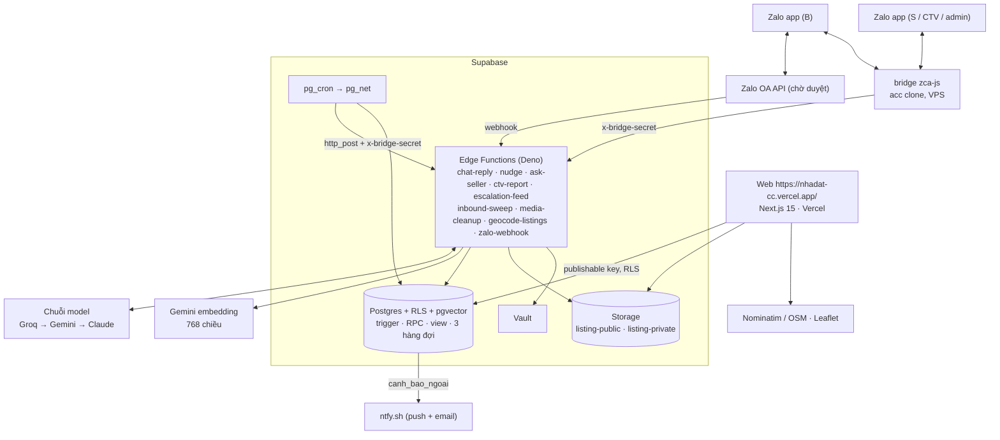
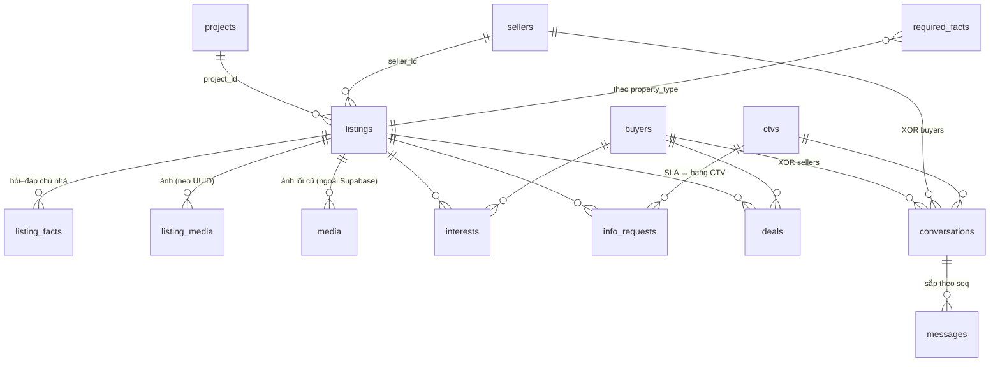
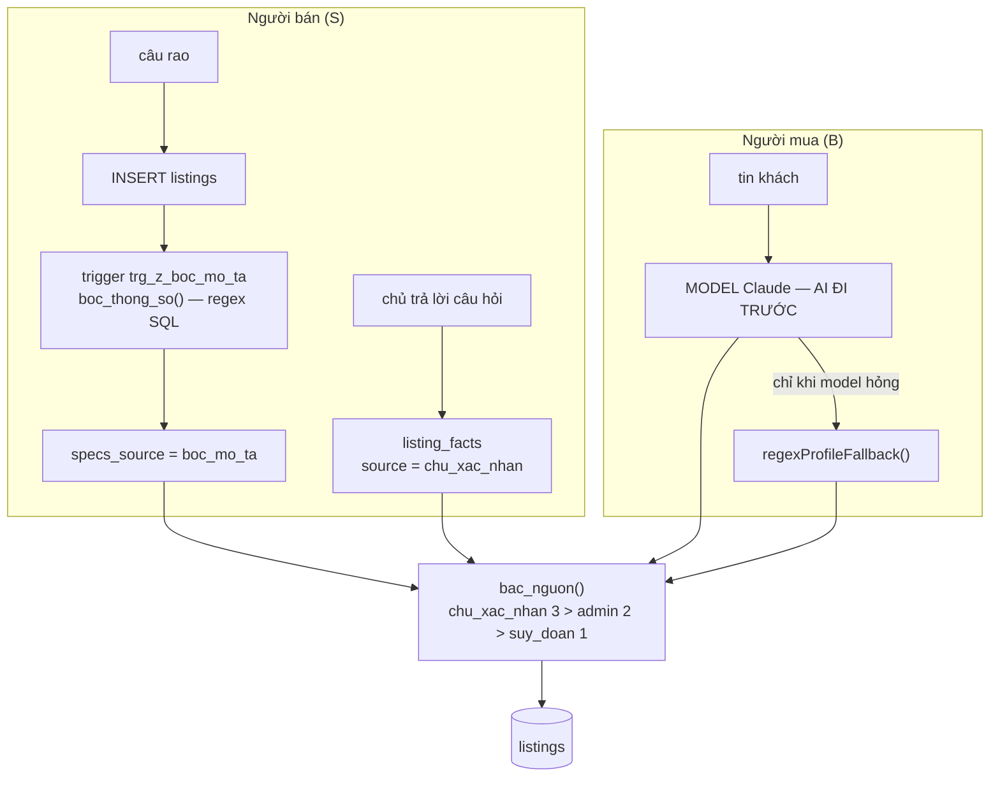

# 07 — Software Requirements Specification

**Hệ thống**: nhadat.cc · **Phiên bản**: v2.0 · **Ngày**: 2026-09-04
**Cơ sở**: `02-requirements.md`, `03-user-flows.md`, `04-information-architecture.md`,
code ở HEAD và DB thật project `nhadat-cc` (`tbcdpupiarkuxtntmosl`).

Tài liệu này tả **hệ thống như đang chạy**. Nguồn của mọi khẳng định là code
trong repo và DB thật (`[nguồn: DB 04/09/2026]` ghi một lần ở đầu mỗi mục lớn).
Mục thiết kế chưa dựng chỉ còn một dòng "Không dựng — thay bằng …" để giữ ID
cho `08-traceability.md`.

---

## 1. Giới thiệu

### 1.1 Mục đích
Đặc tả phần mềm đang vận hành để nghiệm thu (`§7`), kiểm thử (`docs/10`) và
mở rộng mà không lệch khỏi yêu cầu ở `02-requirements.md`.

### 1.2 Phạm vi hệ thống

| Mã | Phân hệ | Đường thật |
|---|---|---|
| `WEB` | Website công khai | Next.js ở root repo: `/`, `/[tag]`, `/mua-ban`, `/cho-thue`, `/nha-dat/[code]`, `/du-an/[slug]`, `/ban-do`, `/moi-gioi`, `/thong-ke`, `/ds/[token]`, `/raoban`, `/tai-khoan`, `/yeu-thich`, `/tinh-lai-vay` |
| `BOT` | B Side | Edge function `chat-reply` (bộ não), `zalo-webhook` (OA) + bridge `zca-js` (acc clone, máy local), `nudge`, `inbound-sweep` |
| `SEL` | S Side | Cùng `chat-reply` (nhánh bán, FR-159), `ask-seller` (hỏi nhỏ giọt), `/quan-ly` + `/dang-nhap` cho NMG |
| `ADM` | Admin | `/admin` (Next, JWT admin qua RLS), `escalation-feed` + `ctv-report` (việc cho CTV/admin), cảnh báo ntfy |

### 1.3 Tài liệu tham chiếu
`docs/00`…`docs/06`, `docs/09-open-issues.md`, `docs/10-ke-hoach-kiem-thu.md`, `bot/README.md`.

---

## 2. Kiến trúc tổng thể


```mermaid
flowchart TB
    W["Web https://nhadat-cc.vercel.app/<br/>Next.js 15 · Vercel"]
    ZB["Zalo app (B)"]
    ZS["Zalo app (S / CTV / admin)"]
    OA["Zalo OA API (chờ duyệt)"]
    BR["bridge zca-js<br/>acc clone, VPS"]
    subgraph Supabase
        EF["Edge Functions (Deno)<br/>chat-reply · nudge · ask-seller · ctv-report · escalation-feed<br/>inbound-sweep · media-cleanup · geocode-listings · zalo-webhook"]
        DB[("Postgres + RLS + pgvector<br/>trigger · RPC · view · 3 hàng đợi")]
        CRON["pg_cron → pg_net"]
        ST[("Storage<br/>listing-public · listing-private")]
        VA["Vault"]
    end
    AI["Chuỗi model<br/>Groq → Gemini → Claude"]
    EMB["Gemini embedding<br/>768 chiều"]
    NTFY["ntfy.sh (push + email)"]
    OSM["Nominatim / OSM · Leaflet"]
    W -->|publishable key, RLS| DB
    W --> ST
    W --> OSM
    ZB <--> OA
    ZB <--> BR
    ZS <--> BR
    OA -->|webhook| EF
    BR -->|x-bridge-secret| EF
    EF <--> AI
    EF --> EMB
    EF --> DB
    EF --> ST
    EF --> VA
    CRON -->|http_post + x-bridge-secret| EF
    CRON --> DB
    DB -->|canh_bao_ngoai| NTFY
```

### SRS-2.1 — Tech stack

`[nguồn: package.json, bot/README.md, DB 04/09/2026; soát lại theo mã nguồn 30/09/2026]`

| Lớp | Công nghệ |
|---|---|
| Web | Next.js 15 (App Router) + TypeScript + Tailwind 4, Bun, deploy Vercel project `nhadat-cc` từ root repo |
| Auth | Supabase Auth: Google OAuth + magic link email (NMG, admin, tài khoản B tự nguyện); không Zalo SSO |
| DB | Supabase Postgres, RLS trên mọi bảng, trigger + RPC `security definer`, 3 hàng đợi bằng bảng (`inbound_ledger`, `reminders`, `media_cleanup_queue`); `pgvector` cho tìm theo nghĩa (vector 768 chiều ở `listings`, `projects`, `wards`, `phuong_cu`, `quan_cu`, `duong`) |
| Serverless | Supabase Edge Functions (Deno), 9 function (`§4`) |
| Lịch / HTTP nội bộ | `pg_cron` (`SRS-5.3`; số job đếm lại trong DB, bản 04/09 ghi 12) + `pg_net` (`net.http_post`) |
| Bí mật | Supabase Vault (`ANTHROPIC_API_KEY`, `GROQ_API_KEY`, `GEMINI_API_KEY`, `GEMINI_API_KEY_2`, `BRIDGE_SECRET`), đọc qua `get_secret()` chỉ cho `service_role` |
| Kho file | Supabase Storage: `listing-public` (ảnh, công khai), `listing-private` (sổ đỏ/giấy tờ, signed URL) |
| AI | Chuỗi dự phòng 3 nguồn (`_shared/claude.ts`, `_shared/groq.ts`): Groq (mặc định `qwen/qwen3.8-27b`, đổi bằng secret `GROQ_MODEL`) → Gemini (cổng giọng OpenAI, mặc định `gemini-3.8-flash`) → Anthropic Claude Haiku 4.5 (SDK, structured output zod v4); thứ tự đổi bằng secret `MODEL_TRUOC`, không cần deploy; lượt có ảnh đi thẳng Claude. Prompt sửa được ở bảng `bot_prompts` (FR-138) |
| Tìm theo nghĩa | Gemini `gemini-embedding-001` (768 chiều) — câu tìm nhúng lúc chat (`_shared/ai/nhung.ts`, 429 thì thử khoá 2, SRS-5.1g), tài liệu nhúng bằng cron `nhung_tick` / `nhung_dia_danh_tick`; công tắc `app_config.tim_theo_nghia` |
| Chat | Zalo qua bridge `zca-js` (acc clone, chạy trên VPS từ 04/09 — `bot/bridge-zca/VPS.md`); Zalo OA API qua `zalo-webhook` chờ OA duyệt |
| Cảnh báo | ntfy.sh (`canh_bao_ngoai`), chuyển tiếp email khi có tài khoản ntfy (`SRS-5.5`) |
| Bản đồ | Leaflet + OSM tile; geocode Nominatim (`geocode-listings`); tiện ích quanh tin qua Overpass |
| Quan trắc | `bot_errors` / `bot_health` / `bot_usage` + `/admin` (FR-152, FR-169); không Logstash/ES, Slack, SMTP, fingerprint |

### SRS-2.2 — Đường giao tiếp S↔B

`[nguồn: DB 04/09/2026, chat-reply v48]` Một đường duy nhất, bằng bảng + trigger, không HTTP giữa hai "side":

1. Khách hỏi về căn → `chat-reply` chèn `info_requests(source='buyer_ask')`; trigger `route_info_request` giao CTV ít việc
   nhất (không có CTV → admin), `sla_due_at` = +`ctv_sla_phut()` (120 phút) (FR-140, FR-173).
2. Trigger `notify_info_request_escalation` sinh MỘT `reminders(kind='escalation')` cho người được giao kèm mẫu
   "`#mã: câu trả lời`"; bridge kéo qua `escalation-feed`.
3. Người nội bộ / chủ nhà nhắn "`#mã: …`" → `chat-reply` (`nguoi_noi_bo`) ghi `ghi_fact_listing` + đóng câu `answered`;
   trigger `info_request_bao_lai_khach` hẹn `followup` cho khách, `nudge` gửi (FR-140 c).
4. Quá SLA → `info_request_sla_tick()` nhắc admin + `[QUESTION]`; quá 48 h → `info_request_timeout_tick()` báo thật cho khách kèm căn khác (FR-110).

Vòng nhỏ giọt với chủ nhà (`source='seller_flow'`) đi cùng bảng, gọi `ask-seller` qua `ask_seller_drip()` (FR-129/144). Không có kênh Slack (OPEN-03 đóng).

---

## 3. Mô hình dữ liệu

`[nguồn: information_schema + pg_constraint + pg_policies, DB 04/09/2026]`
Khối: `cột:kiểu`, `!` = NOT NULL, `=` = default, `→` = FK. PK `uuid` trừ khi ghi khác. Enum thật:
`listing_deal(ban, cho_thue)`, `property_type(nha_pho, nha_cap4, chung_cu, dat, biet_thu, phong_tro, mat_bang, toa_nha, dat_nong_nghiep, dat_kinh_doanh, kho_xuong, chua_ro)` (4 loại sau thêm `20260909i`),
`seller_type(ccrb, nmg, unknown)`, `request_status(pending, answered, expired)`, `msg_sender(buyer, seller, bot, ctv, system, human)`,
`unit_status(con_ban, giu_cho, da_coc, da_ban)`.

### SRS-3.0 · Bản đồ 43 bảng và đường bóc tách

`[nguồn: pg_class + pg_description, DB 06/09/2026]`

Ba tháng sau mở lại repo, thứ mất trước tiên là *cái nào thuộc về cái nào*. Mục
này là bản đồ đó. Nó KHÔNG đẻ nguồn sự thật thứ hai: chú thích tương ứng đã nằm
trong chính DB (`comment on table/column`, migration `20260906b`), hiện ra ngay
dưới tên bảng trong Supabase Table Editor. Đây là bản in ra giấy của thứ đó.

**Năm nhóm, đủ 43 bảng** (`nhung_viec_dia_danh`, `phuong_cu`, `quan_cu` thêm 30/09/2026, `20260930a`; `nhung_viec`, `nhung_viec_du_an` thêm 23/09/2026, FR-216; `duong` thêm 21/09/2026, FR-212; soát lại 18/09/2026 theo `obj_description` thật trên DB — bản trước ghi 32, thiếu `project_facts` `tien_ich` `mau_cau` `boc_tach_bong` `bridge_dang_nhap` và xếp `required_facts` sai nhóm). Tiền tố `[NHÓM]` nằm ngay đầu chú thích mỗi bảng, nên
Table Editor vẫn xếp A→Z mà mắt vẫn gom được theo việc.

| Nhóm | Bảng |
|---|---|
| `[RỔ HÀNG]` (13) | `listings` `media` `listing_media` `listing_facts` `media_cleanup_queue` `projects` `project_facts` (FR-195) `listing_views` `wards` (FR-209) `tien_ich` (FR-204, chú thích `20260918a`) `duong` (FR-212, `20260921b`) `phuong_cu` `quan_cu` (`20260930a`) |
| `[NGƯỜI & HỘI THOẠI]` (10) | `buyers` `sellers` `conversations` `messages` `interests` `info_requests` `viewings` `deals` `reminders` `ratings_log` |
| `[BOT & HÀNG ĐỢI]` (13) | `inbound_events` `inbound_ledger` `bot_errors` `bot_health` `bot_usage` `chat_quota` `bot_prompts` `required_facts` `mau_cau` (FR-180) `boc_tach_bong` (FR-208) `nhung_viec` `nhung_viec_du_an` (FR-216) `nhung_viec_dia_danh` (`20260930a`) |
| `[CTV]` (2) | `ctvs` `ctv_daily_reports` |
| `[HỆ THỐNG]` (5) | `admins` `app_config` `curated_lists` `property_events` `bridge_dang_nhap` (FR-201, `20260911b`) |

**Quan hệ chính** — chỉ khoá ngoại thật, không vẽ luồng chạy:


```mermaid
erDiagram
  projects  ||--o{ listings      : "project_id"
  sellers   ||--o{ listings      : "seller_id"
  listings  ||--o{ listing_facts : "hỏi–đáp chủ nhà"
  listings  ||--o{ listing_media : "ảnh (neo UUID)"
  listings  ||--o{ media         : "ảnh lối cũ (ngoài Supabase)"
  listings  ||--o{ interests     : ""
  listings  ||--o{ info_requests : ""
  listings  ||--o{ deals         : ""
  buyers    ||--o{ interests     : ""
  buyers    ||--o{ deals         : ""
  buyers    ||--o{ conversations : "XOR sellers"
  sellers   ||--o{ conversations : "XOR buyers"
  ctvs      ||--o{ conversations : ""
  ctvs      ||--o{ info_requests : "SLA → hạng CTV"
  conversations ||--o{ messages  : "sắp theo seq"
  required_facts }o--|| listings : "theo property_type"
```

Ba chỗ hay hiểu nhầm, nói thẳng ở đây:

- **Không có bảng `buyer_preferences`.** Nhu cầu khách nằm ở cột
  `buyers.preferences` (jsonb).
- **Không có, và không cần, bảng `<loai>_specs` cho từng loại BĐS.** Chỗ rổ
  hàng đã chia theo loại là `required_facts` — 38 câu hỏi × 7 loại, khoá
  `(property_type, fact_key)`. Định nghĩa thông số phía mã nguồn là `SPEC_COLS`
  trong `bot/supabase/functions/_shared/thong_so.ts` (FR-172).
- **`media` và `listing_media` là hai đời khác nhau.** `media` (1005 dòng) trỏ
  file NGOÀI Supabase — đường dẫn dựng theo `listings.legacy_sst`, tức ảnh nằm
  trong kho ảnh gốc trên máy local, không nằm trong Storage. `listing_media`
  (FR-165) mới là ảnh trong Storage, neo `listings.id`. **Từ 07/09/2026 lối mới
  đã có dữ liệu thật**: `listing_media` 1005 dòng, `listing_photos_v` 945,
  **171/173 tin có ảnh** (hai tin `BDS-Q5-0113`/`BDS-Q5-0124` trống vì thư mục
  nguồn rỗng). Trước hôm đó `storage.objects` = 0 và web phục vụ ảnh giữ chỗ cho
  mọi tin — mốc này để lần sau thấy web vỡ ảnh thì biết soi `listing_media`
  trước. `media` giữ nguyên làm sổ đối chiếu, chưa xoá.

**Đường bóc tách — hai nhánh chạy NGƯỢC nhau.** Đây là hình trạng thật, không
phải hình mong muốn:


```mermaid
flowchart TB
  subgraph S["Người bán (S)"]
    s1["câu rao"] --> s2["INSERT listings"]
    s2 --> s3["trigger trg_z_boc_mo_ta<br/>boc_thong_so() — regex SQL"]
    s3 --> s4["specs_source = boc_mo_ta"]
    s5["chủ trả lời câu hỏi"] --> s6["listing_facts<br/>source = chu_xac_nhan"]
  end
  subgraph B["Người mua (B)"]
    b1["tin khách"] --> b2["MODEL Claude — AI ĐI TRƯỚC"]
    b2 -->|"chỉ khi model hỏng"| b3["regexProfileFallback()"]
  end
  s4 --> r["bac_nguon()<br/>chu_xac_nhan 3 &gt; admin 2 &gt; suy_doan 1"]
  s6 --> r
  b2 --> r
  b3 --> r
  r --> db[("listings")]
```

Nhánh S đúng thứ tự *tiền định trước, model sau* — **đã đổi từ 21/09/2026**: chế độ `boc_tach_ai = chinh` đảo tầng, AI
đọc trước và qua kiểm bằng chứng, luật chỉ đỡ khi model hỏng (FR-208 f; phạm vi AI ⟂ code ở SRS-5.1d). Nhánh B thì ngược: mỗi tin
khách là một lượt gọi model, kể cả câu regex bóc được ("dưới 6 tỷ", "3 phòng
ngủ"); regex chỉ chạy khi model chết (`chat-reply/index.ts:65`, gọi ở `:2266`).
Đảo lại nhánh B là việc còn treo, chưa làm.

**Ranh giới bóc tách ⟂ AI có máy canh.** `bot/tests/ranh-gioi.mjs` (nằm trong
`bun run test:bot`, nên chạy ở CI mỗi PR) chặn hai chiều: mã bóc tách tiền định
không được import SDK Anthropic / `claude.ts` / gọi RPC; tầng AI không được ghi
bảng nghiệp vụ, chỉ ba RPC đã khai tên (`get_secret`, `log_loi`, `cong_token`).
Bài có ca âm nên luật hỏng thì bài đỏ, không im.

**Đọc rổ hàng bằng mắt người:** view `ro_hang_ban` (20 cột thay cho 56, giá quy
ra tỷ, nhãn tiếng Việt, cột `canh_bao` chỉ đích danh trường nào là máy đoán).
`security_invoker = on`, `anon` bị revoke.

**Nhìn như Excel:** schema `so` (`20260907c`) tách riêng khỏi `public` để Table
Editor / Schema Visualizer không lẫn 38 bảng + 19 view ruột bot (đếm trên DB 18/09/2026). Hai view:
`so.ro_hang` — 9 cột đầu đúng thứ tự sheet Excel gốc Q5 (trong `masterDB/`) (stt · bán
hay thuê · vị trí · diện tích · giá · mô tả · SĐT · người bán), cột thêm xếp
sau, cả bán lẫn cho thuê; `so.nguoi_ban` — mỗi người bán một dòng, đếm tin;
`so.hoi_thoai` (`20260907g`) — log chat đọc được: lúc · ai · nội dung · phía bán/mua,
lọc theo `hoi_thoai` để đọc trọn một cuộc (nguồn `messages`, không SĐT).
PostgREST không phơi schema này, `anon`/`authenticated` bị revoke,
`security_invoker = on`. Khác Excel: cột SĐT là SĐT **người bán đã ký** (60/173
tin), DB không giữ SĐT theo tin (FR-104). `xuat_schema()` chỉ quét `public` nên
`so` không nằm trong `schema.sql`; dựng lại phải chạy thêm hai file migration
(`20260907c`, rồi `20260907f` — ô đọc một dòng: mô tả gộp xuống dòng thành
` · `, vị trí bỏ đuôi `, Quận 5, Hồ Chí Minh`, diện tích dấu phẩy thập phân)
[giả định BA: chấp nhận vì view không mang dữ liệu].

### SRS-3.1 · `listings`

```text
id:uuid!  code:text! unique ('BDS-Q5-0001', trigger listings_fill_code)  legacy_sst:int
seller_id:uuid→sellers  deal:listing_deal!=ban  status:text!=cho_thong_tin
district:text!='Quận 5'  ward:text  street:text  location_raw:text  lat,lng:numeric
property_type:property_type=chua_ro  project_id:uuid→projects  unit_code:text  unit_status:unit_status
area_m2,legal_area_m2,built_area_m2:numeric  frontage_m,length_m,rear_width_m:numeric
floors:int  floors_text:text  floor:int  bedrooms:int  bathrooms:int  direction:text
access_type:text  alley_width_m,distance_to_street_m:numeric
legal_status:text  has_completion:bool  planning_status:text
has_elevator,car_in_house,corner_lot,negotiable:bool  furnishing:text  year_built:int
price_raw:text  price_vnd:bigint  price_per_m2_vnd:bigint(generated)  rent_income_vnd:bigint
description:text  source:text!=import_excel  source_url,cc_link:text
property_type_source,price_source,ward_source:text!=suy_doan  specs_source:text
last_confirmed_at,last_interest_at:timestamptz  created_at,updated_at:timestamptz!
nhan:text[]!='{}' (FR-211, chỉ mục GIN, khoá theo từ điển `_shared/extraction/nhan.ts`; ghi qua RPC `them_nhan_tin`)
```
Bản đồ ánh xạ đầy đủ 67 cột (nghĩa, khách nói ví dụ, ghi từ đâu, fact liên quan, lọc ở đâu) + fact → cột + ma trận 12 loại BĐS:
`docs/anh-xa-du-lieu-listings.xlsx` (ảnh chụp 18/09/2026 từ `information_schema` + trigger + `required_facts` + 10 tin bắn thật; đổi schema thì phải làm lại).

- CHECK `status ∈ {cho_thong_tin, dang_ban, dang_quan_tam, da_chot, an}` (FR-139); `access_type ∈ {mat_tien, hem_xe_tai, hem_xe_hoi, hem_xe_may, hem}`;
  `legal_status ∈ {so_hong_rieng, so_hong_chung, so_hong, hdmb, giay_tay}`; `furnishing ∈ {full, co_ban, khong}`; `bedrooms 1..20`;
  `*_source ∈ {suy_doan, chu_xac_nhan, admin}`; `specs_source ∈ {boc_mo_ta, admin, chu_xac_nhan}` (FR-164/172).
- Trigger BEFORE (theo tên): `listings_chuan_hoa_cot` → `fill_code` → `fill_property_type` (FR-150) → `set_price_vnd` (FR-154) →
  `trg_y_boc_thong_so` (FR-172) → `trg_z_normalize_status` → `trg_zz_dang_tin` (tự lên kệ khi đủ giá + m2 + phường, FR-144).
  AFTER: `listing_insert_drip` (FR-129), `bao_tin_moi_khop` (FR-64), `bao_can_da_chot` (FR-108), `trg_pe_listings` (FR-70).
- Index lọc: `(deal, price_vnd)`, `(deal, status, access_type)`, `(deal, status, floors)`, `(district, status)`; unique partial `(project_id, unit_code)`.
- Policy: `anon_read_listings` chỉ `dang_ban | dang_quan_tam | da_chot`; `listings_own_read/insert` (NMG tin của mình); `listings_admin_read/update`.
- Luật: `area_m2` là diện tích chính (chung cư = tim tường), `legal_area_m2` là công nhận — hai cột khác nhau; `description` giữ nguyên văn
  câu rao, không trigger nào sửa (FR-91/153). Bậc nguồn `chu_xac_nhan` > `admin` > `suy_doan`/`boc_mo_ta`; fact chỉ ghi vào cột khi bậc ≥ bậc
  đang giữ, cùng bậc thì mới nhất thắng (FR-163 a, FR-164 a).

### SRS-3.2 · `property_events` — FR-70, FR-73

```text
id:bigserial  listing_id:uuid!→listings cascade  event_type:text!  buyer_id:uuid→buyers set null  at:timestamptz!=now()  meta:jsonb
```
- CHECK `event_type ∈ {view, asked, interest, photos, viewing, deal, match_sent, status}`; index `(listing_id, at desc)`, `(at desc)`; policy `property_events_admin_read`.
- Chỉ trigger `trg_property_event()` ghi (`ghi_su_kien_bds`, không bao giờ ném): `listing_views` → `view`, `info_requests` `buyer_ask` → `asked`,
  `interests` → `interest`, `viewings` → `viewing`, `deals` → `deal`, `reminders` match sent → `match_sent`, `listings` đổi `status` → `status`. `photos` chưa có nguồn sinh.
- `hot_score` (FR-73) = view `bds_hot` tính lúc đọc (số sự kiện 60 ngày), không có cột/job.

### SRS-3.3 · `buyers`

```text
id:uuid!  zalo_user_id:text unique  auth_user_id:uuid unique→auth.users  name:text  phone:text
preferences:jsonb='{}'  last_contact_at:timestamptz  notes:text  created_at:timestamptz!
```
- `preferences` = hồ sơ nhu cầu tích luỹ (`deal` từ ngắn `ban|thue`, `area`, `budget`, `alley`, `bedrooms`, `photo_offset`, `hoi_vai`…), ghi qua `merge_buyer_prefs()` (FR-130).
- `phone` chỉ khi B tự cung cấp ở luồng đặt lịch (NFR-07); `/admin` không SELECT cột này. Policy `buyers_self_read/insert/update`, `buyers_admin_read`.
- Không có `connection_status`/`fingerprint_ids`: vết giữ chân ở `reminders.kind = reengage` (FR-63); fingerprint không dựng (OPEN-14).

### SRS-3.4 · `sellers`

```text
id:uuid!  zalo_user_id:text unique  auth_user_id:uuid unique→auth.users  phone:text unique  phone_proxy:text  name:text
seller_type:seller_type!=unknown  rating_sum:int!=0  rating_count:int!=0  active_listing_id:uuid→listings set null  created_at:timestamptz!
```
- `seller_type` quyết định phí (CCRB 1 %, NMG 0,5 %, FR-101); hồ sơ mở từ chat (`mo_ho_so_nguoi_ban`, FR-159) mang nhãn ngay
  (có BĐS = `ccrb`, tự xưng môi giới = `nmg`), không ghi đè nhãn đã có; `unknown` chỉ còn ở hồ sơ tạo tay.
- `active_listing_id` = căn bot đang hỏi (FR-157), trigger `info_request_set_active_listing` giữ. `rating_*` chỉ do `ghi_danh_gia()` ghi (FR-65).
- Policy `sellers_self_read/insert`, `sellers_admin_read/update`. Không có `fee_rate`, `email`, `contract_status`.

### SRS-3.5 · `conversations`, `messages` — FR-71, FR-72, FR-131, FR-141

```text
conversations  id:uuid!  buyer_id:uuid→buyers  seller_id:uuid→sellers  ctv_id:uuid→ctvs  channel:text!=zalo_oa  started_at:timestamptz!
               last_message_at:timestamptz  needs_human:bool!=false  needs_human_at,human_touch_at,human_escalated_at:timestamptz
messages       id:uuid!  conversation_id:uuid!→conversations  sender:msg_sender!  body:text!  zalo_msg_id:text unique  seq:bigint! unique  created_at:timestamptz!
```
- CHECK `conversations_mot_vai` (`buyer_id` XOR `seller_id`); unique partial `(buyer_id)`, `(seller_id)` — **một hội thoại/khách, không bao giờ đóng** (FR-131).
  "Cuộc trò chuyện" 30 phút của FR-72 tính lúc đọc ở view `hoi_thoai_phien`.
- Trigger: `assign_ctv_round_robin` (BEFORE INSERT, chia CTV); `conversations_email_upset` (`needs_human` false→true → `[UPSET]`);
  `messages_bump_last_message` giữ `last_message_at = greatest(cũ, mới)` — ứng dụng không ghi tay (FR-171 h).
- `seq` là thứ tự tất định cho gửi/replay (FR-162). Policy chỉ `*_admin_read`; bot ghi bằng `service_role`.

### SRS-3.6 · `info_requests` — FR-40…FR-44, FR-76, FR-110, FR-140, FR-173

```text
id:uuid!  listing_id:uuid!→listings cascade  buyer_id:uuid→buyers  question:text!  answer:text  status:request_status!=pending
source:text!=seller_flow  assignee:text  ctv_id:uuid→ctvs  sla_due_at,sla_missed_at,reminded_at,answered_at:timestamptz  created_at:timestamptz!
```
- CHECK `assignee ∈ {seller, ctv, admin}`; `source ∈ {seller_flow, buyer_ask}` (theo code); index partial `(sla_due_at) where pending and sla_missed_at is null`.
- Trigger: `route_info_request` (BEFORE, giao việc + SLA), `notify_info_request_escalation` (bỏ qua `xac_nhan_lich`/`con_ban`),
  `info_request_bao_lai_khach` (`answered` → followup; `xac_nhan_lich` → `viewings.status='confirmed'`), `info_request_set_active_listing`, `trg_pe_info_requests`.
- `question` với `seller_flow` là `fact_key` của `required_facts`; với `buyer_ask` là chữ tự do. FR-44: câu trả lời vào cột qua `listing_facts_sync_cols` (SRS-3.14). Policy `info_requests_admin_read`.

### SRS-3.7 · `viewings` — FR-50…FR-57, FR-65

```text
id:uuid!  listing_id:uuid→listings  listing_code:text  buyer_id:uuid→buyers  guide:text  slot:timestamptz  time_text:text  phone:text
status:text!=proposed  buyer_rating:int  note:text  source:text=bot  created_at:timestamptz!
```
- CHECK `status ∈ {proposed, pending, confirmed, done, cancelled}`; `buyer_rating 1..5`; `viewings_can_neo` (`listing_id` hoặc `listing_code`).
- INSERT → `viewings_bao_ctv_va_email`: nhắc CTV của hội thoại (hoặc admin) ngay, mở câu `xac_nhan_lich` (`buyer_ask`), `email_admin('VIEWING')` (FR-52/57/81).
- Nhắc trước giờ xem = `reminders.kind='viewing'` kèm link bản đồ khi có toạ độ (FR-54); `viewing` sent → `feedback` +4 h (FR-56); `buyer_rating` do `ghi_danh_gia()` ghi.
- `phone` chỉ điền khi B đồng ý ở bước này (NFR-07). Policy `viewings_admin_read`.

### SRS-3.8 · `interests`, `listing_facts`, `deals` — FR-108, FR-112, FR-140, FR-153

```text
interests      buyer_id:uuid!→buyers cascade  listing_id:uuid!→listings cascade  created_at:timestamptz!   (PK cặp)
listing_facts  id:uuid!  listing_id:uuid!→listings cascade  question:text!  answer:text!  source:text!=seller_zalo  created_at:timestamptz!
deals          id:uuid!  listing_id:uuid!→listings  buyer_id:uuid→buyers  ctv_id:uuid→ctvs  price_vnd:bigint  fee_pct:numeric  closed_at  created_at
               unique nulls not distinct (listing_id, buyer_id)
```
- `interests`: `mark_listing_interest(codes, buyer_id)` ghi cho mọi căn khách nhắc/bot gợi/xin hình/nhờ hỏi chủ; tin sang `da_chot` → mỗi khách
  trong `interests` nhận `reminders.kind='sold'` kèm căn thay thế (FR-108).
- `listing_facts`: kho hỏi-đáp tích luỹ, `answer` giữ nguyên văn; ghi duy nhất qua `ghi_fact_listing()`; trigger `listing_facts_sync_cols` đổ vào cột
  theo luật bậc (SRS-3.14). Policy anon đọc trừ `hinh_anh`/`dia_chi_chi_tiet`, chỉ tin lên kệ.
- `deals`: căn cứ phí (`fee_pct` null khi chốt lúc `unknown`, OPEN-28); `deals_chan_xoa_da_chot` cấm xoá deal đã chốt.
- Bất biến ẩn danh (FR-104/105): view/policy công khai không bao giờ trả `phone`, `zalo_user_id`, số nhà; trong hội thoại bot khai mọi thứ đã lưu
  về căn trừ liên hệ người bán (OPEN-36); bong bóng gửi người mua qua `locLienHe()`.

### SRS-3.8a · Hai luật chữ nghĩa bắt buộc

`[nguồn: chat-reply v48]`
- **`deal` có hai bảng từ vựng**: cột `listings.deal` = `ban | cho_thue`; JSON `buyers.preferences` và schema model = `ban | thue`. Mọi chỗ chạm cột phải qua `dealCol()` (FR-163).
- **Không đặt `\b` cạnh chữ tiếng Việt có dấu** — `\w` của JS chỉ là ASCII. Tự dựng biên (`(^|[^a-zà-ỹ])…(?![a-zà-ỹ])`) hoặc khớp trên bản bỏ dấu `boDau()` (FR-161).

### SRS-3.8b · Bảng phụ trợ

```text
curated_lists        id:uuid!  token:text! unique =24 hex  buyer_id:uuid→buyers set null  listing_ids:uuid[]! (1..60)  title  created_at
                     expires_at:=now()+30 ngày                                    -- FR-100; RLS, không policy; đọc/tạo qua RPC (SRS-4.3)
listing_media        id:uuid!  listing_id:uuid!→listings cascade  bucket:text!  storage_path:text!  media_type:text!  mime_type:text!
                     sort_order:int!=0  is_cover:bool!=false  created_at         -- FR-165
                     CHECK bucket ∈ {listing-public, listing-private}; media_type ∈ {mat_tien, trong_nha, hem, so_do, giay_to, khac};
                     so_do/giay_to ⇒ bucket riêng; is_cover ⇒ bucket công khai; storage_path bắt đầu '<listing_id>/'; unique (bucket, storage_path);
                     unique partial một bìa/tin; trigger listing_media_giu_bia, listing_media_xep_hang_don (→ media_cleanup_queue)
media_cleanup_queue  id:uuid!  bucket,storage_path:text!  trang_thai:text!=cho ∈ {cho, dang_lam, xong, loi, chet}  attempts:int!=0  last_error
                     next_retry_at  created_at  updated_at                          -- FR-165 e, FR-166 g
inbound_events       event_id:text! PK (= zalo_msg_id)  zalo_user_id  payload:jsonb  delivery_count:int!=1  first_seen_at  last_seen_at  -- FR-162
inbound_ledger       zalo_msg_id:text! PK  status:text!=received ∈ {received, processing, completed, failed, dead}  attempts:int!=1  reply:jsonb
                     detail  sent_at  send_error  sent_bubbles:int!=0  next_retry_at  locked_by  started_at  finished_at  -- FR-162, FR-166
reminders            id:uuid!  kind:text! ∈ {promise, reengage, viewing, followup, escalation, report, match, feedback, sold, rating}
                     buyer_id  seller_id  ctv_id  listing_id  viewing_id (FK cascade)  due_at:timestamptz!  note:text
                     status:text!=pending ∈ {pending, sent, cancelled, dead}  sent_at  locked_at  locked_by  attempts:int!=0  next_retry_at  last_error
                     unique partial: (buyer_id, listing_id) match; (buyer_id, listing_id) sold; (viewing_id) feedback; (buyer_id) reengage pending
                     -- FR-32/60…64/108/110/133/166 f; policy reminders_admin_read/update
ratings_log          buyer_id,listing_id (PK)  stars:int! 1..5  note  at        -- FR-65, idempotent cho ghi_danh_gia
ctvs                 id:uuid!  name:text!  zalo_user_id unique  phone  active:bool!=true  last_assigned_at  created_at   -- FR-136/173
ctv_daily_reports    id  report_date:date!  ctv_id→ctvs  body:text!  scores:jsonb  sent_to  created_at; unique (report_date, ctv_id)  -- FR-137
required_facts       property_type:property_type!  fact_key:text!  priority:int!=1  nhom:text!=chuyen_mon (co_ban|chuyen_mon|phu|sau_dang; priority 1–9/10–19/20+/30+ — sau_dang hỏi bù SAU khi lên kệ, 20260909i)  (PK cặp)   -- FR-153/177
listing_views        auth_user_id:uuid!→auth.users  listing_id:uuid!→listings  viewed_at; policy views_own_all   -- FR-126
admins               email:text! PK  zalo_user_id  zalo_phone; policy admins_self_read
app_config           key PK  value!  ghi_chu  (admin_email, ntfy_topic, functions_base_url, storage_public_base_url, publishable_key)
bot_prompts          key PK  content!  updated_at (trigger touch)   -- FR-138
wards                ten:text! PK (tên MỚI không tiền tố, khoá tra Nominatim)  loai! ∈ {phuong, xa, dac_khu}  ten_day_du!  quan_cu! ("Quận 9" — chuỗi bocQuan/mã tin)
                     don_vi_2025:text[]!  tinh_cu! ∈ {TP.HCM, Bình Dương, Bà Rịa – Vũng Tàu}  don_vi_cu  lat,lng:numeric(9,6)  ma_hanh_chinh  nguon!  ghi_chu  created_at
                     -- FR-209 / FR-174 đợt 2 (20260915a): 168 dòng, nguồn NQ 1685 + Wikipedia; RLS bật, revoke anon/authenticated, chỉ service_role; xuat_schema() KHÔNG xuất dữ liệu → dựng lại chạy thêm migration
                     nhung:vector(768)  nhung_md5  nhung_luc   -- 20260930a: vector nghĩa (Gemini) của van_ban_dia_danh('wards', ten); cron nhung-dia-danh-tick
duong                id:uuid PK  ten:text! (có dấu, không tiền tố "Đường")  ten_khong_dau:text (generated: bo_dau(ten), index)  tinh! ∈ {TP.HCM, Tây Ninh, Đồng Nai} (tỉnh MỚI)
                     tinh_cu ∈ {TP.HCM, Bình Dương, Bà Rịa – Vũng Tàu}  phuong:text!='' (wards.ten_day_du)  quan_cu  nguon!  created_at; unique (ten, tinh, phuong)
                     -- FR-212 (20260921b): từ điển tên đường từ OSM/Overpass theo phường mới; RPC tim_duong(ten, quan, toi_da) khớp đúng/gần (fuzzystrmatch); chỉ service_role; dữ liệu nạp bằng scripts/nap-duong.mjs
                     loai ∈ {duong, so, hem}  so_hem ('137', '137/28')  duong_me  lat,lng (tâm OSM)  nhung:vector(768) (không nhúng hẻm)  nhung_md5  nhung_luc   -- 20260930a: giữ đường số + hẻm có toạ độ (nap-duong.mjs out center)
phuong_cu            id PK  ten! ('Phường 12', 'Phường Thảo Điền')  loai ∈ {phuong, xa, thi_tran}  quan_cu!  phuong_moi!→wards.ten  toan_bo!  lat,lng (tâm phường mới)  nhung  -- 20260930a: 487 dòng tách từ wards.don_vi_cu; unique (ten, quan_cu, phuong_moi)
quan_cu              ten PK ('Quận Gò Vấp')  lat,lng (trung bình tâm phường mới)  so_phuong_moi  nhung  -- 20260930a: quận / huyện / TP cũ trước 07/2025
media                bảng cũ đường OneDrive, còn policy anon đọc ảnh approved, không còn nguồn ghi — dọn cùng OPEN-18
```
- Không dựng: `tags`/`property_tags` (tag là hằng `lib/tags.ts`, 64 tag, FR-12; OPEN-06), `saved_criteria` (FR-64 đọc `buyers.preferences`),
  `escalations` (bốn loại đi `email_admin()`; vết việc ở `reminders`/`viewings`/`info_requests`), `photos` (thay bởi `listing_media`).

### SRS-3.9 · Bảo mật dữ liệu

`[nguồn: pg_policies, pg_class.relacl, storage.policies, DB 04/09/2026]` Anon key là khoá **công khai** (trong bundle JS và bridge) nên RLS + GRANT là bức tường duy nhất:

1. Vai `anon` chỉ SELECT; `authenticated` ghi có policy gác (`buyers`, `sellers`, `listings` nháp, `listing_views`, `listing_media` tin của mình); không ai có TRUNCATE (FR-167).
2. Bảng chỉ cho bot (`conversations`, `messages`, `info_requests`, `viewings`, `deals`, `interests`, `ctvs`, `ctv_daily_reports`, `bot_prompts`, `required_facts`,
   `curated_lists`, `inbound_*`, `media_cleanup_queue`, `ratings_log`, `app_config`) bật RLS, chỉ policy đọc cho admin hoặc không policy — anon 0 dòng; cảnh báo `rls_enabled_no_policy` là kỳ vọng.
3. Hàm là nội bộ trừ khi chứng minh ngược lại: EXECUTE mặc định chỉ `service_role`/`postgres`; ngoại lệ cố ý là hàm thuần `immutable` (`bo_dau`, `boc_thong_so`,
   `khu_khop`, `bac_nguon`, `seller_rank`, `chuan_hoa_*`…), `log_loi` (web Next chạy bằng publishable key), `doc_danh_sach` (anon), và cho `authenticated`:
   `admin_dang_tin`, `tao_danh_sach`, `la_admin`, `tin_cua_toi`, `thu_muc_dau_uuid`, `parse_vnd`, `guess_property_type`. Mọi hàm ghim `search_path`.
4. View công khai phải là **SECURITY DEFINER tự chứa** (`agents_public`, `listing_photos_v`), chỉ lộ cột không định danh, chỉ tin đã lên kệ; view không dùng cho anon
   để `security_invoker` và revoke (`public_listings`, `public_media`, `listing_missing_facts`, `job_suc_khoe`, `media_mo_coi_*`). View admin (`ctv_ranks`, `nmg_hoat_dong`,
   `bds_hot`, `hoi_thoai_*`, `khach_can_nguoi_that`, `bot_do_tre`) gác `auth.role() = 'service_role'` hoặc email trong `admins` (FR-167 c).
5. Vault không chạm anon: `get_secret()` chỉ `postgres`/`service_role`.
6. Storage: `listing-private` không có route public; đọc duy nhất bằng signed URL 900 s do admin ký ở `/admin` (`storage_admin_private_all`, NFR-06). Bucket công khai:
   `storage_admin_public_all`; người bán chỉ INSERT/DELETE đường dẫn có thư mục đầu = UUID tin của mình (`tin_cua_toi(thu_muc_dau_uuid(name))`, FR-96).
   `listing_media` công khai chỉ đọc được khi TIN đã lên kệ (`listing_media_doc_cong_khai`, FR-167 c).
7. Cổng edge function: 8 function (trừ `zalo-webhook`) qua nếu `Authorization` là service key hoặc header `x-bridge-secret` khớp `BRIDGE_SECRET`; chưa đặt secret thì
   fail-open nhưng ghi `bot_errors` nguồn `<function> CONG MO`; bí mật đọc qua `secretOf()` (env trước, Vault sau). Mọi hàm SQL gọi `net.http_post` tới function
   phải mang `x-bridge-secret`, trừ `canh_bao_ngoai` (FR-151 b, FR-167 b).
8. `zalo-webhook` `verify_jwt=false`; chữ ký `X-ZEvent-Signature` chỉ kiểm khi có `ZALO_APP_SECRET` (chưa có → ghi `KHONG VERIFY`, OPEN-33).

Hồi quy: TS-SEC-01…10, TS-SEC2 (`docs/10`) sau mọi migration đụng RLS/GRANT.

### SRS-3.10 · `projects` — FR-113…FR-117

```text
id:uuid!  name:text!  slug:text unique  developer  district  ward  province  location_raw  lat,lng:numeric  legal_status  amenities:jsonb
floor_plans:jsonb  images:jsonb  specs:jsonb  unit_types:jsonb  description  price_min,price_max:bigint  priority:int!=100  is_partner:bool!=false
handover_date:date  handover:text  status_text  source  source_url  created_at  updated_at
```
- `listings.project_id/unit_code/floor/direction/unit_status` nối căn với dự án; unique partial `(project_id, unit_code)`. Policy `anon_read_projects` (true); `match_projects(text)` tìm dự án khách nhắc.
- Luật thừa hưởng (FR-115/116): câu tầng dự án trả từ `projects`, không sinh `info_requests`; "căn X còn không" đọc `unit_status`; `last_confirmed_at` > 7 ngày hoặc null → "để em xác nhận lại chủ".

### SRS-3.11 · Tài khoản, admin và view quan trắc hội thoại — FR-124…FR-128, FR-71/74/76/77/78/80

- `sellers.auth_user_id`, `buyers.auth_user_id` nối Supabase Auth (Google OAuth + magic link). CCRB không cần tài khoản.
- `admins(email)`: mọi policy `*_admin_read/update` kiểm `exists (select 1 from admins where email = auth.jwt()->>'email')`. Thêm admin = insert email.
  Sáu bảng buyer side (`info_requests`, `viewings`, `buyers`, `conversations`, `messages`, `ctvs`) chỉ mở SELECT cho admin; ghi vẫn thuộc bot/trigger.
- `agents_public` (definer, tự chứa): `id, name, seller_type, rating_sum, rating_count, listing_count, closed_count, rank` — không bao giờ `phone`/`zalo_user_id` (FR-125).
- `listing_views` (own-only) là nền "tin đã xem"; `TrackView` chỉ chạy khi có phiên đăng nhập.
- View admin: `hoi_thoai_thong_ke` (30 ngày theo ngày VN, FR-71), `khach_can_nguoi_that` (FR-77), `hoi_thoai_phien` (FR-72), `bds_hot` (FR-73), `bot_do_tre` (p50/p95, NFR-01). `/admin` đọc bằng JWT admin, có CSV.
- Kỷ luật cột: DB quyết "ai đọc", web quyết "đọc cột nào" — `app/admin/page.tsx` không SELECT `buyers.phone`/`ctvs.phone` (NFR-07).

### SRS-3.12 · Bảng vận hành và hàm RPC — FR-146, FR-151, FR-152, FR-159, FR-166…FR-173

```text
bot_usage   day:date! PK (giờ VN)  model_calls:int!=0  capped_at  in_tokens,out_tokens,cache_write_tokens,cache_read_tokens:bigint!=0  -- FR-151 a, FR-169
bot_errors  id:bigserial  at:timestamptz!  source:text!  status_code:int  detail:text; index (at desc), (source, at desc)      -- FR-152
bot_health  who:text! PK  at:timestamptz!  last_id:bigint!=0                                                                    -- FR-152
```
Cả ba: RLS, policy `*_admin_read`, ghi chỉ `service_role`. `bot_errors` là sổ duy nhất còn lại khi log function (1 ngày, bậc Free) trôi — mọi `catch` phải nối `ghiLoi()`/`log_loi()` (FR-152 d).

`[nguồn: pg_proc + proacl, DB 04/09/2026]` Quyền: **SR** = chỉ `service_role`/`postgres`; **trig** = hàm trigger; **thuần** = ai cũng gọi được; **auth** = thêm `authenticated`; **anon** = mở cho web.

| Hàm / view | Việc | Quyền |
|---|---|---|
| `ensure_buyer_conversation` / `ensure_seller_conversation` | Mở/lấy hồ sơ + hội thoại duy nhất (advisory lock), trả kèm `ctv_id`, `human_touch_at` | SR |
| `mo_ho_so_nguoi_ban(zalo, seller_type)` / `nguoi_noi_bo(zalo)` | Mở `sellers` idempotent kèm nhãn, không ghi đè nhãn (FR-159) / tra CTV-admin (FR-173 d) | SR |
| `merge_buyer_prefs` / `ghi_fact_listing` / `mark_listing_interest` / `tao_followup` / `ghi_danh_gia` | Hồ sơ nhu cầu (FR-130) / cửa ghi fact duy nhất / `interests` + `dang_quan_tam` (FR-108/139) / followup +150' một lần/24 h (FR-32) / sao → `viewings` + `sellers.rating_*`, idempotent (FR-65) | SR |
| `can_cung_khu(buyer, listing, limit)` / `khu_khop` | 2–3 căn cùng phường/quận, giá 0,7–1,15×, trừ căn đã gửi (FR-62/108/110) | SR / thuần |
| `bao_tin_moi_khop` / `bao_can_da_chot` + trigger | Tin vừa `dang_ban` → `reminders.match` cho khách khớp, van 1/khách/24 h (FR-64) / tin `da_chot` → `reminders.sold` (FR-108) | SR / trig |
| `reminders_hen_hoi_cam_nhan` / `messages_bump_last_message` | `viewing` sent → `feedback` +4 h (FR-56) / giữ `last_message_at` (FR-171 h) | trig |
| `route_info_request` / `notify_info_request_escalation` / `info_request_bao_lai_khach` | Giao việc + SLA / nhắc người được giao / báo lại khách, lật lịch `confirmed` (FR-140, FR-173, FR-52) | trig |
| `viewings_bao_ctv_va_email` / `conversations_email_upset` / `reminders_email_voice` | `[VIEWING]` + nhắc CTV + câu `xac_nhan_lich` / `[UPSET]` / `[VOICE]` (FR-52/57/77/79/81) | trig |
| `email_admin(loai, uid, body, listing)` / `canh_bao_ngoai(title, text, priority, p_email)` | Ghép `[LOẠI] <uid>` → ntfy; `admin_email` rỗng → không gửi (FR-81) / `net.http_post` tới ntfy.sh, không qua bridge (FR-152 e) | SR |
| `info_request_sla_tick` / `info_request_timeout_tick` / `stale_listing_tick` | Quá 120' → admin + `[QUESTION]` (FR-173 c) / 24 h nhắc, 48 h `expired` + followup căn khác (FR-110) / tin im 30 ngày → hỏi `con_ban`, ≤ 5 tin/ngày (FR-103) | SR (cron) |
| `seller_drip_tick` / `ask_seller_drip` / `trg_listing_drip` | Gọi `ask-seller` hỏi nhỏ giọt, mang `x-bridge-secret` (FR-129/144) | SR / trig |
| `nudge_tick` / `ctv_report_tick` / `media_cleanup_tick` / `inbound_sweep_tick` | Gọi edge function tương ứng; chỉ gọi HTTP khi có việc (FR-166 d, FR-171 c) | SR (cron) |
| `bot_health_tick` / `beat(who)` / `bo_dem_nhac_treo(gio)` | Quét `net._http_response` không 2xx → `bot_errors`, nhịp tim bridge, gộp báo 1 tin/giờ, dọn sổ 30 ngày (FR-152, NFR-18) / nhịp tim / đếm nhắc treo | SR |
| `log_loi(source, detail, code)` / `bat_het_tien_api()` | Cửa ghi lỗi, van 20 dòng/nguồn/giờ, 200/giờ (FR-171 b) / dấu hiệu hết tiền AI → `HET TIEN API`, ghi thẳng, hãm 6 h (FR-168) | anon / trig |
| `bump_model_quota(limit)` / `cong_token(...)` | Trần lượt gọi model/ngày; cộng số chữ vào `bot_usage` (FR-151 a, FR-169) | SR |
| `claim_inbound` / `bao_hong_inbound` / `viec_inbound_bo_roi` / `ghi_su_kien_inbound` | Sổ idempotency tin đến: giành job atomic, 8 lần → `dead`, tìm việc bỏ rơi 24 h (FR-162, FR-166) | SR |
| `nhan_viec_nhac` / `bao_hong_nhac` / `nha_viec_nhac(id, worker)` | Hàng đợi nhắc: thuê 5' `skip locked`; hỏng → lùi dần, 5 lần `dead`; chưa thử → trả lại nguyên vẹn (FR-166 f) | SR |
| `nhan_viec_don_media` / `chon_viec_don_chet` / `lan_thu_ke(attempts)` | Hàng đợi dọn file `attempts < 6`; khoảng chờ nhân đôi, trần 1 h, nhiễu ±20 % (FR-165 e, FR-166) | SR |
| `boc_thong_so(text, type)` / `boc_ten_duong` / `ap_thong_so(listing, j, bac, de)` / `listings_boc_thong_so` | Bóc thông số (trên `bo_dau`) → cột theo luật bậc (FR-172) | thuần / thuần / SR / trig |
| `listing_facts_sync_cols` / `listings_fill_code` / `next_listing_code` | Fact → cột (SRS-3.14) / cấp mã tin chỉ trong trigger (FR-158, FR-167) | trig / trig / SR |
| `listings_set_price_vnd` / `parse_vnd` / `chuan_hoa_gia_raw` / `chuan_hoa_lai_gia` | Giá chữ → số (FR-154) | trig / auth / thuần / SR |
| `listings_fill_property_type` / `guess_property_type` / `guess_property_type_answer` | Loại BĐS từ mô tả; không đoán ra thì `chua_ro` (FR-150) | trig / auth / SR |
| `listings_quyet_dinh_dang_tin` / `listing_du_dang_tin` / `listings_try_publish` / `listings_autopublish` | Tự lên kệ khi đủ giá + m2 + phường (FR-144); tin từ chat (`can_chu_duyet`) còn cần `diem_tin ≥ 70` + `chu_duyet_at` (FR-177 d) | trig / thuần / SR |
| `diem_tin` / `seller_hoi_bu_tick` / `seller_drip_tick` / `ghi_boc_tach` / `trg_fact_vao_boc_tach` / `trg_vi_tri_vao_cot` | FR-177 f–h (`20260909a`): điểm 8 mục (ảnh 4/7/10 theo số tấm), hỏi bù 5 phút sau khi gật rồi nhịp 30 phút tới khi hết câu hoặc `listings.chu_noi_du_at`; `listings.boc_tach` jsonb gom mọi thứ bóc được (bỏ null); `listings.gap`; fact `vi_tri` → `location_raw` | SR / cron / trig |
| `mau_cau` / `ngu_canh_tin` / `mau_cau_fewshot` / `so.mau_cau` | FR-180 (`20260909c`): mẫu câu chuẩn anh/sếp sửa tay từ câu bot thật; bot dán 12 mẫu mới nhất/phía vào system prompt; xuất JSONL để fine-tune (`scripts/xuat-mau-cau.mjs`, `train/`) | bảng / SR / view |
| `diem_tin(listings)` / `diem_tin(uuid)` | Điểm đầy đủ tin 0–100, 7 tiêu chí 15/20/15/10/10/20/10, tiền định từ cột + fact → `{diem, chi_tiet, thieu[], co_anh}` (FR-177 d) | SR |
| `admin_xoa_khach(zalo)` / `admin_xoa_het_khach_va_ro_hang('XOA HET')` / `don_du_lieu_thu()` | Xoá một khách (`/admin/tin-nhan`) / XOÁ HÀNG LOẠT khách + rổ hàng để test lại, đòi đúng chữ, dấu `bot_health(xoa_het)` (FR-210, nút tab CRM) / dọn người thử 21:00 (FR-197) | auth (`la_admin()` trong thân) |
| `admin_dang_tin(jsonb)` / `tao_danh_sach` / `doc_danh_sach(token)` | Cửa đăng tin admin (FR-156/174) / danh sách riêng (FR-100) | auth / auth / anon |
| `la_admin` / `tin_cua_toi(listing)` / `thu_muc_dau_uuid(name)` / `get_secret` / `cau_hinh(key)` | Gác policy storage + `listing_media` (FR-96) / Vault / `app_config` | auth / SR |
| `seller_rank` / `bac_nguon` / `ctv_sla_phut` / `bo_dau` / `chuan_hoa_phuong` / `cat_truoc_phu_dinh` / `match_projects` | Hàm thuần dùng chung | thuần (`match_projects` SR) |
| `tim_duong(ten, quan, toi_da)` | FR-212 (`20260921b`): tra từ điển `duong` — khớp đúng + khớp gần (Levenshtein ≤ toi_da trên chữ bỏ dấu, `fuzzystrmatch`), mỗi tên một dòng gom phường/quận/tỉnh, ưu tiên quận trùng | SR |
| `tim_dia_danh_theo_nghia(vec, loai[], lat, lng, n)` / `tim_phuong_theo_nghia(vec, n)` | `20260930a`: địa danh (phường mới / cũ, quận cũ, đường, đường số, dự án) gần NGHĨA nhất với vector câu khách, trừ điểm theo khoảng cách tới điểm neo (1 km = −0,01, tối đa −0,2). Kết quả là ỨNG VIÊN (SRS-5.1a) | SR |
| `dia_danh_gan(lat, lng, bán kính, loai[], n)` / `duong_gan_duong(ten, phuong, bán kính, n)` / `phuong_giao_hai_duong(d1, d2, bán kính)` / `tim_hem(cap_hem[], duong_me, phuong)` / `khoang_cach_m(...)` | `20260930a`: VỊ TRÍ — địa danh quanh một điểm; đường nào gần đường nào; phường có cả hai con đường gần nhau; hẻm theo số (hẻm nhỏ nhất trước) + đường mẹ; haversine (không PostGIS). `tim_duong` bỏ hàng hẻm khỏi khớp tên | SR / thuần |
| `nhung_dia_danh_tick()` / `van_ban_dia_danh(bang, khoa)` | `20260930a`: cron `nhung-dia-danh-tick` 2 phút nhúng quận cũ → phường mới → phường cũ → đường (không hẻm) SAU hàng chờ tin rao + dự án, chung công tắc `tim_theo_nghia` và mốc tạm dừng Gemini | cron / SR |
| view `ctv_ranks`, `nmg_hoat_dong`, `seller_ranks`, `job_suc_khoe`, `listing_missing_facts`, `media_mo_coi_db/storage` | Hạng CTV (FR-173 e); NMG hoạt động (I5); hạng người rao (FR-155); ba hàng đợi (FR-166); câu còn thiếu (FR-153); file mồ côi (FR-165) | admin/SR; `seller_ranks` invoker; còn lại SR |

Cửa `mark_sent` của `chat-reply` (`POST {mark_sent, sent_bubbles, done}`) ghi `inbound_ledger.sent_bubbles/sent_at` cho bridge (chỉ có publishable key + bí mật cổng) để cờ chống gửi đúp đúng ở kênh đang chạy thật (FR-162).

### SRS-3.13 · Tầng cache của web — NFR-17, FR-171 j

`[nguồn: app/**/page.tsx]`

| Nhóm | Route | Cách |
|---|---|---|
| Tĩnh/ISR | `/`, `/ban-do` (300 s); `/moi-gioi`, `/thong-ke`, `sitemap` (3600 s) | `export const revalidate` |
| Động có tham số đường dẫn | `/nha-dat/[code]` (300 s), `/[tag]`, `/du-an/[slug]` (3600 s) | `revalidate` **bắt buộc kèm** `generateStaticParams()` — thiếu là route thành `ƒ`, mỗi lượt xem một lambda |
| Đọc `searchParams` | `/mua-ban`, `/cho-thue` | ISR không với tới → truy vấn bọc `unstable_cache` (300 s) khoá theo bộ lọc; không `revalidate` |
| Bí mật | `/ds/[token]`, `/admin`, `/quan-ly` | động (`ƒ`) có chủ ý |

- Luật: trang tin phải là `●`/`○` trong bảng route sau `bun run build`; thấy `ƒ` là hỏng (TS-CACHE).
- Trong một lần dựng: `getListing` bọc `React.cache`; danh sách đọc `CARD_COLS`, bản đồ `MAP_COLS`, không `select("*")`; `/admin` gom truy vấn vào một `Promise.all`.

### SRS-3.14 · Bộ câu hỏi theo loại, bậc nguồn, hạng người rao, cửa đăng tin admin — FR-153…FR-156, FR-164, FR-172

Đặc tính riêng theo loại không nằm ở cột riêng mà ở cặp `required_facts × listing_facts`:
`listing_missing_facts = required_facts ⋈ property_type − listing_facts − {fact_key mà cột tương ứng đã có}` (FR-172 d; ánh xạ `ket_cau↔floors`,
`do_rong_hem/do_rong_duong↔alley_width_m|mat_tien`, `phap_ly↔legal_status`, `huong↔direction`, `so_phong_ngu↔bedrooms`, `tang↔floor`, `dien_tich*↔area_m2`,
`nam_xay↔year_built`, `noi_that↔furnishing`, `mat_tien↔frontage_m`, `quy_hoach↔planning_status`). Đổi `property_type` = đổi bộ câu hỏi ở lượt kế, không migration.

| Loại | Bộ câu hỏi (`required_facts`, theo `nhom` rồi priority — FR-177 a, `20260907h`; thứ tự TRONG nhóm cơ bản do `chonCauKe()` bám câu chủ nhà vừa nói) |
|---|---|
| `nha_pho` | cơ bản: phuong, dien_tich_dat, gia · chuyên môn: do_rong_hem, ket_cau, so_phong_ngu, phap_ly, hinh_anh · phụ (không hỏi): huong, quy_hoach, nam_xay |
| `nha_cap4` | cơ bản: phuong, dien_tich_dat, gia · chuyên môn: dien_tich_dat→do_rong_hem, phap_ly, hien_trang, so_phong_ngu, hinh_anh · phụ: quy_hoach |
| `chung_cu` | cơ bản: phuong, dien_tich_tim_tuong, gia · chuyên môn: phap_ly, so_phong_ngu, tang, phi_quan_ly, noi_that, hinh_anh · phụ: huong |
| `dat` | cơ bản: phuong, dien_tich, tho_cu, gia · chuyên môn: phap_ly, do_rong_duong, hinh_anh · phụ: quy_hoach |
| `biet_thu` | cơ bản: phuong, dien_tich_dat, gia · chuyên môn: ket_cau, phap_ly, san_vuon, do_rong_hem, so_phong_ngu, hinh_anh · phụ: huong |
| `phong_tro` | cơ bản: phuong, dien_tich, gia · chuyên môn: gia_dien_nuoc, gio_giac, noi_that, hinh_anh |
| `mat_bang` | cơ bản: phuong, dien_tich, mat_tien, gia · chuyên môn: thoi_han_thue, nganh_hang_phu_hop, hinh_anh |
| `chua_ro` | loai_bds, phuong, gia |
| `toa_nha` (20260909i) | cơ bản: vi_tri, phuong, dien_tich_dat, gia · chuyên môn: so_phong, ty_le_lap_day, doanh_thu, ket_cau, thang_may, pccc, phap_ly, do_rong_hem, hinh_anh · sau đăng: the_chap, ly_do_ban, thuong_luong |
| `dat_nong_nghiep` (20260909i) | cơ bản: vi_tri, phuong, dien_tich, gia · chuyên môn: quy_hoach, len_tho_cu, duong_vao, nguon_nuoc, ranh_gioi, phap_ly, hinh_anh · sau đăng: ly_do_ban, thuong_luong |
| `dat_kinh_doanh` (20260909i) | cơ bản: vi_tri, phuong, dien_tich, gia · chuyên môn: thoi_han_su_dung, hinh_thuc_thue_dat, muc_dich, do_rong_duong, phap_ly, hinh_anh · sau đăng: ly_do_ban, thuong_luong |
| `kho_xuong` (20260909i) | cơ bản: vi_tri, phuong, dien_tich, gia · chuyên môn: chieu_cao, tai_trong_san, tram_bien_ap, xu_ly_nuoc_thai, duong_container, phap_ly, thoi_han_su_dung, (thuê) tien_coc, thoi_han_thue, hinh_anh · sau đăng: (thuê) truot_gia, fit_out, ly_do_ban |
| *mọi loại nhà/chung cư/đất* | **sau đăng** (`sau_dang`, 30+, chỉ vòng hỏi bù): so_wc, cach_mat_tien, hem_thong, ngap_nuoc, hien_trang_su_dung, the_chap, tien_ich_gan, ly_do_ban, thuong_luong; chung cư: view, can_goc, phi_gui_xe, so_huu; đất: hinh_dang, mat_do_xd, tang_cao_toi_da; thuê: fit_out |

JSON chia nhóm của một tin (FR-187, `20260909i`): `boc_tach_nhom(listings) → jsonb` 12 nhóm (tin · nguoi_rao · vi_tri · thong_so · phap_ly · gia · cho_thue · khai_thac · anh · bo_sung · cham_soc · diem), `jsonb_bo_rong()` bỏ null; view `boc_tach_v` (RLS admin) cho `/admin/ro-hang(/json)`, `so.boc_tach` cho Table Editor. Cột `listings.boc_tach` phẳng vẫn giữ (trigger ghi, `boc_thong_so` đọc).

Fact ngoài bảng nhưng có nghĩa (FR-177 e): `bo_sung` (câu lệch không nhận ra fact nào — ghi nguyên văn, `boc_thong_so` vẫn quét), `tiem_nang` (tiềm năng sử dụng, chỉ khi chủ tự kể), `duyet_tin` (lượt gật bản nháp; câu chờ cùng tên trong `info_requests`).

- Trigger `listing_facts_sync_cols` đổ fact vào cột (fact giữ nguyên văn, chuẩn hoá chỉ trên đường vào cột): `so_phong_ngu → bedrooms` (1…20);
  `dien_tich/dien_tich_dat → area_m2` (5…5000), `dien_tich_tim_tuong → area_m2` **chỉ** `chung_cu` (FR-163); `tang → floor` (0…80); `huong → direction`;
  `gia → price_raw + price_source` (`parse_vnd` 1e8…1e12, thuê dải riêng; `price_vnd` do trigger dẫn xuất); `phuong → ward + ward_source` (`chuan_hoa_phuong`);
  `loai_bds → property_type + property_type_source` (`guess_property_type_answer`, không đọc ra thì không ghi); khoá khác → cụm cột FR-172 qua `boc_thong_so()` → `ap_thong_so()`.
- Luật bậc `bac_nguon()`: `chu_xac_nhan` (3) > `admin` (2) > `suy_doan`/`boc_mo_ta` (1); ghi khi bậc fact ≥ bậc cột, cùng bậc thì mới nhất thắng.
  Mô tả đổi mà `specs_source` còn `boc_mo_ta` thì bóc lại; không bao giờ đè lời chủ nhà/admin.
- Hạng người rao (FR-155): `seller_rank()` + view `seller_ranks` (`id, name, seller_type, active_count, closed_count, total_count, rank`) tính lúc đọc, không lưu cột.
- Cửa đăng tin admin (FR-156/174): `admin_dang_tin(jsonb) → {id, code, price_vnd, seller_id}` — kiểm `admins` (42501 nếu không), tìm/tạo `sellers`,
  `lock table listings in share row exclusive mode`, mã kế tiếp, insert (trigger giá/loại tự chạy); `district` từ form, mặc định "Quận 5".
  Là RPC chứ không policy INSERT để admin gọi được hàm mà không đọc được bảng `sellers` (SĐT thật).

---

## 4. Đặc tả giao diện lập trình

`[nguồn: bot/README.md, bot/supabase/functions/*, app/api/*]` Giao diện thật là **Edge Functions + RPC/trigger + hai route Next**,
không có REST `/api/*` giữa các "side". Gọi function: `POST {SUPABASE_URL}/functions/v1/<name>`, JSON UTF-8, cổng SRS-3.9 (7).

| Function | Vào | Việc | Ai gọi hợp lệ |
|---|---|---|---|
| `chat-reply` (v48) | `{external_user_id, text, msg_id?, channel?, image_url?, human_note?}` hoặc `{mark_sent}` | Bộ não hội thoại mọi kênh (SRS-5.1) | `zalo-webhook` (service key), bridge |
| `zalo-webhook` | event OA `user_send_text`/`user_send_image`; `{replay_event_id}` | Ghi `inbound_events` trước ack 200, gọi `chat-reply`, gửi bong bóng qua OA từ `sent_bubbles` | Zalo OA, `inbound-sweep` |
| `nudge` (v25) | `{}` / `{dry_run, force}` | Gửi lời nhắc tới hạn (SRS-5.4) | cron `nudge_tick` |
| `ask-seller` | `{listing_id, dry_run?}` | Hỏi chủ nhà ≤ 3 thông tin thiếu theo `listing_missing_facts`, ghi `info_requests` | `ask_seller_drip()` (cron + trigger) |
| `escalation-feed` | `{action: pull \| ack \| log}` | Bridge kéo việc `escalation`/`report` kèm `text` soạn sẵn + đích Zalo/SĐT; ack; ghi lỗi | bridge |
| `ctv-report` | `{}` | Báo cáo 17 h theo CTV, chấm điểm hội thoại, lưu `ctv_daily_reports`, xếp `reminders.report` | cron `ctv_report_tick` |
| `inbound-sweep` | `{}` | Gọi lại `zalo-webhook` cửa phát lại cho việc `viec_inbound_bo_roi()` | cron `inbound_sweep_tick` |
| `media-cleanup` | `{}` | Xoá file trong `media_cleanup_queue` qua Storage API | cron `media_cleanup_tick` |
| `geocode-listings` | `{}` | Điền `lat/lng` từ địa chỉ, BỎ số nhà (mức đường; Nominatim 1 req/1,1 s, có nấc không quận / không dấu); nạp tiện ích OSM trong 3 km vào `tien_ich` + `listings.tien_ich_gan` (Overpass); rồi geocode dần `projects` (FR-204) | cron `geocode-tick` 10 phút — chỉ gọi khi `tin_can_geocode` / `du_an_can_geocode` có việc |

### SRS-4.1 · B Side → S Side: câu hỏi (FR-41)
Không dựng REST — thay bằng `info_requests(source='buyer_ask')` + trigger `route_info_request` / `notify_info_request_escalation`; `chat-reply` ghi thẳng bằng `service_role` (SRS-2.2).

### SRS-4.2 · S Side → B Side: trả lời (FR-43, FR-44)
Không dựng REST — thay bằng `chat-reply` nhánh nội bộ "`#mã: trả lời`" → `ghi_fact_listing` + `answered` → trigger `info_request_bao_lai_khach` → `nudge` gửi; cột `listings` cập nhật qua `listing_facts_sync_cols` (SRS-3.14).

### SRS-4.3 · Danh sách riêng cho khách (FR-100)
RPC thay cho HTTP: `tao_danh_sach(p_listing_codes text[], p_title, p_buyer_id) → {token, path, expires_at, n}` (admin qua `admins` hoặc `service_role`; mã lạ → lỗi) và
`doc_danh_sach(p_token) → {title, created_at, expires_at, listings[CARD_COLS]}` hoặc NULL (chỉ tin lên kệ, không trả `buyer_id`).
Trang `app/ds/[token]` đặt `<meta robots noindex, nofollow>`; `robots.txt` chặn `/ds/`; hết hạn → trang báo + hộp Zalo.

### SRS-4.4 · Nhận tin Zalo (FR-162)
Hai cửa vào cùng một bộ não: `zalo-webhook` (OA, ghi `inbound_events` rồi ack < 1 s, chờ OA duyệt) và bridge `bot/bridge-zca/index.mjs` (zca-js, acc clone, chạy local,
gọi `chat-reply` với `x-bridge-secret`, gửi bong bóng rồi `mark_sent`). Mọi tin đến là một vòng đời trong `inbound_ledger` (`claim_inbound` → xử lý → `completed`/`failed`/`dead`), thứ tự gửi theo `messages.seq`.

### SRS-4.5 · `POST /api/search` (FR-09)
`app/api/search/route.ts` + `lib/parse-query.ts`: `{q}` → `{q, filters, confidence, title, url, empty}`; không đụng DB, không xác thực. `filters` dùng tên cột thật
(`deal`, `types[]`, `ward`, `district`, `priceMin/Max/Approx` — "8 tỉ" → ±15 %, `access` mt|hxh|hem, `bedrooms`, `areaMin/Max`, `street`, `landmark`).
`url` = `/{tag}` khi tổ hợp khớp đúng một tag, không thì `/mua-ban|/cho-thue?…`; `GET ?go=1` trả 302 cho form không JS. Kết quả do trang đích truy vấn (một nơi lọc);
0 kết quả → chip lọc + hộp Zalo mang câu gốc, không `relaxed`.

### SRS-4.6 · `POST /api/listing/parse` (FR-92)
`app/api/listing/parse/route.ts`: `{text}` (nhận cả `raw_pitch`; `GET ?text=`) → `{text, fields, confidence, needs_review[]}` bằng luật `parseListing` (không DB, không model).
Trường: deal, property_type, ward, district, street, landmark, bedrooms, price_raw/price_vnd, access_type, alley_width_m, frontage_m/length_m/rear_width_m, area_m2, floors,
legal_status, has_completion, negotiable, direction, has_elevator, car_in_house, corner_lot, furnishing. Là bản xem trước cho `/raoban`; đường bóc thật lúc đăng là `boc_thong_so()` ở DB (FR-172).

### SRS-4.7 · Zalo deep link kèm ngữ cảnh (FR-14)
`zaloLink(context)` (`lib/format.ts`) → `{ZALO_OA_URL}?ref=<ngữ cảnh>` chữ thường (`#mã`, `search:<câu>`, `tag:<slug>`, `ds:<8 ký tự token>`, `du-an:<slug>`).
Không có bảng token/TTL, không nối fingerprint (OPEN-14); bot chưa đọc `ref` ở tin đầu.

---

## 5. Đặc tả xử lý

### SRS-5.1 · Chu trình `chat-reply` v48

`[nguồn: bot/supabase/functions/chat-reply/index.ts]`

```text
1. Cổng 1: bí mật (service key | x-bridge-secret); nạp bot_prompts + trần lượt, nhớ tạm 60 s (FR-171 h).
   mark_sent? → ghi inbound_ledger, return.  human_note? → nhường sân 30' (FR-141), return
2. Sổ inbound: claim_inbound(msg_id) → in_flight/completed thì trả lại reply đã lưu (FR-162)
3. Chuẩn hoá: tKD = boDau(text); mọi cổng regex khớp CẢ có dấu lẫn không dấu (FR-161)
4. Cổng 2: bump_model_quota(cap) — vượt trần → nhánh dự phòng regex, admin được báo một lần/ngày (FR-151 a)
5. Người nội bộ (nguoi_noi_bo) nhắn "#mã: trả lời" → ghi_fact_listing + đóng info_requests, return (FR-173 d)
6. Phân vai (FR-159): đã có hồ sơ bán → BÁN; tự nhận có BĐS → mo_ho_so_nguoi_ban (nhãn ccrb/nmg) → BÁN;
   câu mập mờ ở tin đầu → hỏi vai một lần, không gọi model; mặc định → MUA
7. Nhánh BÁN: câu rao mới → listings nháp (bocQuan, dealCol); trả lời drip → ghi_fact_listing (FR-164);
   lời hứa (PROMISE_RE) → reminders.promise (FR-133); tin đủ đăng thì ngừng drip (FR-144)
8. Nhánh MUA: ensure_buyer_conversation; trần 100 tin/24 h (FR-146); merge_buyer_prefs từ model (fallback regex);
   prompt 2 khối (chung: luật + few-shot + dự án nhà mình, cache 1 h; riêng: KHO ≤ 6 tin theo hồ sơ + giá TB phường FR-99,
   căn khách nhắc, CĂN TRONG DỰ ÁN ≤ 5 + unit_status FR-116, CĂN TƯƠNG TỰ FR-31); structured output → ≤ 2 bong bóng, ≤ 3 listing
9. Cổng regex trên tKD: xin hình → ≤ 4 ảnh/lượt + photo_offset (FR-27); "N sao" trong 48 h sau feedback → ghi_danh_gia (FR-65);
   muốn gọi/voice → needs_human + reminders.escalation "VOICE:" (FR-79); tiêu cực/cần người → needs_human (FR-77/141);
   đặt lịch → viewings (xin SĐT đúng kịch bản, từ chối vẫn đặt được, NFR-07); đồng ý chốt → deals + da_chot (FR-142)
10. Câu cần xác minh (còn bán/sổ/quy hoạch/hoàn công…) → info_requests buyer_ask + câu giữ nhịp FR-45; không tự khẳng định (RSK-03)
11. Lọc liên hệ: mọi fact/địa chỉ vào prompt và mọi bong bóng gửi người MUA qua locLienHe() — SĐT/Zalo → "[liên hệ qua Zalo]", bỏ số nhà (FR-105)
12. Hậu kỳ song song: messages, mark_listing_interest, tao_followup, cong_token (FR-169), ledger completed; mọi catch → ghiLoi
```

Bất biến kiểm thử được: I1 ≤ 3 listing/tin (FR-24); I2 tin chủ động kết thúc bằng câu hỏi (FR-63, `06 §6.8`); I3 câu thuộc {còn bán, sổ, quy hoạch, hoàn công}
luôn sinh `info_requests`; I4 không hỏi SĐT ngoài đặt lịch (NFR-07).

### SRS-5.1a · Địa chỉ và phường của người bán (30/09/2026)

`[nguồn: chủ dự án chạy `bun run chat` trên máy 30/09/2026; bot/supabase/functions/_shared/extraction/khop-phuong.ts; bot/tests/khop-phuong.mjs; e2e AHT-01…07]`

Không cấp FR (chủ dự án 30/09/2026 bỏ bước cấp FR trước khi sửa, xem `docs/11 §11.2`). Ca gốc, gõ như khách Zalo:

> "nhà chú ở 137/28 đường số 59 phường an hội tây nhé" → rồi mới "chú muốn bán 15 tỏi có tl, nhà 45m2 5 tấm nhé"

Bot không nhận địa chỉ, hỏi lại phường; khách "phường an hội tây quận gò vấp" → bot ghi **"Phường An Hội"** (sai: An Hội Tây và An Hội Đông là hai phường). Bốn nguyên nhân, bốn chỗ sửa:

| # | Nguyên nhân | Sửa |
|---|---|---|
| 1 | **Phường viết thường có dấu lọt khe giữa hai luật.** `phuongTenCauRao` chỉ nhận tên viết hoa ("Phường An Hội Tây"); nhánh tra `wards` chỉ chạy khi CẢ câu không dấu, và còn dính đuôi "nhé" ("an hoi tay nhe"). | Chủ dự án: *"cái này để cho AI đọc chứ cho máy đọc người ta viết có chuẩn 100% đâu"*. AI đọc phường (luật `boc-rao.ts`: tên đủ mọi chữ, không cắt). Máy chỉ làm một việc chắc: **chốt** mọi tên phường (của AI hoặc luật) với 168 phường có thật trong `wards` — `chotPhuong()`: bỏ dấu, bỏ tiền tố "phường/p./xã", bỏ chữ đệm; câu khách chứa trọn một tên phường thì **tên dài nhất thắng**. Khớp được thì biết luôn quận cũ (`wards.quan_cu`), không hỏi lại quận. |
| 2 | **Giá trị AI đọc được ghi thẳng.** Câu trả lời phường ở chế độ `chinh`: `loaiDapAn` (AI) đi vào `ghi_fact_listing`, đè cả bản đã chuẩn hoá — không ai đối chiếu với phường có thật. | Trước khi ghi, `chotPhuong(AI, câu khách, wards)`. Không khớp chữ mà là một tên phường chữ → tìm theo **nghĩa** (vector, `tim_phuong_theo_nghia`, ngưỡng 0,8) và **hỏi xác nhận** ("Dạ chú nói Phường X (Quận Y cũ) đúng không ạ?") — không ghi; khách gật thì đường gợi ý FR-209 ghi. |
| 3 | **Địa chỉ nói TRƯỚC câu rao bị mất.** Lúc đó chưa có tin nên không có chỗ ghi; tới lúc tạo tin chỉ đọc câu hiện tại. | Người CHƯA có tin nào: các tin họ nhắn trước câu rao (≤ 9 tin gần nhất, `truocTin`) cũng là lời về căn sắp rao. AI đọc cả đoạn; luật lấy địa chỉ / phường ở đó khi câu rao không nói. |
| 4 | **Số nhà hẻm bị rơi.** Luật bóc vị trí đọc "137/28 đường số 59" ra "đường số 59". | `ghepSoNhaHem` ghép lại số đứng ngay trước. |

**Quy ước số nhà TP.HCM** (chủ dự án 30/09): **"137/28 đường số 59" là HẺM 137 của đường số 59, NHÀ SỐ 28 trong hẻm** — số sau dấu "/" cuối là số nhà, phần trước là hẻm ("137/28/5" = nhà 5 trong hẻm 137/28). Không phải "nhà 137 hẻm 28". `tachSoNhaHem()` (bỏ "đường 3/2", "1/2 tỷ", ngày tháng); câu hỏi hẻm gọi đúng số hẻm ("Nhà mình nằm trong hẻm 137 đúng không…"); luật AI ghi rõ quy ước này và cấm đảo / bỏ số.

**AI đọc phường, máy chỉ xác nhận** (chủ dự án 30/09, sau khi chat thử "bán nhà cấp 4 Vĩnh Lộc B": *"sao lại nhận tên đúng chữ mới nhận, phải dùng AI để xem chứ, xóa hết mấy luật kia đi"* → *"dùng api key cho hết các trường hợp"*). Đã GỠ các luật dò tên phường trong câu (khớp chữ sau "phường / xã / ở", đổi tên cũ bằng luật). Nay: câu lệnh AI bóc tách có sẵn DANH SÁCH 168 phường mới + 487 tên cũ → mới (`_shared/extraction/ds-phuong.ts`, sinh từ `wards`) — AI tự hiểu "Vĩnh Lộc B" là Xã Tân Vĩnh Lộc, "bên Thảo Điền" là Phường An Khánh, gõ sai, thiếu chữ "xã". Máy chỉ KIỂM (`khop-phuong.ts`, trong `kiem-bang-chung`): tên AI trả phải là phường có thật (tên cũ chỉ về một phường mới thì tự đổi), và trích dẫn phải nhắc phường đó (tên mới hoặc tên cũ, lệch ≤ 2 chữ cái; "vĩnh lộc b" không tính là nhắc Xã Vĩnh Lộc). AI cắt / bịa tên ("An Hội") → bỏ. **Không có khoá Anthropic thì không có AI** — `bun run chat` chỉ chạy luật và sẽ không đọc được nơi chốn nói kiểu tự nhiên.

**Hẻm trong hẻm** (chủ dự án 30/09: *"còn mấy hẻm khác còn nhiều / nhỏ và nhỏ hơn nữa"*): `tachSoNhaHem` trả đủ các cấp — "12/3/4/5A" = nhà 5A, hẻm 12 → 12/3 → 12/3/4 (`capHem`); câu hỏi hẻm gọi hẻm nhỏ nhất.

**Từ điển địa danh có TOẠ ĐỘ** (chủ dự án 30/09: *"vector đường lớn phường quận mới và cũ và dự án đi, sau khi người ta nhắc tới gần đúng sẽ biết cái nào đúng và sửa vào, kết hợp với vị trí nữa, để biết đường nào gần đường nào"*). `20260930a` + `scripts/nap-duong.mjs`:

| Địa danh | Nguồn | Vector | Toạ độ |
|---|---|---|---|
| Đường tên riêng | OSM, theo phường mới | có | tâm các đoạn (`out center`) |
| Đường số ("Đường số 59", "Đường N1") — trước BỎ | OSM, theo phường mới | có | có |
| Hẻm ("Hẻm 137 Đường số 59", "Hẻm 448/84 Phan Huy Ích") — trước BỎ | OSM, theo phường mới; `so_hem` + `duong_me` | **không** (số + tên mẹ tra thẳng chắc hơn; vài chục nghìn hẻm sẽ ngốn cả tuần hạn mức free) | có |
| Phường mới (168) | `wards` | có | tâm (Wikipedia) |
| Phường / xã cũ (487) | `phuong_cu`, tách `wards.don_vi_cu` | có | tâm phường mới |
| Quận / huyện / TP cũ | `quan_cu` | có | trung bình tâm phường mới |
| Dự án (1.639) | `projects` (đã nhúng từ `20260923h`) | có | `projects.lat/lng` |

Thử thật 30/09 trên Overpass (chỉ đọc): phường An Hội Tây có 13 đường tên riêng, 6 đường số (có "Đường số 59"), **793 hẻm** có tên. Nhúng: `wards` + `quan_cu` + `phuong_cu` vài phút, đường cỡ một ngày ở hạn mức free (20 / 2 phút, sau tin rao + dự án).

**Bot dùng vị trí thế nào** — khớp CHỮ trước (chắc, miễn phí), rồi VỊ TRÍ, vector sau cùng:

1. **Số hẻm** — "137/28 đường số 59": `tim_hem([137], 'đường số 59')` → đúng một phường → hỏi xác nhận "Em tra thấy hẻm 137 đường số 59 thuộc Phường An Hội Tây (Quận Gò Vấp cũ), đúng không…".
2. **Hai con đường** — "hẻm Trần Bình Trọng gần An Dương Vương" (`duongNhacKem`: gần / góc / giao / ngã tư / cạnh / sát…): `phuong_giao_hai_duong` → phường nơi hai đường gần nhau; nhiều phường thì chỉ nhận phường **gần nhất rõ rệt** (≤ 400 m, phường kế xa gấp đôi + 200 m — `chonPhuongGanNhat`). Trần Bình Trọng có ở Chợ Quán, Vườn Lài, Bình Lợi Trung; gần An Dương Vương chỉ có đoạn Chợ Quán.
3. **Đường số** khi đã biết quận — tra `duong` theo khoá "duong so 59" (`khoaDuongSo`).
4. **Tên phường cũ** — "phường thảo điền" → Phường An Khánh (Quận 2 theo `wards`) khi chỉ MỘT phường mới nhận nó (`doiPhuongCu`); phường cũ bị chia (An Phú, Thủ Đức → An Khánh + Bình Trưng) → không đoán. Phường đánh số ("Phường 12") vẫn đi đường cũ vì rổ hàng đang ghi theo số.
5. **Gần đúng + vị trí khớp → SỬA LUÔN**: tên đường sai 1–2 chữ mà con đường đó có trong phường / quận đã biết của căn → sửa, không hỏi (`chonDuong` với phường / quận; trước: luôn hỏi). Phường tìm theo nghĩa ≥ 0,9, bỏ xa ứng viên nhì ≥ 0,03 VÀ đúng quận đã biết → sửa (`nghiaDuChac`). Thiếu vị trí để đối chiếu → hỏi xác nhận như cũ.

**Việc tay sau khi áp migration:** chạy lại `node scripts/nap-duong.mjs` (cần service_role trong `scripts/.env`) để nạp đường số + hẻm + toạ độ — chưa nạp thì các bước 1–3 không có dữ liệu và bot đi đường cũ. Bật `app_config.tim_theo_nghia = 'bat'` (nếu đang tắt) để cron nhúng.

**Đã chạy thử migration trên Postgres thật** (PGlite + pgvector, dựng giả `cron`/`net`/`log_loi`, 168 phường thật): áp được, áp lại lần hai không lỗi; 20 phép kiểm (487 phường cũ, quận cũ có toạ độ, `tim_hem`, `dia_danh_gan`, `duong_gan_duong`, `phuong_giao_hai_duong`, `tim_duong` bỏ hẻm, tick gửi 20 việc quận cũ trước, không nhúng hẻm, `tim_dia_danh_theo_nghia` trả khoảng cách). Phần tick GHI vector không chạy được trên PGlite (UPDATE trong vòng FOR — giới hạn của PGlite); `nhung_tick` production cùng khuôn đang chạy thật.

**Lệch đã biết, chưa sửa:** "toi" KHÔNG dấu — luật TS `docTien` đọc "15 toi" là 15 tỷ, `parse_vnd` SQL trả NULL (hỏi `doi_chieu_tien_cong_khai` 30/09). Bảng ca `bot/tests/luat/tien.json` chưa có ca này nên cổng đối chiếu tiền không bắt. "tỏi" CÓ dấu thì hai bản khớp (15 tỷ). Mock `parseVnd` của e2e / chat thử trước đây thiếu cả "tỏi" có dấu (bot báo "chưa đọc ra số" dù production đọc được) — đã sửa, ca T01 của bộ đo bóc tách từ đó đạt.

**Kiểm:** `bun bot/tests/khop-phuong.mjs` (42 ca: 168 phường thật, 487 phường cũ, hẻm nhiều cấp, `nghiaDuChac`), `bun bot/tests/phan-loai-duong.mjs` (20 ca: đường / đường số / hẻm + gom toạ độ), `bun bot/tests/tra-duong.mjs` (51 ca, thêm đường nhắc kèm, phường gần nhất, sửa khi vị trí khớp) — cả ba trong `test:bot`; e2e AHT-01…11 (địa chỉ nói trước, phường thường có dấu, AI cắt "An Hội", tra hẻm 137 đường số 59, Trần Bình Trọng gần An Dương Vương, phường Thảo Điền cũ, 'pham the hier quận 8' sửa luôn); DUONG-02/03/04/08 nay dùng 'quận 7' (đường gần giống KHÔNG có trong quận khách nói → vẫn hỏi); HX-01 đòi "nằm trong hẻm 105". Mock `napPhuongThat()` / `napPhuongCuThat()` nạp `wards` / `phuong_cu` thật cho `bun run chat` và ca AHT (mặc định e2e vẫn để trống vì nhiều ca cố ý dựng bảng riêng).

### SRS-5.2 · Xếp hạng gợi ý

`[nguồn: chat-reply v48]` Không có công thức trọng số; hai luật đang chạy:

- **KHO theo hồ sơ** (FR-130): lọc `deal` (qua `dealCol`), đúng số phường (`ward ilike 'Phường N'`), `bedrooms ≥`, `price_vnd` trong dải `budgetRangeVnd()`
  ("tầm 5 tỷ" → ≤ 5,75 tỷ; "5–6 tỷ" → 4,75–6,6 tỷ; đọc "5 tỷ 8", "5 tới 6"), chỉ `dang_ban | dang_quan_tam` có giá số; `created_at` giảm dần, lấy 6, model chọn ≤ 3.
- **CĂN TƯƠNG TỰ** (FR-31): khi căn khách hỏi đã `da_chot`/`an` hoặc câu có "giống vầy/tương tự/na ná": gốc = căn khách nhắc (không có → mã cuối bot nói trong 12 tin);
  ứng viên cùng `deal`, lên kệ, giá 0,7–1,3× gốc, bước 1 cùng `ward` (≤ 6), < 3 thì thêm cùng `district`; điểm = 4·[cùng ward] + 2·[cùng access_type] + 1·[cùng property_type]; lấy 3.
- Phía DB, `can_cung_khu()` dùng cho nhắc (reengage/sold/followup): cùng phường ưu tiên rồi cùng quận, giá 0,7–1,15×, trừ căn đã gửi.
- **Loại hẻm + theo nghĩa** (FR-216, 23/09/2026): `prefs.alley` lọc cứng `access_type` (`locLoaiHem`). Công tắc `app_config.tim_theo_nghia = bat` thì KHO lấy 30 căn đã lọc cứng, nhúng câu khách (Gemini `gemini-embedding-001`, 768 chiều, RETRIEVAL_QUERY) rồi `tim_tin_theo_nghia(p_vec, p_codes)` xếp theo cosine với `listings.nhung` (cron `nhung-tick` nhúng tin, RETRIEVAL_DOCUMENT), cắt 6. Hỏng → thứ tự `gap`, `created_at` như cũ.
- Chưa có: loại listing B đã từ chối sau khi xem (UF-07); `bds_hot` chưa tham gia xếp hạng.

### SRS-5.3 · Job định kỳ

`[nguồn: cron.job, DB 04/09/2026]` Giờ cron là UTC (1–13 = 8 h–20 h VN).

| Job | Lịch | Gọi gì |
|---|---|---|
| `inbound-sweep-tick` | `* * * * *` | `inbound_sweep_tick()` → `inbound-sweep` chỉ khi có việc bỏ rơi (FR-166 d) |
| `media-cleanup-tick` | `*/5 * * * *` | `media_cleanup_tick()` → `media-cleanup` chỉ khi có việc nhận được (FR-165 e) |
| `bot-health-tick` | `*/15 * * * *` | `bot_health_tick()` — SQL thuần (FR-152, NFR-18) |
| `nhung-tick` | `*/2 * * * *` | `nhung_tick()` — thu vector Gemini lượt trước từ `net._http_response`, gửi ≤ `nhung_moi_tick` (10) tin rao rồi dự án mới/đổi; Gemini từ chối thì tạm dừng 2 → 60 phút; chỉ gửi khi `tim_theo_nghia = bat` (FR-216 g) |
| `ctv-sla-tick` | `*/15 1-13 * * *` | `info_request_sla_tick()` (FR-173 c) |
| `nudge-tick` | `7,37 1-13 * * *` | `nudge_tick()` → `nudge` (FR-32/54/56/60…64/108/110/133) |
| `seller-drip-tick` | `22,52 1-13 * * *` | `seller_drip_tick()` → `ask-seller` (FR-129/144) |
| `info-timeout-tick` | `3 1-13 * * *` | `info_request_timeout_tick()` (FR-110) |
| `media-chet-tick` | `0 * * * *` | `chon_viec_don_chet()` (FR-166 g) |
| `stale-listing-tick` | `0 2 * * *` (9 h VN) | `stale_listing_tick()` (FR-103) |
| `ctv-report-tick` | `0 10 * * *` (17 h VN) | `ctv_report_tick()` → `ctv-report` (FR-137/149/173 e) |
| `listing-interest-decay` | `0 20 * * *` | SQL: `dang_quan_tam` quá 7 ngày → `dang_ban` (FR-139) |
| `soat-du-lieu-tick` | `5 1 * * *` (8:05 VN) | `soat_du_lieu_tick()` — soi dữ liệu tin thật, có chỗ nghi lỗi thì một tin 🔎 cho admin (FR-245) |
| `cron-don-so` | `15 18 * * *` | SQL: xoá `cron.job_run_details` quá 7 ngày (FR-171 d) |

- Luật: không tin `cron.job_run_details.status` — `net.http_post` trả về khi xếp hàng nên luôn `succeeded`; kết quả thật ở `net._http_response` → `bot_health_tick()` → `bot_errors` (NFR-18).
- Không dựng job riêng cho `recompute_hot_score` (view `bds_hot`), `match_new_listings` (trigger `bao_tin_moi_khop`), `close_conversations` (FR-131).

### SRS-5.4 · `nudge` v25 và cờ cần người thật — FR-60…FR-64, FR-77, FR-133, FR-147

`[nguồn: bot/supabase/functions/nudge/index.ts]`

```text
1. Cổng bí mật (congBiMat); tự chặn ngoài 8 h–21 h VN; dry_run không giành việc
2. nhan_viec_nhac(kinds, limit, worker) — hợp đồng thuê 5', hai lượt chồng nhau không gửi đúp (FR-166 f)
3. Theo kind:
   promise   → nhắc khéo một tin đúng giờ hẹn (FR-133)
   viewing   → nhắc trước ~45', kèm "Bản đồ: maps.google.com/?q=lat,lng" khi có toạ độ (FR-54); sent → trigger hẹn feedback +4 h
   reengage  → khách im ĐỦ 5 ngày: một lần/lượt im (FR-60), góc xoay vòng tất định theo số lần đã hỏi
               (can_cuoi · tien_do · xem_anh · tieu_chi · dat_lich · thi_truong, FR-61) + kho can_cung_khu (FR-62);
               im ≥ 6 ngày → BUỘC mẫu KEEPALIVE cố định "nhắn lại một chữ kẻo Zalo ngắt" (FR-63)
   followup  → "chủ nhà chưa phản hồi #mã…" (FR-110) / "lịch xem #mã đã được xác nhận…" (FR-52) mẫu cố định; còn lại qua model (FR-32)
   match     → "vừa có căn mới khớp tiêu chí: <note>" mẫu cố định (FR-64)
   feedback  → hỏi cảm nhận + xin chấm sao 1–5 (FR-56/65)
   sold      → "#mã đã chốt · thay thế: …" mẫu cố định (FR-108)
   escalation/report → gửi qua OA nếu có token, không thì để bridge kéo qua escalation-feed; CTV không chạm sau 30' → admin (FR-147)
4. Gửi (sendZalo) → sent; hụt có thử → bao_hong_nhac (lùi dần, 5 lần dead); chưa thử được → nha_viec_nhac
5. Mọi tin chủ động kết thúc bằng câu hỏi; ≤ 1 emoji, ≤ 2 bong bóng (06 §6.8)
```

Phát hiện phản ứng tiêu cực (FR-77): cờ `conversations.needs_human` là proxy — `chat-reply` bật khi model/regex thấy khách bực, đòi người thật, muốn gọi, hoặc câu hỏi
lặp không có trả lời; trigger `conversations_email_upset` gửi `[UPSET]` kèm 3 tin khách gần nhất; `/admin` thẻ "Khách cần người thật" đọc `khach_can_nguoi_that`.
Chưa có: nhánh từ đánh giá ≤ 3 sao, `unfollow`.

### SRS-5.5 · Email / cảnh báo ngoài — FR-81, FR-152 e

- Đường đi: sự kiện → `email_admin(loai, zalo_uid, body, listing_id)` → `canh_bao_ngoai(title, text, priority, p_email=true)` → `net.http_post` tới `https://ntfy.sh`
  body `{topic: app_config.ntfy_topic, title: "[LOẠI] <uid>", message, priority, email: app_config.admin_email}`.
- Bốn nguồn: `[VIEWING]` trigger `viewings` INSERT; `[UPSET]` `needs_human` false→true; `[QUESTION]` `info_request_sla_tick` (trừ `xac_nhan_lich`); `[VOICE]` `reminders` note "VOICE:".
- Thân: các trường sự kiện + "BĐS: #mã · địa chỉ · giá · m2" + 300 ký tự mô tả + giờ VN; không có link admin.
- `admin_email` rỗng → `email_admin` không gửi gì (topic ntfy là kênh sức khoẻ bot); ntfy.sh từ chối email ẩn danh (400) — cần tài khoản ntfy + secret Vault `NTFY_TOKEN`
  (`Authorization: Bearer`). Hiện `admin_email` rỗng, `NTFY_TOKEN` chưa có.
- Không hàng đợi/retry riêng: pg_net gửi một lần, kết quả `net._http_response` → `bot_health_tick` → `bot_errors`; việc thật vẫn ở `reminders`/`viewings`/`info_requests` nên email hụt không mất việc.

---

### SRS-5.1b · Công tắc `luat_loi_bot` — bớt luật sửa lời bot (30/09/2026)

`[nguồn: chủ dự án 30/09/2026 "nhiều quy tắc quá xem bỏ cái nào dc ko, quy tắc nhiều ngu con bot ra, cập nhật lại cái nào cần thì để lại cho ai nó làm"; bot/supabase/functions/chat-reply/index.ts; e2e LUAT-GON-gon / LUAT-GON-du]`

Không cấp FR (CLAUDE.md §6, 30/09/2026). Lời model gửi người bán đi qua khoảng 35 luật hậu kiểm. Kiểm kê chia ba nhóm:

| Nhóm | Luật | Chế độ `gon` |
|---|---|---|
| Chống BỊA / hứa sai | `boTienBia`, `boViTriBia`, `boKhenKhongCanCu`, `boMenhDeKhenSai`, `boCauGhiTienKhongCo`, `boCauM2KhongCo`, `boHuaDaDang`, `boHuaHoiChuNha`, `suaGapTheoDeal`, `laLoiMeta`, `chanNhanLaNguoi` | giữ |
| Khớp câu hỏi với ô đang hỏi (sai là ghi nhầm ô) | `motCauHoi`, `thayCauHoiLech`, `giuVeCauMau`, `boHoiLaiDaCo`, `boHoiHoanCong` | giữ |
| Xưng hô, định dạng, chống lặp | `doiTuXung`, `botXungEm`, `boGachCheo`, `boDoanGioiDauCau`, `boGachDai`, `boCauTrung`, `boCauLapLai`, `goiCanHo`, `goiDat` | giữ |
| **Sửa VĂN mà câu lệnh model đã dặn** | `themXinLoiKhiHieuNham` (prompt dòng "Hiểu nhầm … mở bằng một câu xin lỗi"), `boCauKhen` + `boKhenViTri` + `suaKhenNguocNghia` (prompt "Khen ít"), `boKhenThiTruong` (**trái prompt**: prompt dạy "hẻm xe hơi tới cửa là khách chuộng lắm", luật cắt đúng câu đó) | **tắt** |

`app_config.luat_loi_bot`: không có dòng hoặc `gon` = tắt năm luật nhóm cuối; `du` = bật lại, có hiệu lực lượt kế, không cần deploy. Luật BÓC TÁCH không đổi: ở chế độ `chinh` luật tìm-chuỗi đã chỉ chạy khi AI không trả (SRS-5.1a).

Nguyên nhân chính làm bot "ngu" đo được cùng ngày không nằm ở luật: 24h qua **mọi** lượt gọi Claude trả `400 invalid_request_error: Your credit balance is too low` (24 lần, `bot_errors` nguồn `model chinh hong - doi sang Groq …`) → rơi sang Groq; 9 lượt cả chuỗi dự phòng hỏng, lỗi cuối là Gemini 503 (7 lượt AI bóc tách → luật tìm-chuỗi gánh; 2 lượt model trả lời → câu mẫu). `ban-thu.yml` nay in chế độ `boc_tach_ai`, số lỗi model 24h và thông điệp lỗi model chính mới nhất (đã che dãy số dài).

Kiểm: e2e `LUAT-GON-gon` (câu "khách mua … hỏi nhiều lắm" của model giữ nguyên), `LUAT-GON-du` (bị cắt như cũ); bộ e2e cũ chạy ở `du` (mock mặc định) nên các luật vẫn còn được kiểm; `bun run chat` chạy ở `gon` như production.

### SRS-5.1c · AI bóc tách chết vì câu lệnh quá dài; câu rao vào tin rỗng (30/09/2026)

`[nguồn: bắn thật thu-groq-01, thu-groq-02 ngày 30/09/2026 sau khi đặt MODEL_TRUOC=groq; bot/supabase/functions/_shared/ai/boc-rao.ts; e2e FR250-E1b]`

Ca gốc: "em cần bán nhà" → "nhà hẻm xe hơi 137/28 đường số 59 an hội tây gò vấp, 4x15, 3 tầng, giá 6 tỷ 2" → bot ghi CẢ CÂU vào "thông tin bổ sung", chỉ ra Quận Gò Vấp, rồi hỏi lại giá.

| Lỗi | Nguyên nhân | Sửa |
|---|---|---|
| AI bóc tách hỏng cả chuỗi (Groq → Gemini → Claude) | Câu lệnh bóc tách ~36.000 ký tự: luật ~10k + ví dụ ~8k + **danh sách 655 phường ~18k** (thêm 30/09). Groq bản miễn phí có trần chữ mỗi phút; câu lệnh 14k chữ đã từng bị trả "Request too large" (ghi chú 15/09 trong `groq.ts`). Gemini đang 503, Claude hết tiền. Lỗi Groq không vào sổ vì 413 được coi là "xoay model bình thường" | `danhSachPhuongChoAi(cau)`: chỉ gửi các phường câu khách NHẮC tới (tên mới / cũ, lệch 1–2 chữ cái), đặt trong phần tin nhắn (phần system giữ cố định để cache). Câu không nhắc phường nào → không gửi danh sách |
| Câu rao đủ chi tiết thành câu trả lời địa chỉ | Tin rỗng (từ "em cần bán nhà") đang hỏi `vi_tri`, câu rao CÙNG LOẠI nhà nên `khacLoai` không bật → đi vòng câu treo → AI chết → `lech` → `bo_sung` | Tin đang hỏi còn rỗng (`laTinRong`) mà câu là câu rao có chi tiết (`wantsSell && coChiTiet`) → `raoMoiKhiDangHoi` → đường tạo tin, điền vào tin rỗng |

Còn hở (chưa sửa): AI còn sống nhưng không trả ngang/dài thì luật "4x15" không đọc (`ndRao` chỉ chạy khi `!aiRao`).

Kiểm: e2e `FR250-E1b` (AI ném "Groq 413" → một tin, 6,2 tỷ, 4x15, Phường An Hội Tây, không vào bổ sung); `khop-phuong.mjs` +3 (danh sách lọc theo câu "thảo điền" < 1.500 ký tự, câu không nhắc phường → rỗng, "vinh loc b" không dấu → Tân Vĩnh Lộc).

### SRS-5.1d · Phạm vi AI ⟂ code, tìm theo nghĩa, bảng câu hỏi theo loại BĐS (30/09/2026)

`[nguồn: chủ dự án 30/09/2026 "có chỗ nào ghi phạm vi của bot và của AI ngoài, search schematic được cái nào, các trường cần ghi lại của các trường hợp bds" → "đưa vào pdf với docs luôn đi"; đọc mã chat-reply, _shared/, schema.sql; bảng required_facts đọc trên production 30/09 qua ban-thu.yml]`

**Phạm vi.** Trước mục này không có một chỗ nói gọn — rải ở CLAUDE.md §6, `docs/02` FR-194 / FR-205 / FR-208, đoạn "Ranh giới bóc tách ⟂ AI" ở trên và `bot/tests/ranh-gioi.mjs` (máy canh hai chiều).

| AI (Groq → Gemini → Claude, `MODEL_TRUOC`) làm | Code làm |
|---|---|
| Soạn lời trả lời (người bán, người mua, chăm sóc chung) | Kiểm bằng chứng từng giá trị AI đưa (`kiem-bang-chung.ts`: trích dẫn có thật · đọc lại được · ngữ cảnh không phản) |
| Đọc tin người bán: đề xuất trường + trích dẫn nguyên văn (`_shared/ai/boc-rao.ts`) | Ghi DB — tầng AI không được ghi bảng nghiệp vụ (`ranh-gioi.mjs`) |
| Phân vai bán / mua khi luật không kết luận (`phan-vai-loc.ts` kiểm bằng chứng) | Tạo tin, chọn câu hỏi kế (`required_facts` → `listing_missing_facts` → `chonCauKe`), điểm tin, lên kệ (trigger) |
| Đọc hồ sơ người mua (`BuyerTurn`) | Lọc kho, chặn bịa / hứa sai trên lời AI (mục 7 bản đồ; SRS-5.1b) |
| Phân loại ảnh, gán mảnh câu vào căn, vét dự án, đọc ý "gần chợ / trường" | Định tuyến câu hỏi chủ / CTV / admin, nhắc nhở, lịch xem, chốt |
| Nhúng vector câu tìm (Gemini embed) | Nhúng vector tài liệu (cron `nhung-tick`, `nhung-dia-danh-tick`) và chọn kết quả |

**Tìm theo nghĩa (vector 768 chiều).** Sáu bảng có cột `nhung`: `listings`, `projects`, `wards`, `phuong_cu`, `quan_cu`, `duong`.

| Hàm | Tìm gì | Bot gọi? |
|---|---|---|
| `tim_tin_theo_nghia` | Tin rao gần nghĩa câu người mua | Có — xếp lại kho người mua |
| `tim_phuong_theo_nghia` | Phường mới gần nghĩa | Có — người bán gõ sai tên phường (đủ chắc thì sửa, không thì hỏi xác nhận) |
| `tim_dia_danh_theo_nghia` | Phường mới / cũ, quận cũ, đường, dự án, trừ điểm theo khoảng cách | Có (từ SRS-5.1e) — tên ĐƯỜNG lệch > 2 ký tự, chỉ hỏi xác nhận |
| `tim_du_an_theo_nghia` | Dự án | Có (từ SRS-5.1e) — khi `match_projects` (khớp chữ) không ra |

Tra theo chữ / toạ độ (không vector) bot đang dùng: `tim_duong`, `tim_hem`, `phuong_giao_hai_duong`, `tin_gan_moc`. Độ phủ 30/09: phường mới 168/168, phường cũ 487/487, quận cũ 45/45, dự án 1.639, đường 299/10.083 (đang nhúng), hẻm 0 (chưa chạy `scripts/nap-duong.mjs`).

**Bảng câu hỏi theo loại BĐS.** Nguồn sự thật là bảng `required_facts` trên DB (migration `20260909i` … `20260928i`); bảng dưới là ẢNH CHỤP 30/09/2026 — in lại bản mới bằng `ban-thu.yml` (khối "Câu hỏi theo loại BĐS"). Nhóm `co_ban` hỏi khi rao theo thứ tự ưu tiên; `sau_dang` hỏi bù sau khi lên kệ (`ask-seller`); `phu` KHÔNG BAO GIỜ hỏi (`listing_missing_facts` lọc bỏ).

| Loại | Hỏi khi rao (co_ban, theo thứ tự) | Thêm khi BÁN | Thêm khi CHO THUÊ |
|---|---|---|---|
| `nha_pho` | vi_tri → dien_tich_dat → ket_cau → do_rong_hem → gia → phap_ly → so_phong_ngu → phuong → gap → hinh_anh | sau_dang: nguoi_dung_ten, the_chap, quy_hoach, tranh_chap, dien_tich_khop_so, noi_that | co_ban: noi_that, tien_coc, thoi_han_thue, truot_gia; phu: quy_hoach; sau_dang: the_chap, fit_out |
| `nha_cap4` | vi_tri → dien_tich_dat → hien_trang → do_rong_hem → gia → phap_ly → so_phong_ngu → phuong → gap → hinh_anh | sau_dang: nguoi_dung_ten, the_chap, quy_hoach, tranh_chap, dien_tich_khop_so | co_ban: noi_that, tien_coc, thoi_han_thue; phu: quy_hoach; sau_dang: the_chap |
| `biet_thu` | vi_tri → dien_tich_dat → ket_cau → san_vuon → do_rong_hem → khu_compound → gia → phap_ly → so_phong_ngu → phuong → gap → hinh_anh | sau_dang: nguoi_dung_ten, the_chap, quy_hoach, tranh_chap, dien_tich_khop_so, noi_that | co_ban: noi_that, tien_coc, thoi_han_thue; sau_dang: the_chap, fit_out |
| `chung_cu` | vi_tri → dien_tich_tim_tuong → so_phong_ngu → tang → huong → noi_that → gia → phi_quan_ly → phap_ly → phuong → gap → hinh_anh | sau_dang: nguoi_dung_ten, the_chap, tranh_chap | co_ban: tien_coc, thoi_han_thue; sau_dang: the_chap, fit_out |
| `dat` | vi_tri → dien_tich → gia → do_rong_duong → huong → ha_tang → tho_cu → xay_dung → phap_ly → phuong → gap → hinh_anh | sau_dang: nguoi_dung_ten, the_chap, quy_hoach, tranh_chap | phu: quy_hoach; sau_dang: the_chap |
| `dat_nong_nghiep` | vi_tri → dien_tich → gia → duong_vao → nguon_nuoc → ranh_gioi → len_tho_cu → phap_ly → phuong → gap → hinh_anh | co_ban: quy_hoach; sau_dang: nguoi_dung_ten, the_chap, tranh_chap | co_ban: quy_hoach; sau_dang: the_chap |
| `dat_kinh_doanh` | vi_tri → dien_tich → gia → do_rong_duong → muc_dich → thoi_han_su_dung → hinh_thuc_thue_dat → phap_ly → phuong → gap → hinh_anh | sau_dang: nguoi_dung_ten, the_chap, quy_hoach, tranh_chap | sau_dang: quy_hoach |
| `kho_xuong` | vi_tri → dien_tich → chieu_cao → tai_trong_san → duong_container → tram_bien_ap → xu_ly_nuoc_thai → gia → thoi_han_su_dung → phap_ly → phuong → gap → hinh_anh | sau_dang: nguoi_dung_ten, the_chap, quy_hoach, tranh_chap, dien_tich_khop_so | co_ban: tien_coc, thoi_han_thue; sau_dang: truot_gia, fit_out, the_chap |
| `toa_nha` | vi_tri → dien_tich_dat → ket_cau → so_phong → thang_may → do_rong_hem → ty_le_lap_day → doanh_thu → gia → pccc → phap_ly → phuong → gap → hinh_anh | sau_dang: nguoi_dung_ten, the_chap, quy_hoach, tranh_chap, dien_tich_khop_so | sau_dang: the_chap |
| `mat_bang` | vi_tri → dien_tich → mat_tien → nganh_hang_phu_hop → gia → tien_coc → thoi_han_thue → truot_gia → phuong → gap → hinh_anh | — | — |
| `phong_tro` | vi_tri → dien_tich → noi_that → gio_giac → gia → gia_dien_nuoc → tien_coc → phuong → gap → hinh_anh | — | — |
| `chua_ro` | loai_bds → vi_tri → gia → phuong | — | — |

Hỏi bù chung (`sau_dang`, mọi giao dịch) theo loại:

| Loại | sau_dang | phu (không hỏi) |
|---|---|---|
| `nha_pho` | so_wc, tang_phu, cach_mat_tien, hem_thong, ngap_nuoc, hien_trang_su_dung, tien_ich_gan, ly_do_ban, thuong_luong, tiem_nang | huong, nam_xay |
| `nha_cap4` | so_wc, tang_phu, cach_mat_tien, hem_thong, ngap_nuoc, hien_trang_su_dung, tien_ich_gan, ly_do_ban, thuong_luong, tiem_nang, huong, no_hau | — |
| `biet_thu` | so_wc, tang_phu, thang_may, hem_thong, ngap_nuoc, hien_trang_su_dung, tien_ich_gan, ly_do_ban, thuong_luong, nam_xay | huong |
| `chung_cu` | view, can_goc, phi_gui_xe, so_huu, hien_trang_su_dung, ly_do_ban, thuong_luong, so_wc, toa_thap, nam_xay | — |
| `dat` | hinh_dang, mat_do_xd, tang_cao_toi_da, ly_do_ban, thuong_luong, no_hau, cach_mat_tien | — |
| `dat_nong_nghiep` | ly_do_ban, thuong_luong, tho_cu, hinh_dang | — |
| `dat_kinh_doanh` | ly_do_ban, thuong_luong, tram_bien_ap, duong_container | — |
| `kho_xuong` | ly_do_ban, pccc, thuong_luong | — |
| `toa_nha` | tang_phu, ly_do_ban, thuong_luong, huong, nam_xay, noi_that | — |
| `mat_bang` | fit_out | — |

Nhãn tiếng Việt của từng khoá: `FACT_LABELS` trong `_shared/prompts.ts` (ví dụ `vi_tri@chung_cu` = "dự án và toà / block"). Ngoài bảng này, fact còn được ghi khi khách tự nói (AI hoặc luật đọc ra) dù bot chưa hỏi — `nhanDienNhieuFact`, `docAiChinh`.

Bản in có sơ đồ: `train/out/ban-do-bot-30-09-2026.pdf` (không commit — ảnh chụp để đọc, nguồn sự thật vẫn là `docs/` và code).

### SRS-5.1e · Tên dự án / tên đường gõ sai: tìm theo nghĩa, máy xác nhận tên (30/09/2026)

`[nguồn: chủ dự án 30/09/2026 "2 hàm tìm theo nghĩa cho địa danh và dự án đang nằm không trong DB … làm đi, chưa merg thì merg vào"; bot/supabase/functions/_shared/extraction/khop-ten-nghia.ts; e2e NGHIA-DA-01…03, NGHIA-DUONG-01; bot/tests/khop-ten-nghia.mjs]`

Trước đây dự án chỉ khớp bằng chữ (`match_projects`: tên nằm trọn trong câu / cụm 3 từ / một từ hiếm) và tên đường chỉ khớp khi lệch ≤ 2 ký tự (`tim_duong`). "vinhome gran park", "huyn tan fat" rơi cả hai → tin không gắn dự án, địa chỉ giữ chữ sai.

Đường mới: khớp chữ không ra → **vector tìm, máy xác nhận**.

| Bước | Dự án | Tên đường |
|---|---|---|
| Khi nào chạy | `match_projects` không ra, có tên để tìm (AI đọc `du_an`, hoặc `tenDuAnTrongCau` — nay cắt ở thông số đầu tiên "2pn / 70m2 / giá") | `tim_duong` không ra (lệch > 2 ký tự) |
| Tìm | `tim_du_an_theo_nghia(vector "Dự án <tên>", 5)` | `tim_dia_danh_theo_nghia(vector "Đường <tên>, <quận>", loại đường / đường số, 8)`, lọc đúng quận nếu đã biết |
| Máy xác nhận (`chonUngVienNghia`) | tên còn gần chữ khách gõ (bỏ dấu, bỏ từ chung, lệch ≤ ¼ độ dài, tối đa 4 ký tự; chữ số phải y hệt), gần nghĩa ≥ 0,55, ra đúng MỘT tên | như dự án |
| Nhận thì | gắn `project_id` (câu rao, câu trả lời vị trí), nạp kiến thức dự án cho người mua | chỉ HỎI XÁC NHẬN (`boc_tach.duong_goi_y`, đường gợi ý FR-212 sẵn có), không ghi thẳng |

Vì sao cần bước máy xác nhận: "gần nghĩa" không phải "đúng tên" — vector đặt "Vinhomes Central Park" sát "Vinhomes Grand Park". Chạy khi `tim_nghia_san_sang()` (công tắc `tim_theo_nghia = bat`, không tạm dừng, có `GEMINI_API_KEY`); tắt / chưa nhúng / không ứng viên nào đạt → null, bot đi đường cũ (không vào sổ); Gemini nhúng hỏng hoặc quá giờ, RPC hỏng → null VÀ vào sổ (`chat-reply tim du an theo nghia` / `… tim duong theo nghia`) — bắn thật 30/09 "sunrize city" không gắn dự án mà không để lại dấu vết, trong khi chính câu nhúng đó chạy tay qua `ban-thu.yml` (tuỳ chọn `do_nghia`) ra Sunrise City đứng đầu (0,730). Độ phủ vector đường còn thấp (299/10.083 lúc viết, cron nhúng dần) nên tên đường chưa nhúng vẫn chưa gợi ý được.

**Vẫn cần khoá Google (Gemini).** Vector câu tìm do Gemini embed (`gemini-embedding-001`, `_shared/ai/nhung.ts`); vector tài liệu do cron DB gọi Gemini. Không có `GEMINI_API_KEY` thì mọi tìm theo nghĩa (tin rao người mua, phường, dự án, đường) tắt. Gemini còn là nguồn dự phòng thứ hai của chuỗi model trả lời (FR-194 d). Nominatim (tra phường từ tên đường) là OpenStreetMap, không cần khoá Google.

**Bắn thật 30/09 sau deploy — hai lỗi, không phải Gemini.** "bán căn hộ sunrize city 2pn 70m2 giá 3 tỷ" không gắn dự án, sổ lỗi trống. (1) Lượt AI im: `tenDuAnTrongCau` chỉ bắt tên sau chữ "dự án / khu đô thị / khu dân cư" → tên rỗng, không tìm. Thêm `tenSauCanHo` (tên sau "căn hộ / chung cư", bỏ chữ đệm "chính chủ, tầng, view, 2pn…") — CHỈ làm đầu vào tìm theo nghĩa, không ghi thành fact tên dự án. (2) Lượt AI đọc ra "Sunrize City": vector trả "Sunrise City" (0,730) và "Khu Căn Hộ Sunrise" (0,697); bỏ từ chung thì cả hai còn lõi "sunrise" → hai tên → không chọn. Nay nhiều tên qua thì phân xử trên tên ĐẦY ĐỦ (giữ từ chung): "sunrizecity" gần "sunrisecity", xa "khucanhosunrise". Lượt bắn đạt (v285) lộ thêm lời bot "Cảm ơn em đã ghi nhận bán căn hộ…" — model cảm ơn khách vì việc bot làm; `botXungEm` (luôn chạy, cả chế độ `gon`) nay đổi "cảm ơn (em/mình/anh chị…) đã ghi nhận / ghi lại / lưu lại" thành "Dạ em ghi nhận…" (`van-tra-loi.mjs`).

Kiểm: e2e `NGHIA-DA-01` (gắn Grand Park dù vector xếp Central Park gần hơn), `NGHIA-DA-02` (vector chỉ trả tên không gần chữ → không gắn), `NGHIA-DA-03` (công tắc tắt → không nhúng), `NGHIA-DA-04` ("bán căn hộ sunrize city", không chữ "dự án" → gắn Sunrise City, quận 7 từ dự án), `NGHIA-DA-05` ("căn hộ chính chủ" → không nhúng), `NGHIA-DUONG-01` ("huyn tan fat" → hỏi xác nhận Huỳnh Tấn Phát, địa chỉ chưa sửa); `khop-ten-nghia.mjs` 19 ca (trong `test:bot`).

### SRS-5.1f · Bắn thử vector: 4 lỗi ghi sai / văn bản nhúng không dấu (30/09/2026)

Ca gốc: `ban-thu.yml` tuỳ chọn `soi_vector` (in `van_ban_nhung()` của tin ID thử, nhúng thật, đo độ gần câu tìm), hai kịch bản — nhà phố hẻm xe hơi Trần Bình Trọng Q5 và nhà cấp 4 Lê Văn Sỹ Q3, ba lượt nhắn mỗi kịch bản. Thông tin khách nói ĐỀU vào văn bản nhúng; câu tìm đúng nhu cầu gần hơn câu lạc đề (0,73–0,74 so với 0,60–0,61). Tin chỉ được cron `nhung-tick` nhúng khi đã lên kệ — đúng thiết kế. Bốn lỗi lộ ra:

| # | Triệu chứng | Nguyên nhân | Sửa | Kiểm |
|---|---|---|---|---|
| 1 | "nhà có 1 phòng ngủ ngay tầng trệt cho người già" → số phòng ngủ = 1; chi tiết "phòng ngủ tầng trệt" mất khỏi vector | Kiểm bằng chứng chỉ đòi chữ "ngủ/PN" trong trích dẫn; luật tìm-chuỗi coi mọi "N phòng ngủ" là tổng số, luật kết cấu bắt chữ "trệt" | `soPhongNguTheoTang` / `cumPhongNguTheoTang` (`khop-cau-tra-loi.ts`): số phòng ngủ đi kèm chữ chỉ chỗ ("ở / ngay / dưới / trên / nằm / tại" + tầng / trệt / lầu) hoặc "trệt" là phòng ngủ THEO TẦNG — kiểm bằng chứng bỏ (`phong_ngu_theo_tang`), luật không ghi số phòng ngủ / kết cấu, `kiemKienThuc` giữ nguyên vế làm thông tin bổ sung (vế model cắt ngắn trùng ý thì bỏ). "2pn tầng 12" (căn hộ ở tầng 12) vẫn là 2 phòng ngủ. Bắn lại sau deploy (v287) vẫn ra "số phòng ngủ: 1": trigger fact → cột gọi `boc_thong_so()` trên chính câu bổ sung và điền ô trống — migration `20260930d` bỏ cụm phòng ngủ theo tầng (kể cả "tầng trệt", "lầu 2") trước khi đọc phòng ngủ / kết cấu. Bắn lại v288 vẫn còn fact `so_phong_ngu = 1` nguồn `seller_chat`: đường lời sửa FR-164 bắt mọi "N phòng ngủ" — nay bỏ qua phòng ngủ theo tầng | `kiem-bang-chung.mjs` (7 ca), `fr176` (2 ca), `do-boc:nen` (R02); `rpc/boc_thong_so` trên DB: câu gốc → `{}`, "76m2 2pn tầng 12" → 2 PN; e2e `CHU-PN-TANG` (đỏ khi gỡ chặn ở FR-164) |
| 2 | "nhà có giếng trời" → "nguồn nước tưới" | Luật nguồn nước bắt chữ "giếng" | `gieng(?!\s*troi)` | `fr176` (2 ca) |
| 3 | Khách tả "…cho người già, …đi bộ ra chợ 5 phút" → bot "tin mình đang ghi giá 8 tỷ ạ, anh chị nhắn giá đúng là em sửa lại liền" | `laXinBoTruong` dò trên bản bỏ dấu: "đi bộ" = "đi bỏ", "già" = "giá" | Tin có dấu thì chỉ nhận "xoá / bỏ / gỡ / huỷ" viết đúng dấu; tin không dấu thì bỏ cụm "đi bộ" trước khi dò | `van-tra-loi.mjs` (5 ca) |
| 4 | Văn bản nhúng có "bo sung:", "nguon nuoc:", "Đặc điểm: yen tinh, san vuon", địa chỉ lặp "Trần Bình Trọng, Trần Bình Trọng" | `van_ban_nhung()` in khoá snake_case bỏ gạch; nối location_raw với street dù đã chứa | Migration `20260930c`: tên ô qua `nhan_fact()`, nhãn qua hàm mới `ten_nhan()` (bản SQL của `TU_DIEN_NHAN`), street / ward / district có trong location_raw thì không lặp. Văn bản đổi → md5 đổi → tin trên kệ được nhúng lại ở lượt cron kế | `bot/tests/ten-nhan-sql.mjs` (trong `test:bot`): `ten_nhan()` trong `schema.sql` phải khớp `nhan.ts` — thêm nhãn là thêm dòng bằng migration mới |

### SRS-5.1g · Khoá Gemini dự phòng `GEMINI_API_KEY_2` (30/09/2026)

Ca gốc: 30/09 Gemini embed trả 429 (hết hạn mức) cả buổi — cron nhúng 10.083 tên đường ăn hết hạn mức của khoá duy nhất, `nhung_tam_dung_den` bật, `tim_nghia_san_sang()` tắt luôn tìm theo nghĩa của khách; bắn thử vector không đo được độ gần. Chủ dự án đưa thêm một khoá Gemini free: "đưa vào kẻo lâu lâu thiếu api ko gọi dc".

| Chỗ | Trước | Sau |
|---|---|---|
| Nhúng câu tìm (`_shared/ai/nhung.ts` `nhungCauTim`) | một khoá | danh sách khoá `GEMINI_API_KEY` → `GEMINI_API_KEY_2`; 429 thì thử khoá sau, lỗi khác ném luôn |
| Model trả lời (`_shared/claude.ts`) | một nguồn Gemini | thêm nguồn Gemini chạy khoá 2 vào chuỗi dự phòng |
| Cron `nhung_tick`, `nhung_dia_danh_tick` (migration `20260930e`) | khoá chính | khoá 2 nếu có (việc nhúng nền), để khoá chính còn hạn mức cho khách |
| `tim_nghia_san_sang()` | cron tạm dừng là tắt tìm theo nghĩa | có khoá 2 thì cron tạm dừng không chặn câu tìm của khách |

Khoá nằm trong Supabase Vault (`get_secret`), KHÔNG trong repo (công khai) hay input workflow (log công khai): `select vault.create_secret('<khoá>', 'GEMINI_API_KEY_2', 'Gemini dự phòng');`. Chưa có khoá 2 thì mọi đường y như cũ. Hai khoá cùng một Google project thì chung hạn mức — dự phòng chỉ có tác dụng khi khoá 2 thuộc project khác [giả định BA, chưa kiểm được project của khoá]. Kiểm: `bot/tests/khoa-gemini.mjs` (5 ca, fetch giả).

### SRS-5.1h · Người mua: kho lọc đúng quận / loại / "dưới", đưa căn khi đổi ngân sách (30/09/2026)

Ca gốc: bắn thử người mua 30/09 bằng ID thử `lx-mua-*` trên production (v290).

| Ca | Triệu chứng | Nguyên nhân | Sửa |
|---|---|---|---|
| C "tìm căn hộ quận 7 2 phòng ngủ dưới 3 tỷ" | bot "Dạ có" rồi đưa nhà phố Quận 5 6,5 tỷ | `budgetRangeVnd`: chữ "hon" không ranh giới khớp trong "p**hòn**g ngủ" → {min 2,85 tỷ}, "dưới" bị lờ; kho chỉ lọc số phường, không lọc quận, không lọc loại | ranh giới từ, "dưới / tối đa / không quá" thắng; khu vực MỘT quận → lọc `district` (tin chưa ghi quận vẫn giữ); loại nói chắc trong câu hoặc hồ sơ ("căn hộ", "đất", "nhà phố"…) → lọc `property_type` (`chua_ro` / trống vẫn giữ), cả ở truy vấn căn gần ngân sách (`loaiKhoTuHoSo`, `loaiNhaTrongCau`) |
| D "dưới 6 tỷ" → "vậy 7 tỷ cũng được em" | kho có căn mà hai lượt model chỉ hỏi cùng một câu "hẻm xe hơi hay mặt tiền" | FR-218 b chỉ đưa căn khi khách CHƯA từng được đưa căn | lượt khách VỪA ĐỔI ngân sách đã lưu → đưa 2 căn đầu kho như FR-218 b (không mã tin), bỏ câu hỏi dò và câu hỏi lặp ý câu bot vừa hỏi (`boCauHoiLap`) |
| Địa chỉ lặp | "Nguyễn Trãi Nguyễn Trãi P2" | model viết lặp | `boLapCum`: cụm 2–5 chữ lặp liền nhau → một lần (bỏ qua bong bóng 🤖 💾 📝 📋) |
| Khu vực "q5" | hồ sơ lưu nguyên "q5" | ghi thẳng chữ model | `chuanKhuVucMua`: "q5 / quan 5 / Q.10" → "Quận N", "p2" → "Phường N" |
| Hứa lọc trước danh sách (bắn lại v291) | "Dạ vậy em sẽ lọc thêm mấy căn nữa cho mình ạ, chờ em một tí." ngay trước bong bóng danh sách căn | câu hứa của model giữ nguyên khi code chèn danh sách | `boCauHuaLoc`: lượt code chèn danh sách căn thì bỏ câu hứa "em (sẽ) lọc / tìm thêm", "chờ em một tí" (câu hỏi giữ) |
| Câu ảnh không ai hỏi (bắn lại v291) | "căn nào rẻ nhất" → bot chen "Căn này chủ nhà chưa gửi hình ạ…" | model tự hứa gửi hình cho căn 0 ảnh; luật 23/09 luôn thay câu hứa bằng lời thật | khách KHÔNG xin hình → chỉ bỏ câu hứa (`chanHuaGuiHinh(…, null)`); khách xin hình → vẫn nói "chủ nhà chưa gửi hình" |

Kiểm: `bot/tests/van-tra-loi.mjs` (hàm thuần), e2e `MUA-C1`, `MUA-D1`, `MUA-D1b`, `MUA-D2`, `GVF-10`, `GVF-10b`, `GVF-21`; `BLDL-11` / `BLDL-11b` nay chờ "Quận 5" đã chuẩn. Workflow `ban-thu` in thêm khoá AI nào có (có / không, không in giá trị) và ô `soi_gemini` gọi thử Gemini bằng từng khoá.

### SRS-5.1i · Người bán: tầng không phải số nhà, pháp lý kèm câu khác, khen tiện ích bịa, sửa nháp nhiều ý (30/09/2026)

Ca gốc: bắn thử bán trên production v292 (ID thử `lx-ban-292a`, `lx-ban-292b`); Gemini khoá 1 trả 429, Claude hết tiền → Groq trả lời.

| Ca | Triệu chứng | Nguyên nhân | Sửa |
|---|---|---|---|
| "căn hộ … tầng 15 dự án Sunrise City quận 7" | địa chỉ "15 dự án Sunrise City" | `bocViTriRao` nhận "số + chữ ngay trước quận" là số nhà, không xét chữ đứng TRƯỚC số | số đứng sau "tầng / lầu / lô / căn / block / tháp / toà / phòng" không phải số nhà |
| Hỏi phí quản lý, "sổ hồng rồi em, phí quản lý 15k/m2" | pháp lý không ghi → bot hỏi lại "đã ra sổ hồng chưa"; phí ghi "15 nghìn" | chế độ `chinh`: AI chỉ trả phí, im pháp lý; luật "sổ hồng" bị gạt vì chỉ "sổ hồng riêng" mới là chắc; AI bỏ "/m2" | `phapLyCoSo`: "(có / đã có) sổ hồng / sổ đỏ (rồi…)" không phủ định là câu pháp lý chắc, giữ đúng chữ khách; `kiemTraLoiCau` + `chonDeGhi(phi_quan_ly)` gắn lại đơn vị "/m2 · /tháng · /năm" khách nói |
| "Sunrise City có hồ bơi chân mây rộng" | khen tiện ích dữ liệu dự án không có | lưới khen chỉ soát hẻm / ô tô / sổ / mặt tiền | `KHEN_CAN_BANG_CHUNG` thêm tiện ích (hồ bơi, gym, công viên, siêu thị, trường, bệnh viện, an ninh…): chủ nhà không nói thì bỏ vế |
| Chờ duyệt nháp, "chính chủ đứng tên, không thế chấp" | cả câu vào ô đứng tên, thế chấp mất; gửi lại nháp y hệt kèm "Em sửa lại rồi" | nhánh sửa nháp chỉ ghi MỘT fact; luôn gửi lại nháp | câu có ≥ 2 ý luật nhận ra thì ghi từng ý; thân nháp mới (trước dòng điểm) y hệt bản vừa gửi → "Dạ em ghi thêm rồi ạ…", không gửi lại |
| "Cảm ơn mình đã chia sẻ Mình muốn bán gấp…" | thiếu dấu chấm | `boMenhDeKhenSai` cắt vế khen sai sau dấu phẩy, vế còn lại mất dấu kết | giữ dấu kết của câu gốc |

Kiểm: `bot/tests/van-tra-loi.mjs`, `bot/tests/kiem-bang-chung.mjs`, e2e `NHAP-S1`, `NHAP-S2`, `SOHONG-01`.

### SRS-5.1j · Bắn thử 01/10: dự án trùng tên xã, đường trước đất, hứa tự kiểm, tên quận làm đường, "xe máy", "Chợ Lớn" (01/10/2026)

Ca gốc: bắn thử production v293 (ID thử `lx-ban-293c`, `lx-ban-293d`, `lx-mua-293e`).

| Ca | Triệu chứng | Nguyên nhân | Sửa |
|---|---|---|---|
| "đất … xã Tân Thạnh Đông Củ Chi" | gắn dự án "Khu dân cư Tân Thạnh Đông" | `duAnLaTenDuong` chỉ loại dự án trùng tên ĐƯỜNG | loại cả dự án chỉ trùng tên xã / phường / thị trấn đứng sau chữ "xã / phường / p / tt" |
| "đường nhựa 6m" (đất) | bản tin "Đường vào: hẻm xe tải 6m" | trigger `listing_facts_sync_cols` xếp loại đường vào theo bề rộng cho cả `do_rong_duong` | migration `20261001a`: fact `do_rong_duong` → `access_type = 'mat_tien'` (đã có thì giữ) |
| Hỏi "vướng cột điện / hố ga", chủ nói khác | bot "Để em kiểm tra xem cột điện … có chạy qua lô không nha?" | lời model hứa tự kiểm — bot không có cách kiểm | `boHuaTuKiemTra`: bỏ câu "(để) em (sẽ) kiểm tra / xác minh / check…"; câu bị bỏ là câu hỏi duy nhất thì hỏi lại bằng câu mẫu ô kế |
| "nhà cấp 4 hẻm 3m Bình Thạnh 4x12" | địa chỉ "hẻm 3m Bình Thạnh" | `bocViTriRao` lấy tên quận làm tên đường | tên đường là tên quận (Bình Thạnh, Phú Nhuận, Gò Vấp, Quận N…) → không ghi, bot hỏi địa chỉ |
| Cùng tin | 🤖 "hẻm xe hơi 3m" mà bot nói "hẻm 3 m thuận tiện cho xe máy" | model tự hạ loại hẻm | `KHEN_CAN_BANG_CHUNG`: "xe máy" chủ không nói thì bỏ vế |
| Mua Q10 "gần chợ" | "em lọc … từ chợ, chợ và quanh khu Chợ Lớn Quận 10" | `boTenRiengBia` chỉ bắt "chợ" viết thường | bắt cả chữ hoa đầu ("Chợ Lớn"); gọt xong gộp cụm loại lặp ("chợ, chợ") |

Đã đối chiếu, KHÔNG phải lỗi: "xã Tân Thạnh Đông" → "Xã Phú Hòa Đông" đúng bảng sáp nhập `PHUONG_CU`; "Phường 26" Bình Thạnh giữ số cũ như kho đang lưu (đổi riêng sẽ lệch bộ lọc phường số).

Kiểm: `bot/tests/van-tra-loi.mjs` (9 ca mới).

### SRS-5.1k · "ko có phường" bị ghi làm tên phường (01/10/2026)

Ca gốc: chủ dự án test Zalo 01/10 — bot hỏi "Nhà mình ở phường nào", khách "ko có phường" → 🤖 "Bóc tách được: phường: \"ko có phường\"".

| Đường | Nguyên nhân | Sửa |
|---|---|---|
| AI (`chinh`) | `kiemDeXuat` nhận tên phường chữ khi chữ có trong tin và tin có chữ "phường" — "ko có phường" qua | `KHONG_BIET_PHUONG` (không / không có / không biết / quên…) → `phuong_khong_co_that` |
| Luật | `phanLoaiCauTraLoi` coi câu ngắn ≤ 4 tiếng là tên phường; `laBoSungRac` để "ko có" vào ô bổ sung | cùng mẫu: câu phường trả `lech` (câu treo, không ghi), bổ sung bỏ |

Kiểm: `bot/tests/kiem-bang-chung.mjs` (2 ca), e2e `PHUONG-KC` (3 câu).

### SRS-5.1l · Chế độ bóc tách `ai`: AI quyết, máy chỉ chặn bịa (01/10/2026)

Chủ dự án 01/10: "bóc thông số không biết từ đồng nghĩa hoặc viết gần giống… thay bằng câu lệnh cho AI bóc tách và điền vào DB". Ca gốc: "xhr" (gõ sai "shr") khi hỏi pháp lý → AI đọc được nhưng lớp kiểm bằng chứng soát từ khoá (`phapLyMa`) loại, ô pháp lý trống.

Công tắc `app_config.boc_tach_ai = 'ai'` (migration `20261001b`), đi chung đường `chinh` với ba khác biệt:

| Chỗ | `chinh` | `ai` |
|---|---|---|
| Cổng gọi AI | regex `coMuiDuLieuRao` / `coNoiDungTraLoi` | mọi tin của người đang rao hoặc đang có câu treo |
| Câu lệnh (`boc-rao.ts`) | `LUAT` | `LUAT` + `LUAT_CHUAN_HOA`: hiểu viết tắt / gõ sai / tiếng lóng, viết giá trị bằng từ chuẩn của nghề, "ko có phường" thì không đưa |
| Kiểm bằng chứng (`kiem-bang-chung.ts`) | soát từ khoá từng ô (loại BĐS, gấp, thương lượng, pháp lý, hình dạng chữ…) | `kiemGiaTriNhe`: trích dẫn có trong tin (khớp mờ), tiền / số đọc từ cụm trích, giá trị trong danh sách, quận / phường có thật |
| AI im / nói không trả lời | luật "chắc" gỡ lại (`luatChacCauTreo`, `giuLuat`, `KHOA_LUAT_DO_KHI_AI_IM`, `phapLyChac`…) | không gỡ — AI quyết |

Chưa đổi (bước sau): các trigger SQL đoán từ chữ (`guess_property_type`, `boc_thong_so`, `listing_facts_sync_cols`), luồng sửa lời FR-164, nhiều căn, duyệt nháp vẫn là luật. Lùi: đổi công tắc về `chinh`.

Kiểm: `bot/tests/kiem-bang-chung.mjs` (11 ca `[ai]`), e2e `AIM-00…02`.

Bắn thử production 01/10 (10 kịch bản `lx-ai-01…10`, Claude Haiku bóc tách; `ban-thu.yml` nay in đề xuất AI từng lượt từ `boc_tach_bong`). Đạt: rao đủ, không dấu viết tắt (`hxh`, `shr`, `9ty5`), đất Củ Chi "còn bớt lộc", căn hộ view/hướng, mặt tiền đang cho thuê + cọc, hai căn một tin, "ko có phường" không ghi. Lỗi và sửa:

| Ca | Triệu chứng | Sửa |
|---|---|---|
| `lx-ai-08` "3 tỏi 9 TL" | AI trích "3 tỏi" → giá 3 tỷ, "9 TL" sang thương lượng | `tienCatThieu`: sau cụm trích còn số lẻ không đơn vị mà đọc gộp ra số khác → bỏ, luật tiền đọc nguyên cụm (3,9 tỷ) |
| `lx-ai-03` "xhr" | có lượt AI ghi PHÁP LÝ = "hẻm xe hơi" | kiểm HÌNH DẠNG giá trị AI viết (`HINH_TRUONG_CHU` trên giá trị, không trên chữ khách); câu lệnh: viết tắt không chắc nghĩa thì không đưa |
| `lx-ai-03` "3 lầu" | AI ghi so_tang 3 (quên trệt), bị loại | cụm trích có trệt / lầu / tấm và tính ra đúng một số → lấy số tính ra; câu lệnh + ví dụ mẫu 12 |
| `lx-ai-06` "50m2", "5 tỷ" khi đang hỏi kết cấu | AI trả rỗng (lạc câu hỏi) → diện tích mất, giá vào bổ sung | câu lệnh: lạc câu hỏi vẫn đưa dữ liệu khác; ví dụ mẫu 12 (giới hạn bản chữ ví dụ 8000 → 8600) |

Bắn lại sau v297: "3 tỏi 9 TL" → 3 tỷ 9; "50m2", "5 tỷ" khi hỏi kết cấu ghi đúng; "xhr" không vào sai ô; "3 lầu" ghi kết cấu. Lỗi lời bot còn lại: "Trệt lửng 2 lầu 3 phòng ngủ thì khách gia đình chuộng lắm" khi chủ chỉ nói "hẻm 3m" — lưới `laSoDoBia` chỉ tìm CHỮ SỐ trong tin chủ (số 3 của "hẻm 3m" làm lọt). Sửa: số phòng phải đi cùng đơn vị phòng; `laKetCauBia` — số lầu / tầng / tấm phải đi cùng đơn vị, "lửng" phải có chữ lửng / gác (chỉ câu khẳng định). Kiểm: `van-tra-loi.mjs` KC-01…05.

Hỏi lại xác nhận chữ gõ sai (chủ dự án 01/10: "xhr có thể người ta nhắn shr nhưng viết nhầm, có thể hỏi lại xác nhận"): schema AI thêm `xac_nhan` (khoá · nghĩa đoán · cụm khách gõ); chế độ `ai` nhận khi cụm có trong tin và ô thuộc `KHOA_XAC_NHAN` (pháp lý, nội thất, hướng, kết cấu, hiện trạng, view) — `kiemXacNhan`. Gợi ý cất `boc_tach.xac_nhan_goi_y`, bot hỏi `Dạ "xhr" là sổ hồng riêng đúng không …?` (thay câu hỏi đầu / câu kế); chủ gật (cả câu hoặc vế đầu) mới ghi ô, gợi ý dùng một lần. Kiểm: e2e `AIM-XN1`, `AIM-XN2`.

Còn treo: "bán nhà" trơn vẫn ra nhà phố (ví dụ mẫu 1 và trigger `guess_property_type` coi "nhà" là nhà phố) — bước sau. Bắn 10 người cùng lúc làm `match_projects` quá giờ (DB Free) nên Sunrise City không gắn dự án; bắn lẻ thì không.

### SRS-5.1m · Album ảnh: một lời đáp cho cả đợt, câu pháp lý một ý (01/10/2026)

Ca gốc: chủ dự án test Zalo 01/10 — gửi album 4 ảnh (phòng, bếp…) → bot đáp 4 lượt, mỗi lượt "🤖 Không bóc tách được gì từ tin này." + một câu khen dài; chủ dự án: "gộp lại khen 1 2 câu thôi, nhận ảnh cần hỏi cái gì nữa thì hỏi", "tin nhắn cho người test: đã bóc tách ảnh bếp phòng tắm… và tin nhắn dưới khen đẹp là được; đoạn pháp lý ko cần hỏi gộp lại nhiều quá, từng ý thôi".

| Chỗ | Trước | Sau |
|---|---|---|
| Lượt ảnh trơn (`chat-reply`) | mỗi ảnh một lời đáp | ảnh nào cũng vào kho; chờ 8 giây, có tin chủ nhà MỚI hơn (theo giờ DB `lucTinChu`) thì lượt này im — chỉ lượt ảnh cuối của đợt trả lời |
| Bong bóng 🤖 lượt ảnh | "Không bóc tách được gì" | `🤖 Bóc tách ảnh: N ảnh: mặt tiền, bếp, …` (đọc `listing_media` vừa cất trong 2 phút) — chỉ khi `bao_lai_da_luu` bật |
| Lời khen | "Em nhận được ảnh X rồi ạ. … khách lướt qua là để ý liền." mỗi ảnh | MỘT câu: "Ảnh [loại] đẹp lắm {ac} ạ, [điểm mạnh model thấy]." (ảnh giấy tờ giữ lời đối chiếu sổ) |
| Sau ảnh | "Cảm ơn … nhiều!" | hỏi lại câu đang chờ (câu "gửi ảnh" đã đóng thì thôi) |
| Câu pháp lý tin bán (`phap_ly@ban…`) | sổ riêng/chung + ai đứng tên + cầm tay/thế chấp trong một câu (FR-232, 27/09) | chỉ hỏi sổ; đứng tên / thế chấp vẫn là câu `sau_dang` riêng (ask-seller) |

Cùng ngày (ảnh chụp bản nháp): tiêu đề dài > 120 ký tự bị cắt đuôi "…, SHR, cần bán…" — mất GIÁ → `tieuDeTin` cắt phần giữa, giữ ", giá X" ở cuối; "hình đây" gửi kèm album thành "📝 Thêm: hình đây" → `laBoSungRac` bỏ câu đưa ảnh ("hình đây", "ảnh nè", "gửi hình nhé"). Kiểm: `tin-nhap-rao.mjs`, `boc-cau-rao.mjs`.

Lưu ý: `bot_prompts.cau_hoi_mau` trong DB đè câu mẫu trong code — có khoá `phap_ly@ban` ở DB thì phải sửa cả ở đó (`bun run prompt`).

Kiểm: e2e `ALB-01…03`, `PL232-E3`, `PL232-E3b`, `GVA-03` (đổi kỳ vọng sang câu một ý), `N9`, `ANHNHAM-02`.

### SRS-5.1n · Kết cấu "N tấm / N tầng" hỏi có tính lửng; phòng ngủ hỏi sau gấp; AI im thì luật đỡ ô khác (01/10/2026)

Ca gốc: bắn thật 01/10 trên v302, ba ID thử `lx-tam-01…03` (chế độ `ai`). Chủ dự án cùng ngày: "nhà nếu có 4 tấm, tầng thì hỏi có tính gác lửng ko… mấy cái này gọi chung là kết cấu trong nhà", "nếu có lửng thì note lại là số tầng −1 và thêm note có lửng", "phòng ngủ… hỏi nó sau sau tí đi".

| Chỗ | Trước | Sau |
|---|---|---|
| Kết cấu chỉ có số tấm/tầng ("4 tấm", "4 tầng", không có lầu / trệt / lửng / gác) | DB tự hiểu "trệt + 3 lầu", không hỏi | câu kế: "Dạ kết cấu 4 tấm đó có tính cả gác lửng không {ac} ạ?" (`soTamCanHoiLung`, gợi ý ở `boc_tach.lung_goi_y`, mỗi tin hỏi một lần). Đáp "có" → `floors` = N−1, `floors_text` "trệt + lửng + (N−2) lầu"; "có lửng thêm / chưa tính lửng" → "trệt + lửng + (N−1) lầu"; "không" → "trệt + (N−1) lầu" (`docTraLoiLung`, `ketCauTheoLung`); rồi hỏi lại câu đang chờ. Căn hộ / đất / phòng trọ không hỏi |
| Phường khi khách đáp chuyện khác (lx-tam-01) | đang xác nhận phường, "có lửng nha em" → PHƯỜNG "có lửng" | cụm ≤ 4 tiếng có chữ kết cấu / pháp lý / đường vào / gấp (lửng, gác, lầu, trệt, hẻm, gấp, sổ hồng…) không phải tên phường (`phanLoaiTho`) |
| Chế độ `ai`, khách đáp ô KHÁC câu đang hỏi (lx-tam-02/03) | "không gấp em" khi hỏi phường / phòng ngủ, "sổ hồng riêng" khi hỏi hiện trạng → AI không đưa ô nào, luật bị tắt → "📝 Thêm", ô trống, bot hỏi lại gấp | AI IM HẲN (không ô, không cập nhật, không `xac_nhan`) → luật ghi các ô KHÁC câu đang hỏi (`aiImHan` trong `chat-reply`); câu đang hỏi vẫn theo AI (AI nói "không trả lời" là không — AIM-02) |
| Thứ tự hỏi nhà phố / cấp 4 / biệt thự | … pháp lý 16 → phòng ngủ 21 → phường 22 → gấp 23 → ảnh 24 | … pháp lý → phường → gấp → phòng ngủ 24 → ảnh 25 (migration `20261001c`); câu nối "→ ảnh" (= gửi bản nháp) không nhảy qua phòng ngủ (`chonCauKe`) |

Câu xác nhận do code dựng (tên đường, nghĩa chữ gõ sai, lửng, phường) gửi NGUYÊN VĂN — trước đây câu xác nhận nghĩa (`cauXnKe`) chưa nằm trong danh sách đó nên model có thể nói lại khác đi.

Kiểm: e2e `LUNG-01…04`, `AIM-IM1`, `AIM-IM2`, `N6` (thứ tự mới).

**Bắn lại trên v303 (`lx-tam-11…13`)**: lửng, thứ tự hỏi, "không gấp em" / "sổ hồng riêng" lạc câu đều đúng. Còn hai lỗi, sửa tiếp cùng mục:

| Chỗ | Trước | Sau |
|---|---|---|
| Phường gõ trong câu địa chỉ (lx-tam-12) | "156 đường 59 Tây Thông Hội" → AI đoán "Xã Tân Thông Hội" (Củ Chi) → phường **Xã Củ Chi** cho tin Gò Vấp | dò theo TỪ ĐIỂN bảng `wards` (`timPhuongTrongCau`): khớp đúng, đảo chữ, sai ≤ 1 ký tự; tên ngay sau "đường"/số nhà đầu câu là tên đường; tên trùng quận cũ (Gò Vấp, Bình Thạnh…) cần chữ "phường"; theo sau là chữ cái / số ("Vĩnh Lộc B") thì để đường tra tên cũ lo; nhiều phường khớp → không đoán; khác quận đã biết của tin → không ghi. Tìm ra thì ghi phường (seller_chat) TRƯỚC mọi nhánh, phường / quận AI đoán trong lượt đó bị bỏ. Chỉ dò khi tin chưa có phường hoặc đang hỏi phường |
| Loại nhà (lx-tam-12) | "nhà 4 tầng" → AI ghi `nha_cap4` | chế độ `ai`: `nha_cap4` phải có chữ "cấp 4 / c4" trong tin (`kiemGiaTriNhe`) |

Chủ dự án hỏi "dò bằng schematic hay từ chính xác": phường dò bằng danh sách thật trong DB (168 phường/xã mới), không để AI tự đoán tên — lượt bắn trên cho thấy AI đoán ra một xã có thật nhưng sai chỗ.

Kiểm thêm: `bot/tests/phuong-trong-cau.mjs` (26 ca, bảng `wards` thật), e2e `TDP-01/02`, `kiem-bang-chung.mjs` (nhà 4 tầng ≠ cấp 4).

### SRS-5.1o · Địa chỉ giữ số nhà, hỏi bù một ý, bot có tính cách (01/10/2026)

Ca gốc: bắn lại v304 (`lx-tam-21/22`) và ảnh Zalo chủ dự án gửi cùng ngày (hỏi bù: "Để em kiểm tra giá khu vực và lên danh sách cho khách, em cần mình tuyên bố thêm ba điểm: Quy hoạch… tranh chấp… Diện tích xây khớp với sổ đỏ không ạ?"). Chủ dự án: "sửa luôn lỗi mất số nhà 156… sửa phải sửa cái bao quát tổng thể, từ nguồn sửa về, bot … tính cách của nó thông minh nhanh nhẹn thấu hiểu khách hàng chưa".

| Chỗ | Trước | Sau |
|---|---|---|
| `bocViTriRao` (MỘT hàm, mọi đường ghi địa chỉ: câu rao, câu địa chỉ, câu phường) | mệnh đề bắt đầu từ chữ "đường/hẻm" → số nhà đứng trước rơi ("156 đường 59" → "đường 59…"); "đường 59" (không chữ "số") đọc như số nhà + vơ chữ sau làm tên ("đường 59 Tây Thông Hội"), hoặc trống | giữ số nhà ngay trước chữ mở đầu (kèm "số / nhà / sn", "137/28") trừ khi đó là số đo / tiền / tầng / cấp ("dt 50", "giá 5", "cấp 4"); "đường N" → "đường số N", tên dừng ở con số ("đường 3 tháng 2", "đường 5m" giữ như cũ) |
| Xác nhận chữ AI không chắc (lx-tam-22) | khách gõ rõ "sổ hồng riêng" → "Dạ "sổ hồng riêng" là sổ hồng riêng đúng không ạ?" | chữ khách đã chứa nguyên giá trị thì không hỏi lại (`kiemXacNhan`); câu đó đi đường "AI im → luật đỡ ô khác" |
| Trả lời bản nháp bằng một ô (lx-tam-21) | "3 phòng" → ô phòng ngủ VÀ "📝 Thêm: 3 phòng" | tin ≤ 4 chữ mà AI đã ghi được ô từ đó → không ghi bổ sung |
| Hỏi bù sau khi lên tin (`ask-seller`, nhịp drip) | gom 3 câu một tin, lời do model viết ("tuyên bố ba điểm") | MỘT ý mỗi tin, câu mẫu (`cauHoiMau`), mở đầu "Dạ, em hỏi thêm một ý nha." (lần đầu: cảm ơn); không gọi model. Chế độ batch (CTV gọi tay) giữ 3 câu |
| Tính cách (`TONE_RULES`) | chỉ có luật giọng nhắn | thêm dòng tính cách: nhanh nhẹn, tinh ý, hiểu ý khách như môi giới lành nghề; đọc được chữ gõ tắt / sai / không dấu; nhớ điều khách đã nói; mỗi tin một ý; khách bận / bực thì lùi |

`bot_prompts.tone_rules` trong DB (nếu có) ĐÈ bản trong code — workflow bắn thử nay in TÊN các khoá đang đè (không in nội dung) để biết có cần `bun run prompt --day`.

Kiểm: `boc-cau-rao.mjs` (+10 ca địa chỉ), `kiem-bang-chung.mjs` (+2 ca xác nhận), `deno check` cho `ask-seller`.

Bắn lại trên v305 (`lx-tam-31/32`): số nhà 156, phường từ điển, "sổ hồng riêng" không hỏi lại đều đúng. Còn ba lỗi, sửa tiếp:

| Chỗ | Trước | Sau |
|---|---|---|
| Kết cấu khách nói "không có lửng" (lx-tam-31) | AI cập nhật "trệt + 3 lầu (không có lửng)" → DB thấy chữ "lửng" → nháp in "trệt + LỬNG + 3 lầu" | `boPhuDinhKetCau`: bỏ cụm phủ định (lửng / sân thượng / hầm / áp mái) ở cả đề xuất lẫn cập nhật của AI |
| Câu rao "số 12 hẻm 4m Trần Bình Trọng" (lx-tam-32) | AI trả tên đường trần (số 12 thành mã căn) → địa chỉ "Trần Bình Trọng" | `chonViTri`: phần trước tên đường của luật có SỐ NHÀ thật (không đuôi "m", không đứng sau "hẻm/kiệt/ngõ") → ghép vào tên đường AI |
| Sửa nháp bằng "3 phòng" | luật không nhận → "📝 Thêm: 3 phòng" dù AI đã ghi phòng ngủ | AI đọc ra ô từ câu đó (đã kiểm) thì không ghi bổ sung |
| Tiêu đề tin (bắn lại lx-tam-42) | "Bán nhà cấp 4 hẻm xe hơi 4m 12 hẻm 4m Trần Bình Trọng…" — lặp bề rộng hẻm khi số nhà đứng trước | `tieuDeTin` bỏ "hẻm N m" ở giữa địa chỉ khi vế đường vào đã nói; "hẻm 45" (số hẻm) giữ |

### SRS-5.1p · Dò địa danh chung, số nhà nói lên hẻm hay mặt tiền, dọn sổ lỗi (01/10/2026)

Chủ dự án 01/10: "khi nào người ta đưa tên lên thì có thể đó là đường phường xã quận gì đó, vào search được đúng không … làm hàm dò địa danh chung đi, dò bằng schematic, nếu 137/28 thì là hẻm rồi, đường số 59 hoặc đường có tên là đường lớn"; và "lỗi Claude mới nhất trong sổ lỗi là 'credit balance is too low' — xoá cái sổ này đi".

| Chỗ | Trước | Sau |
|---|---|---|
| Tên trơn khách gõ ("tay thanh", "quan binh thnh", "phường thảo điền") | mỗi bảng một đường tra riêng: `wards` dò trong câu (chỉ phường mới), `tim_duong` (chỉ đường), vector riêng từng loại; quận gõ sai không ra, phường CŨ / gõ sai khi đang hỏi câu khác ghi nguyên chữ thô ("Phường Tay Thnh") | `tim_dia_danh(p_ten)` (`20261001e`) dò MỘT lần cả bốn từ điển (phường mới, phường cũ → phường mới, quận cũ, tên đường; đúng chữ / đảo chữ / sai 1 ký tự); chữ không ra thì tìm theo nghĩa (`tim_dia_danh_theo_nghia`, chỉ nhận khi ≥ 0,9 và tên còn gần chữ gõ). `chonDiaDanh` (`_shared/extraction/dia-danh.ts`) chọn loại: chữ khách gõ trước tên ("phường / quận / đường") quyết, không thì câu đang hỏi quyết giữa phường và đường; tên phường trùng quận cũ ("Gò Vấp") mà khách không gõ "phường" thì không đoán. Phường → ghi phường chuẩn (luật tìm-chuỗi không ghi lại chữ thô); quận → ghi quận khi tin chưa có quận chắc; đường → đường địa chỉ cũ lo |
| Số nhà trơn ("156 Nguyễn Trãi", "156 đường số 59") | không suy gì (quyết định 25/09: "người rao hay bỏ số hẻm") → hỏi "hẻm trước nhà rộng mấy mét" | luật rẽ nhánh `so_nha_mat_tien` (`re-nhanh.ts`): nhà có xây, số nhà không xẹc + tên đường, cả câu rao không có chữ hẻm / kiệt / ngõ → hỏi "Nhà mình mặt tiền đường luôn đúng không …, đường trước nhà rộng mấy mét?" (`do_rong_duong`, DB ghi access_type mặt tiền) thay câu hẻm, giữ đúng thứ tự câu hẻm. "137/28" giữ câu hẻm như cũ (`do_rong_hem@so_nha_hem`) |
| Phường lệch quận (bắn thử v308 `lx-dd-51/53`) | tin Quận 5, khách gõ "tay thnh" → AI ghi Phường Tây Thạnh (Tân Phú); tin Bình Thạnh, "phường thảo điền" → Phường An Khánh (Thủ Đức) — quận và phường của tin mâu thuẫn | chủ dự án: "có, hỏi lại được, tao muốn tương tác với khách nhiều hơn". Phường thuộc quận khác quận tin đã ghi chắc → không ghi (cả đường AI ghi nền), bot hỏi "Dạ Phường X em thấy thuộc Y cũ, mà tin nhà mình em đang ghi Z. Nhà mình ở Y hay Z vậy …?" (gợi ý `phuong_goi_y.doi_quan`). Gật / gọi tên Y → ghi phường + đổi quận; gọi tên Z → giữ quận, hỏi lại phường. Bắn lại v309 (`lx-lq-61`): AI im ở "tay thnh" thì luật ghi chữ thô — nay phường từ điển dò ra (kể cả gõ sai) mà lệch quận cũng hỏi lại; khách gật rồi thì phường gợi ý thắng giá trị AI ("tân phú em" từng thành "Phường Tân Phú"). Bắn lại v310 (`lx-lq-72`): "bình thạnh mà em" (giữ quận) → AI ghi nền "Phường Bình Thạnh" — phường mang đúng tên quận cũ mà khách không gõ chữ "phường" thì không ghi (cùng luật `timPhuongTrongCau`) |
| Sổ lỗi `bot_errors` | dòng "credit balance is too low" cũ vẫn đứng đầu sổ, bắn thử in như lỗi đang có | `20261001d` xoá toàn bộ sổ (cùng cách `20260908e`) |

Kiểm: `bot/tests/dia-danh.mjs` (50 ca), `re-nhanh.mjs` MT-01…07, e2e DD-01…07 + MT-E1/E2 + LQ-01…07 (mock `tim_dia_danh` chép ngữ nghĩa SQL). Đo bằng cách tắt `tim_dia_danh` trong mock: DD-01…04 đường cũ vẫn tự lo; DD-05…07 (quận gõ sai, phường cũ / gõ sai khi đang hỏi câu khác) chỉ đạt khi có hàm mới.

### SRS-5.1q · Khách hỏi lại: AI đọc ý hỏi thay bộ từ khoá (01/10/2026)

Ca gốc: bắn thử v309 (`lx-hn-62`) — "bao lâu thì bán được em" bị ghi làm "thông tin bổ sung" rồi bot nói "Dạ em ghi rồi ạ"; "giá khu này giờ sao em" được đáp "Dạ giá mình đang rao là 15 tỷ ạ". Chủ dự án: "sửa chung chứ đừng sửa mấy kiểu vặt vặt … sửa từ cái gốc nguyên nhân nào mà làm nó sai, sau này có lỗi tương tự như này nữa ko".

**Lớp lỗi (nguyên nhân gốc).** "Tin này có phải khách HỎI không, hỏi chuyện gì" do ba bộ TỪ KHOÁ quyết: `laCauHoiTron` (phải khớp cùng lúc ba danh sách từ hỏi — không có "bao lâu", "hông"), `hoiVeTin` (dò "giá" + "nay" trên chữ BỎ DẤU, nên "khu NÀY" trùng "hồi NÃY"), `dapHoiNguocTienDinh` (thấy từ "phí / ảnh / máy" là đáp câu mẫu). Danh sách từ khoá luôn thiếu cách nói mới, và bỏ dấu làm hai chữ khác nghĩa thành một — mỗi lần vá thêm một từ là chờ câu kế tiếp lọt. Tin lọt khỏi bộ "hỏi" thì rơi xuống nhánh "lệch → ghi nguyên văn vào bổ sung".

| Chỗ | Trước | Sau |
|---|---|---|
| Nhận ra khách hỏi | ba bộ từ khoá | AI (đã đọc mọi tin ở chế độ `ai`) trả thêm `hoi_lai` {co_hoi, cau_hoi chép nguyên văn, chu_de: tin_cua_minh / dich_vu / thi_truong / ve_bot / khac}; code kiểm câu hỏi có trong tin (`docHoiLai`). Từ khoá chỉ còn là lưới đỡ khi AI không chạy |
| Câu hỏi bị ghi làm dữ liệu | được, nếu từ khoá trượt | cả tin chỉ là câu hỏi (AI không đọc ra dữ liệu nào khác) → không bao giờ ghi vào ô nào, không coi là câu trả lời; câu treo vẫn treo |
| Đáp bằng câu mẫu / dữ liệu tin | thấy từ khoá là đáp | chỉ khi ĐÚNG chủ đề AI nói ("giá khu này" là `thi_truong` → không đáp giá rao) |
| Trả lời câu thị trường | model được dặn "chưa nắm thì nói em kiểm tra rồi báo lại" (lời hứa không ai làm) | chỉ dẫn theo chủ đề: thị trường → nói thật chưa có số liệu, không con số, không hứa; dịch vụ → theo hướng dẫn hệ thống, không hứa số ngày; câu đỡ khi model hỏng cũng theo chủ đề |

**Chỗ khác cùng lớp (máy đoán Ý khách bằng từ khoá) còn lại:** `laDongY`, `laNgungRao`, `laDuRoi`, `laGap`, `laRaoLai`, `laXinBoTruong`, nhận "bận / hoãn", `laXinXoaDuLieu`, `laDiemCham`. Chiều KHỚP NHẦM của các luật này đã có cổng (`bot/tests/luat/khong-duoc-kich.json`), chiều BỎ SÓT thì chưa — cùng hình lỗi trên. Hướng xử lý giống nhau: thêm ý đó vào `hoi_lai`/một trường AI tương tự, từ khoá lùi xuống lưới đỡ; làm từng ý, mỗi ý có bộ câu đo.

Kiểm: e2e HN-01…05 (đã thử tắt hàm mới: HN-01, 02, 04 đỏ — HN-04 "khu này dễ bán hông em" là cách nói chưa từng bắn, đỏ cùng lý do), `kiem-bang-chung.mjs` HL-01…05.

Bắn lại v312 (`lx-hn-91/92/93`) — đỡ được phần lớn (không còn đáp giá rao cho "giá khu này", "bao lâu bán được" không vào bổ sung, phí / bot là ai / giá đã ghi đúng), lòi thêm hai chỗ CÙNG LỚP:

| Chỗ | Trước | Sau |
|---|---|---|
| "AI im → luật đọc ô khác" (SRS-5.1n) | AI chỉ nói "đây là câu hỏi" (không ô nào) bị coi là im → luật đọc "ký hợp đồng gì không em" ra pháp lý = "ký hợp đồng gì không" | AI nói là câu hỏi thì không im; ghi bổ sung cũng chặn khi AI hoặc lưới từ khoá thấy dáng hỏi |
| Câu hệ thống KHÔNG có dữ liệu (giá khu vực; độc quyền, hợp đồng, ai xem tin, bao lâu bán) | model tự trả lời: hứa "kiểm tra rồi nhắn lại", khẳng định "không độc quyền" (không có trong luật phí / kịch bản), khen "khách tìm nhiều lắm" | câu tiền định nói thật ("chưa có số liệu…", "em nhờ anh chị phụ trách trả lời chính xác") + tạo nhắc việc `escalation` cho người phụ trách (một lần / 24 giờ / câu) — lời hứa có việc thật đi kèm |
| "tin của anh ai xem được vậy" | đáp số khách quan tâm (`hoiVeTin` "khach") | câu mẫu dữ liệu tin chỉ khi AI nói chủ đề `tin_cua_minh` |
| Nhìn thấy AI đọc gì | sổ `boc_tach_bong` không lưu | lưu `da_ghi.hoi_lai`; workflow bắn thử in "khách hỏi: chủ đề «câu»" |

Thêm kiểm: e2e HN-06…08 (tắt bản sửa: đỏ cả ba).

Bắn lại v313 (`lx-hn-a1/a2/a3`): 12 câu hỏi lại, không câu nào bị ghi làm dữ liệu; AI đọc đúng chủ đề 11/12. Câu sai: "ben minh co bat doc quyen ko" — AI chép câu BOT vừa hỏi ("nhà mình phường mấy…") làm câu hỏi của khách. Bản đầu của `docHoiLai` gặp trích không có trong tin thì "lấy cả tin" — giấu lỗi của AI. Nay trích không có trong tin khách = lượt đó AI không đáng tin → rơi về lưới từ khoá (cùng nguyên tắc kiểm bằng chứng của mọi trường AI); mô tả trường dặn rõ "không chép câu bot". Kiểm: `kiem-bang-chung.mjs` HL-05…07.

### SRS-5.1r · Ô thông số theo loại BĐS trên web (01/10/2026)

Ca gốc: chủ dự án xem form sửa tin ở `/admin`: "nếu mà các loại bds khác thì bên trong tab này đâu phải là phòng ngủ đâu".

**Lớp lỗi.** Bot hỏi theo LOẠI (bảng `required_facts`: đất không có câu phòng ngủ, căn hộ không có ngang × dài), còn web dùng MỘT bộ ô cho mọi loại — form admin luôn có Ngang / Dài / Phòng ngủ / Kết cấu; trang tin, thẻ tin hiện "N PN" hễ cột có số (kể cả lô đất lỡ có số); bộ lọc tìm kiếm luôn có hàng "Phòng ngủ". Hai nơi không có gì nối với nhau nên lệch mà không ai thấy.

| Chỗ | Trước | Sau |
|---|---|---|
| Bảng ô theo loại | không có | `O_THEO_LOAI` (`lib/format.ts`, cạnh `TYPE_LABEL`): phòng ngủ / kết cấu / ngang × dài cho từng loại; chưa rõ loại → đủ ô |
| Form sửa tin `/admin` | một bộ ô cho mọi loại | theo `O_THEO_LOAI`; ô đang có giá trị vẫn hiện để admin thấy và xoá |
| Trang tin, thẻ tin | "N PN" khi cột có số | chỉ khi loại có phòng ngủ |
| Bộ lọc tìm kiếm | hàng "Phòng ngủ" luôn hiện | ẩn khi loại đang lọc không có phòng ngủ |

**Chỗ khác cùng lớp:** bản nháp tin (`tin-nhap.ts`) đọc theo fact đã có nên không in ô thừa; `ListingBrowse` lọc `bedrooms` vẫn chạy được khi không chọn loại (cố ý). Chưa soát: trang dự án `app/du-an`.

Kiểm: `bot/tests/o-theo-loai.mjs` (trong `test:bot`) — ô phòng ngủ của từng loại phải trùng việc bot có câu `so_phong_ngu` cho loại đó (bảng câu của mock e2e, chép từ bảng thật); loại bot hỏi kết cấu phải có ô kết cấu.

### SRS-5.1s · Không hỏi lại câu đã hỏi; viết tắt chuẩn không rơi; form nhà không có ô phòng ngủ trống (01/10/2026)

Ca gốc (bắn thử 10 tin `lx-tt-01…10`, v314): "Dạ nhà mình ở đường nào vậy?" hai lượt liền (`lx-tt-08`), "phường nào" hai lần ở 5/10 tin; cùng tin `lx-tt-08` đang hỏi phường, khách nhắn "shr" → "🤖 Không bóc tách được gì", pháp lý trống. Chủ dự án: "cái số 3 cần làm kĩ để nó không được hỏi lại lần nào hết"; "chỉ nói hẻm 3m mà nó hiểu là hẻm xe hơi là tốt" (giữ luật hẻm ≥ 3m = hẻm xe hơi, không đổi).

**1. Hỏi lại câu treo.**
- *Lớp lỗi:* đường câu lệch trong `chat-reply` có MẶC ĐỊNH là hỏi lại câu treo khi khách chưa trả lời; mỗi bản vá cũ gỡ MỘT ngoại lệ (FR-233 câu lệch đã ghi chú, FR-234 nói sang ô khác — trừ bốn ô lõi diện tích / giá / vị trí / phường được hỏi lại một lần). Ô lõi, câu "ừ", câu hỏi ngược, lời dặn xưng hô… vẫn rơi vào mặc định → hỏi lại.
- *Sửa:* đảo mặc định — một câu chỉ hỏi MỘT lần trong chat; khách nói gì khác thì ghi được gì ghi nấy, câu treo `expired`, đi tiếp câu kế (câu `expired` thì vòng hỏi bù `ask-seller` cũng không hỏi lại — FR-186 o). Còn hỏi tiếp CHỈ khi khách trả lời MỘT PHẦN của chính câu đó (chỉ quận khi hỏi phường, chỉ quận / số nhà khi hỏi địa chỉ, chỉ ngang khi hỏi diện tích — câu kế hỏi phần còn thiếu) và các câu chốt luồng (`duyet_tin`, `loai_bds`, `xac_nhan_lich`, `con_ban`, `ngung_rao_can_nao`).
- *Chỗ khác cùng lớp:* `HOI_MOT_LAN` (câu mềm hỏi một lần) và FR-234 nay là trường hợp riêng của luật chung, giữ nguyên. Còn một đường hỏi lại có chủ đích: bản nháp thiếu giá thì mở lại câu giá (`thieuDiem`) — kèm lời giải thích "tin còn thiếu giá để đăng", không phải lặp liền. Hỏi bù (`ask-seller`) KHÔNG hỏi lại câu đã `expired` (FR-186 o) — bản trước của mục này ghi sai là "vẫn hỏi lại cách ngày", sửa 01/10.
- *Kiểm:* e2e `HL1-01…06` (phường + "sổ hồng riêng" / "ko gap" / "ừ" / kể chuyện / hỏi phí; "quận 10 em" vẫn hỏi phường). Tắt bản sửa: HL1-01, 02, 05 đỏ (03, 04 đã được FR-233/234 lo). 18 ca cũ khẳng định "câu vẫn treo, hỏi lại" (G1, G3, G6, N15, HN-01…04, AIBOC-10/13, BON-01, HN-3/5, CHU-8, GOVAP-03b, GVD-07, GVE-13, FR240-E3, GOP-02, RENHANH-04b) đổi theo luật mới — vẫn giữ phần kiểm dữ liệu ghi.

**2. Viết tắt chuẩn rơi mất ("shr").**
- *Lớp lỗi:* chế độ `ai` cho AI đánh dấu chữ "không chắc nghĩa" (`xac_nhan`) để hỏi xác nhận; câu xác nhận chỉ được hỏi ở nhánh có câu kế (`xnKe`, `xnDau`). AI xếp nhầm viết tắt CHUẨN vào đó → nhánh câu lệch bỏ im, dữ liệu mất. Kèm lỗi thứ hai cùng chỗ: luật và AI cùng đọc ra MỘT ô thì chữ thô của luật ("shr") thắng giá trị AI đã chuẩn hoá.
- *Sửa:* `nangXacNhanChac` (`kiem-bang-chung.ts`) — hai bộ đọc độc lập (AI + từ điển tiền định `nhanDienNhieuFact`) cùng đọc cụm trích ra cùng ô thì không còn mơ hồ → ghi thẳng giá trị chuẩn của AI; chỉ AI thấy ("xhr") thì vẫn hỏi lại. Luật và AI cùng ô → giá trị AI. Prompt `LUAT_CHUAN_HOA`: viết tắt chuẩn (shr, hxh, pn, wc, c4…) là chắc, không vào `xac_nhan`. Không thêm từ vào regex nào.
- *Chỗ khác cùng lớp:* mọi lượt AI đều đi qua `bongAi` nên sửa ở một chỗ phủ cả câu rao đầu, câu treo, câu lệch. Câu xác nhận thật ("xhr") nay cũng được hỏi ở nhánh câu lệch vì nhánh đó đi tiếp câu kế (mục 1).
- *Kiểm:* `bot/tests/kiem-bang-chung.mjs` `XNC-01…05` (kể cả "SHR" viết hoa giữa câu — cách nói mới); e2e `XN-CHAC-01` (đỏ khi tắt `nangXacNhanChac`, và đỏ riêng khi tắt "AI thắng luật cùng ô"), `XN-CHAC-02` ("xhr" vẫn hỏi xác nhận).

**3. Form sửa tin của nhà không có ô phòng ngủ trống.** Chủ dự án: "phòng ngủ cũng ko quan trọng" → "bỏ ô phòng ngủ khỏi form với nhà". `O_THEO_LOAI` thêm cột `oPhongNguTrong` (form hiện ô phòng ngủ cả khi trống) tách khỏi `phongNgu` (loại có phòng ngủ — trang tin / thẻ tin vẫn hiện "N PN" khi có). Nhà phố / cấp 4 / biệt thự: không có ô trống; bot đã ghi số thì ô vẫn hiện để admin sửa / xoá. Bot vẫn hỏi phòng ngủ SAU CÙNG như `20261001c`. `bot/tests/o-theo-loai.mjs` thêm luật: ô trống ⇔ bot hỏi phòng ngủ trước pháp lý (ưu tiên < 16); để nhà có ô trống thì đỏ 3 ca.

### SRS-5.1t · AI đọc ngữ cảnh; "ừ" cho câu chọn không ghi; nhận xét phải có căn cứ; câu không áp dụng; cảm xúc chủ nhà (01/10/2026)

Ca gốc (bắn lại v315, `lx-tt-11`, `lx-tt-08`): bot hỏi "Mình cần ra hàng gấp hay được giá thì thôi ạ?", khách "ừ" → ô gấp ghi "được giá thì thôi"; bot nói "Nhà phố hẻm sâu…" khi chủ chỉ gõ "hxh". Chủ dự án: "làm sao để ra luật nó phải đọc thêm 1 2 câu hoặc cả ngữ cảnh phía trước nữa, sửa cả 4 đi" (4 = lỗi "ừ", khen bịa, câu hỏi theo loại BĐS cần AI hiểu, nhận cảm xúc khách báo admin).

**Lớp lỗi chung — AI đọc MỘT tin không ngữ cảnh.** Lượt AI bóc tách (`bocRaoBangModel`) chỉ nhận tin vừa nhắn + câu hỏi MẪU của khoá đang treo (`cauHoiMau`), không thấy câu bot THẬT SỰ vừa nói (model viết lại thành câu chọn "gấp hay được giá thì thôi") và các lượt trước. Câu ngắn ("ừ", "đúng rồi", "cái đó") vì thế bị đoán.
- *Sửa:* AI nhận câu bot vừa nói NGUYÊN VĂN (`cauBotThat`, thay câu mẫu), 4 lượt gần nhất ("BOT: … / CHỦ NHÀ: …", che liên hệ), và câu bot còn định hỏi của căn đang treo. LUAT thêm khối NGỮ CẢNH: ngữ cảnh để HIỂU, MỌI trích dẫn vẫn phải nằm trong tin; câu chọn một trong hai mà khách chỉ gật → không trả lời. Code thêm một lớp kiểm bằng chứng (`kiemTraLoiCau(…, cauBotThat)`): câu bot là câu chọn A/B (`laCauChonHai`) mà cả tin chỉ là lời gật (`laChiGat`) → không có căn cứ cho vế nào, không ghi. Câu có / không ("có cần bán gấp không?") thì "ừ" vẫn là có.
- *Chỗ khác cùng lớp:* lượt AI là MỘT chỗ (`bongAi`) nên mọi nhánh (câu rao, câu treo, câu lệch) có ngữ cảnh. Lời bot (`r1`, `r2`) đã có lịch sử từ FR-176. Còn lại: phân vai tin đầu (`phan-vai.ts`) vẫn đọc một tin — cố ý (tin đầu chưa có ngữ cảnh).

**1. "ừ" thành đáp án** — như trên. Kiểm: e2e `CTX-01` (đỏ khi tắt chặn câu chọn), `CTX-02` (AI nhận ngữ cảnh), `CTX-03` (câu có/không vẫn ghi); `kiem-bang-chung.mjs` `NC-01…05`.

**2. Nhận xét không căn cứ.** *Lớp lỗi:* `KHEN_CAN_BANG_CHUNG` (van-tra-loi.ts) là danh sách cặp cụm khen ↔ cụm bằng chứng viết tay — cụm khen mới ("hẻm sâu", "yên tĩnh") lọt. *Sửa:* `soatNhanXetBangModel` (`_shared/ai/kiem-khen.ts`) — AI liệt kê từng câu NHẬN XÉT trong lời bot kèm căn cứ chép nguyên văn từ lời chủ nhà / thông tin đã ghi; code (`nhanXetKhongCanCu`) kiểm căn cứ có thật, `boCauNhanXet` bỏ câu không căn cứ, KHÔNG bao giờ bỏ câu hỏi. Chạy ở lời đáp câu rao (`r1`) và lời hỏi câu kế (`r2`), chế độ `ai`; AI hỏng → ghi sổ, lưới danh sách cũ vẫn chạy sau. *Chỗ khác cùng lớp:* lời hỏi lại (`r2b`) và nhánh người mua chưa nối (nhánh mua có `boViTriBia`, `boTienBia` riêng). Kiểm: e2e `KHEN-AI-01` (đỏ khi tắt), `KHEN-AI-02` (có căn cứ thì giữ); `NX-01…03`.

**3. Câu hỏi theo loại BĐS cần AI hiểu.** Bảng `required_facts` (13 loại, mỗi loại một bộ câu) vẫn là DANH MỤC; *lớp lỗi* là danh mục cứng không biết căn cụ thể (căn officetel không có phòng ngủ, kho trong khu công nghiệp không có hẻm). *Sửa:* AI nhận "câu bot còn định hỏi" và trả `khong_can_hoi` (khoá + lý do + trích dẫn lời chủ nhà); code (`docKhongCanHoi`) nhận khi khoá có trong danh sách, không phải câu lõi (`CAU_KHONG_DUOC_BO`: giá, diện tích, vị trí, phường, pháp lý, loại, duyệt, ảnh), trích dẫn có trong lời chủ nhà (tin này + 6 tin trước) → cất `listings.boc_tach.khong_hoi`; câu kế (`chat-reply`) và vòng hỏi bù (`ask-seller`) bỏ qua. Kiểm: e2e `KH-01` (câu lõi / trích sai không bỏ), `KH-02` (căn hộ: phòng ngủ vốn là câu kế ngay — đỏ khi tắt); `KHK-01`.

**4. Cảm xúc chủ nhà → báo người phụ trách.** Trước: nhánh bán chỉ bắt "bận / mệt / hỏi hoài" bằng từ khoá (`laHoanLai`), không báo ai. *Sửa:* AI trả `cam_xuc` (`binh_thuong` · `buc` · `nghi_ngo` · `muon_dung` + trích dẫn); code (`docCamXuc`) nhận khi trích có trong tin → việc `escalation` "😟 Zalo …1234 có vẻ bực / đang nghi ngờ bên mình / muốn dừng: «…»" (một lần / 24 giờ / người, xét ở đường ra chung `traLoiSeller`). Bực mà tin không trả lời câu đang hỏi → nhánh hoãn ("em xin lỗi, em hỏi dồn quá", không hỏi tiếp). Từ khoá `laHoanLai` lùi xuống lưới đỡ khi AI không chạy. Kiểm: e2e `CX-01…03` (đỏ khi tắt), `CX-04` (trích không có trong tin → không báo); `CXK-01…03`.
Lưu ý vận hành: việc `escalation` của ID thử cũng đi qua `escalation-feed` như việc thật (feed không lọc `la_id_thu`) — bắn thử cảm xúc có thể làm admin nhận một tin 😟 mang đuôi Zalo ID thử.

### SRS-5.1u · Việc nội bộ không về máy chủ nhà; câu hỏi đầu bỏ câu không áp dụng; trấn an khi nghi ngờ; Gemini 429 giãn nhịp (01/10/2026)

Ca gốc (bắn thử v316 sau SRS-5.1t): (a) `lx-kh-01` rao căn officetel "không có phòng ngủ" → câu hỏi ĐẦU vẫn là phòng ngủ; (b) `lx-cx-01` "bên em có phải lừa đảo không vậy" → bot chỉ đáp "em là trợ lý AI", không nói gì về phí; (c) sổ lỗi mỗi lượt một dòng "Gemini embed 429". Khi soát (b) lộ thêm một lỗi nặng hơn: việc 😟 / ❓ gắn `seller_id` → tầng gửi coi là tin CHO CHỦ NHÀ. Chủ dự án: "sửa cả 3 đi" (mục 4 — lọc tin ID thử báo admin — để nguyên).

**1. Việc nội bộ đi về máy chủ nhà.** *Lớp lỗi:* NGƯỜI NHẬN suy từ một cột ngữ cảnh. `escalation-feed` và `nudge` chọn người nhận seller → CTV → admin theo `reminders.seller_id`, và `escalationText` bọc ghi chú có `seller_id` thành lời chào chủ nhà (FR-144: dòng có seller_id = câu hỏi bù soạn cho chủ nhà). Việc "❓ … hỏi" (PR #384) và "😟 … có vẻ bực" (PR #388) gắn `seller_id` chỉ để làm ngữ cảnh → ghi chú nội bộ ("anh chị phụ trách xem lại cuộc chat…") đi thẳng về Zalo chủ nhà. *Sửa (hai tầng):* chỗ ghi bỏ `seller_id` (giữ `listing_id`); tầng gửi chặn bằng `laTinNoiBo(note)` (`_shared/tin_nhac.ts`): ghi chú mở đầu bằng ký hiệu (❓ 😟 🩺 …) mà không phải "💬 " (tin soạn cho chủ nhà) là nội bộ — feed / nudge không chọn chủ nhà, `escalationText` không bọc. Migration `20261001f` gỡ `seller_id` khỏi việc nội bộ còn chờ gửi và đếm số dòng đã gửi (chỉ số đếm) — áp 01/10/2026: 0 việc còn chờ, 0 đã gửi tới chủ nhà thật, 0 tới ID thử (lỗi có trong code đã deploy nhưng chưa có dòng nào đi ra). *Chỗ khác cùng lớp:* soát mọi `reminders.insert({kind:"escalation"…})` trong `chat-reply` — chỉ hai chỗ trên gắn `seller_id` với ghi chú nội bộ; việc 💬 của `ask-seller` (câu hỏi bù FR-144) đúng là cho chủ nhà và vẫn đi; ✏️ 📐 trong `chat-reply` và các việc do hàm SQL tạo không gắn `seller_id`; tin soạn sẵn (`noi_dung_gui`: lịch xem, lời hứa) đi đường riêng của feed, không qua chặn này. Kiểm: `tin-nhac.mjs` `NB-01…03` (đỏ khi tắt `laTinNoiBo`); e2e `CX-01` (😟) và `HN-06…08` (❓) khẳng định không có `seller_id` (đỏ khi gắn lại); `ban-thu.yml` in `gui_chu_nha` cho từng việc của ID thử.

**2. Câu hỏi đầu sau câu rao chưa lọc câu không áp dụng.** *Lớp lỗi:* SRS-5.1t mục 3 chỉ nối `khong_can_hoi` vào nhánh câu treo; lượt câu rao chưa có tin nên AI không có "câu bot còn định hỏi" và đường chọn câu đầu không đọc `khong_hoi`. *Sửa:* lượt câu rao (chế độ `ai`) đưa AI danh mục câu hay đổi theo loại / theo căn (`CAU_TUY_CAN`); sau khi tạo tin, `khongHoiAi` lọc câu đầu và cất `boc_tach.khong_hoi` (cùng kiểm trích dẫn `docKhongCanHoi`). *Chỗ khác cùng lớp:* ba đường chọn câu — câu đầu (nay lọc), câu kế (đã lọc), hỏi bù `ask-seller` (đã lọc theo `boc_tach.khong_hoi`). Kiểm: e2e `KH-03` "căn hộ studio … không có phòng ngủ riêng" kèm địa chỉ đủ (đỏ khi tắt lọc: câu đầu thành phòng ngủ; đỏ khi bỏ `khongHoiAi`: `khong_hoi` không cất) — cách nói mới so với `KH-01/02`.

**3. Chủ nhà nghi ngờ lừa đảo.** *Lớp lỗi:* AI đọc ra `nghi_ngo` (SRS-5.1t mục 4) nhưng chỉ dùng để báo người phụ trách; lời đáp để model tự soạn, và câu nghi ngờ còn rơi vào bổ sung ("chắc bên này lừa rồi" vào "📝 Thêm" của tin). *Sửa:* `nghi_ngo` (có trích dẫn) → bong bóng trấn an TIỀN ĐỊNH đứng đầu, chỉ nói điều có thật: không thu trước, phí chỉ thu khi giao dịch thành công (1% CCRB / 0,5% NMG, FEE_RULES), đã báo người phụ trách. Câu AI đọc ra cảm xúc (`camAi`) không vào bổ sung. Dedupe việc 😟 tính theo MỨC (bực rồi nghi ngờ = hai việc). *Chỗ khác cùng lớp:* bổ sung có các chặn cùng dạng (câu hỏi `hoiAi`, rác `laBoSungRac`) — nay thêm cảm xúc; nhánh người mua không đọc `cam_xuc`. Kiểm: e2e `CX-05` "chắc bên này lừa rồi" (cách nói mới; đỏ khi tắt trấn an, đỏ khi tắt chặn bổ sung).

**4. Gemini 429 spam sổ lỗi, cạn hạn mức.** *Lớp lỗi:* sự cố KÉO DÀI (hết hạn mức) bị ghi như lỗi từng lượt, và không có gì ngừng gọi. `nhung_dia_danh_tick` dừng cố định 4 phút + `log_loi` mỗi lần; chat-reply `ghiLoi` mỗi câu tìm theo nghĩa. *Sửa:* chat-reply `loiNhung`: gặp "Gemini embed 429" thì đặt `app_config.nhung_tam_dung_den` = +60 phút (chỉ khi mốc cũ đã qua — câu `update … where value < now`), `tim_nghia_san_sang()` thôi mở cửa nên các lượt sau không gọi Gemini; ghi sổ MỘT lần khi vừa đặt mốc. `nhung_dia_danh_tick` (migration `20261001f`) giãn nhịp lũy thừa theo `nhung_lan_loi` như `nhung_tick`, chỉ kéo dài mốc chung, ghi sổ lần đầu và mỗi 12 lần. *Chỗ khác cùng lớp:* `nhung_tick` đã giãn nhịp từ trước; `timPhuongTheoNghia` trước chỉ console.log — nay 429 cũng đặt mốc. Hạn mức bản thân vẫn cần chủ dự án (nạp hoặc thêm `GEMINI_API_KEY_2` vào Vault) — code chỉ ngừng gọi và ngừng ồn. Kiểm: chưa có bài tự động cho `loiNhung` (mock e2e không giả Gemini 429); soát bằng sổ lỗi sau deploy.

**5. "nói thật" thành ô nội thất** (bắn lại v317 sau mục 1–4, `lx-cx-12`: bực → hoãn, rồi "nói thật chứ chị sợ mấy bên online lừa lắm" → `noi_that` = nguyên câu, bot "Dạ em ghi rồi ạ"). *Lớp lỗi:* luật tìm-chuỗi và kiểm bằng chứng so trên chữ BỎ DẤU, mà bỏ dấu làm hai chữ khác nghĩa trùng nhau ("nói thật" = "nội thất" = `noi that`); thêm nữa, AI đọc ra cảm xúc nhưng không đưa ô nào thì bị coi là "AI im hẳn" → luật được đọc ô từ lời bày tỏ. *Sửa (hai tầng):* (a) AI đọc ra cảm xúc có trích dẫn (`camAi`) thì KHÔNG phải im — luật không đọc fact kèm (cùng dạng chặn câu hỏi `hoiAi`); (b) `goNhamDau` (`_shared/extraction/go-nham-dau.ts`) đổi "nói thật" (có dấu, nghĩa đã rõ) → "nói thựt" (cùng nghĩa, cùng độ dài) TRƯỚC khi bỏ dấu, nối vào `boDau` của `khop-cau-tra-loi.ts`, `kiem-bang-chung.ts` (kiểm bằng chứng ô AI), `van-tra-loi.ts` và `chat-reply`. Khách gõ không dấu ("noi that") thì trùng thật sự — để AI đọc theo nghĩa, không thêm từ vào regex. *Chỗ khác cùng lớp:* còn ~10 bản `boDau` chép riêng (`re-nhanh`, `nhan`, `boc-cau-rao`, `tu-van-mua`, `hoi-ve-tin`, `khop-phuong`, `dia-danh`…) chưa nối — các chỗ đó không có luật `noi that` ghi dữ liệu, trừ `boc-cau-rao.ts` (cụm "nội thất|noi that" chỉ chặn cắt vị trí câu rao) và `nhan.ts` ("full noi that"); cặp đồng âm khác khi bỏ dấu (vd bán / bàn, thuê / thuế) CHƯA soát. *Kiểm:* `go-nham-dau.mjs` (`GND-*`, 3 câu "nói thật" mới × 3 câu treo, đỏ khi tắt `goNhamDau`); e2e `CX-06` a/b/c (AI đưa ô nội thất / AI trả lời / AI im — đỏ khi tắt `goNhamDau`), `CX-07` "mấy bên môi giới hối chị gấp gấp rồi lừa, sợ lắm" không ghi ô gấp (đỏ khi tắt chặn `camAi`).

### SRS-5.1v · Đợt 1 chuyển luật sang AI: thông số của tin do AI quyết, regex DB không đè (02/10/2026)

Ca gốc (bắn thử 5 ca v318, `lx-t5-05`): "cho thuê kho xưởng … nằm trong khu công nghiệp nên không có hẻm" → `access_type = hem`, bản nháp "trong hẻm"; "xe container vào tận nơi em" → ô xe container ghi nguyên câu, dính "em". Chủ dự án: "lấy hết các luật bên kia qua cho AI" — chọn 3 đợt, luật chỉ đỡ khi model chết (đợt 2: nhãn môi giới / ngưng rao / hoãn / lọc bổ sung; đợt 3: chọn câu hỏi kế).

**Lớp lỗi — luật tìm-chuỗi quyết dữ liệu ở chỗ AI không thấy.** Chế độ `ai` chỉ đưa AI lên trước ở TS; tầng DB vẫn đọc chữ tự do bằng regex: câu rao vào `description` → trigger `trg_y_listings_boc_thong_so` chạy `boc_thong_so()` (~25 cột, không hiểu phủ định); MỌI fact (kể cả bổ sung, kiến thức) cũng qua `boc_thong_so` trong `listing_facts_sync_cols`. Thêm ~40 khoá (thế chấp, năm xây, thổ cư, xe container…) AI không có chỗ nói nên luật ghi nguyên câu. Soát bằng Postgres thật (bản trước migration): "không có hẻm" → `hem`; bổ sung "nhà mặt tiền nhưng không có hẻm sau, 2 lầu" → `mat_tien` + 3 tầng; "không có thang máy" → CÓ thang máy.

**Sửa:**
- AI có ô cho mọi khoá luật từng ghi một mình (`KHOA_O`, kiem-bang-chung.ts) — trừ câu đứng tên (giữ chữ khách, không xin họ tên). Ô cột mới: `loai_duong_vao` (mặt tiền / hẻm xe tải / xe hơi / xe máy / trong hẻm / không có hẻm), `o_to_vao_nha`, `hoan_cong`, `thang_may`, `can_goc` (có / không, đọc phủ định theo nghĩa), `nam_xay`. Code kiểm: mã trong danh sách, không ngược loại đường khách nói rõ ("hxm" ≠ hẻm xe hơi), "không có hẻm" phải có chữ phủ định / nội khu, năm phải có trong cụm trích. Các khoá này vào `KHOA_FACT_AI_BIET` → luật không ghi khi AI chạy.
- Chế độ `ai`, AI đọc được câu rao → tin mang dấu `boc_tach._thong_so_ai`. Migration `20261002a`: tin mang dấu thì `listings_boc_thong_so` không đọc câu rao; `listing_facts_sync_cols` chỉ lấy cột thuộc ĐÚNG khoá fact (`loc_thong_so_theo_khoa`: pháp lý → giấy tờ, hẻm → đường vào…), không lật loại BĐS từ chữ. Ô `loai_duong_vao` → `access_type`; ô có / không → cột boolean qua `doc_co_khong` (áp cho mọi tin — luật ghi "không có thang máy" cũng hết thành có).
- Gấp / thương lượng: AI nói "co" / "khong" thì ghi chữ chuẩn ("có thương lượng") thay cho cụm khách nói — "bớt lộc" từng để trống cột thương lượng vì regex DB không khớp.
- Ô chữ bỏ tiểu từ / xưng hô cuối (`gonGiaTriFact`, cả luật lẫn AI), trừ câu đứng tên.

**Chỗ khác cùng lớp (còn lại, để đợt 2–3):** tin tạo khi model chết hoặc tin cũ không mang dấu → regex DB như trước (luật đỡ); `listing_facts_sync_deal` (chữ "thue" trong fact loại giao dịch) và `doc_gap` vẫn đọc chữ — chỉ trên đúng khoá của chúng; nhãn môi giới `tinHieuMoiGioi` / `xinDoiNhan` (bắn thử `lx-cx-14`: "mấy bên môi giới hối chị…" báo đổi nhãn), ngưng / rao lại, hoãn, lọc bổ sung, chọn câu hỏi kế (`re-nhanh`) vẫn theo từ khoá. Hàm `xuat_schema()` in cột sinh `price_per_m2_vnd` thành `default <biểu thức>` — `schema.sql` không dựng lại được bảng `listings` từ số không (bài kiểm SQL vá tạm; cần sửa ở `xuat_schema`).

**Bổ sung sau bắn thử v319** (`lx-t6-01/02`): KCN "không có hẻm" → `access_type` trống ✓; "xe hơi không vào được chỉ xe máy" → hẻm xe máy ✓, "không có thang máy" → không ✓; nhưng model bỏ sót "chưa hoàn công", "đang thế chấp", "bớt lộc", và ô xe container ghi mã "co". Sửa: ví dụ mẫu đầu `vi-du-boc-rao.ts` dạy ô có / không đọc phủ định, thế chấp, thương lượng (cách nói khác ca bắn; trần khối ví dụ 8600 → 9500 ký tự, khối nằm trong system có cache); ô chữ mà AI trả "co" / "khong" ghi "có" / "không" (`O-15`); `ban-thu.yml` in thêm các cột có / không và dấu `_thong_so_ai`.

**Kiểm:** `bun run test:sql` (mới, CI job `bot`) — dựng Postgres tạm, nạp `schema.sql`, chạy `bot/tests/sql/thong-so-ai.sql` trên trigger THẬT: 9 ca, bỏ migration thì 5 ca đỏ; e2e `TS-AI-01` (dấu + ô sạch; đỏ khi tắt dấu), `TS-AI-02` (AI chết → không dấu); `kiem-bang-chung.mjs` `O-01…14`; `van-tra-loi.mjs` FR248-a (xe container bỏ "em", "ba anh" giữ).

### SRS-5.1w · Đợt 2 chuyển luật sang AI: ý định, vai người rao, bổ sung, địa chỉ câu rao (02/10/2026)

Chủ dự án 02/10: "lấy hết các luật bên kia qua cho AI" — đợt 2 sau SRS-5.1v (khi được hỏi có làm trợ lý có công cụ ngay không, chọn "làm đợt 2, 3 trước"). Ca gốc: `lx-cx-14` "mấy bên môi giới hối chị gấp gấp rồi lừa, sợ lắm" → báo admin đổi nhãn MÔI GIỚI; `lx-t6-04` câu rao "không có hẻm gì hết" → địa chỉ "hẻm gì hết", tên đường "gì hết".

**Lớp lỗi — quyết định theo từ khoá ở chế độ `ai`.** Ngưng rao / đã bán (`laNgungRao`), rao lại (`laRaoLai`), hoãn (`phanLoaiCauTraLoi` → `hoan`, `laHoanLai`), nhãn tự xưng (`tinHieuMoiGioi`), lọc nguyên câu vào bổ sung (chuỗi `laNoiVoiBot` / tự giới thiệu / `laBoSungRac` / `laCauHoiTron`), địa chỉ câu rao (`bocViTriRao` khi AI không có đường) — đều tìm chữ, không hiểu "của người khác", phủ định, hay cách nói mới.

**Sửa:** AI trả thêm `y_dinh` (binh_thuong · ban_roi · ngung_rao · rao_lai · hoan + trích dẫn) và `vai` (khong_noi · chinh_chu · moi_gioi + trích dẫn) — `boc-rao.ts`; code nhận khi cụm trích có trong tin (`docYDinh`, `docVai`). Chế độ `ai`, AI chạy được: đóng tin / rao lại / hoãn / báo đổi nhãn theo AI (từ khoá một mình không đủ — luật "hoãn" mà AI không nói hoãn thành câu lệch); xét đổi nhãn dời xuống SAU khi lượt AI khởi động (`xetDoiNhan`); bổ sung chỉ còn ý AI đọc ra (`kien_thuc`, nguyên văn), không ghi nguyên câu; câu rao mà AI không có đường thì không lấy địa chỉ luật đoán (câu địa chỉ sẽ được hỏi). AI không chạy → từ khoá như cũ. `max_tokens` lượt bóc 1300 → 2000 (thêm ~40 khoá + 2 trường).

**Chỗ khác cùng lớp (còn lại):** nhãn gán lúc MỞ hồ sơ (tin đầu, `mo_ho_so_nguoi_ban`) vẫn theo `tinHieuMoiGioi` — lúc đó chưa có lượt AI; đổi sau đó đi qua `xetDoiNhan` (báo admin, không tự lật). Xin xoá dữ liệu (`laXinXoaDuLieu`), gật bản nháp (`laDongY`), lời hứa (`PROMISE_RE`) vẫn từ khoá. Chọn câu hỏi kế (`re-nhanh`) — đợt 3.

**Kiểm:** e2e `D2-01…07` (cách nói từ khoá bỏ sót / đọc nhầm: "có người lấy rồi", "hàng xóm bán rồi, nhà chị vẫn bán", "căn này chị tính bán từ năm ngoái mà chưa có thời gian", "mấy bên môi giới gọi chị suốt", "em làm bên sàn", câu rao "không có hẻm gì hết", "chị đang chạy xe, lát nữa nói tiếp") — tắt từng bản sửa đều có ca đỏ; `kiem-bang-chung.mjs` `YD-01…03`, `VAI-01…02`.

### SRS-5.1x · Đợt 3 chuyển luật sang AI: AI chọn câu hỏi kế (02/10/2026)

**Lớp lỗi — câu hỏi kế theo bảng cứng.** Câu kế do `chonCauKe` (nhóm + `priority` của `required_facts` + bảng câu liên quan `LIEN_QUAN`) và `re-nhanh` (từ khoá trong lịch sử mở câu nhánh) quyết — không theo mạch điều chủ nhà vừa nói ngoài vài cặp viết tay.

**Sửa:** AI trả `cau_ke` (khoá + lý do) chọn trong danh sách "Câu bot còn định hỏi" — danh sách nay gồm cả câu lõi và các câu NHÁNH re-nhanh có thể mở (`CAU_NHANH`, đánh dấu "(nhánh)"). Prompt: thông tin cần để lên tin đi trước, rồi câu nối mạch điều chủ nhà vừa nói, rồi câu dễ trả lời; không chọn câu đã trả lời / vừa đưa vào `khong_can_hoi`. Code (`docCauKe`) chỉ nhận khoá có trong danh sách hợp lệ của lượt (`conHoi`: đã bỏ câu hết hạn, câu không áp dụng, câu đang treo, nhóm `sau_dang`); ngoài danh sách / AI không chạy → `chonCauKe` như cũ. Luật nghiệp vụ giữ nguyên: vừa trả lời địa chỉ mà chưa rõ quận → hỏi phường; câu kế là ảnh mà còn thiếu phường → hỏi phường; hết câu đủ điểm → gửi bản nháp.

**Chỗ khác cùng lớp (còn lại):** câu hỏi ĐẦU sau câu rao vẫn theo `chonCauKe` (lượt câu rao AI chỉ thấy danh mục câu tùy căn, chưa thấy danh sách thật của tin); vòng hỏi bù `ask-seller` (cron) vẫn theo thứ tự `priority`; câu nhánh AI chỉ chọn được khi re-nhanh đã mở nó trong lượt (nằm trong `conHoi`).

**Kiểm:** e2e `D3-01` (AI chọn pháp lý → câu treo kế là pháp lý; đỏ khi tắt), `D3-02` (khoá ngoài danh sách → luật chọn); `kiem-bang-chung.mjs` `CK-01`.

### SRS-5.1y · Trợ lý có công cụ — nhánh người mua (02/10/2026)

Chủ dự án: "mày để nó tương tác như 1 chatbot gắn crm bình thường… nghe hiểu các yêu cầu của khách, và ghi lại vào crm", "tao muốn tương tác tự nhiên", rồi "làm trợ lý có công cụ đi" (yêu cầu ví dụ: tìm tiện ích quanh một khu vực).

**Lớp lỗi — model chỉ được ĐIỀN Ô, không được LÀM.** Lượt mua cũ là một lần gọi model trả JSON cố định (`BuyerTurn`): hồ sơ + câu trả lời + vài cờ. Khách nhờ việc gì ngoài các ô đó (tra trường/chợ quanh một khu, xem kỹ một căn chưa nằm trong ngữ cảnh) thì model không có đường làm. Nó hoặc hứa suông, hoặc kể theo trí nhớ, rồi lưới chặn bịa gọt đi. Ngữ cảnh do code đoán trước bằng từ khoá (`coMuiViTri`, `HOI_TIEP_VE_CAN_RE`…) chứ không theo điều khách thật sự nhờ.

**Sửa:**
- `_shared/ai/tro-ly.ts` chạy vòng tool use. Cùng ngữ cảnh (system, kho, hồ sơ, lịch sử) với đường cũ, chỉ thay lời dặn `DAU_RA_JSON` bằng `DAU_RA_CONG_CU`. Model viết thẳng lời nhắn và gọi công cụ:
  - Công cụ **ĐỌC** chạy thật trong lượt:
    - `tim_tien_ich_quanh`: định vị bằng mã căn (toạ độ đã geocode), hoặc mốc trùng tên trong `tien_ich`, hoặc Nominatim qua RPC. Sau đó đọc `tien_ich` trong bán kính 300–3.000 m, code tự đo khoảng cách.
    - `xem_can`: dòng căn + fact đã xác minh + số hình + tiện ích quanh căn.
  - Công cụ **GHI** không đụng DB trong module. Chúng gom về đúng khuôn `LuotMua`, nên mọi bước sau lượt model của đường cũ vẫn chạy y nguyên (ghi hồ sơ, việc hỏi chủ, lịch xem, chốt, nhắc, báo người phụ trách và các lưới chặn bịa). Ánh xạ:
    - `ghi_ho_so_mua` → `profile`
    - `hen_xem_nha` → `viewing`
    - `hoi_chu_nha` → `ask_owner`
    - `gui_hinh` → `send_photos`
    - `chot_can` → `agreed_deal`
    - `hen_bao_lai` → `promise`
    - `bao_nguoi_phu_trach` → `need_human` / `voice_request`
- **Code kiểm trích dẫn** (`trichCoTrongTin`, nay export):
  - Công cụ ghi điều KHÁCH nói (hồ sơ, giờ hẹn, chốt, lời hứa) phải kèm cụm copy từ lời khách. Không có thì không ghi, và model nhận `is_error` để viết lại lời.
  - Một lệnh có trường đạt lẫn trường bị bỏ vẫn tính là lỗi. Bắt ở e2e: lời "em ghi hẻm xe hơi, 3 phòng ngủ" suýt tới khách dù "3 phòng ngủ" không được ghi.
  - SĐT trong lịch xem chỉ nhận khi đúng dãy số đó có trong lời khách.
- **Tiết kiệm vòng gọi:**
  - Model đã viết lời nhắn và chỉ gọi công cụ ghi (đều qua) → xong ngay, không tốn thêm một vòng.
  - Trần 4 vòng.
- **Rơi về đường JSON cũ ngay trong lượt** khi:
  - model từ chối;
  - không có chữ;
  - đầu vào công cụ cụt vì hết trần;
  - hết vòng;
  - model ném lỗi (ghi sổ `chat-reply tro ly`).
- **Lưới chặn bịa coi kết quả công cụ đọc là dữ liệu thật**: `duLieuCongCu` được đưa vào ngữ cảnh của `chanBiaDuKien`, `boDoanPhuongDiaDanh` và `boTenRiengBia`. Nếu không, tên trường do công cụ trả về sẽ bị gọt như tên bịa.
- **Gọi THẲNG Claude** (`anthropicTrucTiep`, model `MODEL`): lưới dự phòng Groq/Gemini (`groq.ts`) dịch lượt gọi sang giọng OpenAI và bỏ `tools`.
- **Công tắc `app_config.tro_ly`** (migration `20261002b`, mặc định dòng mới là `thu`):
  - `tat`: tắt;
  - `thu`: chỉ ID thử theo `la_id_thu`;
  - `bat`: mọi khách mua.
  - Đọc mỗi lượt mua, không nhớ tạm (+1 truy vấn, TOIUU-02/03 nâng trần kèm lý do).
- Payload có `tro_ly: {vong, cong_cu}` (chỉ tên công cụ) để quan sát lượt nào do trợ lý trả lời.

**Chỗ khác cùng lớp (còn lại):**
- Nhánh NGƯỜI BÁN vẫn là các lượt gọi model trả chữ (r1/r2/r3) cộng lượt bóc tách JSON. Chưa có công cụ: ghi thông tin vào tin, tạo tin, ngưng rao, tra tiện ích cho chủ nhà.
- Nhánh mua: ngữ cảnh kho vẫn do code lọc trước theo hồ sơ + câu (`hoSoTamTuCau`, `locLoaiHem`…). Chưa có công cụ `tim_tin` để model tự lọc theo yêu cầu.
- `tien_ich` chỉ nạp quanh các căn đã geocode (3 km), nên khu không có căn nào thì công cụ báo "chưa có dữ liệu". Đúng là nói thật, nhưng còn thiếu dữ liệu.

**Kiểm:**
- `bot/tests/tro-ly.mjs` (32 ca, model giả) gồm:
  - TL-01/02: công cụ đọc, mọi `tool_result` trong MỘT tin user;
  - TL-03: một vòng khi chỉ ghi;
  - TL-04/04b/05: **đỏ khi tắt kiểm trích dẫn**, cách nói mới không dấu ("chieu thu 7 minh qua xem"), SĐT model tự điền bị bỏ;
  - TL-06/07: rơi về, lỗi tra cứu.
- E2E qua handler thật:
  - `TL-E2E-01`: trường trong bán kính, khoảng cách code đo, tên trường không bị gọt, không gọi đường JSON;
  - `TL-E2E-02`: trường bịa không vào hồ sơ, lời sai không tới khách;
  - `TL-E2E-03/04`: công tắc tắt / ID thật → đường JSON;
  - `TL-E2E-05`: trợ lý ném → sổ lỗi + đường JSON.

**Bắn thật lần 1 (02/10, `thu-trl-01`)** — "quanh chợ An Đông có trường tiểu học nào không em" → bot hỏi ngược "chợ An Đông ở đường nào".
- **Lớp lỗi:** câu dặn của đường JSON nằm trong ngữ cảnh chung. Khi `khongThayMoc` (kho căn không định vị được mốc khách nói), câu đó ép "hỏi lại khách nơi đó ở đường nào". Trợ lý cũng đọc câu ấy nên làm theo, không gọi công cụ.
- **Sửa:** ở chế độ trợ lý, câu dặn đổi thành "gọi `tim_tien_ich_quanh` TRƯỚC; công cụ cũng không định vị được thì mới hỏi lại" (`HOI_LAI_NOI_DO_TRO_LY`).
- **Chỗ khác cùng lớp:** các câu dặn khác trong khối kho (ví dụ "CHƯA đủ tiêu chí… chưa gợi ý căn") vẫn dùng chung cho hai chế độ. Chúng không chặn công cụ nào nên chưa đổi.
- **Kiểm:** e2e `TL-E2E-06` (đỏ khi tắt bản sửa).
- **Lần bắn đó không biết lượt nào do trợ lý trả lời.** Vì vậy:
  - payload `tro_ly` nay có thêm `van_goc` (lời model trước các lưới), `du_lieu` (kết quả công cụ đọc) và `ly_do` khi rơi về đường JSON (`vong` 0);
  - `ban-thu` gửi `msg_id` `bt-<ID thử>-…` để sổ inbound lưu payload, rồi in ra cùng hồ sơ mua của ID thử.

**Bắn thật lần 2 (02/10, `thu-trl-03`, `thu-trl-04`).** Payload cho thấy trợ lý chạy thật: lượt 1 gọi `ghi_ho_so_mua`, hồ sơ đúng; lượt hỏi trường quanh chợ gọi đúng `tim_tien_ich_quanh`. Còn ba lỗi:

1. **Công cụ không định vị được "chợ An Đông, Quận 5".**
   - Lớp lỗi: khớp tên mốc (`tien_ich.ten_kd`) và tra Nominatim đều dùng NGUYÊN chuỗi model gửi, kèm đuôi hành chính. "cho an dong quan 5" không bao giờ là tên một mốc, và sau 07/2025 không còn "Quận 5".
   - Sửa: `ungVienKhuVuc` thử thêm bản bỏ đuôi hành chính sau tên (", quận 5", " p12", " q bình thạnh", " tp hcm"). "Phường" chỉ là đuôi khi kèm số hoặc đứng sau dấu phẩy, nên tên đường "Nguyễn Tri Phương" không bị cắt. Nhiều mốc cùng khớp thì lấy tên ngắn nhất.
   - Chỗ khác cùng lớp: `timTinGanMoc` (đường JSON, "nhà gần X") tra theo tên model bóc riêng (`ten`), không kèm quận, nên chưa dính.
   - Kiểm: `tro-ly.mjs` TL-09, e2e `TL-E2E-07`. Cả hai đỏ khi tắt bản sửa.
2. **Ghi CRM thêm chữ khách không nói.** Khách "nhà có 2 con nhỏ" → `nguoi_o_cung` = "vợ chồng + 2 con nhỏ".
   - Lớp lỗi: code kiểm trích dẫn nhưng không kiểm giá trị.
   - Sửa: `giaTriCoTrongLoi` đòi mọi chữ/số của giá trị chữ phải có trong lời khách (bỏ dấu, `tachGop` như `kiemCapNhat`; nay export). Viết lại có dấu từ chữ không dấu vẫn nhận.
   - Chỗ khác cùng lớp: đường JSON cũ ghi `profile` không kiểm gì (đi qua `locHoSoMua`, chỉ lọc vài trường). Chưa sửa, vì đường đó sẽ lùi dần.
   - Kiểm: TL-04c, đỏ khi tắt.
3. **Đoán giới tính ở nhánh mua.** Khách xưng "mình", bot gọi "Dạ được chị ơi".
   - Lớp lỗi: lưới "chưa biết anh hay chị" chỉ có ở nhánh bán, viết inline, và không có dạng gọi "anh ơi / chị ơi".
   - Sửa: gom vào `boGoiDoanGioi` / `boGoiCuoiVaOi` (`van-tra-loi.ts`). Nhánh mua dùng `boGoiDoanGioi`; nhánh bán dùng `boGoiCuoiVaOi`, vì người lớn tuổi không đổi đầu câu thành "Anh chị". Áp cho cả đường trợ lý lẫn đường JSON.
   - Kiểm: `van-tra-loi.mjs` GOI-01…05 ("Anh ơi em gửi" là cách nói mới), e2e `TL-E2E-08`, đỏ khi tắt.

Còn ghi nhận, chưa sửa: kho trống mà khách xin hẹn xem thì model đáp "Dạ được… để em lọc rồi gửi". Lưới kho trống thay vế hứa nhưng còn sót chữ "Dạ được" mở đầu.

**Bắn thật lần 3 (02/10, `thu-trl-05`, `thu-trl-06`).** Định vị đã chạy: "trường quanh chợ An Đông" ra trường thật kèm khoảng cách code đo (THCS Lý Phong ~100 m…). Còn ba lỗi:

1. **Kể khoảng cách theo trí nhớ.** "Còn bệnh viện gần đó thì sao": model KHÔNG gọi công cụ mà tự nói "Bệnh viện Chợ Rẫy khoảng 500m". Lưới gọt tên cắt tên, nhưng còn lại khoảng cách bịa.
   - Lớp lỗi: lời dặn "tra trước khi nói" chỉ là chữ; không có gì trong code đòi con số phải có nguồn.
   - Sửa: `cauKhoangCachKhongNguon` tìm câu có chữ nơi chốn (bệnh viện / trường / chợ / gần / cách…) kèm khoảng cách mà con số không có trong nguồn. Nguồn gồm kết quả công cụ, ngữ cảnh kho/căn, lời khách. Lệch tối đa 8% (tối thiểu 50 m); cụm bán kính "trong ~1 km" không tính là nguồn.
   - Câu không có nguồn → code NHẮC model đúng một lần (tin `[HỆ THỐNG]`, kèm `tool_result` nếu có). Vẫn không có nguồn thì bỏ câu đó.
   - Payload có `nhac_khoang_cach`, `bo_cau`.
   - Chỗ khác cùng lớp: đường JSON cũ cũng có thể kể khoảng cách theo trí nhớ; lưới gọt tên chỉ gọt tên. Chưa áp lưới này cho đường đó, vì đường đó không có công cụ để nhắc.
   - Kiểm: TL-10/10b/10f, e2e `TL-E2E-09`. Đỏ khi tắt.
2. **Số phòng ngủ bịa.** Khách "nhà có 2 con nhỏ" → `bedrooms` = 2. Trích dẫn "2 con nhỏ" có thật, và số không qua kiểm giá trị chữ.
   - Sửa: trích dẫn phải có "phòng"/"pn" kèm đúng số.
   - Kiểm: TL-04d ("3PN" là cách nói mới), đỏ khi tắt.
3. **Gọi theo giới trước dấu phẩy.** "Dạ được anh, để em lọc…" → `boGoiCuoiVaOi` thêm dạng này ("anh, chị" cặp tách phẩy thì giữ).
   - Kiểm: GOI-06, đỏ khi tắt.

**Bắn thật lần 4 (02/10, `thu-trl-07`, `thu-trl-08`) và hai việc chủ dự án giao.** Lần này khoảng cách đã có nguồn (code nhắc → model tra → "Bệnh viện 30 Tháng 4 ~150 m"), CRM không còn ghi "vợ chồng" hay phòng ngủ bịa, không còn gọi "chị". Chủ dự án chọn làm tiếp hai việc:

1. **Kiểm giá trị hồ sơ mua cho đường JSON cũ.**
   - Lớp lỗi: đường cũ ghi `profile` model trả mà không kiểm giá trị. `locHoSoMua` chỉ soi vài trường theo từ khoá trong câu vừa nhắn.
   - Sửa: `locGiaTriHoSo` (`kiem-bang-chung.ts`) xét trường chữ. Giá trị có chữ khách không nói (trong 12 tin gần nhất + tin này) → null (không ghi, không xoá cái đã biết). Số phòng ngủ chỉ giữ khi lời khách có đúng số kèm "phòng"/"pn".
   - `giaTriCoTrongLoi` chuyển xuống tầng tiền định, dùng chung cho trợ lý. Hàm thêm bảng viết tắt (`q`→quận, `hxh`, `pn`, `tỏi`→tỷ, `củ`/`tr`→triệu, "chung cư"↔"căn hộ") và chữ đệm ("tầm", "dưới", "quận", "ở cùng", "muốn"…), vì thiếu bảng này thì bỏ oan bản viết lại đúng nghĩa (e2e NOTES-01 bắt "mẹ già ở cùng").
   - Chỗ khác cùng lớp: nhánh người bán ghi fact qua `kiem-bang-chung` (`kiemDeXuat`, `kiemCapNhat`) — đã có kiểm trích dẫn và giá trị.
   - Kiểm: `kiem-bang-chung.mjs` HS-01…06 ("chung cu q5 3pn hxh 6 toi" là cách nói mới); e2e `HS-E2E-01`. Đỏ khi tắt.
2. **Gọi trường THCS là "trường tiểu học".**
   - Lớp lỗi: dữ liệu công cụ chỉ có loại chung "trường học"; model tự gán cấp theo câu khách hỏi.
   - Sửa: `capTruong` đọc cấp từ tên (mầm non / tiểu học / THCS / THPT / liên cấp / đại học; không đọc được thì "không rõ cấp"). Mỗi dòng trường trong kết quả ghi cấp. Công cụ nhận thêm `cap_truong` để chỉ lấy đúng cấp; không có trường cấp đó thì trả rõ "KHÔNG có trường … nào" kèm các trường gần nhất có ghi cấp.
   - Chỗ khác cùng lớp: các loại khác (bệnh viện công/tư, chợ/siêu thị) cũng chỉ có tên; chưa có câu khách nào hỏi theo thuộc tính con của chúng.
   - Kiểm: `tro-ly.mjs` TL-11, e2e `TL-E2E-10`. Đỏ khi tắt.

Bộ kịch bản bắn thử theo tính năng: `bot/tests/ban-thu/kich-ban.md` (trỏ ở docs/10 §10.7).

**Bắn thật lần 5 — nhóm D của `bot/tests/ban-thu/kich-ban.md` (02/10/2026, `thu-d1`…`thu-d8`, kho 0 tin).**
- **Đạt:** D1 lượt 2 (đúng cấp tiểu học, khoảng cách khớp `du_lieu`), D3 (kho không có căn thì nói thật), D5 (không "Dạ được" mâu thuẫn), D6 (hồ sơ đúng 5 trường), D7 (lọc đúng mầm non), D8 (không tạo chốt).
- **Hỏng 1 — D1 lượt 3** "còn bệnh viện gần đó thì sao". Payload: `vong 0, ly_do khong_ra_cau_tra_loi`. Bot rơi về đường JSON cũ, trả "Bệnh viện tế Phương Châu khoảng 800m, Bệnh viện khoảng 1km": số không nguồn, rồi lưới gọt tên cắt cụt tên bệnh viện.
- **Hỏng 2 — D4, D7:** khách nói "q5" rồi "gần đó có công viên / trường mầm non". Trợ lý truyền khu vực "Quận 5", bước so tên `tien_ich` lấy "Trung tâm Giáo dục thường xuyên Quận 5" (tên chứa chữ "Quận 5") làm tâm. Bot kể tiện ích quanh trường đó như thể quanh nhà khách.
- **Ghi nhận, chưa sửa:**
  - D2/D8 — tin đầu tiên mang ý người mua ("quanh phường bến thành có siêu thị nào", "ok chốt căn đó") vẫn nhận câu chào hỏi người bán. Đó là câu chào chủ dự án chốt (G1); muốn đổi thì cần quyết định.
  - D6 — trợ lý ghi `xung_ho = anh` từ "vợ mình", nhưng lời trả lời vẫn "Anh chị".

**Lớp lỗi.**
- (1) **Lưới chặn bịa nằm TRONG một đường, không nằm ở ĐẦU RA.** Lưới khoảng cách chỉ chạy trong vòng trợ lý. Đường JSON cũ, tức đường rơi về khi trợ lý hỏng, không có lưới đó. "Hết vòng công cụ" lại là một cách hỏng, nên đúng lúc cần chặn nhất thì lưới vắng mặt.
- (2) **Tên đơn vị hành chính được xử lý như tên một điểm.** "Quận 5" được đem so chuỗi với tên tiện ích, giống một mốc nhỏ.

**Sửa.**
- `chayTroLyMua`: vòng CUỐI gửi `tool_choice: none`, model buộc trả lời bằng kết quả đã tra hoặc nói thật chưa tra được. Mọi đường trả `null` gọi `baoHong(lý do, công cụ đã gọi, vòng)`, nên payload có `ly_do` cụ thể (`tu_choi` / `het_vong` / `het_tran_token` / …), không còn chỉ một chữ "không ra câu trả lời".
- `chat-reply`: lưới `cauKhoangCachKhongNguon` chạy cho MỌI đường ở nhánh mua, ngay trước lưới gọt tên. Câu nêu nơi chốn + khoảng cách không có trong kho / dữ liệu công cụ / hội thoại thì bỏ cả câu; bỏ hết thì nói thật "chưa tra được số liệu chắc".
- `tim-moc.ts`: thêm `laKhuVucQuaRong()` (quận / huyện / TP, kể cả "q.10", "quận Bình Thạnh, TP.HCM"; không nhầm "Quang Trung", "Hùng Vương"). `timTienIchQuanh` trả "quá rộng, hỏi khách khu cụ thể" và không đụng DB.

**Chỗ khác cùng lớp.**
- Lưới gọt tên (`boTenRiengBia`), đoán phường (`boDoanPhuongDiaDanh`), một câu hỏi (`motCauHoi`) vốn đã chạy ở đầu ra chung.
- Lưới giá trị hồ sơ (`locGiaTriHoSo`) đã phủ cả hai đường từ lần 4.
- Còn: nhánh BÁN chưa có lưới khoảng cách, vì bot bán ít kể nơi chốn.

**Bài kiểm đỏ khi tắt bản sửa.**
- `tro-ly.mjs`:
  - TL-12/12b/12c: quá rộng / không nhầm tên đường / không đụng DB;
  - TL-13: vòng cuối có `tool_choice none`;
  - TL-13b: `baoHong('het_vong')`.
- e2e:
  - TL-E2E-11: hết vòng → trả lời ở vòng 4, không qua JSON cũ;
  - TL-E2E-12: trợ lý từ chối → `ly_do tu_choi`, đường cũ nói "bệnh viện … 800m" thì câu đó bị bỏ.

**Bắn lại lần 6 — sau bản sửa lần 5 (02/10/2026).**
- **D4, D7 đạt:** "Quận 5 hơi rộng… mình muốn ở quanh đường hay phường nào", không còn chọn đại một điểm.
- **D1 hỏng theo hai cách mới:**
  - (a) Lượt hỏi trường: lời đúng "…và mấy trường khác **trong khoảng 1 km**" bị lưới khoảng cách coi là số không nguồn, vì cụm bán kính trong nguồn bị loại khỏi nguồn. Model bị nhắc, viết lại thành câu hỏi ngược, mất thông tin.
  - (b) Lượt hỏi bệnh viện: tra xong ở vòng 1, vòng 2 model viết "Ghi lại hồ sơ với thông tin khách đã nói rõ:" kèm lệnh ghi. Vòng lặp coi "chỉ có lệnh ghi + có chữ" là xong, khách không nhận câu trả lời nào.

**Lớp lỗi.**
- (a) Lưới coi MỌI cụm "trong X km" trong lời là khoảng cách tới một nơi, kể cả khi đó là nhắc lại bán kính đã tra.
- (b) Điều kiện dừng sớm dựa vào HÌNH DẠNG vòng (chỉ ghi + có chữ), không dựa vào việc lượt đó đã có dữ liệu cần trả lời hay chưa.

**Sửa.**
- `cauKhoangCachKhongNguon`: cụm bán kính trong lời KHỚP bán kính của nguồn (±8% / 50 m) được bỏ ra trước khi soi. Bán kính khác nguồn ("trong vòng 300m có bệnh viện…") vẫn bị bắt.
- `chayTroLyMua`: lượt đã gọi công cụ ĐỌC thì không dừng ở vòng chỉ-có-ghi; gửi kết quả ghi về để model viết lời trả lời từ dữ liệu.

**Chỗ khác cùng lớp.** Dừng sớm chỉ còn ở lượt chưa tra gì, nơi lời đi kèm lệnh ghi là lời trả lời thật.

**Bài kiểm đỏ khi tắt bản sửa.** `tro-ly.mjs`, chạy trên `tro-ly.ts` cũ: 55/57.
- TL-14: "trong khoảng 1 km" khớp bán kính thì không bỏ;
- TL-14b: cách nói mới "trong vòng 300m có bệnh viện" vẫn bắt;
- TL-15: tra rồi thì vòng chỉ-ghi không phải lời cuối.

### SRS-5.1z · Giảm egress / request Supabase về gói Free: không dựng sẵn trang lúc build, không kéo vector (02/10/2026)

Chủ dự án: "giảm mức dùng Supabase của dự án này (project nhadat-cc) để cả tổ chức nằm lại trong gói Free" (egress 11,6/5 GB, log ingestion 13,4/1 GB). Đo trước bằng workflow chỉ đọc `.github/workflows/do-supabase.yml` (PR #400, #401) — số dưới đây là **ĐO** trừ chỗ ghi "ước".

**Số đo 02/10/2026.**
- REST ~290 nghìn request/ngày lúc nhóm đang làm việc (usage API: 30/09 310.665, 01/10 292.772, 28/09 423.908). Ban đêm, khi không có PR, không có bắn thử: ~50 request/giờ. Storage gần 0 (0–16/ngày), nên egress không đến từ ảnh.
- pg_stat_statements từ 22/08: tổng 3,89 triệu request PostgREST. Riêng hai truy vấn của `/du-an/[slug]` (đọc dự án theo slug, đọc tin theo `project_id`) chiếm 1,62 triệu mỗi cái, tức **3,25 triệu, 83%**.
- Nguyên nhân: `generateStaticParams` trả cả 1.639 slug, nên mỗi lượt build dựng sẵn 1.639 trang × 2 truy vấn. Lượt build xảy ra ở CI `kiem.yml` mỗi PR và mỗi lần đẩy lên main, ở Vercel preview, và ở Vercel production.
- Cỡ dòng `projects` dạng JSON: trung bình 11,8 KB, trong đó vector `nhung` 9,8 KB (83%). `match_projects` trả `SETOF projects` mà không chọn cột.
- DB 86 MB. `listings` hiện 0 dòng.
- Log analytics qua Management API: endpoint `logs.all` đã bị gỡ, nên chưa đo được log theo đường dẫn; workflow đã chuyển sang `/analytics/endpoints/logs`.

**Lớp lỗi — chi phí tỉ lệ với SỐ LƯỢT BUILD và SỐ CỘT, không tỉ lệ với người dùng.** Build dựng sẵn mọi dòng của một bảng, và câu đọc không chọn cột nên kéo cả cột lớn mà trang không dùng. Cả hai đều vô hình khi đọc code từng trang: mỗi truy vấn rẻ, chỉ có nhân lên mới đắt.

**Sửa.**

| Chỗ | Trước | Sau |
|---|---|---|
| `app/du-an/[slug]` `generateStaticParams` | trả 1.639 slug | trả `[]`. Route vẫn `●`: `prerender-manifest.dynamicRoutes` có route, `fallback: null`. Đo bằng `next start`: lượt đầu `x-nextjs-cache: MISS`, lượt sau `HIT`, `s-maxage=300` |
| `app/nha-dat/[code]` `generateStaticParams` | trả mọi mã tin lên kệ (~6 truy vấn/tin) | trả `[]`, cùng lý do |
| `app/nha-dat/[code]` `getListing` | `select("*")` | `DETAIL_COLS`: cột trong type `Listing` + `nhan`; bỏ `nhung`, `boc_tach`, `tien_ich_gan` |
| `app/quan-ly` | `select("*")` ×2 | 11 cột trang hiển thị |
| chat-reply: 7 chỗ `rpc("match_projects")` + 1 chỗ `projects.select("*")` | cả dòng, có vector | `.select(COT_DU_AN)`: bỏ `nhung*`, `images`, `floor_plans` |

**Trước → sau (ước, từ số đo trên).**
- Request REST lúc làm việc: ~290 nghìn/ngày → dưới ~50 nghìn/ngày. Hai truy vấn `/du-an` (~80 nghìn/ngày trung bình) chỉ còn chạy khi có người hoặc bot tìm kiếm mở trang. Phần còn lại là bắn thử bot và các trang tĩnh.
- Mỗi lượt build: ~3.300 request → ~200 (88 trang tĩnh).
- Log ingestion đi theo số request, nên giảm cùng tỉ lệ.
- Mỗi dòng dự án bot đọc: ~11,8 KB → ~2 KB.

**Chỗ khác cùng lớp.**
- Đã soát: `generateStaticParams` của `/[tag]` lấy từ từ điển, không hỏi DB, nên giữ nguyên.
- Còn `select("*")` trên bảng nhỏ (`project_facts_cho_duyet`, `mau_cau` ở admin, `agents_public`), không có cột vector: chưa sửa.
- Admin `/admin` hỏi `bridge_dang_nhap` mỗi 4 giây, nhưng `qr_png` đo được 0 byte: chưa sửa.
- `bot_errors` nhận ~2.950 dòng `pg_net`/ngày (lượt gọi Gemini nhúng bị 429 hoặc timeout): chưa sửa, cần quyết định riêng về nhịp nhúng.

**Bài kiểm đỏ khi tắt bản sửa.** `bot/tests/giam-egress.mjs` (trong `test:bot`) soi mã nguồn ba luật:
- G-01: `generateStaticParams` không được hỏi DB;
- G-02: mọi `match_projects` phải có `.select`;
- G-03: không có `select("*")` trên `listings`/`projects`.

Trả lại bản cũ thì đỏ: G-01 đỏ ở `/du-an` và `/nha-dat`, G-02 đỏ đủ 7 chỗ. Hai ca tự kiểm bảo đảm regex còn bắt được mẫu cũ. Cách nói mới bài kiểm bắt: `client.rpc("match_projects", …).then(...)` không qua `.select`.

**Đợt 2 — còi Gemini (migration `20261002c`, cùng ngày).** Chủ dự án: "key nào hết thì xóa".
- **Đo bằng `kiem-khoa.yml`** (chỉ đọc: thử từng khoá bằng một lượt gọi nhỏ nhất, không in giá trị khoá). `ANTHROPIC_API_KEY`, `GROQ_API_KEY`, `GEMINI_API_KEY` đều trả HTTP 200. `GEMINI_API_KEY_2` không có trong Vault. **Không khoá nào hết tiền, không có gì để xoá.**
- **3 dòng "HET TIEN API" ngày 01/10 đều từ `nhung-dia-danh-tick`.** Câu 429 của Gemini có chữ "billing", nên trigger `bat_het_tien_api` báo nhầm "BỘ NÃO ĐANG CÂM".
- **2.951/2.952 dòng `pg_net`/24h là Gemini 429 `RESOURCE_EXHAUSTED`** của lượt nhúng nền. `bot_health_tick` chép chúng vào `bot_errors`.

**Lớp lỗi — lọc theo DANH SÁCH TÊN thay vì theo loại.**
- `bat_het_tien_api` liệt kê đúng tên `'nhung-tick'`; khi thêm cron mới `nhung-dia-danh-tick` (30/09) thì không ai thêm tên vào danh sách.
- `bot_health_tick` chép mọi phản hồi pg_net không phải 2xx, kể cả 429 mà cron nhúng đã tự xử lý — đúng hình lỗi "đường đi đúng thiết kế không được ghi vào sổ lỗi" (CLAUDE.md, 08/09).

**Sửa.**
- (1) `bat_het_tien_api` lọc theo tiền tố `new.source like 'nhung%'`, và bỏ qua mọi lỗi Gemini (`resource_exhausted`, `generativelanguage`, `gemini`).
- (2) `bot_health_tick` bỏ phản hồi `429` có `RESOURCE_EXHAUSTED`.
- (3) `nhung_tick` / `nhung_dia_danh_tick`: khi Gemini báo hết hạn mức NGÀY (`quotaId …PerDay…`), dừng tới 08:00 UTC kế tiếp, tức lúc Google cấp lại hạn mức (nửa đêm giờ Thái Bình Dương), thay vì cứ 60 phút gửi thêm một mẻ 20 lượt 429.

**Trước → sau (ước).**
- `bot_errors` nguồn pg_net: ~2.950 dòng/ngày → ~1 dòng/ngày.
- Báo nhầm "hết tiền": 3 lần/ngày → 0.
- Lượt gọi Gemini bị từ chối mỗi ngày khi đã hết hạn mức ngày: hàng trăm → tối đa một mẻ.

**Chỗ khác cùng lớp.**
- `bat_het_tien_api` vẫn dò chữ `%billing%` trong mọi nguồn khác. Nay Gemini đã bị loại riêng, Anthropic thật vẫn bắt được bằng chữ `credit balance` và mã 402.
- **Còn treo, cần chủ dự án:** `GEMINI_API_KEY_2` chưa có trong Vault, nên nhúng nền đang dùng CHUNG hạn mức với câu tìm theo nghĩa của khách. Ý định của `20260930e` là khoá thứ hai gánh việc nhúng nền; muốn tách hạn mức thì tạo khoá ở một Google project khác, đặt vào Vault tên `GEMINI_API_KEY_2`.

**Bài kiểm đỏ khi tắt bản sửa.**
- `bot/tests/coi-gemini.mjs` (trong `test:bot`) soi `schema.sql` (sinh từ DB): CG-01 lọc `'nhung%'` + lỗi Gemini, CG-02 không chép 429 RESOURCE_EXHAUSTED, CG-03 hai cron dừng theo `PerDay`.
- Chạy trên `schema.sql` trước migration: 0/5 đạt.

### SRS-5.1za · Tin rao dán nguyên khối: AI ghi ô thay luật, AI đọc lại nguyên văn tin chủ nhà, bỏ qua thả cảm xúc (02/10/2026)

**Ca gốc** (test Zalo của chủ dự án, ảnh 02/10/2026). Người bán có hai tin: A là nhà phố ở Trương Đình Hội; B là tin vỏ rỗng (chưa loại, chưa giá, chưa diện tích, chưa địa chỉ) đang chờ câu "loại nhà". Người bán dán nguyên tin rao của A: "BÁN NHÀ PHỐ 6 TẦNG CÓ THANG MÁY – TRƯƠNG ĐÌNH HỘI… Diện tích đất: 4m x 11m… Kết cấu: 6 tầng, có thang máy…". Bot làm sai bốn chỗ:
- Ghi tiêu đề làm "kết cấu".
- In "có thang máy không có thang máy".
- Hỏi "nhà mình là nhà phố, chung cư hay đất" (câu của tin B).
- Coi "[khách thả cảm xúc /-strong]" là câu trả lời, rồi hỏi lại lần ba.

Chủ dự án: "xóa luôn mấy luật này đi… để AI viết ổn hơn, và để AI có cache để đọc lại nguyên tin nhắn của khách để ko mất".

**Lớp lỗi — máy đoán nghĩa bằng từ khoá ở những nhánh AI không đi qua.** Ở chế độ `ai`, lượt bóc tách chính do AI quyết. Nhưng ba nhánh phụ vẫn để luật quyết:
- **Nhánh chia mảnh theo tin (FR-214).** AI chỉ chia câu theo mã tin. Các ô của mảnh do regex `nhanDienNhieuFact` ghi.
- **Câu "loại nhà" khi AI không thấy loại.** Câu bị đem đoán bằng RPC `guess_property_type_answer`. Hàm này xét "đất" trước "nhà phố", nên câu "Diện tích đất 4m x 11m" ra loại ĐẤT.
- **Tin thả cảm xúc.** Không nhánh nào phân biệt lời GẬT với câu trả lời có nội dung.

Thêm vào đó, AI bóc tách chỉ thấy 4 lượt gần nhất, mỗi lượt cắt còn 220 chữ, và tin hiện tại bị cắt ở 1.200 chữ. Các nhãn in ra (🤖, 📝) lấy từ FACT_LABELS, mà FACT_LABELS là câu HỎI.

**Sửa:**
- **Chia mảnh:** mỗi mảnh của tin khác qua `bocRaoBangModel` → `kiemDeXuat` → `docAiChinh` (cùng lớp kiểm bằng chứng như câu rao). Mảnh mở tin mới (MOI) lấy luôn loại do AI đọc. `nhanDienNhieuFact` và regex tiền chỉ còn đỡ khi công tắc không phải `ai`/`chinh` hoặc model lỗi.
- **Tin vỏ rỗng:** mọi mảnh đã về tin khác mà tin đang chờ câu là vỏ rỗng thì làm bốn việc: thôi câu của vỏ (`expired`), chuyển `active_listing_id` sang tin vừa nhận dữ kiện, chọn câu kế của tin đó (`chonCauKe`, bỏ nhóm `sau_dang`) và hỏi câu đó. Vỏ rỗng không bị xoá.
- **Câu "loại nhà":** AI đã đọc tin thì AI quyết; AI không thấy loại thì hỏi lại. `guess_property_type_answer` chỉ chạy khi AI không chạy. Lỗi RPC nay được ghi vào sổ.
- **Thả cảm xúc** (`laThaCamXuc`): chỉ là gật cho các câu xin đồng ý (`CAU_GAT_DUOC`: `duyet_tin`, `xac_nhan_lich`, `con_ban`). Với câu khác, bot im và câu đang hỏi vẫn chờ.
- **"Bộ nhớ" tin chủ nhà:** truy vấn lịch sử lấy 40 tin thay vì 9 (vẫn một truy vấn). Nguyên văn các tin của người nhắn (tối đa 6.000 chữ, đã che liên hệ, bỏ tin thả cảm xúc) vào câu lệnh bóc tách ở khối "Các tin CHỦ NHÀ đã nhắn TRƯỚC". Khối này để AI hiểu ngữ cảnh; trích dẫn vẫn phải nằm trong tin hiện tại. Tin hiện tại cắt ở 4.000 chữ thay vì 1.200.
- **Nhãn in:** `nhanNgan` trong `bao_lai.ts` là một nguồn nhãn ngắn cho cả 🤖 lẫn 📝 ("thang máy: có", "khu: …"). 📝 in dạng "nhãn: giá trị".

**Chỗ khác cùng lớp:**
- **Đã sửa:** ba nhánh trên.
- **Còn lại:** nhánh `factRoi` (thông số rơi khi không có câu chờ) ở chế độ tắt; `docLaiGhiChu` (vẫn cắt 1.200 chữ, nhưng chạy qua AI); các trigger DB đọc `description` bằng regex khi tin không có dấu `_thong_so_ai`; luật mở tin mới trong cổng `wantsSell`. Danh sách đầy đủ nằm ở lượt soát kèm PR này.

**Kiểm:** e2e `ZR-01`…`ZR-06`. Cả sáu đều đỏ khi gỡ bản sửa (đã chạy thử, giữ nguyên bài kiểm). Cách nói mới chưa từng bắn: thả "❤️" (khác "/-strong"), và "diện tích đất 4m x 11m nha em" khi đang hỏi loại nhà.

### SRS-5.1zb · Đối chiếu AI ↔ code: chỗ regex còn đọc nghĩa câu khách khi AI đã đọc (02/10/2026)

**Ca gốc:** chủ dự án hỏi "còn mấy hàm bằng code nữa, hàm nào dễ gây lệch, soát lại đi" và "cần đối chiếu sửa gì về luật bóc tách giữa AI và code tay". Sau lượt soát, chủ dự án chốt "làm hết cả hai nhóm".

Lượt soát tìm khoảng 25 chỗ regex/từ khoá còn quyết NGHĨA câu khách. Các chỗ nặng là chỗ chạy TRƯỚC hoặc THAY lượt AI dù AI đã đọc tin. Có thêm một bẫy cấu trúc: ô nào luật đã ghi thì AI không đè (`chonDeGhi`), nên luật ghi sai trước thì AI không gỡ được.

**Lớp lỗi — hai tầng đọc cùng một câu, tầng từ khoá đi trước.** Chế độ `ai` chỉ đảo tầng ở đường câu treo chính. Các đường phụ vẫn đọc bằng từ khoá. Chúng đều có kết quả AI trong tay (`bongAi`) mà không hỏi. Cụ thể:
- quận của tin;
- lời sửa có nhãn;
- sửa bản nháp;
- "đủ rồi", "đăng đi";
- mở tin mới;
- ô AI để trống ở câu rao;
- trigger DB đoán loại.

Lớp lệch thứ hai: prompt và code không có gì đối chiếu với nhau. AI đọc "nở hậu 5m" thì code không có ô để ghi.

**Sửa** (chỗ nào cũng: AI đã đọc thì AI quyết; luật chỉ chạy khi AI không chạy):

| Chỗ | Trước | Nay |
|---|---|---|
| `capNhatQuan` (mọi câu trả lời câu treo) | `bocQuan` dò quận trên cả câu rồi GHI ĐÈ: "hướng Đông, ra Quận 1 có 5 phút" → Quận 1 | Quận lấy của AI (prompt: quận/phường/đường là NƠI CĂN NHÀ NẰM). Tin đã có quận thật thì chỉ đổi khi đang hỏi địa chỉ (`CAU_DIA_CHI`) |
| Bắt lời sửa FR-164 (`batSua`) | regex có nhãn ghi trước AI: "căn kế bên giá 9 tỷ đó em, anh để 8 tỷ 5" → ghi "9 tỷ đó em" | Chỉ giữ ô AI cũng đọc ra, lấy giá trị của AI |
| Sửa bản nháp (`duyet_tin`) | `nhanDienNhieuFact`: "ghi thêm giùm em, nói thật nhà để trống" → ô hiện trạng sử dụng = nguyên câu | Ô của AI. AI không thấy ô nào thì câu là ghi chú thêm |
| "Đủ rồi" giữa vòng hỏi | `laDuRoi`: "xây kín hết rồi em" khớp "hết rồi" → đóng mọi câu | Ý định AI `du_roi` (mới, có trích dẫn) |
| "Đăng đi" (`chuMuonDang`) | "nha dang cho thue" khớp "dang" → "em đăng liền" | Ý định AI `du_roi` |
| Mở tin mới khi đang hỏi | từ khoá "nữa / thêm", quận khác, loại khác: "bán nhà này 5 tỷ nữa là chốt" → tin trùng | Trường AI `can_khac` (mới). AI không nói thì luật như cũ |
| Câu rao: ô AI để trống | luật điền thay: "chưa cần bán gấp đâu em" → GẤP; "nhà mua 3 tỷ năm 2018" → giá 3 tỷ | AI đã đọc thì trống là khách không nói (`chiAi`). Loại giao dịch đoán bằng từ khoá không còn đưa vào `docAiChinh` |
| `aiImHan` | AI chỉ đưa kiến thức thêm vẫn bị coi là "im" | Có kiến thức thêm là AI đã đọc |
| Trigger `listings_fill_property_type` | không xét dấu AI: "có kho chứa đồ" → kho_xuong | Migration `20261002d`: tin mang `_thong_so_ai` thì không đoán; mock e2e theo cùng luật |
| Chia mảnh, mảnh mở tin mới | loại / quận / địa chỉ bằng regex, deal cứng "ban", không mang dấu AI | Lấy của AI và mang dấu `_thong_so_ai` |
| Nở hậu | AI đọc ra mà `docAiChinh` bỏ (`khoa_khong_co_cho_ghi`) | Ghi fact `no_hau` ("5m"), thêm vào `KHOA_FACT_AI_BIET` |

**Chỗ khác cùng lớp còn lại:**
- Tin rao nhiều căn (`nhanDienNhieuCan` / `tachTheoCan`): AI đứng ngoài có chủ đích.
- Cổng `wantsSell` cho người mới: phân vai bằng model chỉ chạy khi regex không quyết. Với người đang có câu treo thì nay `can_khac` quyết.
- `re-nhanh`, `raoSuong`, `canGanManh`: chỉ rẽ luồng, rủi ro thấp.
- Các trigger DB đọc câu trả lời đã chuẩn hoá (C).

Regex dự phòng **không xoá**: CLAUDE.md quy định từ khoá phải còn làm lưới đỡ khi AI không chạy, và mọi chỗ trên nay chỉ chạy luật khi AI không chạy.

**Kiểm:**
- e2e `DC-E2E-01`…`09`: cả mười ca đỏ khi gỡ bản sửa (đã chạy thử, giữ nguyên bài kiểm). Mỗi ca dùng một cách nói mới, ví dụ "giá thì mình tham khảo mấy căn bên quận 7 đã em", "thôi em lên luôn đi, nhiêu đó được rồi", "phía sau nở ra 5m".
- Bài kiểm tĩnh mới `bot/tests/doi-chieu-ai.mjs` (trong `test:bot`) có năm nhóm:
  - DC-01: mọi khoá AI nói được phải có đường ghi, `dai` là ngoại lệ ghi rõ lý do;
  - DC-02: mọi khoá có tên trong câu lệnh;
  - DC-03: danh sách loại BĐS trong câu lệnh = bảng code;
  - DC-04: mọi ý định AI nói được đều qua `docYDinh`;
  - DC-05: sáu chỗ trên hỏi AI trước.
- Một số mock e2e chế độ `ai` từng để AI trả rỗng rồi trông vào luật điền giá. Nay mock đưa đủ thứ AI thật đọc ra.

### SRS-5.1zc · Ý gấp đi kèm giá trong cùng một tin (02/10/2026)

**Ca gốc** (chủ dự án test tay): "16 tỉ em ạ rao khi nào dc giá thì thôi" → bot chỉ ghi giá 16 tỷ, mất ý KHÔNG GẤP, rồi vẫn hỏi có gấp không.

**Lớp lỗi — câu lệnh chỉ nêu giá trị của ô, không dạy nghĩa; tin nhiều ý thì model chỉ trả ô của câu đang hỏi.** Dòng `gap` trong
`boc-rao.ts` chỉ ghi `"co" | "khong"`. Ví dụ mẫu dạy "lạc câu hỏi vẫn đưa dữ liệu khác", nhưng không có ví dụ nào cho ý gấp nói bằng
lời ("được giá thì bán", "từ từ"). **Chỗ khác cùng lớp:** `thuong_luong` (đã có chuẩn hoá "bớt lộc / còn TL" ở khối CHUẨN HOÁ), `ly_do_ban`
nói chung câu với giá — chưa có ca hỏng, để bộ kịch bản Nhóm L canh.

**Sửa:** dòng `gap` trong LUAT đọc theo nghĩa ("được giá thì bán / thì thôi", "rao khi nào được giá", "không vội", "từ từ" → khong;
"cần tiền gấp", "kẹt tiền" → co) và dặn tin có cả giá lẫn ý gấp thì đưa CẢ HAI trường. Không thêm ví dụ mẫu vì bản chữ ví dụ đã chạm trần
9.500 ký tự (`vi-du-boc-rao.mjs`).

**Kiểm:** `doi-chieu-ai.mjs` DC-06 (đỏ khi gỡ dòng luật). Vì đây là lời dạy model, mock e2e không đo được — đo thật bằng ca **L4** của
`bot/tests/ban-thu/kich-ban.md` Nhóm L (bộ thử lẻ từng câu mới) sau deploy.

### SRS-5.1zd · Bắn thật 12 cách nói "gấp": luật không ghi ô phán đoán khi AI im; tin "nhà" luôn có loại (02/10/2026)

**Ca gốc** (bắn thật `ban-thu`, 12 ID thử `thu-gap-01…12`, sau deploy #409; model bóc tách đang chạy: `claude-haiku-4-5`).
Mỗi ID nhắn câu rao "ban nha hem 4m Ton Dan quan 4…" rồi một cách nói gấp / không gấp:
- Đúng 4/12: "không vội", "ko gấp", "cần tiền gấp", "bán gấp".
- Sai nghĩa:
  - "chưa cần tiền, bán chơi thôi" → gấp = "cần tiền";
  - "hong có gấp gì hết" → gấp = "gấp", cột gấp = TRUE.
- Không ghi: "16 tỉ em ạ rao khi nào dc giá thì thôi", "giá tốt thì bán, không thì để đó", "cần ra hàng sớm".
- Câu "ngộp ngân hàng rồi, cắt lỗ cũng bán" bị đọc là bực → bot xin lỗi "em hỏi dồn quá".
- Thêm: **10/12 tin để trống loại**. Từ #408 trigger DB thôi đoán loại, mà AI không đưa `loai_bds` cho câu không dấu "ban nha hem", nên bot hỏi "nhà phố hay chung cư" cho mọi tin.

**Lớp lỗi — luật tìm-chuỗi ghi ô PHÁN ĐOÁN khi AI im.** Mọi ô sai đều có nguồn `seller_chat` (luật), không phải AI. AI không đưa ô gấp nên bị coi là "im hẳn" (`aiImHan`), và hai đường đỡ cho luật ghi các ô KHÁC câu đang hỏi:
- `factKem`;
- `giuLuat` (`kq.chuyenSang`).

Luật cắt một mẩu câu, mất phủ định. Bài `AIM-IM1` cũ còn khẳng định đúng hành vi này ("AI im thì luật ghi gấp").

**Chỗ khác cùng lớp:** mọi ô cần hiểu nghĩa cả câu: thương lượng, lý do bán, tiềm năng, hiện trạng, nội thất, mục đích. Nay chúng chung một danh sách `KHOA_CAN_HIEU_NGHIA`. Các ô dữ kiện chắc vẫn để luật đỡ khi AI im: số đo, số phòng, pháp lý chắc (`KHOA_LUAT_DO_KHI_AI_IM`).

**Sửa:**
- (1) AI đã chạy mà im → luật KHÔNG ghi ô trong `KHOA_CAN_HIEU_NGHIA`, ở cả `factKem` lẫn `giuLuat`.
- (2) Câu lệnh, ô gấp:
  - `gia_tri` CHỈ là co/khong;
  - danh sách cách nói lấy từ đúng các ca bắn hỏng (khong: "giá tốt thì bán, không thì để đó", "chưa cần tiền", "hong có gấp"…; co: "kẹt bank", "ngộp ngân hàng", "cắt lỗ cũng bán", "cần ra hàng sớm"…).
- (3) Câu lệnh, loại BĐS: tin rao có chữ "nhà" (kể cả không dấu "ban nha hem") LUÔN đưa `loai_bds` = nha_pho, trừ khi nói cấp 4 / biệt thự / chung cư / phòng trọ.
- (4) Ô cảm xúc: "ngộp ngân hàng / kẹt bank / cắt lỗ" là áp lực tiền, không phải bực với bot.

**Kiểm:**
- e2e `DC-E2E-10` (ba câu hỏng thật, AI im → không ghi gấp): hai câu đỏ khi gỡ bản sửa (đã chạy). Câu thứ ba ("giá tốt thì bán…") luật cũ vốn không đọc ra.
- `AIM-IM1` đổi theo luật mới; `AIM-IM1b`: AI đọc gấp = khong thì ghi.
- `doi-chieu-ai.mjs` DC-07 (câu lệnh).
- Đo thật: bắn lại 12 ID `thu-gap-*` sau deploy, so với bảng trên.

### SRS-5.1ze · Test tay 16:16: khoá AI sai không bỏ cả lượt; nguồn của điều bot nói; xưng hô, kết cấu lửng; model Sonnet 4.6 (02/10/2026)

**Ca gốc** (chủ dự án test tay trên Zalo 02/10, 16:16–16:33; thêm bắn thử `thu-gapb-*` cùng ngày):
- (a) Sổ lỗi có `Failed to parse structured output … invalid_value` → lượt bóc tách đó coi như AI im, kể cả các ô AI đọc đúng.
- (b) Khách "Nhà ở khu Ny'ah phú định" → bot hỏi "Nhà phố 4-6 tầng có thang máy thì bao nhiêu phòng ngủ". Khách hỏi lại "Sao em biết nhà 4-6 tầng" → bot đáp "Dạ em là trợ lý AI…" rồi hỏi "kết cấu 6 tầng đó có tính cả gác lửng không". Khách đáp "Nhà a 4 tầng tính cả lửng" → bản nháp ghi "trệt + lửng + 4 lầu".
- (c) Khách "Ừ anh đang muốn bán căn nhà…", "Nhà a 4 tầng…" → bot gọi "anh chị" suốt cuộc chat.
- (d) "16 tỉ em ạ rao khi nào được giá thì bán" chỉ ra giá; hai tin sau bot lại hỏi "cần ra hàng gấp hay được giá thì thôi".

Chủ dự án: "nếu lấy thông tin ra thì phải ghi vì sao có cái này, người ta hỏi sao em biết nhà 4-6 tầng nó ko trả lời dc"; "nếu thông tin chung chung, thông tin dự án sẽ ghi là theo em biết là …"; "đổi sang sonet 4.6 đi".

**Lớp lỗi:**
- (1) **MỘT giá trị sai trong đầu ra có khuôn làm mất CẢ đầu ra.** `zodOutputFormat()` của SDK gỡ `enum` khỏi JSON Schema gửi đi, nên model không bị ràng buộc theo danh sách khoá. `parse` của SDK và `safeParse` ở nơi gọi gặp một phần tử sai là ném / trả null.
- (2) **Dữ kiện CHUNG đưa vào ngữ cảnh model mà không đánh dấu phạm vi và nguồn.** Khối DỰ ÁN mang `specs` của cả dự án, lệnh lại dặn "mọi con số về dự án lấy từ khối này". Model dùng nó như dữ kiện của căn chủ nhà, và khi bị hỏi thì không biết nói nguồn.
- (3) **Đoán ý bằng từ khoá:**
  - `soTamCanHoiLung` đọc "6 tầng" trong câu HỎI của khách thành kết cấu;
  - `tuXungTuCau` là danh sách mẫu câu, câu mở bằng "Ừ" lọt.

**Chỗ khác cùng lớp:**
- (1) Mọi lượt AI dùng khuôn zod: `boc-rao`, `gan-manh`, `phan-vai`, `boc-gan`, `boc-du-an`, `kiem-khen` → cả 6 nay đọc lỏng qua `_shared/ai/doc-long.ts`.
  - Còn lại `phan-loai-anh` (đọc thẳng `parsed_output`, không có danh sách khoá dài) và nhánh mua `BUYER_FORMAT` (đã có đường đọc chữ `docLuotMuaTuChu`).
- (2) Khối DỰ ÁN là khối kiến thức chung duy nhất vào ngữ cảnh nhánh bán. Giá khu vực vốn đã bị chặn ("chưa có số liệu").
- (3) Câu lửng và tự xưng đã đưa sang AI. Các luật tự xưng khác (`batXungHo`) vẫn chạy làm lưới đỡ.

**Sửa:**
- (1) `docLong` / `dinhDangLong`: phần tử mảng sai thì bỏ riêng phần tử đó; trường cấp một sai thì đặt null.
- (2) Khối DỰ ÁN ở nhánh bán:
  - bỏ `specs`, mô tả cắt ngắn;
  - lệnh nói rõ đây là thông tin cả dự án, không dùng để nói / hỏi căn của chủ nhà;
  - nhắc tới thì mở bằng "Theo em biết, dự án … ".
  - Thêm chủ đề hỏi ngược `nguon` ("sao em biết…", "ai nói em vậy"): lệnh model nói thật nguồn — chủ nhà đã nói, kho dự án ("Theo em biết…"), hoặc nhận nói nhầm và xin lỗi. Không đáp "em là trợ lý AI".
- (3) Câu lửng:
  - chế độ `ai` chỉ hỏi khi AI đọc ra `ket_cau` / `so_tang` trong tin này;
  - luật đỡ không nhận khoảng "4-6 tầng";
  - câu đáp có số tầng ("4 tầng tính cả lửng") → số khách nói thắng số bot hỏi;
  - câu đáp ≤ 8 chữ không đi tiếp luồng thường (luồng đó từng ghi lại "4 tầng").
- (4) AI đọc khách tự xưng (`tu_xung`, code kiểm trích dẫn `docTuXung`) → ghi hồ sơ, gọi đúng ngay lượt đó.
- (5) `khong_can_hoi` dạy thêm "chủ nhà ĐÃ trả lời / nói vòng" (vd "rao khi nào được giá thì bán" là đã trả lời câu gấp), để bot không hỏi lại.
- (6) Model chính mặc định `claude-sonnet-4-6` (`_shared/claude.ts`; secret `ANTHROPIC_MODEL` đặt cùng ngày qua `ban-thu`).

**Kiểm (đỏ khi gỡ bản sửa — đã chạy, giữ test, stash code):**
- e2e `KHOA-SAI-01`, `LUNG-05/06/07`, `XH-AI-01`, `HN-09/10`. Cách nói mới chưa từng bắn: "sao em biết nhà 6 tầng vậy", "ai nói với em là có thang máy vậy", "ừm nhà a ở Lê Văn Sỹ…".
- `LUNG-08` và `XH-AI-02` là ca xuôi / ca âm.
- `doi-chieu-ai.mjs` DC-08…11 (câu lệnh).

**Bắn lại sau deploy #411** (model `claude-sonnet-4-6`; ID thử `thu-tay-01` phát lại nguyên đoạn chat test tay, `thu-gapc-01…06`):
- Đã đúng: bot gọi "anh" từ tin thứ hai; không còn "4-6 tầng"; "16 tỉ em ạ rao khi nào được giá thì bán" → giá 16 tỷ + gấp "không gấp", và không hỏi lại câu gấp; "Sao em biết nhà 4-6 tầng" → bot nhận nói nhầm, xin lỗi, hỏi lại số tầng.
- Độ trễ: mỗi lượt AI bóc tách 8–11 giây (lượt câu rao đầu 15–25 giây), chậm hơn Haiku.
- Còn hỏng → sửa tiếp trong PR sau #411:
  - (a) "Nhà a 4 tầng tính cả lửng" → AI so_tang 3 (đúng nghĩa: 3 tầng không tính lửng), lưới bỏ vì số 3 không có trong cụm, nên không ghi gì mà bot vẫn nói "em ghi rồi". Sửa: cụm có số tấm/tầng + lửng nằm trong / có thêm lửng → ghi `ket_cau` tính bằng `ketCauTheoLung` (kiểm `LUNG-K1…3`, đỏ khi gỡ bản sửa; "5 tấm có thêm lửng" là cách nói mới).
  - (b) Một bong bóng chỉ còn ")" sau chuỗi lọc → đường ra bỏ dòng không còn chữ / số / biểu tượng.
  - (c) 5/6 câu gấp đứng riêng lúc bot đang hỏi phường ("được giá thì bán em", "không vội…", "chưa cần tiền…", "giá tốt thì bán…", "cần tiền gấp em ơi") → AI trả `truong` rỗng; chỉ "kẹt bank, muốn ra nhanh trong tháng" ghi được. Chưa rõ AI xếp câu vào đâu → sổ đo `boc_tach_bong.da_ghi.ai_khac` (trả lời câu đang hỏi, câu không cần hỏi, ý định, cảm xúc) và `ban-thu` in ra, để bắn lại tìm nguyên nhân.

**Chưa sửa (ghi lại):**
- Hai tin liền nhau "Đường Trương Đình hkojj" / "Hội" (cách 7 giây) chạy hai lượt song song → hai câu trả lời, địa chỉ ghi "Trương Đình". Cần gom tin liền nhau ở tầng nhận tin — việc riêng.

## 6. Yêu cầu phi chức năng — tiêu chí nghiệm thu

`[nguồn: docs/10 §10.7–10.8, DB 04/09/2026]` ✅ đạt · 🟡 một phần/chưa đo đủ · ❌ chưa.

| NFR | Cách nghiệm thu | Trạng thái |
|---|---|---|
| NFR-01 | view `bot_do_tre` p95 < 3 s trên 7 ngày; load test 50 tin đồng thời | 🟡 view có, chưa load test |
| NFR-02 | Lighthouse mobile ≥ 90, LCP < 2,5 s/4G | ❌ chưa đo |
| NFR-03 | `bot_health_tick` + ntfy báo bridge im; uptime OA 30 ngày ≥ 99,5 % | 🟡 OA chưa duyệt, bridge dừng từ 27/08 |
| NFR-04 | TS-JOB: dựng cảnh sập tay → 0 tin mất, `inbound_ledger` không `dead` oan | ✅ |
| NFR-05 | Seed 5.000 listing + 300 hội thoại, p95 không suy giảm | ❌ chưa seed |
| NFR-06 | Bucket riêng không có route public; signed URL 900 s chỉ admin ký (TS-WEB2 S) | ✅ |
| NFR-07 | Rà 100 hội thoại: 0 lần hỏi SĐT ngoài đặt lịch; `/admin` không đọc `phone` | 🟡 e2e đạt, chưa có 100 hội thoại thật |
| NFR-08 | Fingerprint có thông báo/từ chối | — không dựng fingerprint (OPEN-14) |
| NFR-09 | 100 URL tag index Search Console, 0 lỗi structured data (TS-SEO) | 🟡 64 tag SSG + sitemap + JSON-LD; chưa index (OPEN-44) |
| NFR-10 | Toàn bộ UI + chat tiếng Việt, xưng anh/chị/em | ✅ |
| NFR-11 | Thống kê kết nối được từ Excel | 🟡 CSV từ `/admin` + Table Editor; chưa nối trực tiếp |
| NFR-12 | Thêm kênh không sửa `chat-reply` | ✅ OA + bridge cùng gọi một bộ não |
| NFR-13 | Mọi sự kiện có timestamp truy vết | ✅ `property_events`, `messages.seq/created_at` |
| NFR-14 | Tổng chi phí build ≤ 418 tr | ❌ chưa có số đo |
| NFR-15 | Theme thương mại ngoài git, đúng license | ✅ |
| NFR-16 | Mọi dịch vụ ở bậc Free, đối chiếu usage hằng tuần | ✅ (Supabase/Vercel/ntfy Free) |
| NFR-17 | Bảng route sau build: trang tin `●`/`○`; `x-vercel-cache` HIT (TS-CACHE) | ✅ 01…03; 04/05 cần Vercel |
| NFR-18 | Request tới function không tồn tại → `bot_errors` có dòng dù cron `succeeded` (TS-HEALTH) | ✅ |

---

## 7. Tiêu chí nghiệm thu MVP

`[nguồn: docs/10 §10.8 + TS-GIUCHAN/TS-V48/TS-WEB2/TS-ADM2/TS-MATCH]` ✅ chạy end-to-end (test rollback/e2e) · 🟡 một phần · ❌ chưa.

| # | Kịch bản | FR/UF | Trạng thái | TS phủ |
|---|---|---|---|---|
| AC-01 | Google → trang tag → chi tiết → click Zalo → bot nhắc đúng nhu cầu ở tin đầu | UF-01→03, FR-14 | 🟡 link mang `ref`, bot chưa đọc (OPEN-14) | TS-SEO, TS-WEB |
| AC-02 | Chat từ đầu, bot thu đủ khu vực + giá, trả ≤ 3 listing, "xem thêm" trả tiếp | UF-04, FR-24 | 🟡 hồ sơ + ≤ 3 tin đạt; "xem thêm" mới có cho ảnh | TS-CHATREPLY, TS-E2E, TS-V48 |
| AC-03 | B hỏi "cho xem sổ đỏ" → info_request → CTV/chủ trả lời → B nhận **và** listing cập nhật | UF-05, FR-44, FR-173 | ✅ (ảnh Zalo tạm chưa vào kho, OPEN-32) | TS-HOICHU, TS-CTV, TS-OUNG |
| AC-04 | Đặt lịch xem đúng căn, B từ chối cho SĐT vẫn đặt được, nhận link Maps, email `[VIEWING]` | UF-06, FR-53, NFR-07 | 🟡 lịch + Maps + push đạt; email cần tài khoản ntfy | TS-VIEW, TS-MATCH-08, TS-GIUCHAN |
| AC-05 | Sau buổi xem B nói "chỉ mua MT trên 4m" → gợi ý sau loại nhà hẻm | UF-07 | 🟡 hồ sơ cập nhật; chưa loại căn đã từ chối | TS-MATCH-06/07 |
| AC-06 | B im 5 ngày → hỏi thăm; ≥ 6 ngày → giữ kết nối mẫu cố định, kết thúc bằng câu hỏi | UF-08, FR-60, FR-63 | ✅ | TS-GIUCHAN-02/03, TS-RET |
| AC-07 | S gõ một câu rao → bóc ≥ 4 trường → sửa → đăng → có mã `#ID` | UF-09, FR-92 | ✅ | TS-MA, TS-VAI, TS-THONGSO |
| AC-08 | Nhắn Zalo "cần bán nhà" → được hỏi ngay trong Zalo, mở hồ sơ bán kèm nhãn (FR-159 thay link `/raoban`) | UF-10, FR-97, FR-159 | ✅ theo FR-159 | TS-VAI-01…06, TS-E2E |
| AC-09 | Admin thấy đủ bảng buyer side, phân trang, click B ID sang Zalo | FR-70…80 | 🟡 bảng + view có (TS-ADM2); phân trang/click UI ⏭ | TS-ADM2-01…10 |
| AC-10 | 4 loại cảnh báo `[QUESTION] [VOICE] [VIEWING] [UPSET]` đúng subject/body tới `admin_email` | FR-81 | 🟡 push đạt; email 400 chờ tài khoản ntfy | TS-GIUCHAN-05 |
| AC-11 | Tạo danh sách riêng → URL token → `noindex`, không lộ danh tính B | UF-12, FR-100 | ✅ | TS-WEB2-P06…P10 |
| AC-12 | Tìm "gần ngã tư Trần Bình Trọng và An Dương Vương" trả kết quả hợp lý | FR-22, INS-07 | 🟡 `landmark` bóc được, lọc theo mốc chưa có | TS-WEB2-P01…P05 |
| AC-13 | Căn 50 của dự án còn không → theo `unit_status`; tiện ích dự án không sinh info_request; đã bán → khách trong interests được báo kèm căn thay thế | FR-113…116, INS-10 | 🟡 hai vế đầu ✅ (v48); vế báo đi theo `listings.status='da_chot'`, chưa theo `unit_status` | TS-V48-114/116, TS-GIUCHAN-01, TS-PROJECT |

---

## 8. Trạng thái phát hành

- **Đang chạy** (04/09/2026): web trên Vercel; DB + 9 edge function + 12 cron trên Supabase Free; toàn bộ FR-129…174 có test rollback/e2e xanh.
- **Chưa có giao dịch thật**: `listing_facts`, `info_requests`, `viewings`, `deals`, `interests` đều 0 dòng; 158 tin `dang_ban` là import Excel.
- **Kênh Zalo**: OA chờ duyệt (`ZALO_OA_ACCESS_TOKEN` chưa có); bridge zca-js là đường duy nhất và đang dừng từ 27/08 — bật lại là điều kiện cho DH-06 đợt 2.
- **Cảnh báo**: push ntfy chạy; email cần tài khoản ntfy + `NTFY_TOKEN` + `admin_email`.
- **Treo**: OPEN-14 (fingerprint/ref), OPEN-32 (ảnh Zalo vào kho), OPEN-33 (`ZALO_APP_SECRET`), OPEN-43/44/45.
