# 13 — Sơ đồ: tin nhắn vào → bóc tách → hỏi tiếp → prompt bot

Bản vẽ "tao hiểu hệ thống đang chạy thế nào", chủ dự án yêu cầu tối 09/09/2026 sau đợt
FR-186/187. Mọi ô trong sơ đồ trỏ về một hàm/bảng có thật ở HEAD (`bot/supabase/functions/`,
`bot/supabase/schema.sql`); không có ô nào là "sẽ làm". Sơ đồ Mermaid, GitHub render được.
Nguyên tắc xuyên suốt: **bóc tách là tiền định (regex + SQL), AI chỉ soạn lời** — máy canh ở
`bot/tests/ranh-gioi.mjs` (NFR, FR-176).

## 13.1 Toàn cảnh: một tin Zalo đi đâu

```mermaid
flowchart TD
  Z[Zalo cá nhân / OA] -->|bridge zca-js hoặc webhook| W[zalo-webhook<br/>kiểm chữ ký, chuyển tiếp]
  W --> CR[chat-reply<br/>BỘ NÃO HỘI THOẠI]
  CR --> G1{Cổng 1<br/>BRIDGE_SECRET}
  G1 -->|sai| X1[401, không xử lý]
  G1 --> L[Sổ inbound<br/>inbound_ledger: mỗi zalo_msg_id một vòng đời<br/>FR-162 chống trùng]
  L --> G2{Cổng 2<br/>trần lượt theo người<br/>và trần model/ngày}
  G2 -->|vượt| X2[câu mẫu, không gọi model]
  G2 --> NB{Người nội bộ?<br/>rpc nguoi_noi_bo}
  NB -->|CTV/admin nhắn<br/>"#mã tin: câu trả lời"| TL[Ghi vào info_requests<br/>trigger báo lại khách<br/>FR-173 d]
  NB -->|không| VAI{Nhận VAI<br/>FR-159}
  VAI -->|có hồ sơ sellers| S[NHÁNH NGƯỜI BÁN<br/>§13.2]
  VAI -->|người lạ nhưng câu rao thật<br/>wantsSell / chính chủ| MO[rpc mo_ho_so_nguoi_ban<br/>gán nhãn CCRB/NMG ngay] --> S
  VAI -->|hồ sơ buyers hoặc câu hỏi mua| B[NHÁNH NGƯỜI MUA<br/>§13.4]
  VAI -->|không rõ| H[Hỏi lại một câu,<br/>không đoán vai]
  S --> HK[HẬU KỲ song song<br/>ghi messages, merge hồ sơ,<br/>reminders, property_events]
  B --> HK
  HK --> OUT[replies[] trả về bridge → Zalo]
```

`wantsSell` (cổng câu rao) là regex chạy trên CẢ bản có dấu lẫn bản bỏ dấu (`tKD`, FR-161):
có chữ *bán/rao/cho thuê* + tên loại BĐS + (chi tiết giá/m²/hẻm/phường **hoặc** ý định rõ
*muốn bán / ký gửi* mà không phải câu hỏi tình trạng "nhà mình bán chưa em?").

## 13.2 Nhánh người bán: từ câu rao tới tin lên kệ

```mermaid
flowchart TD
  IN[Tin của người bán] --> A{Đang có câu hỏi treo?<br/>info_requests status=pending}

  %% ── câu rao mới ──
  A -->|không, và wantsSell| R1[INSERT listings<br/>description = nguyên câu rao]
  R1 --> T1[Trigger BEFORE INSERT theo tên:<br/>listings_chuan_hoa_cot → fill_code → fill_property_type<br/>→ set_price_vnd → y_boc_thong_so → z_normalize_status<br/>→ zz_quyet_dinh_dang_tin]
  T1 --> T1a[fill_property_type<br/>= guess_property_type&#40;câu rao&#41;<br/>12 loại, toà nhà xét TRƯỚC chung cư]
  T1 --> T1b[boc_thong_so&#40;text, loại&#41;<br/>regex SQL: m², ngang×dài, tầng, PN,<br/>hẻm/mặt tiền, pháp lý, hướng… → 24 cột]
  T1 --> T1c[quyet_dinh_dang_tin<br/>đủ giá+m²+phường hoặc ≥70 điểm<br/>→ dang_ban, không thì cho_thong_tin]
  T1a & T1b & T1c --> MF[(view listing_missing_facts<br/>required_facts theo loại + deal<br/>− listing_facts − cột đã có<br/>− nhóm phu)]
  MF --> CK[chonCauKe&#40;vừa nói, còn thiếu&#41;<br/>LIEN_QUAN: bám chi tiết vừa nghe<br/>lọc bỏ nhóm sau_dang trước bản nháp]
  CK --> CHM[cauHoiMau&#40;fact, xưng hô, bảng, loại&#41;<br/>khoá fact@loai ưu tiên<br/>bot_prompts DB đè TS]
  CHM --> IR[INSERT info_requests pending<br/>= câu đang hỏi]
  IR --> M1[[model r1<br/>soạn lời chào + câu hỏi đầu]]

  %% ── trả lời câu treo ──
  A -->|có| PL[phanLoaiCauTraLoi&#40;câu hỏi, tin&#41;<br/>tiền định, không model]
  PL -->|khop| GF[rpc ghi_fact_listing<br/>listing_facts]
  PL -->|lech + nhanDienFact nhận ra fact khác| GF2[ghi fact ĐÓ, giữ câu treo] --> M2b[[model r2b<br/>hỏi lại bằng lời khác]]
  PL -->|lech không nhận ra| BS[ghi bo_sung nguyên văn] --> M2b
  PL -->|ack / xung_ho / hoi| XL[nhớ xưng hô, trả lời câu hỏi ngược,<br/>không đóng câu treo]
  GF --> T2[Trigger AFTER INSERT listing_facts:<br/>sync_cols → cột &#40;PN, m², tầng, hướng…&#41;<br/>vi_tri_vao_cot → đường/phường<br/>zz_fact_vao_boc_tach → listings.boc_tach]
  T2 --> DT[diem_tin&#40;l&#41; 0–100<br/>8 mục, nhánh riêng theo loại]
  DT --> DU{Đủ chưa?<br/>hết co_ban+chuyen_mon<br/>hoặc chủ nói "đủ rồi"}
  DU -->|chưa| MF
  MF -->|câu kế| M2[[model r2<br/>khen thật + hỏi MỘT câu kế]]
  DU -->|rồi| BN[guiBanNhap: bản nháp tin + điểm<br/>info_requests question=duyet_tin]
  BN --> GAT{Chủ gật?<br/>laDongY / laDuRoi}
  GAT -->|sửa| GF
  GAT -->|gật| LEN[chu_duyet_at, status dang_ban<br/>chúc mừng + điểm người rao<br/>diem_nguoi_ban]
  LEN --> CRON[cron seller-hoi-bu-tick 5' & seller-drip-tick 30'<br/>ask_seller_drip hỏi bù: phần còn thiếu<br/>kể cả nhóm sau_dang &#40;WC, hẻm thông, thế chấp…&#41;]

  %% ── các nhánh đặc biệt ──
  IN -.->|ảnh| ANH[nhanAnh: taiAnh → phanLoaiAnh &#40;AI&#41;<br/>→ catAnhVaoKho listing-public / listing-private<br/>sổ: OCR diện tích, lệch >10% thì hỏi lại + việc 📐]
  IN -.->|"bán rồi / rút tin"| NR[laNgungRao → da_chot hoặc an<br/>nhiều căn → chonCanTheoCau]
  IN -.->|"à giá 6.8 tỷ" giữa chừng| SUA[FR-164 bắt lời sửa<br/>cột đã chủ xác nhận thì khoá]
  IN -.->|nhắc tên dự án| DA[match_projects → gắn project_id<br/>khối DỰ ÁN vào ngữ cảnh model]
```

**Tại sao lệch câu không ghi:** "Ngang 5" khi đang hỏi diện tích → `chuyenSang: mat_tien`,
ghi đúng chỗ, câu diện tích vẫn treo. "Kêu chị nha" → `xung_ho`, nhớ rồi hỏi lại. Câu có/không
(`HOI_CO_KHONG`: hẻm thông, ngập, thế chấp…) thì "không", "cụt", "cầm tay" là đáp án thật,
không phải ack.

## 13.3 Prompt bot: cái gì vào system, cái gì vào từng lượt

```mermaid
flowchart LR
  subgraph SYS[SELLER_SYSTEM — cache_control ephemeral, giống nhau mọi lượt]
    T[TONE_RULES<br/>"{ten}" → tenTroLy&#40;zalo&#41;<br/>FNV-1a, 20 tên •ai]
    SC[SELLER_SCRIPT_RULES<br/>thứ tự hỏi theo 11 loại,<br/>một câu một thông tin, dự án, bán rồi]
    FS[SELLER_FEWSHOT<br/>+ mẫu chuẩn admin duyệt<br/>mau_cau_fewshot]
    FE[FEE_RULES<br/>phí chỉ nói khi hỏi]
  end
  subgraph DB[bot_prompts &#40;DB&#41; đè bản TS<br/>md5 phải khớp, sinh bằng script]
    P[(tone_rules · seller_script_rules<br/>seller_fewshot · cau_hoi_mau · loi_chao)]
  end
  P -.đè.-> SYS
  subgraph USER[Lượt user — dựng lại mỗi tin]
    NC[NGỮ CẢNH: 8 tin gần nhất<br/>+ cách gọi đã dặn &#40;sellers.xung_ho&#41;]
    TIN[Các tin của người này<br/>neo theo CĂN đang nói, không theo câu hỏi mới nhất]
    BIET[ĐÃ BIẾT / CÒN THIẾU<br/>từ listing_missing_facts, FACT_LABELS]
    DUAN[DỰ ÁN &#40;kiến thức đã xác thực&#41;<br/>chỉ khi match_projects]
    GY[Câu gợi ý = cauHoiMau&#40;câu kế&#41;<br/>model diễn đạt lại, không đổi ý]
    LENH[Lệnh lượt này<br/>r1 chào · r2 khen+hỏi kế · r2b hỏi lại · r3 chăm sóc]
  end
  SYS --> MODEL[[Claude<br/>_shared/claude.ts<br/>effort low/medium, ≤512 token]]
  USER --> MODEL
  MODEL --> RE[Một bong bóng <30 từ<br/>không mã tin, không gạch dài, xuống dòng theo ý]
  MODEL -.hỏng.-> FB[Câu mẫu tất định<br/>OPEN-30: vòng drip không đứng chờ model]
```

Bốn chỗ gọi model trong nhánh bán, cùng một `SELLER_SYSTEM`:

| Lượt | Khi nào | Model được giao gì | Nếu model chết |
|---|---|---|---|
| r1 | tin rao vừa tạo (mã đã cấp) | lời chào + câu hỏi đầu | `LOI_CHAO` + câu mẫu |
| r2 | chủ trả lời KHỚP câu treo | khen thật (nếu có gì đáng khen) + hỏi MỘT câu kế; hoặc cảm ơn khi đã đủ | câu mẫu `cauHoiMau` |
| r2b | trả lời LỆCH / chưa gật nháp | xử lý ý vừa nghe rồi hỏi lại bằng lời khác | `NHAN_HOI_LAI` |
| r3 | chăm sóc chung (không câu treo, không rao) | ghi nhận, nhắc 5 căn gần nhất | câu mẫu |

Bản nháp tin, điểm, chúc mừng, câu xin chấm điểm chăm sóc, "bán rồi", ảnh: **hệ thống soạn
bằng mẫu, không qua model** (trừ `phanLoaiAnh` — AI đọc ảnh, nhưng chỉ trả JSON phân loại).

## 13.4 Nhánh người mua (để so sánh)

```mermaid
flowchart TD
  B[Tin người mua] --> RX[Regex cổng: mã tin, "còn không",<br/>xem thêm hình, đồng ý chốt &#40;AGREE&#41;]
  RX --> P[[Claude messages.parse<br/>BUYER_FORMAT: hồ sơ + lời đáp<br/>system = TONE+HUMAN+FEES+SLANG+AGREE+FEWSHOT]]
  P -.hỏng.-> RF[regexProfileFallback<br/>ngân sách, loại, phường]
  P --> MP[rpc merge_buyer_prefs<br/>buyers.preferences]
  MP --> MATCH[Tìm căn: match theo deal/loại/giá/phường<br/>tối đa 3 căn, gọi bằng địa chỉ]
  B -.hỏi thứ tin thiếu.-> IRB[info_requests buyer_ask<br/>route_info_request: CHỦ NHÀ trước<br/>12 giờ không hồi âm → CTV 120'<br/>→ admin]
```

Đây là chỗ ranh giới **đang ngược** so với nhánh bán (ghi ở CLAUDE.md): người mua đi model
trước, regex chỉ đỡ khi model chết. Chưa có lệnh đảo.

## 13.5 JSON bóc tách chia nhóm (FR-187): dữ liệu gom từ đâu

```mermaid
flowchart LR
  L[(listings<br/>56 cột: 24 cột thông số do boc_thong_so<br/>+ sync_cols điền)] --> F
  LF[(listing_facts<br/>fact mới nhất mỗi khoá<br/>bo_sung theo thứ tự)] --> F
  LM[(listing_media<br/>loại, kho, mô tả, OCR)] --> F
  BT[(listings.boc_tach<br/>túi phẳng do trigger)] --> F
  DT[diem_tin&#40;l&#41;] --> F
  SE[(sellers: tên, vai, trợ lý)] --> F
  F[boc_tach_nhom&#40;listings&#41;<br/>12 nhóm · jsonb_bo_rong bỏ null] --> V[(view boc_tach_v<br/>security_invoker → RLS admin<br/>anon: permission denied)]
  F --> SO[(so.boc_tach<br/>Table Editor)]
  V --> W1[/admin/ro-hang<br/>nút JSON mở hàng con/]
  V --> W2[/admin/ro-hang/json<br/>lọc loại · nhóm · tải mã-tin.json/]
```



Nhóm nào chưa có dữ liệu thì **không xuất hiện** — nhìn JSON là thấy tin còn hổng chỗ nào.
`listings.boc_tach` phẳng vẫn giữ vì trigger và `boc_thong_so` đọc nó; JSON nhóm là lớp đọc.

## 13.6 Hai tầng, ai được làm gì

| Tầng | Ở đâu | Được | Không được | Máy canh |
|---|---|---|---|---|
| Bóc tách tiền định | `_shared/extraction/khop-cau-tra-loi.ts`, hàm SQL `boc_thong_so`, `guess_property_type*`, `diem_tin`, trigger `listing_facts_sync_cols` | regex, so khớp, ghi bảng nghiệp vụ | import SDK Anthropic, gọi RPC từ TS | `ranh-gioi.mjs` LUAT_BOC_TACH |
| AI | `_shared/claude.ts`, `_shared/ai/phan-loai-anh.ts` | soạn lời, phân loại ảnh, trả JSON | ghi bảng nghiệp vụ (trừ `get_secret`, `log_loi`, `cong_token`) | `ranh-gioi.mjs` LUAT_AI |

Kiểm được mà không tốn tiền: e2e 229 ca chạy `chat-reply` thật trên mock Supabase + mock model
(`bot/tests/e2e/`), FR-176 49 ca khớp câu, FR-177 196 ca nhận fact / chọn câu kế.

## 13.7 Cron liên quan tới người bán

| Job | Lịch (UTC) | Làm gì |
|---|---|---|
| `seller-hoi-bu-tick` | mỗi 5' 1–13h | 5 phút sau khi chủ gật nháp: hỏi bù MỘT thứ còn thiếu (`seller_hoi_bu_tick`) |
| `seller-drip-tick` | :22, :52 1–13h | hỏi bù nhịp 30': 3 câu/ngày/tin, 2 căn/người/ngày, 10 tin/nhịp (`ask_seller_drip`) |
| `info-timeout-tick` | 1:03 hằng ngày | câu hỏi treo quá hạn → nhắc / chuyển CTV (`info_request_sla_tick`) |
| `nudge-tick` | :07, :37 1–13h | nhắc lời hứa (ảnh "tối gửi"), hỏi thăm khách im |
| `stale-listing-tick` | 2:00 | tin lâu không xác nhận → hỏi "còn bán không" |
| `bot-health-tick` | mỗi 15' | quét `net._http_response` → `bot_errors` → còi ntfy |
