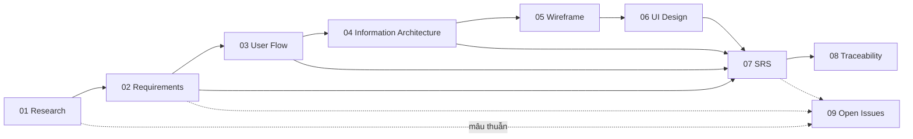

# Bộ tài liệu BA — nhadat.cc

Phiên bản: **v1.0** · Ngày: **2026-08-21** · Trạng thái: **Draft để review**

## Pipeline

## Mục lục

| File | Mô tả | Đối tượng đọc |
|---|---|---|
| [00-glossary.md](00-glossary.md) | Từ điển thuật ngữ | Tất cả |
| [01-research.md](01-research.md) | Bối cảnh thị trường, người dùng, đối thủ, ràng buộc | PO, Founder, Marketing |
| [02-requirements.md](02-requirements.md) | Mục tiêu KD, persona, FR/NFR | PO, Dev Lead, QA |
| [03-user-flows.md](03-user-flows.md) | 12 luồng end-to-end | UX, Dev, QA |
| [04-information-architecture.md](04-information-architecture.md) | Sitemap, URL/SEO, content model | UX, SEO, Dev |
| [05-wireframes.md](05-wireframes.md) | Wireframe low-fi 14 màn hình | UX, UI, Dev |
| [06-ui-design.md](06-ui-design.md) | Design system + tone giọng chat | UI, Dev, Content |
| [07-srs.md](07-srs.md) | Đặc tả kỹ thuật: kiến trúc, DB, API, NFR | Dev, QA, Vendor |
| [08-traceability.md](08-traceability.md) | Ma trận truy vết | PO, QA |
| [09-open-issues.md](09-open-issues.md) | 16 vấn đề cần chủ dự án chốt | Founder, PO |

## Đọc từ đâu

- **Founder / nhà đầu tư** → `01` rồi `09`.
- **Vendor phát triển (Vitalify)** → `07` là hợp đồng kỹ thuật; `02` là phạm vi.
- **Designer** → `03` → `04` → `05` → `06`.
- **QA** → `02` (FR/NFR) + `08` (truy vết) để dựng test case.

## Trạng thái từng tầng

| Tầng | Độ đầy đủ | Chặn bởi |
|---|---|---|
| 01 Research | 85% — thiếu số liệu thị trường sơ cấp | OPEN-01 |
| 02 Requirements | 90% | OPEN-02, OPEN-05 |
| 03 User Flow | 90% | OPEN-04 |
| 04 IA | 80% — chờ danh sách TOP-100 keyword | OPEN-06 |
| 05 Wireframe | 85% | — |
| 06 UI Design | 75% — chờ chốt theme thương mại | OPEN-07 |
| 07 SRS | 80% — API S↔B còn mâu thuẫn với thiết kế Slack | OPEN-03 |
